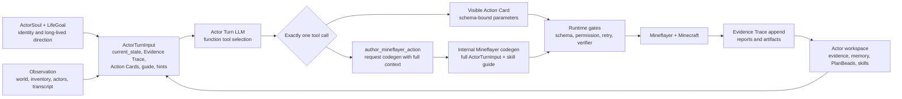
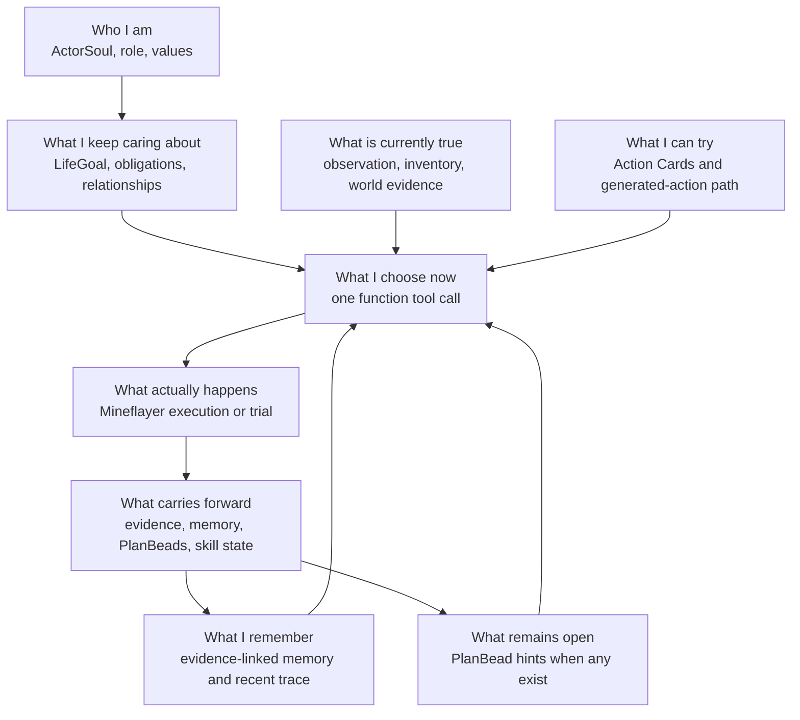
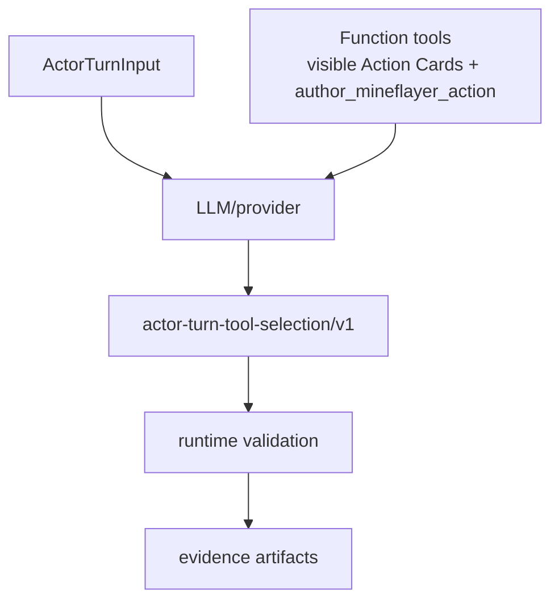
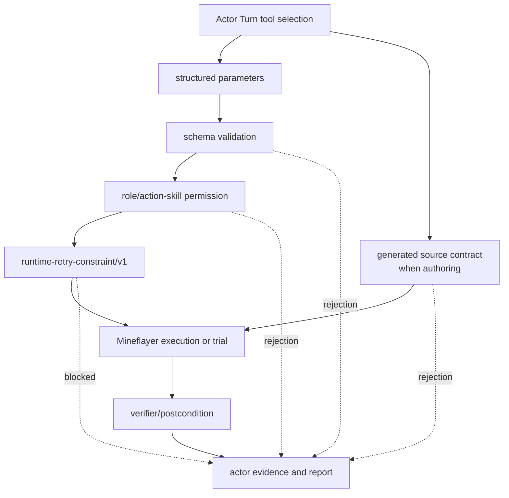
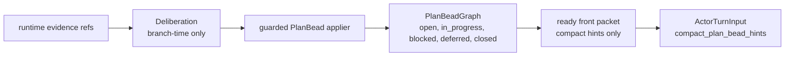
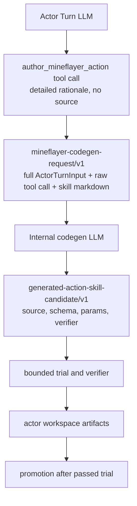

# Current Project Implementation Architecture Review

Search token: `CURRENT_IMPLEMENTATION_ARCHITECTURE_REVIEW`.

Status: repo-internal current implementation map. This is an orientation
document for the checked-out repository state, not a PR summary and not a
replacement for `SPEC.md`.

Location: project root. This is not a Docusaurus public page.

## What This Document Is For

이 문서는 현재 repo를 처음 읽는 사람이 아래 질문에 빠르게 답할 수 있게 하기
위한 안내서다.

1. 이 프로젝트는 무엇을 만들고 있는가.
2. LLM/provider, TypeScript runtime, Mineflayer, actor workspace가 각각
   무엇을 맡는가.
3. Actor Turn, Action Cards, PlanBeads, generated action skills가 어떻게
   연결되는가.
4. 실제 Minecraft 진행과 가짜 진행을 어떻게 구분하는가.
5. 지금 가장 큰 구현 리스크가 무엇인가.

한 문장으로 줄이면, 이 repo는 **Soul/LifeGoal을 가진 한 actor가 Minecraft에서
작은 행동을 직접 시도하고, runtime이 그 행동을 검증/실행/기록하는 headless
runtime**을 만들고 있다.

중요한 점은 LLM/provider가 Minecraft truth를 소유하지 않는다는 것이다.
Provider는 Actor Turn에서 하나의 visible Action Card function tool 또는
`author_mineflayer_action`을 고른다. Runtime은 구조화된 parameters, permission,
retry, source guard, verifier, evidence를 검사한다. Mineflayer는 실제 Minecraft
client API를 호출한다. Actor workspace는 결과 evidence, memory, PlanBeads,
relationships, generated action skill state를 다음 turn으로 넘긴다.

## One-Page Mental Model

화살표는 권한 이동이 아니라 정보와 artifact 흐름이다. Provider text는
실행이나 성공을 확정하지 않는다. 오직 validated runtime action, Mineflayer
execution, verifier-backed evidence가 Minecraft progress를 만든다.

## Current Product Scope

장기 방향은 Soul-grounded Minecraft social simulation seed다. 하지만 현재
delivery target은 작다.

| Scope | Current target |
| --- | --- |
| Actor count | one actor first |
| Minecraft client | one Mineflayer bot |
| Runtime loop | observe -> Actor Turn -> gate -> execute/trial -> verify -> record |
| Provider hot path | one low-cost Actor Turn tool-selection call per ordinary turn |
| Generated behavior | Actor Turn-only `author_mineflayer_action`, then bounded codegen/trial |
| Continuity | actor workspace evidence, memory, PlanBeads, relationships, action skill state |

현재 목표가 아닌 것:

- Voyager-style architecture revival;
- race-to-diamond benchmark optimization;
- shelter, storage, mining, travel, or conversation as an always-on planner;
- persona text alone pretending to be social simulation;
- hidden Minecraft heuristics that choose for the LLM while claiming the LLM
  stayed free;
- provider prose being treated as runtime authority.

## Actor Perspective

NPC 관점에서 현재 runtime은 이렇게 읽어야 한다.

`ActorSoul`이 조심스럽다고 해서 runtime이 몰래 안전한 좌표를 추측해 이동하지
않는다. `LifeGoal`이 공동체를 중시한다고 해서 모든 turn이 storage나 shelter
planner로 바뀌지 않는다. LLM은 현재 evidence와 Action Cards를 보고 직접
판단한다. Runtime은 그 판단이 명시적 structured parameters와 gate를 통과할 때만
실행한다.

## Core Terms

| Term | Current meaning |
| --- | --- |
| `ActorSoul` | actor identity seed. Long-lived context, not decoration. |
| `LifeGoal` | actor's long-lived direction. It shapes choices but does not execute. |
| `ActiveEpisode` | current bounded focus window for ordinary Actor Turns. |
| `ActorTurnInput` | provider-facing packet: current_state, Evidence Trace, Action Cards, Minecraft Basic Guide, memory refs, relationship context, PlanBead hints, budget hint. |
| Action Card | visible function-tool affordance with a strict parameter schema and runtime mapping. |
| `author_mineflayer_action` | logical tool selection that starts internal full-context Mineflayer codegen. It does not carry source. |
| runtime action | validated resolved action or generated candidate trial that may reach Mineflayer. |
| PlanBeads | passive actor-owned work graph for open work, blockers, obligations, followups. |
| Evidence Trace | compact window of runtime-backed action/evidence results for the next Actor Turn. |
| actor workspace | source of truth for actor artifacts: evidence, memory, PlanBeads, relationships, provider snapshots, generated action skills. |

`agent skill` and `action skill` are different. An `agent skill` is a Codex or
Claude capability such as `.agents/skills/mineflayer-code-generation/SKILL.md`.
An `action skill` is a Minecraft behavior the runtime can validate, execute,
verify, and persist for an actor.

## Provider Boundary

Provider output is tool selection, not Minecraft truth.

| Provider can | Provider cannot |
| --- | --- |
| Choose one visible function tool | Call hidden primitives, hidden action skills, or raw Mineflayer |
| Fill strict `parameters` for that tool | Supply missing parameters through rationale text |
| Explain detailed situation/rationale | Claim physical success |
| Choose `author_mineflayer_action` when no visible card can express the needed bounded behavior | Include generated source in the outer tool call |
| Use PlanBead hints, memory, guide, relationship context as context | Treat PlanBeads or memory as executable authority |

The strongest current anti-pattern is parsing LLM-facing prose as policy.
Runtime code must not search `current_state_requirements`, Action Card
descriptions, Minecraft Basic Guide text, memory, PlanBeads, or rationale with
`includes`, regexes, keyword lists, or domain-family heuristics to choose tools,
supply args, clear retry, grant permission, authorize source, or prove success.

Tool calling and schemas/enums define the flow. Runtime validation and evidence
define execution truth.

## Runtime Gates

Runtime gates reject fake progress before Mineflayer work starts.

Important boundaries:

- Natural-language rationale is review context only.
- Required item/count/position/text parameters must be present in structured
  params before execution.
- Repeated exact blockers become retry constraints over normalized target/args.
- A failed gate writes evidence; it must not silently fall back to movement,
  observe, wait, or guessed parameters.
- Generated source must pass helper allowlist, source contract, schema,
  verifier, timeout, trial, and promotion policy.

## PlanBeads Boundary

PlanBeads are still part of the architecture, but their role is passive and
durable.

Good PlanBeads behavior:

- preserve open work, blockers, obligations, and followups across context
  changes;
- expose compact hints to Actor Turn;
- accept guarded operations with evidence refs;
- make long-term work state reviewable.

Bad PlanBeads behavior:

- choosing primitives or action skills;
- supplying runtime parameters;
- acting as a Minecraft strategy checklist;
- claiming physical success;
- requiring the NPC to maintain beads instead of acting.

Latest evidence matters here: the 2026-06-04 fresh-world 50-cycle run wrote
ready-front snapshots on every cycle, but all PlanBead packets were empty:
`selected_plan_bead_refs=0`, `plan_bead_operation_results=0`,
`compact_plan_bead_hints=[]`. That means PlanBeads were wired but not
substantively used in that run. The next implementation pass must create/update
durable beads from meaningful social requests, completed/blocked episode work,
and repeated no-progress evidence without turning PlanBeads into an executor.

## Generated Mineflayer Action Authoring

Generated Mineflayer behavior must originate from Actor Turn.

The outer Actor Turn model selects codegen. It does not choose a `context_to_preserve`
summary and does not provide source. The internal codegen call receives the full
original Actor Turn context plus the full raw tool call and the
`.agents/skills/mineflayer-code-generation/SKILL.md` body.

## Actor Workspace And Evidence

Actor workspace is the continuity source of truth.

| Workspace data | Why it matters |
| --- | --- |
| soul and LifeGoal | preserve actor identity and direction |
| provider input/output snapshots | show exactly what the model saw and returned |
| action/evidence artifacts | distinguish execution, blocker, timeout, verifier result |
| memory | influences later turns without pretending to prove progress |
| PlanBeads | durable open work and blockers when created |
| relationships | social context and consequences |
| action skill records | actor-owned candidate/active/retired behavior state |
| provider usage | budget and free-tier guard evidence |

Weak evidence must stay weak. Observation, wait, provider narration, or memory
can provide context, but they are not physical success unless verifier-backed
world, inventory, position, block, container, chat, or transcript evidence
supports the claim.

## How To Diagnose A Run

Use this order.

1. Read the report summary and provider usage.
2. Open the Actor Turn provider input snapshot for the bad turn.
3. Check the raw provider output/tool call.
4. Check the parsed tool-selection artifact and resolver/gate evidence.
5. Check Mineflayer execution evidence and postcondition/verifier output.
6. Check Evidence Trace, judgment/memory, PlanBead operation results, and
   relationship events that carried forward.

This separates four failure classes:

- provider selected a poor action;
- provider selected a good action with invalid parameters;
- runtime incorrectly allowed/rejected the action;
- Mineflayer/verifier/artifact logic made the result look stronger or weaker
  than reality.

## Code Reading Map

| Question | Start here |
| --- | --- |
| Where does the run orchestrate? | `probe/src/runtime/socialCycleRunner.ts` |
| What does Actor Turn see? | `probe/src/runtime/goals/actorEpisode/turnInput.ts` and sibling projection modules |
| How are Action Cards built? | `probe/src/runtime/goals/actorEpisode/actionCards.ts` |
| How is one tool call parsed? | `probe/src/provider/socialActorTurnToolParser.ts` |
| How does OpenAI/Gemini tool calling run? | `probe/src/provider/openaiApiToolProvider.ts`, `probe/src/provider/geminiApiToolProvider.ts` |
| How is Actor Turn resolved? | `probe/src/runtime/goals/actorEpisode/resolver.ts` |
| How does codegen run? | `probe/src/provider/socialActorTurnCodegenProvider.ts` |
| How are generated candidates checked? | `probe/src/skills/generated/sourceContracts.ts`, `probe/src/skills/generated/verifierEvaluation.ts` |
| How are PlanBeads stored/applied? | `probe/src/runtime/goals/planBeads/**` |
| How are retry constraints handled? | `probe/src/runtime/retryConstraints.ts` |
| How are runs audited? | `probe/src/runtime/goals/socialCycleReportAuditCli.ts`, `probe/src/runtime/goals/socialCycleReviewSummary.ts` |

`socialCycleRunner.ts` remains large. That is a review risk. The architectural
question is whether provider authority, runtime validation, Mineflayer execution,
evidence, and persistence stay traceable despite that size.

## Current Implementation Strengths

- Actor Turn function-tool selection is now the ordinary hot path.
- Existing Action Card parameters are schema-bound and validated before
  execution.
- `author_mineflayer_action` uses full-context internal codegen instead of a
  lossy legacy summary.
- Runtime code rejects missing parameters rather than inferring them from prose.
- Provider usage and artifacts make live runs auditable.
- Runtime retry constraints can block exact repeated failures before another
  Mineflayer call.
- Generated action candidates now leave source, schema, helper, verifier, trial,
  and promotion artifacts.

## Current Implementation Risks

1. PlanBeads are wired but did not substantively participate in the latest
   50-cycle run; empty ready-front packets are not long-term planning.
2. Active Episode can remain stale after a social request is satisfied; the
   decision frame may warn the model, but durable work state still needs to be
   updated.
3. `socialCycleRunner.ts` is still a large orchestration file.
4. Some legacy planner provider files and report schemas remain for explicit
   migration or historical artifact readability; they must not be treated as the
   active Actor Turn contract.
5. Long-run behavior can still loop on observe/inspect/wait or repeated low-value
   actions even when runtime status is `passed`.
6. A docs/test green state is not enough; behavior claims need fresh live-run
   evidence and artifact review.

## Documentation Authority

If documents disagree, start from:

1. `SPEC.md`
2. `AGENTS.md`
3. `docs/blog-doc/Architecture/Actor-Turn-Tool-Calling-And-Full-Context-Codegen.md`
4. `docs/blog-doc/Architecture/Actor-Episode-And-Actor-Turn-Architecture.md`
5. `docs/blog-doc/Architecture/Current-Handoff-And-Next-Work.md`
6. `docs/blog-doc/Documentation-Map.md`
7. `docs/blog-doc/Terminology.md`

Historical docs and `docs/research-archive/**` are references only. They are not
active implementation specs unless a current architecture document explicitly
routes to them.
