# Current Project Implementation Architecture Review

Search token: `CURRENT_IMPLEMENTATION_ARCHITECTURE_REVIEW`.

Status: repo-internal project implementation guide. This document explains the
current project as a whole from the checked-out repository state. It includes
recent implementation changes, but it is not a PR summary and not a replacement
for `SPEC.md`.

Location: project root. This is an internal review/orientation document, not a
Docusaurus public docs page.

## What This Document Is For

이 문서는 이 프로젝트를 모르는 사람이 현재 repo를 읽을 수 있게 만드는 안내서다.
목표는 "파일 이름을 많이 아는 것"이 아니라, 다음 질문에 답할 수 있게 하는
것이다.

1. 이 프로젝트는 무엇을 만들고 있는가.
2. 전체 시스템은 어떤 층으로 나뉘는가.
3. LLM/provider, TypeScript runtime, Mineflayer, actor workspace가 각각 무엇을
   맡는가.
4. 실제 Minecraft 진행과 가짜 진행을 어떻게 구분하는가.
5. NPC 관점에서는 이 구조가 어떻게 보이는가.
6. 어떤 문서와 파일을 어떤 순서로 읽으면 되는가.

한 문장으로 줄이면, 이 repo는 **Soul/LifeGoal을 가진 한 actor가 Minecraft에서
작은 행동을 시도하고, runtime이 그 행동을 검증/실행/기록하는 headless runtime**
을 만들고 있다.

중요한 점은 LLM/provider가 Minecraft truth를 소유하지 않는다는 것이다.
Provider는 다음 목표와 행동을 제안한다. TypeScript runtime은 그 제안이 실행
가능한지 확인한다. Mineflayer는 실제 Minecraft client API를 호출한다. Actor
workspace는 결과 evidence와 memory를 다음 cycle로 넘긴다.

## One-Page Mental Model

처음에는 이 그림만 잡고 시작하면 된다.

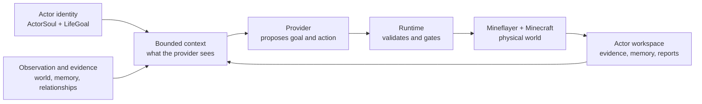

이 그림에서 화살표는 "권한을 넘긴다"가 아니라 "정보가 흐른다"에 가깝다.
Provider가 runtime으로 보내는 것은 확정 명령이 아니라 proposal이다. Runtime이
Mineflayer를 호출해야 실제 실행이 시작된다. 실행 후에도 success claim은
provider text가 아니라 evidence artifact로 확인해야 한다.

## NPC Perspective Architecture

Runtime loop는 엔지니어가 보는 흐름이다. NPC 관점에서는 같은 시스템이 조금
다르게 보인다. NPC는 "LLM이 조종하는 말단 캐릭터"가 아니라, identity,
observation, memory, body, evidence를 가진 actor로 다뤄진다.

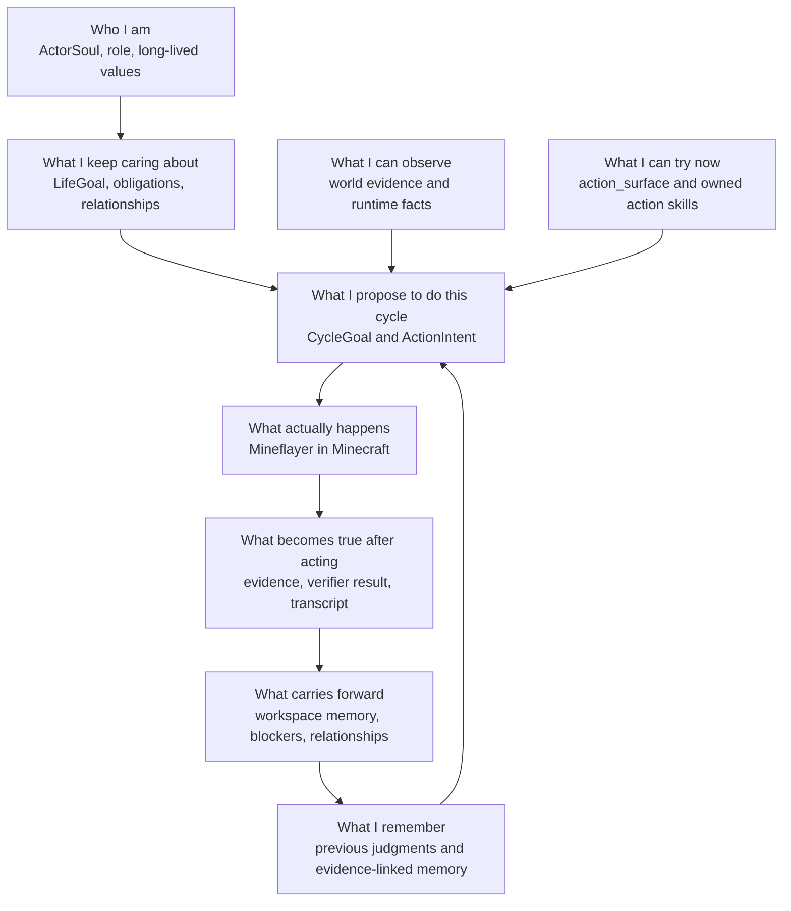

이 그림은 NPC의 "마음속 독백"을 구현했다는 뜻이 아니다. 현재 구현에서 실제로
있는 자료구조와 경계를 NPC 관점으로 다시 배열한 것이다.

| NPC-facing question | Architecture piece | Plain reading |
| --- | --- | --- |
| 나는 누구인가? | `ActorSoul` | actor의 identity seed다. 성격 장식이 아니라 장기 맥락의 출발점이다. |
| 나는 무엇을 계속 중요하게 여기는가? | `LifeGoal`, obligations, relationships | 한 cycle의 입력보다 오래 가는 방향이다. |
| 지금 무엇을 관찰했는가? | `observation`, world evidence, transcript artifacts | Minecraft fact가 먼저 들어오는 층이다. 아직 명령이나 목표가 아니다. |
| 지금 어떤 외부 사건과 관계 맥락이 있는가? | `WorldEvent`, role context, relationships, blockers | 밤, 부족, 위험, 요청, 신뢰, 갈등 같은 자료가 LLM 판단에 들어간다. |
| 나는 무엇을 기억하고 있는가? | evidence-linked memory, previous `CycleJudgment` | 다음 판단에 쓰이지만, 그 자체가 Minecraft progress proof는 아니다. |
| 내 몸으로 지금 무엇을 할 수 있는가? | `action_surface`, runtime primitives, active action skills | provider가 고를 수 있는 현재 affordance다. |
| 이번 cycle에 무엇을 시도할 것인가? | `CycleGoal`, `ActionIntent` | provider proposal이다. 아직 실행 사실이 아니다. |
| 실제 세계에서는 무슨 일이 일어났는가? | Mineflayer execution, verifier, evidence artifacts | runtime이 Minecraft state를 바꾸거나 실패를 기록한 결과다. |
| 다음의 나는 무엇을 이어받는가? | actor workspace | memory, blockers, relationship state, provider snapshots, action skill state다. |

이 NPC 관점에서 중요한 점은 identity와 body가 분리되어 있다는 것이다.
`ActorSoul`이 "조심스럽다"고 해서 runtime이 자동으로 안전한 위치를 추측해
이동하지 않는다. 조심스러운 actor라면 provider가 더 보수적인 `CycleGoal`이나
`ActionIntent`를 제안할 수 있다. 하지만 그 intent가 physical action이면
structured args와 runtime gates를 통과해야 한다.

마찬가지로 `LifeGoal`이 공동체 안정성을 중시한다고 해서 모든 cycle이 집짓기나
storage planning으로 바뀌지 않는다. 현재 observation, evidence, memory,
relationships, `action_surface`가 함께 들어가고 LLM이 이번 cycle의 작은 시도를
정해진다.

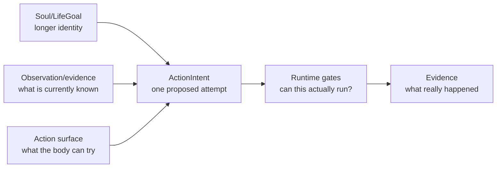

따라서 NPC 관점의 아키텍처를 리뷰할 때는 세 가지를 같이 봐야 한다.

- **continuity**: `ActorSoul`, `LifeGoal`, memory, relationships가 다음 판단에
  실제로 들어가는가.
- **embodiment**: `action_surface`와 actor-owned action skills가 "지금 이
  actor가 할 수 있는 몸"을 정확히 보여주는가.
- **consequence**: 행동 후 memory나 judgment가 evidence 없이 강한 progress
  claim으로 바뀌지 않는가.

## Current Product Scope

이 프로젝트의 장기 방향은 Soul-grounded Minecraft social simulation seed다.
Minecraft는 단순 배경이 아니라 observation, raw evidence, 그리고 실제 행동의
결과를 만들어내는 실험 환경이다.

하지만 현재 delivery target은 작다.

| Scope | Current target |
| --- | --- |
| Actor count | one actor first |
| Minecraft client | one Mineflayer bot |
| Runtime loop | observe -> context -> provider proposal -> gate -> execute -> verify -> record |
| Evidence | transcript, runtime artifacts, provider snapshots, actor workspace state |
| Near-term gameplay | movement, gathering, crafting, storage, placement, communication, simple maintenance |
| Long-term growth | actor-owned action skills, memory, relationships, role context, bounded social play |

현재 목표가 아닌 것도 분명하다.

- Voyager-style architecture를 되살리는 것;
- race-to-diamond benchmark를 최적화하는 것;
- house/building/settlement를 항상 켜진 planner로 만드는 것;
- persona text만으로 social simulation이 된다고 주장하는 것;
- bot이 조금 움직였다는 이유로 성공이라고 말하는 것.

집짓기, 채집, 저장, 이동, 대화, 갈등은 모두 actor가 관찰하고 판단할 수 있는
상황이다. 하지만 그중 하나가 core runtime architecture가 되면 안 된다. 이
repo가 먼저 만들어야 하는 것은 특정 전략이 아니라 **풍부한 observation,
넓은 action surface, gate, verification, artifact, memory**라는 autonomy
substrate다.

## Project Layers

전체 repo는 아래처럼 읽으면 된다.

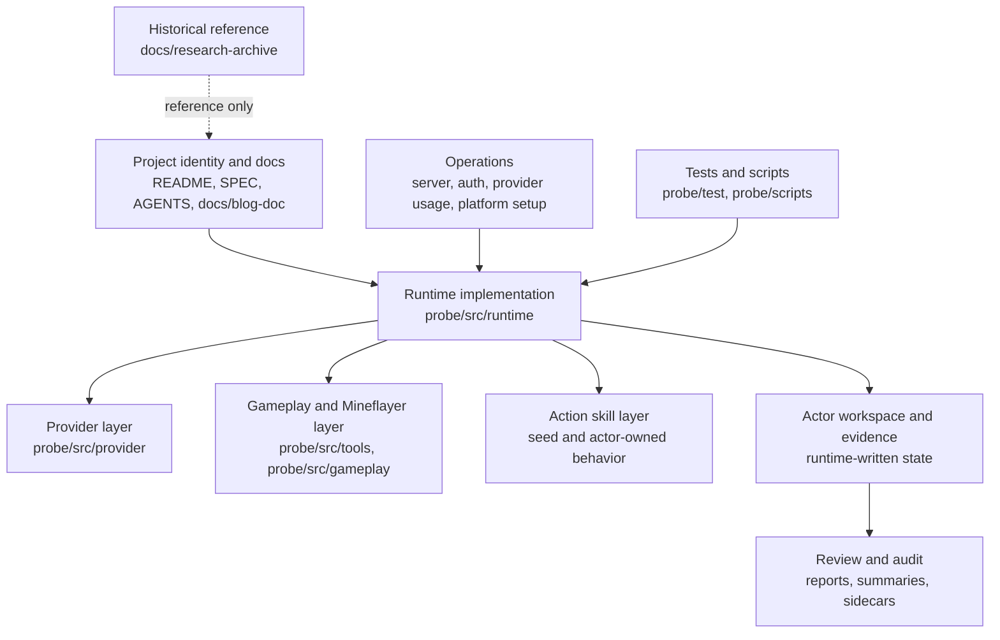

| Layer | Main locations | What it owns |
| --- | --- | --- |
| Project identity and governance | `SPEC.md`, `AGENTS.md`, `README.md`, `docs/blog-doc/Specification/**` | product direction, terminology, agent rules, documentation authority |
| Runtime loop | `probe/src/runtime/**` | cycle orchestration, action execution gates, reports, retry constraints, actor state wiring |
| Provider layer | `probe/src/provider/**` | prompts, provider adapters, deterministic fallback, usage snapshots |
| Gameplay/Mineflayer layer | `probe/src/tools/**`, `probe/src/gameplay/**` | Minecraft observations and bounded primitive operations |
| Action skill layer | `probe/src/gameplay/seedSkills/**`, `probe/src/skills/**` | repo-authored and actor-owned bundled behaviors |
| Actor workspace | runtime data under actor workspaces | soul, goals, evidence, memory, provider snapshots, relationships, action skill ownership |
| Review/audit | `probe/src/runtime/goals/*Audit*`, `probe/src/reviewer/**` | artifact-based diagnosis and repair proposals |
| Operations | setup docs, server scripts, provider auth/usage files | Minecraft server lifecycle, provider budget/auth, platform-sensitive blockers |
| Tests/scripts | `probe/test/**`, `probe/scripts/**` | focused regression tests and live-run helpers |

`docs/research-archive/`는 역사적 참고 자료다. 거기 있는 paper dump나 old plan이
현재 product spec이 되는 것은 아니다.

## Core Terms, In Reading Order

용어가 한꺼번에 나오면 이 프로젝트는 읽기 어렵다. 아래 순서대로 보면 덜
헷갈린다.

| Term | Plain meaning | Where it matters |
| --- | --- | --- |
| `ActorSoul` | actor의 identity seed. 성향, 역할, 장기 방향의 출발점이다. | provider context, actor workspace |
| `LifeGoal` | actor가 오래 유지하는 삶의 방향이다. | social-cycle goal selection |
| observation | runtime이 본 Minecraft fact다. 가능한 한 raw evidence로 유지한다. | provider context, verifier evidence |
| `WorldEvent` | scenario, 관계, role, 외부 사건을 담는 context record다. | provider context |
| `CycleGoal` | 이번 cycle에서 시도할 작은 목표 proposal이다. | provider output, judgment |
| `ActionIntent` | provider가 실행하고 싶다고 제안한 structured action record다. | runtime validation |
| `action_surface` | 지금 actor가 고를 수 있는 direct/deferred affordance 목록이다. | provider context |
| runtime primitive | `move_to`, `mine_block`, `place_block`, `wait` 같은 bounded operation이다. | Mineflayer execution |
| action skill | 여러 primitive를 묶은 Minecraft behavior다. actor-owned state로 관리된다. | action-skill registry/workspace |
| verifier | 실행 후 실제 state 변화가 있었는지 확인하는 checker다. | success/failure 판정 |
| actor workspace | actor continuity와 evidence를 저장하는 source of truth다. | 다음 cycle context, audit |

`agent skill`과 `action skill`은 다르다. `agent skill`은 Codex/Claude 같은 개발
agent가 쓰는 능력이다. `action skill`은 이 Minecraft runtime 안에서 actor가
실행할 수 있는 검증 대상 behavior다.

## The Runtime Loop

현재 runtime의 핵심은 social-cycle loop다. 한 cycle은 대략 다음 순서로 돈다.

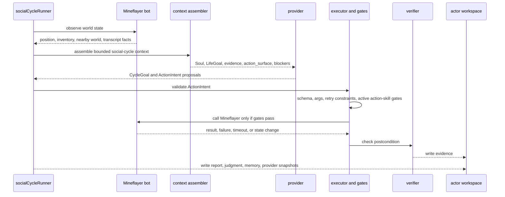

이 흐름에서 가장 중요한 분리는 다음이다.

- Provider는 판단을 제안한다.
- Runtime은 실행 가능성을 검사한다.
- Mineflayer는 Minecraft state를 읽고 바꾼다.
- Verifier와 actor workspace는 결과를 evidence로 남긴다.

Provider가 "성공했다"고 써도 verifier-backed evidence가 없으면 성공으로 보지
않는다. 반대로 gate에서 차단된 것도 유용한 결과다. 이 프로젝트는 실패를 숨기기
보다, 실패가 왜 났는지 artifact로 설명하는 것을 우선한다.

## Provider Boundary

Provider는 현재 context를 보고 다음 목표와 행동을 고른다. 하지만 provider가
할 수 없는 일이 있다.

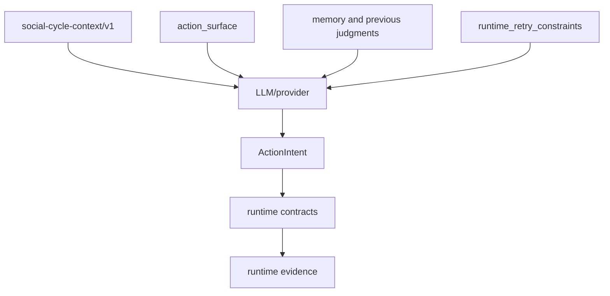

| Provider can | Provider cannot |
| --- | --- |
| Read current evidence and actor context | Invent world facts that were not observed |
| Propose `CycleGoal`, `ActionIntent`, `CycleJudgment` | Decide Minecraft success by prose |
| Choose from current `action_surface` | Call tools or action skills outside the exposed surface |
| Avoid exact retry constraints | Force execution of a blocked target/args pair |
| Explain intent in `why_this_action` | Use prose as a substitute for structured args |

Example:

```json
{
  "schema": "action-intent/v1",
  "action_type": "use_primitive",
  "primitive": "move_to",
  "args": {
    "position": { "x": 12, "y": 64, "z": -8 }
  },
  "why_this_action": "Move to the observed open area before attempting any build-related action."
}
```

This is executable because the target position is in structured `args`.

This is not executable:

```json
{
  "schema": "action-intent/v1",
  "action_type": "use_primitive",
  "primitive": "move_to",
  "args": {},
  "why_this_action": "Move east toward a better place."
}
```

The word "east" in prose is not enough. The runtime should reject or repair the
intent through an explicit path, record the contract failure, and avoid calling
Mineflayer with a hidden movement default.

## Runtime Gates

Runtime gates are where the project rejects fake progress.

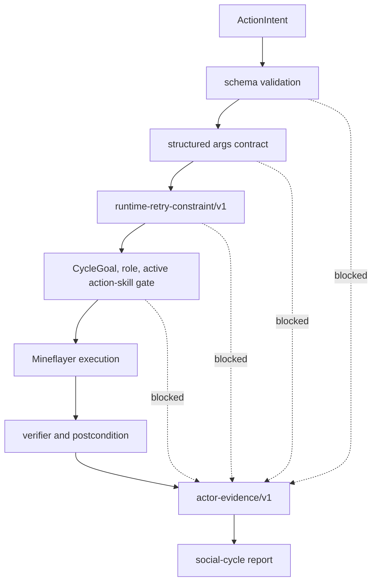

| Gate | What it protects | Example |
| --- | --- | --- |
| schema validation | runtime only accepts known intent shapes | unknown `action_type` |
| structured args contract | physical actions need executable args | `move_to` without a position |
| `runtime-retry-constraint/v1` | exact repeated blocker attempts are stopped before Mineflayer | same target/args keeps timing out |
| active action-skill gate | provider cannot bypass actor-owned capability boundaries | direct primitive tries to carry `action_skill_id` |
| Mineflayer execution | actual game API calls are bounded and visible | pathfinder, dig, craft, place, chat |
| verifier/postcondition | success claims need state evidence | inventory, position, block, container, transcript delta |

The retry constraint work belongs here as part of the current runtime, not as a
separate PR feature. If the same blocker repeats for the same target and
structured args, the runtime records `runtime-retry-attempt/v1` and can create a
`runtime-retry-constraint/v1`. A matching future intent is blocked before another
Mineflayer call.

That constraint is deliberately exact. It prevents blind repetition without
turning the runtime into a broad domain planner.

## Action Surface And Action Skills

`action_surface` answers a narrow question: **what can this actor try now?**

It should not answer "what should every actor always optimize?" That decision
belongs to the provider under `ActorSoul`, `LifeGoal`, raw observation,
evidence, memory, and current Mineflayer affordances.

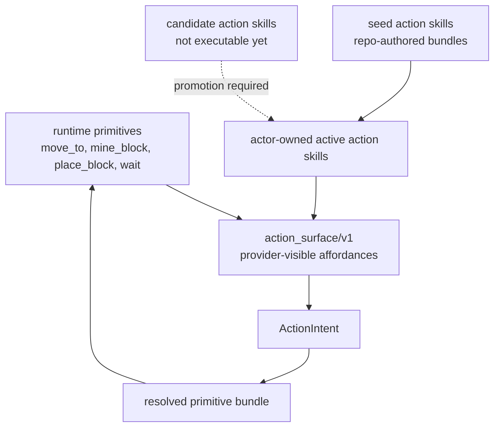

| Concept | Example | Important boundary |
| --- | --- | --- |
| runtime primitive | `move_to`, `mine_block`, `place_block`, `remember` | smallest executable operation |
| seed action skill | `collectLogs`, `craftPlanksAndSticks`, `buildBasicShelter` | repo-authored behavior that can be materialized for an actor |
| candidate action skill | repair recipe or proposed bundle | not executable until promoted/owned |
| `action_surface/v1` | direct primitives plus deferred action skill options | provider-visible affordance packet |
| resolved primitive bundle | action skill expanded into primitive attempts | each primitive still needs runtime evidence |

`buildBasicShelter` can exist as a bounded action skill. That does not mean the
runtime should always carry `StructurePlacementPlan`, `ShelterBlueprint`, or
building-first planner state. Building is one possible action the model may
choose from context, not the core architecture.

## Actor Workspace And Memory

Actor workspace is the continuity layer. The provider does not get an unbounded
raw transcript every time. The runtime compacts and selects evidence-linked
context from workspace state.

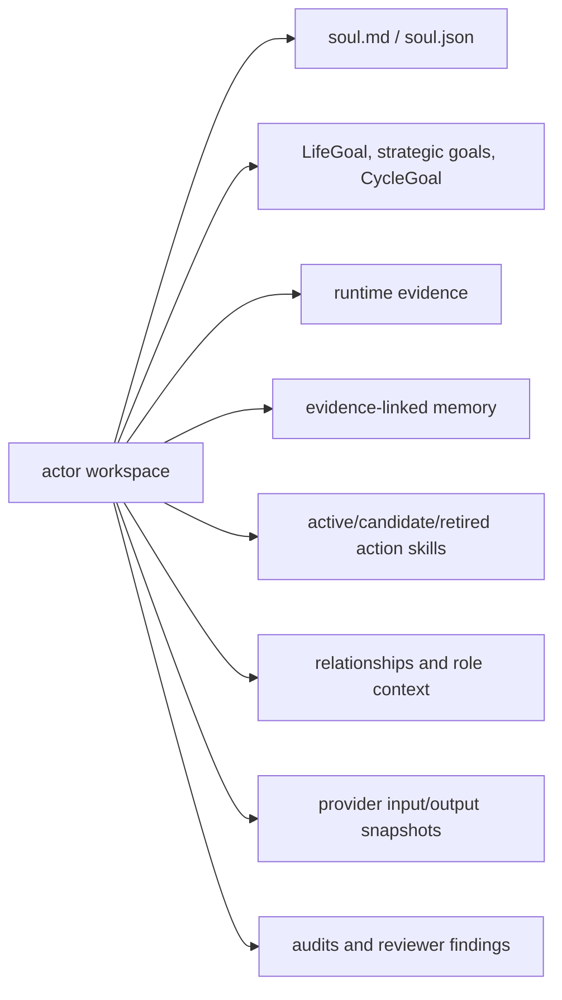

| Workspace data | Why it matters |
| --- | --- |
| soul and goals | preserve actor identity and long-running direction |
| evidence | lets reviewers verify what really happened |
| memory | influences later cycles without pretending to be physical proof |
| action skill state | keeps capability ownership actor-scoped |
| relationships | carries social context beyond one prompt |
| provider snapshots | show exactly what context the provider saw and returned |
| reviews | support async diagnosis and repair proposals |

Memory can affect the next cycle. It cannot prove progress by itself. Progress
needs evidence such as inventory delta, position evidence, block delta,
container state, chat/transcript evidence, or verifier output.

## Evidence And Artifacts

This project treats evidence as the product's hard floor. A run should be
diagnosable without immediately reproducing it.

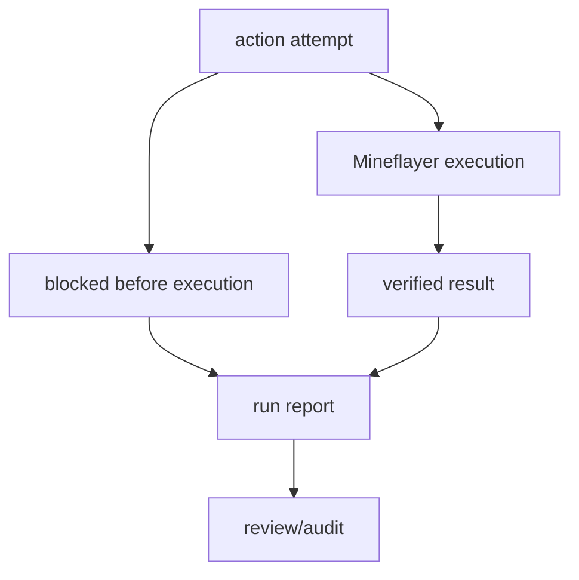

Useful evidence includes:

- provider input/output snapshots;
- `ActionIntent` records with structured args;
- contract failure artifacts;
- runtime retry attempts and constraints;
- Mineflayer execution result, timeout, or cancellation;
- inventory, position, block, container, chat, and transcript evidence;
- `world-state-summary/v1` or `world-state-scan/v1` artifacts with scan limits;
- CycleJudgment and memory records that reference runtime evidence.

Weak evidence should stay weak. A memory note, provider explanation, observation
summary, or `wait` action can provide context, but it should not become a
physical success claim.

## Operations And Provider Usage

Operations are part of the architecture because an environment failure can look
like actor failure if it is not recorded correctly.

| Area | What to watch |
| --- | --- |
| Minecraft server lifecycle | server start/stop, reconnect, session freshness, cleanup |
| Platform | Apple Silicon macOS and Linux ARM can differ in Docker socket, native binaries, Java, and file permissions |
| Provider auth | gameplay provider auth is not the same thing as Codex CLI login |
| Provider usage | live calls should write usage snapshots and respect budget guardrails |
| Environment blockers | Docker/provider/auth/setup failures should be classified as `environment_blocked` |

Before changing platform-sensitive setup, check the platform. Do not diagnose a
Docker socket problem, Java startup problem, or provider auth failure as actor
behavior.

## Documentation Structure

The documentation split is intentional.

| Location | Meaning |
| --- | --- |
| `SPEC.md` | canonical gateway spec |
| `AGENTS.md` | binding repo-agent guidance |
| `CLAUDE.md`, `GEMINI.md` | agent-surface mirrors, subordinate to `AGENTS.md` |
| `docs/blog-doc/Specification/**` | long-term product/spec detail |
| `docs/blog-doc/Architecture/**` | active architecture and current-state docs |
| `docs/blog-doc/Setup/**` | server/provider setup |
| `docs/blog-doc/Terminology.md` | canonical vocabulary |
| `docs/research-archive/**` | historical references, not active build instructions |
| `CURRENT_IMPLEMENTATION_ARCHITECTURE_REVIEW.md` | this internal whole-project implementation map |

If documents disagree, start from `SPEC.md` and `AGENTS.md`. Do not silently turn
an old research note or external paper into product direction.

## How To Read The Code

For a first pass, read by question rather than by directory.

| Question | Start here | What to look for |
| --- | --- | --- |
| Where does the cycle run? | `probe/src/runtime/socialCycleRunner.ts` | orchestration, provider calls, report flushing |
| Where is an action executed? | `probe/src/runtime/socialCycleExecution.ts` | gates, primitive execution, verifier result |
| What does the provider see? | `probe/src/runtime/goals/cycleContextAssembler.ts` | Soul/LifeGoal/evidence/action surface/blockers packaging |
| How are provider prompts bounded? | `probe/src/provider/socialGoalMindProvider.ts`, `probe/src/provider/socialActionPlannerProvider.ts`, `probe/src/provider/socialCycleJudgmentProvider.ts` | proposal authority, evidence discipline |
| How are repeated blockers handled? | `probe/src/runtime/retryConstraints.ts` | exact target/args grouping and pre-execution blocking |
| How is context compacted? | `probe/src/runtime/goals/socialCycleContextCompaction.ts` | evidence refs preserved, weak progress not upgraded |
| How are runs audited? | `probe/src/runtime/goals/socialCycleReportAuditCli.ts`, `probe/src/runtime/goals/socialCycleReviewSummary.ts` | artifact-based diagnosis |
| Where are seed action skills? | `probe/src/gameplay/seedSkills/**` | bounded behavior and verification boundary |

`socialCycleRunner.ts` is still large. That is a review risk, not proof that the
architecture is wrong. The important question is whether orchestration, provider
authority, execution, verification, and persistence remain traceable.

## How To Diagnose A Run

When a run looks wrong, use this order.

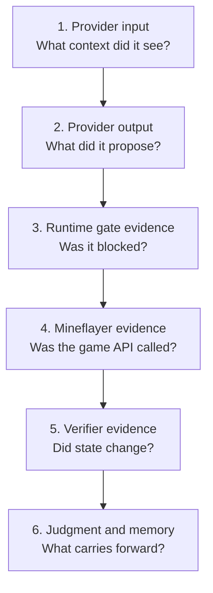

1. Check provider input snapshots.
   - Did the provider see the right `ActorSoul`, `LifeGoal`, evidence,
     `action_surface`, and retry constraints?
2. Check provider output snapshots.
   - Look at structured `ActionIntent.args` before `why_this_action`.
3. Check runtime gate evidence.
   - Was this blocked by schema, args, retry constraint, or action-skill gate?
4. Check Mineflayer execution evidence.
   - Did pathfinder, dig, craft, place, storage, or chat actually run?
5. Check verifier/postcondition evidence.
   - Did inventory, position, block, container, or transcript evidence support
     the success claim?
6. Check judgment and memory.
   - Did the next cycle receive a truthful blocker, memory, or repair context?

This separates four different problems:

- provider selected a bad action;
- runtime allowed or rejected the action incorrectly;
- Mineflayer failed to execute in the world;
- verifier/reporting made the result look stronger than the evidence.

## Current Implementation Strengths

- Runtime truth is generally owned by TypeScript/Mineflayer code rather than
  provider text.
- Physical `ActionIntent` args contracts prevent hidden gameplay defaults from
  looking like valid behavior.
- Runtime retry constraints turn repeated exact blockers into hard gates.
- Actor workspace ownership prevents provider output from directly activating
  unreviewed action skills.
- Review and audit paths can inspect nested action attempts, movement
  contracts, world-state scan evidence, and retry constraint counts.
- Docs repeatedly state that house/building/settlement context must not become a
  hidden core architecture.

## Current Implementation Risks

These are not necessarily bugs. They are the highest-value areas to watch while
reviewing the project.

1. `socialCycleRunner.ts` is still a large orchestration file.
2. `settlement_state` is still a compatibility name. It is useful diagnostic
   state, but it can accidentally become a standing strategy checklist.
3. Provider prompts still mention settlement compatibility state. Future edits
   should keep that wording guarded.
4. `runtime_retry_constraints` are exact by design. They stop blind repetition,
   but they do not yet diagnose broader equivalence classes such as "same
   impossible movement with slightly different coordinates."
5. Context compaction exists as a pure builder, but longer live-run integration
   still needs more runtime validation.
6. Fresh-world cleanup ownership remains an operational risk on Docker/Linux ARM
   runs.

## User Review Notes

These notes capture active human review feedback that should shape the next
architecture/doc/prompt pass. The first implementation slice is now tracked in
`docs/blog-doc/Architecture/Actor-Memory-Observation-And-Action-Space-Plan.md`.

1. **Observation should be the architecture-level focus.**
   Current wording sometimes pre-classifies world evidence before the model sees
   it. That is too constraining. Minecraft observations should enter the runtime
   as observation/evidence: position, inventory, nearby blocks, entities,
   container state, transcript facts, scan limits, and verifier output. The
   model should receive that context and decide whether it implies danger,
   hunger, urgency, opportunity, obligation, repair, avoidance, or something
   else. This requires a naming and prompt pass across docs/provider context,
   while legacy field names can be migrated separately.
2. **Mineflayer should be treated as the actor's broad capability substrate, not
   hidden behind seed action skills.**
   The current `action_surface` reads like "what the NPC can try now," but the
   implementation exposes a narrow runtime-owned primitive list intersected with
   role allowance and active action-skill backing. That can make seed action
   skills look like the actor's body, when they should be closer to best
   practices, examples, or verified bundles built on top of Mineflayer's broader
   action space. Safety and verification are important, but their purpose should
   be to open more of Mineflayer safely, not to keep the NPC trapped inside a
   small hand-authored menu. A better target model is layered: Mineflayer
   capability substrate -> generated or hand-authored bounded runtime adapters
   -> seed/owned action skill recipes -> provider-visible `action_surface`.
   Code generation should be considered a primary path for expanding the NPC's
   action space: generate Mineflayer-backed adapters or action skill candidates,
   run them through contract checks, verifier requirements, artifact recording,
   and promotion gates, then expose successful capabilities back to the actor.
   The provider still must not get raw unchecked Mineflayer authority, but the
   architecture should make unadapted Mineflayer affordances visible as
   expansion opportunities instead of implying they do not exist.

## Project Review Checklist

Use this when reviewing code, docs, or a live run.

### Product Direction

- Does the change preserve `ActorSoul` / `LifeGoal` as identity continuity?
- Does it keep `WorldEvent` as event/context input, not LifeGoal replacement?
- Does it improve autonomy substrate rather than encode one domain strategy?
- Does it avoid reviving Voyager-style architecture as the active path?

### Provider Boundary

- Does the provider see enough current evidence to act?
- Are direct and deferred affordances clear?
- Are repeated blockers visible as constraints or evidence?
- Can provider prose accidentally become executable authority?

### Runtime Truth

- Are structured args validated before Mineflayer execution?
- Are repeated exact blockers blocked before execution?
- Are timeout and cancellation results artifact-visible?
- Are verifier and postcondition results stronger than provider claims?

### Actor Continuity

- Is action skill ownership actor-scoped?
- Are memory writes evidence-linked and confidence-bounded?
- Are relationships and role context preserved without replacing LifeGoal?
- Does context compaction avoid laundering weak evidence into progress?

### Operations

- Is a Docker/provider/auth issue classified as `environment_blocked`?
- Is provider usage recorded and guarded?
- Is platform-sensitive behavior checked before setup commands?

## Evidence Baseline

Current baseline for the repository implementation:

- focused retry constraint/context tests pass;
- full probe test suite passes locally;
- TypeScript typecheck passes;
- Docusaurus docs build passes;
- latest action-skill matrix baseline remains 14/14 current-run live evidence.

This baseline is useful, but it is not the same thing as proving behavioral
quality forever. For behavior review, ask for a fresh live social-cycle run and
read the artifacts in the diagnosis order above.
