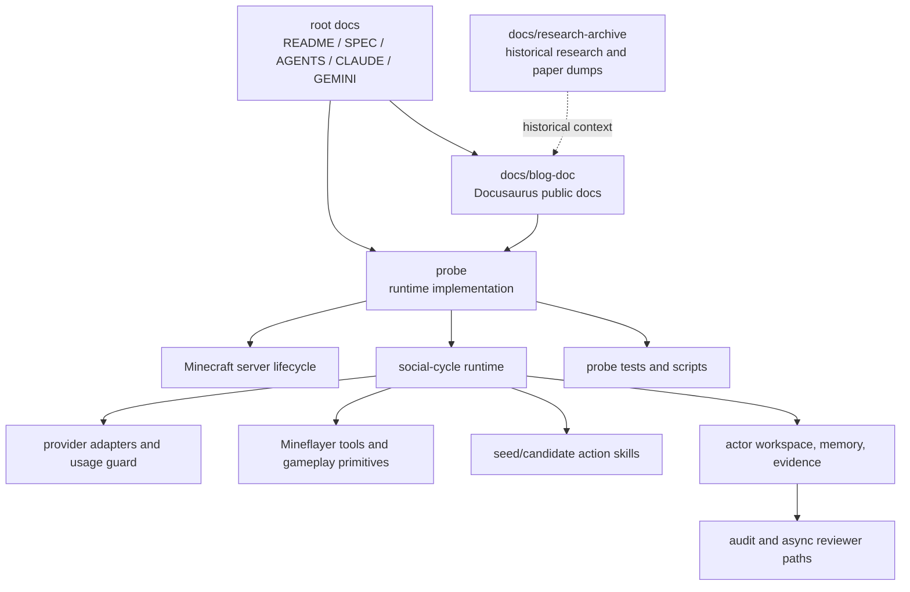
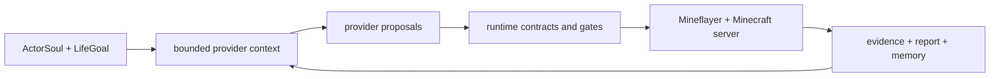
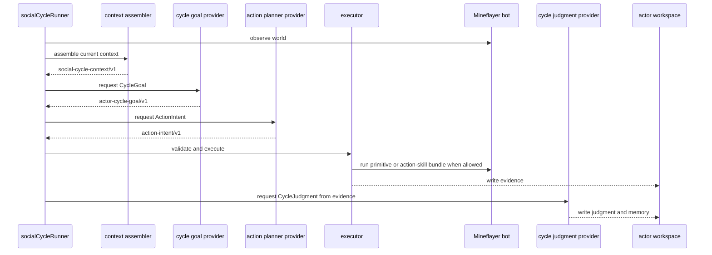
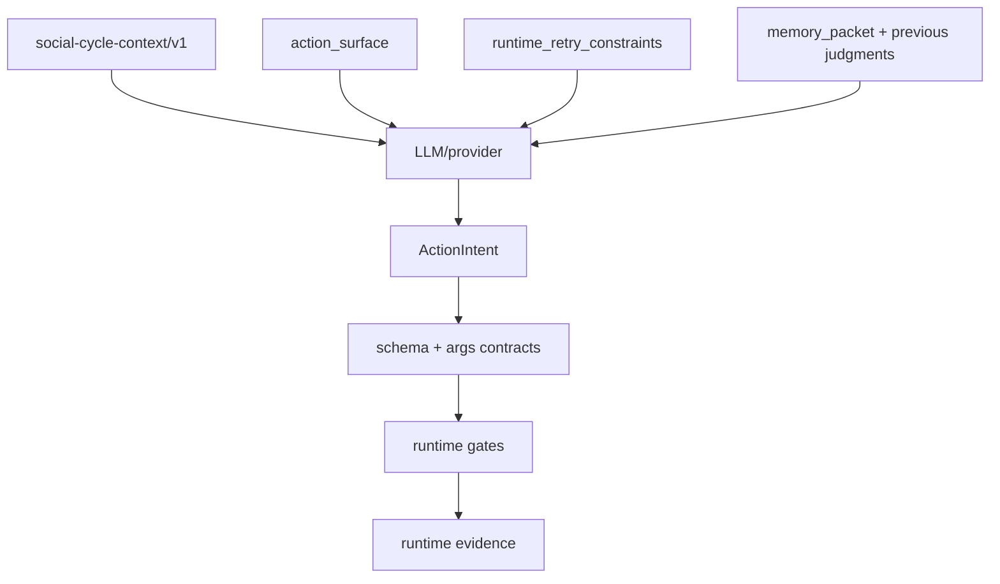
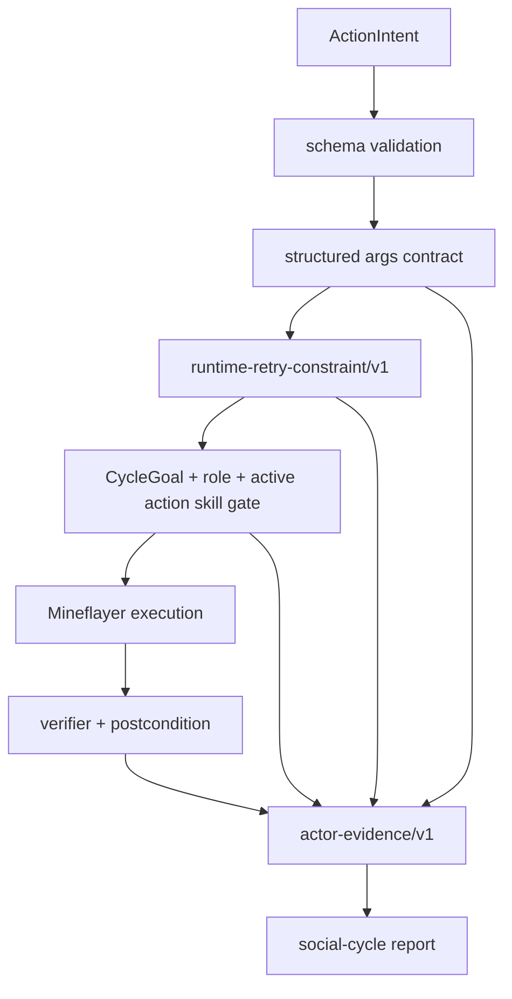
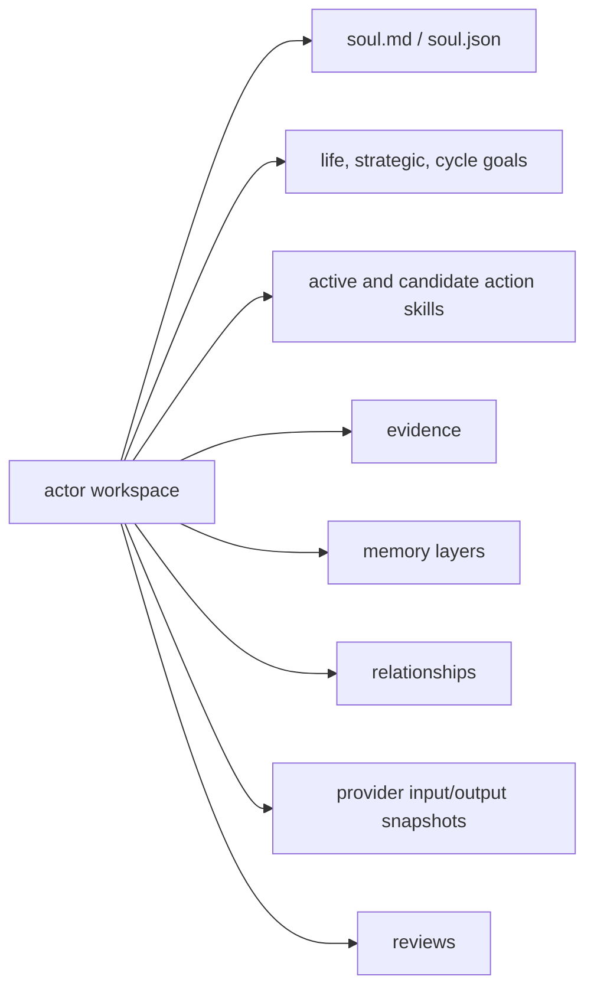
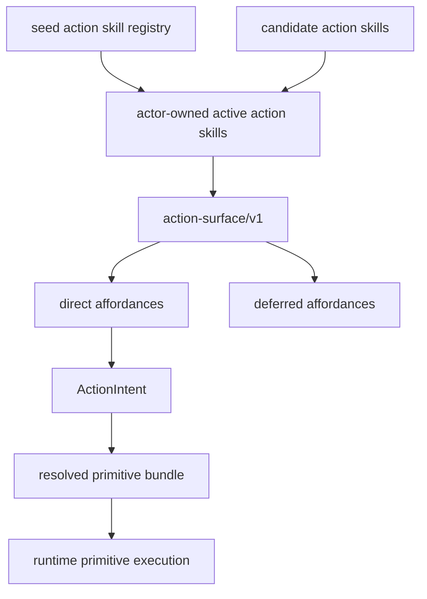

# Project Implementation Architecture Review

Search token: `CURRENT_IMPLEMENTATION_ARCHITECTURE_REVIEW`.

Status: repo-internal project implementation guide. This document explains the
current repository implementation as a whole, including the latest branch
changes. It is not a branch-diff summary and it is not a long-term spec change.

Location: repo-internal review document at the project root. It is not a
Docusaurus blog post or public docs page.

## How To Read This

이 문서는 현재 repo 전체 구현을 이해하기 위한 안내서다. 목표는 "이
프로젝트가 무엇을 만들고 있고, 실제 코드와 문서가 어떤 구조로 나뉘어 있고,
각 컴포넌트가 어떤 책임을 갖는지"를 한 번에 볼 수 있게 만드는 것이다.

현재 브랜치에서 추가된 구현도 포함하지만, 이 문서는 브랜치 변경사항만
설명하는 문서가 아니다. 기준은 "현재 checkout 기준으로 존재하는 프로젝트
전체 구현"이다.

리뷰할 때 가장 중요한 질문은 네 가지다.

1. `ActorSoul` / `LifeGoal` 기반의 social-cycle runtime이라는 방향을 지키고 있는가?
2. LLM/provider가 제안만 하고, Minecraft truth는 runtime이 소유하고 있는가?
3. `action_surface`, action skill, runtime primitive, verifier, artifact 경계가 명확한가?
4. 특정 활동, 예를 들어 집짓기나 자원 채집이 hidden architecture가 되지 않았는가?

이 문서를 읽을 때는 "무엇이 무엇을 결정하는가"를 계속 분리해서 보면 된다.

- **Actor identity**: `ActorSoul`, `LifeGoal`, memory, relationship pressure가
  actor의 장기적 맥락을 만든다.
- **Provider proposal**: LLM/provider는 다음 목표와 행동을 제안한다. 제안은
  아직 Minecraft truth가 아니다.
- **Runtime truth**: TypeScript runtime과 Mineflayer가 실제 실행, 검증,
  artifact 기록을 소유한다.

헷갈리기 쉬운 점은 이 문서의 그림들이 "목표를 달성하는 전략"을 그린 것이
아니라 "권한과 증거가 어디를 지나가는지"를 그린 것이라는 점이다. 예를 들어
`buildBasicShelter`가 있어도 이 아키텍처가 항상 shelter를 향해 움직인다는
뜻은 아니다. Shelter는 여러 social pressure 중 하나이고, runtime은 그런
pressure를 안전하게 실행하고 검증할 substrate를 제공한다.

## Scope Of This Document

이 문서는 세 가지를 함께 설명한다.

1. **Product frame**
   - `SPEC.md`, `AGENTS.md`, `docs/blog-doc/Specification/*`에 적힌
     Soul/LifeGoal 기반 social simulation 방향.
2. **Implemented runtime**
   - `probe/src/**`에 구현된 Mineflayer runtime, provider boundary,
     actor workspace, action skill ownership, verifier, report/audit path.
3. **Current operational/documentation state**
   - 현재 브랜치에서 추가된 retry constraint, docs boundary, review doc,
     provider usage guard 같은 최신 변경사항까지 포함한 repo 상태.

반대로 이 문서는 다음이 아니다.

- 특정 PR의 diff-only 설명;
- 장기 spec을 새로 쓰는 문서;
- 모든 historical research를 다시 요약하는 문서;
- "집 짓기", "다이아몬드", "정착지" 같은 하나의 gameplay goal을 중심으로
  프로젝트를 재해석하는 문서.

## Component Glossary

| Component | Meaning | What it does in this repo | Common mistake |
|-----------|---------|---------------------------|----------------|
| `ActorSoul` | Actor identity seed | 성향, 역할, 장기 방향을 정의한다. | 매 cycle의 직접 명령으로 취급하는 것. |
| `LifeGoal` | Durable actor goal | Actor가 오래 유지하는 삶의 목표를 제공한다. | User prompt나 `WorldEvent`로 매번 덮어쓰는 것. |
| `WorldEvent` | Current pressure | 밤, 부족, 위험, 요청 같은 상황 압력을 제공한다. | Actor의 top-level goal로 승격하는 것. |
| `CycleGoal` | One-cycle objective | 이번 cycle에서 무엇을 시도할지 제안한다. | 검증 없이 성공으로 기록하는 것. |
| `ActionIntent` | Proposed action record | provider가 실행하고 싶은 action type과 structured args를 낸다. | `why_this_action` prose를 실행 인자로 추정하는 것. |
| `action_surface` | Current affordance packet | 지금 actor가 직접/간접적으로 무엇을 할 수 있는지 provider에게 보여준다. | Domain strategy checklist로 바꾸는 것. |
| action skill | Minecraft bundled behavior | 여러 primitive를 묶은 actor-owned behavior다. 예: `collectLogs`. | Codex/Claude agent skill과 혼동하는 것. |
| runtime primitive | One bounded game operation | `move_to`, `mine_block`, `place_block`, `remember` 같은 runtime action이다. | Missing args를 hidden default로 채워 실행하는 것. |
| verifier | Evidence checker | 실제 inventory, position, block, container, transcript 변화로 결과를 판정한다. | Provider text를 verifier처럼 믿는 것. |
| actor workspace | Actor state store | evidence, memory, provider snapshots, action skill ownership을 저장한다. | 단순 로그 폴더로 취급하는 것. |
| evidence artifact | Runtime fact record | 실행/차단/실패/검증 결과를 리뷰 가능한 형태로 남긴다. | Report summary만 보고 원인 분석을 끝내는 것. |

## Repository Implementation Map

이 repo는 크게 네 층으로 나뉜다.



각 영역의 의미는 다음과 같다.

| Area | Main location | What it is for |
|------|---------------|----------------|
| Project identity and rules | `README.md`, `SPEC.md`, `AGENTS.md`, `CLAUDE.md`, `GEMINI.md` | 프로젝트가 무엇을 목표로 하고, agent가 어떤 규칙으로 작업해야 하는지 정의한다. |
| Public documentation | `docs/blog-doc/` | Docusaurus로 노출되는 현재 spec, architecture, setup, terminology 문서다. |
| Internal archive | `docs/research-archive/` | 과거 research, old plans, paper dumps를 보존한다. active build instruction은 아니다. |
| Runtime implementation | `probe/src/runtime/**` | social-cycle loop, execution gate, actor workspace, reports, retry constraints를 구현한다. |
| Provider layer | `probe/src/provider/**` | OpenAI/Gemini/deterministic provider calls, prompts, usage tracking, snapshots를 담당한다. |
| Gameplay/Mineflayer layer | `probe/src/tools/**`, `probe/src/gameplay/**` | Minecraft state를 실제로 읽고 바꾸는 bounded primitive와 helper다. |
| Action skill layer | `probe/src/gameplay/seedSkills/**`, `probe/src/skills/**` | repo-authored seed action skills와 actor-owned candidate/active lifecycle을 관리한다. |
| Actor state and memory | `data/actors/**` at runtime, `probe/src/runtime/*Store*` | actor의 soul, goals, evidence, memory, relationships, provider snapshots를 저장한다. |
| Review and audit | `probe/src/runtime/goals/*Audit*`, `probe/src/reviewer/**` | run 결과를 artifact 기반으로 점검하고 repair proposal을 만든다. |
| Tests and scripts | `probe/test/**`, `probe/scripts/**` | 작은 Detroit-style regression test와 live/run helper를 제공한다. |

이 표에서 중요한 점은 `docs/blog-doc/`와 `docs/research-archive/`가 runtime
구현이 아니라는 것이다. Public docs는 현재 방향을 설명하고, archive는 참고
자료를 보존한다. 실제 Minecraft truth는 `probe` runtime과 Mineflayer evidence에
있다.

## Project Shape

이 프로젝트는 "Minecraft에서 LLM을 돌리는 일반 봇"이 아니다. 현재 구현은
한 actor가 `ActorSoul`, `LifeGoal`, memory, relationship pressure, `WorldEvent`,
그리고 실제 Minecraft evidence를 바탕으로 작은 cycle을 반복하는 headless
runtime이다.



이 그림의 각 노드는 다음을 뜻한다.

| Node | Concrete meaning | Example |
|------|------------------|---------|
| `ActorSoul + LifeGoal` | Actor가 어떤 존재이고 어떤 방향성을 유지해야 하는지에 대한 durable context | `npc_b`가 공동체 유지와 생존 안정성을 중시한다. |
| `bounded provider context` | provider에게 넘기는 compact packet. Soul, LifeGoal, current evidence, action surface, blockers가 들어간다. | "현재 inventory, 마지막 판단, 사용 가능한 action skill, 최근 실패 이유"가 포함된다. |
| `provider proposals` | provider가 만든 `CycleGoal`, `ActionIntent`, `CycleJudgment` 제안 | "근처를 관찰하고, 필요한 위치로 이동하라" 같은 intent. |
| `runtime contracts and gates` | schema validation, args contract, active action skill gate, retry constraint, timeout, verifier | `move_to`에 structured target이 없으면 실행 전 차단한다. |
| `Mineflayer + Minecraft server` | 실제 Minecraft client API와 server state | block을 캐고, 이동하고, chest를 열고, chat을 보낸다. |
| `evidence + report + memory` | 실제 실행 결과와 다음 cycle에 들어갈 기록 | inventory delta, block placement result, provider snapshot, CycleJudgment. |

화살표는 "권한 위임"이 아니라 "정보 흐름"이다. Provider가 Runtime으로
보내는 것은 명령 확정이 아니라 제안이다. Runtime이 Minecraft로 보내는 것만
실제 실행이고, Minecraft에서 돌아온 evidence만 progress claim의 근거가 된다.

핵심 원칙은 단순하다.

- provider는 `CycleGoal`, `ActionIntent`, `CycleJudgment`를 제안한다.
- runtime은 schema, args contract, retry constraint, action skill ownership,
  timeout, cancellation, verifier를 소유한다.
- Mineflayer가 실제 Minecraft state를 읽고 변경한다.
- actor workspace는 memory, evidence, provider snapshots, relationship state,
  action skill ownership의 source of truth다.

## Main Runtime Path

현재 social-cycle 실행 경로는 [probe/src/runtime/socialCycleRunner.ts]에서
시작된다. 이 파일은 아직 크지만, 책임은 다음 흐름으로 이해할 수 있다.



위 sequence diagram은 한 cycle의 "happy path"를 압축한 것이다. 실제로는 각
단계에서 blocked, failed, no-progress가 날 수 있다.

1. `Runner->>Bot: observe world`
   - Mineflayer bot으로 현재 위치, inventory, nearby blocks/entities,
     container state 등을 읽는다.
   - 이 단계는 "진행"이 아니라 다음 판단을 위한 관찰이다.
2. `Runner->>Context: assemble current context`
   - `ActorSoul`, `LifeGoal`, previous judgment, memory, evidence, action
     surface, retry constraints를 provider context로 묶는다.
   - raw transcript 전체를 던지는 것이 아니라, runtime이 의미 있다고
     판단한 구조화 context를 만든다.
3. `Runner->>Goal: request CycleGoal`
   - provider가 이번 cycle에서 집중할 목표를 제안한다.
   - 예: "현재 위험을 줄이기 위해 주변 상태를 확인하고 안전한 다음 행동을 고른다."
4. `Runner->>Planner: request ActionIntent`
   - provider가 실제 실행하고 싶은 행동을 제안한다.
   - 예: `use_primitive` + `move_to` + `{ position: { x, y, z } }`.
5. `Runner->>Exec: validate and execute`
   - runtime이 schema, structured args, role/action skill ownership, retry
     constraints를 확인한다.
   - 여기서 막히면 Mineflayer를 호출하지 않고 blocker evidence를 쓴다.
6. `Exec->>Bot: run primitive or action-skill bundle when allowed`
   - 허용된 경우에만 Mineflayer API가 호출된다.
   - 예: `bot.pathfinder.goto(...)`, `bot.dig(...)`, `bot.placeBlock(...)`.
7. `Exec-->>Store: write evidence`
   - success, blocked, failed, progressing, no-progress를 actor workspace에
     기록한다.
8. `Runner->>Judge: request CycleJudgment from evidence`
   - provider가 cycle을 평가할 수 있지만, 평가의 근거는 runtime evidence다.
   - provider가 "성공했다"고 써도 verifier evidence가 없으면 progress claim이
     강화되지 않는다.

### Key Files

| Area | Current files | Review focus |
|------|---------------|--------------|
| Cycle orchestration | `probe/src/runtime/socialCycleRunner.ts` | Is orchestration truthful and observable, or is it hiding control policy? |
| Execution | `probe/src/runtime/socialCycleExecution.ts` | Are gates and verifier results applied before success claims? |
| Context | `probe/src/runtime/goals/cycleContextAssembler.ts` | Is provider context useful without becoming domain strategy? |
| Provider prompts | `probe/src/provider/socialGoalMindProvider.ts`, `probe/src/provider/socialActionPlannerProvider.ts`, `probe/src/provider/socialCycleJudgmentProvider.ts` | Are prompts authority-bounded and evidence-oriented? |
| Retry constraints | `probe/src/runtime/retryConstraints.ts` | Does repeated failure become exact target/args suppression, not broad strategy? |
| Compaction | `probe/src/runtime/goals/socialCycleContextCompaction.ts` | Are compact facts evidence-backed and non-progress-claiming? |
| Review | `probe/src/runtime/goals/socialCycleReportAuditCli.ts`, `probe/src/runtime/goals/socialCycleReviewSummary.ts` | Can a run be diagnosed from artifacts? |

## Concrete Cycle Example

아래 예시는 "보금자리를 만들어줘" 같은 broad pressure가 들어왔을 때의 가능한
흐름이다. 중요한 점은 runtime이 "항상 집을 지어라"라고 설계된 것이 아니라,
provider가 현재 evidence와 action surface를 보고 한 cycle의 행동을 제안한다는
점이다.

### Example Input Pressure

```text
WorldEvent: user asked for a place to settle / rest.
ActorSoul: values shared survival and careful evidence.
LifeGoal: maintain a stable life with the group.
Current evidence: inventory has some blocks, current position is known, last
attempt failed because a target position was missing.
```

### Possible Provider Proposal

```json
{
  "schema": "action-intent/v1",
  "action_type": "use_primitive",
  "primitive": "move_to",
  "args": {
    "position": { "x": 12, "y": 64, "z": -8 }
  },
  "why_this_action": "Move to the observed open area before attempting any build-related action."
}
```

### What Runtime Checks

- Is this a known primitive?
- Does `move_to` have a structured target position?
- Is the actor allowed to use `move_to` under the current active action skill gate?
- Is this exact target/args combination blocked by `runtime-retry-constraint/v1`?
- If execution runs, did position evidence actually change enough to count?

### If Args Are Missing

```json
{
  "action_type": "use_primitive",
  "primitive": "move_to",
  "args": {},
  "why_this_action": "Move east toward a better place."
}
```

This must not silently become "move east by 8 blocks." The correct behavior is:

1. runtime rejects the intent as an `ActionIntent` contract failure;
2. Mineflayer is not called;
3. actor evidence records the missing structured target;
4. the next provider context includes that blocker so the provider can repair or pivot.

This is one of the most important architecture rules in the current
implementation. A bot that moved because code filled in a hidden default did not
successfully follow the actor's intent; it only produced misleading motion.

## Provider Boundary

Provider context is intentionally rich, but provider authority is intentionally
limited. The LLM can choose what seems useful from the current pressure and
affordances. It cannot invent coordinates from prose, claim progress without
evidence, or bypass action skill ownership.



Provider boundary를 더 풀어 쓰면 다음과 같다.

| Item | Provider can do | Provider cannot do |
|------|-----------------|--------------------|
| `social-cycle-context/v1` | 현재 actor state와 evidence를 읽고 판단한다. | context에 없는 world fact를 사실처럼 invent한다. |
| `action_surface` | 가능한 direct/deferred affordance 중 하나를 고른다. | affordance를 bypass해서 없는 tool을 호출한다. |
| `runtime_retry_constraints` | 반복 실패를 보고 다른 target/args를 고른다. | 같은 금지 target/args를 다시 실행시킨다. |
| `memory_packet` | 이전 판단과 기억을 참고한다. | memory note를 Minecraft progress proof로 취급한다. |
| `ActionIntent` | structured args가 있는 행동을 제안한다. | prose만으로 target을 암시하고 runtime이 추측하길 기대한다. |
| `CycleJudgment` | evidence를 바탕으로 다음 cycle에 유용한 판단을 쓴다. | verifier 없이 "goal completed"를 확정한다. |

Reviewer should check that provider-facing text preserves these boundaries:

- `WorldEvent` is pressure only, not a replacement `LifeGoal`.
- `action_surface` is the actor's current body, not a strategy checklist.
- `settlement_state` is compatibility/diagnostic state, not a hidden settlement planner.
- `runtime_retry_constraints` block exact repeated target/args failures only.
- `why_this_action` is explanation, not executable authority.

## Runtime Gates

Runtime gates are where the project rejects fake progress. This is the strongest
part of the current architecture and should stay strict.



각 gate의 의미는 다음과 같다.

| Gate | What it protects | Example failure it catches |
|------|------------------|----------------------------|
| `schema validation` | JSON shape and enum validity | `action_type: "walkMaybe"`처럼 모르는 action type. |
| `structured args contract` | 실행 가능한 target/item/count/text 존재 여부 | `move_to`인데 `args`가 비어 있음. |
| `runtime-retry-constraint/v1` | 같은 target/args로 같은 실패를 반복하는 것 | 같은 좌표로 계속 pathfinder timeout을 내는 intent. |
| `CycleGoal + role + active action skill gate` | actor-owned capability와 현재 cycle authority | provider가 actor에게 없는 action skill을 직접 실행하려 함. |
| `Mineflayer execution` | 실제 Minecraft API 호출 | `bot.dig`, `bot.craft`, `bot.placeBlock` 실행. |
| `verifier + postcondition` | 성공 claim이 실제 world state 변화와 맞는지 확인 | craft promise는 끝났지만 inventory가 늘지 않음. |

Gate가 실패해도 그것은 유용한 결과다. 이 프로젝트에서는 "실패를 정확히
artifact로 남기는 것"이 "겉보기로 움직여서 성공처럼 보이는 것"보다 중요하다.

Important current behaviors:

- direct `use_primitive` cannot carry `action_skill_id`;
- missing physical args produce `action_intent_contract_failure` evidence;
- repeated exact target/args blocker evidence creates `runtime-retry-constraint/v1`;
- matching retry constraints are blocked before Mineflayer execution;
- action skill bundles can receive postcondition verification;
- `wait` and `remember` still pass through CycleGoal and active action skill gates.

## Actor Workspace And Memory

Actor workspace state is not decoration. It is the runtime-owned continuity layer
between cycles.



Workspace는 "저장소"이지만, 단순 로그 보관소가 아니다. 다음 cycle의 context가
여기서 다시 만들어지므로, actor continuity의 핵심이다.

| Workspace area | Meaning | Example |
|----------------|---------|---------|
| `soul.md / soul.json` | actor identity source | actor가 어떤 역할과 장기 방향을 갖는지. |
| `life, strategic, cycle goals` | durable goal and per-cycle goal records | 이번 cycle의 `CycleGoal`과 이전 cycle의 judgment. |
| `active and candidate action skills` | actor-owned capabilities | `collectLogs`가 active인지, candidate repair가 있는지. |
| `evidence` | runtime-observed facts | movement blocked, inventory delta, block placed, chat delivered. |
| `memory layers` | evidence-linked memory | "이 위치 근처에서 이전 move_to가 실패했다" 같은 기록. |
| `relationships` | social pressure state | 누가 누구에게 요청했는지, 의무/신뢰가 어떻게 변했는지. |
| `provider input/output snapshots` | provider audit trail | provider가 어떤 context를 보고 어떤 JSON을 냈는지. |
| `reviews` | async reviewer findings | run 후 분석과 proposed repair. |

Memory can influence the next cycle, but it cannot prove Minecraft progress.
Progress must still come from runtime evidence: inventory delta, block delta,
position evidence, container state, chat/transcript evidence, or verifier output.

## Action Surface And Action Skill Ownership

`action_surface` is the provider-visible list of direct and deferred affordances.
It should answer "what can this actor do now?" without implying "what should this
actor always optimize?"



이 그림에서 가장 헷갈리기 쉬운 구분은 `runtime primitive`, action skill,
`action_surface`다.

| Term | Scope | Example | Authority |
|------|-------|---------|-----------|
| runtime primitive | 가장 작은 실행 단위 | `move_to`, `mine_block`, `place_block`, `wait` | runtime이 schema와 args를 검증한 뒤 실행한다. |
| seed action skill | repo-authored bundled behavior | `collectLogs`, `craftPlanksAndSticks`, `buildBasicShelter` | actor workspace에 active로 materialize되어야 한다. |
| candidate action skill | 아직 검증/승격 전 제안 | reviewer나 experiment가 제안한 repair recipe | 바로 실행 authority가 없다. |
| `action_surface` | provider-visible affordance list | direct affordances + deferred action skill options | provider가 고를 수 있는 현재 body를 보여준다. |
| resolved primitive bundle | action skill이 실제로 풀린 실행 묶음 | observe -> move -> mine -> pickup | runtime이 각 primitive를 실행/검증한다. |

예를 들어 `buildBasicShelter`는 action skill일 수 있다. 하지만 provider context에
항상 `StructurePlacementPlan` 같은 planner object가 있어야 한다는 뜻은 아니다.
`buildBasicShelter`가 active action skill로 노출되고, current pressure가 그것을
정당화하고, args와 verifier가 통과할 때만 실행 surface가 된다.

Reviewers should be suspicious if a new action surface entry starts looking like
a domain plan. `build_pattern` can be a valid affordance. A universal
`StructurePlacementPlan` in every cycle context would be the wrong direction.

## How To Diagnose A Run From This Architecture

실제 run을 볼 때는 다음 순서로 보면 이해가 빠르다.

1. **Provider input snapshot**
   - provider가 실제로 어떤 `ActorSoul`, `LifeGoal`, evidence, action surface,
     retry constraints를 봤는지 확인한다.
2. **Provider output snapshot**
   - provider가 어떤 `CycleGoal`과 `ActionIntent`를 냈는지 확인한다.
   - `why_this_action`보다 structured `args`를 먼저 본다.
3. **Runtime gate evidence**
   - schema/args/retry/action skill gate 중 어디서 막혔는지 본다.
   - 막혔다면 Minecraft failure가 아니라 contract/gate result일 수 있다.
4. **Mineflayer execution evidence**
   - 실제로 Mineflayer가 호출됐는지, timeout/cancellation/pathfinder/dig/craft
     결과가 무엇인지 본다.
5. **Verifier/postcondition**
   - provider claim이 아니라 inventory/block/position/container/transcript
     evidence가 progress를 지지하는지 본다.
6. **CycleJudgment and memory**
   - 다음 cycle에 어떤 blocker나 memory가 전달됐는지 본다.

이 순서로 보면 "LLM이 이상한 판단을 했는지", "runtime contract가 부족한지",
"Mineflayer 실행이 실패했는지", "검증 기준이 약한지"를 분리할 수 있다.

## Current Strengths

- Runtime truth is generally owned by TypeScript/Mineflayer code rather than
  provider text.
- ActionIntent args contracts prevent hidden movement or gameplay defaults from
  looking like valid behavior.
- Runtime retry constraints now turn repeated exact blockers into hard gates.
- Actor workspace ownership prevents provider output from directly activating
  unreviewed action skills.
- Review and audit paths can inspect nested action attempts, movement contracts,
  world-state scan evidence, and retry constraint counts.
- The docs now repeatedly state that house/building/settlement pressure must not
  become hidden core architecture.

## Current Risks To Review

These are not necessarily bugs, but they are the highest-value review targets.

1. `socialCycleRunner.ts` is still a large orchestration file. It works, but it
   mixes server setup, context assembly, provider calls, execution, judgment,
   memory writes, relationship proposal application, and report flushing.
2. `settlement_state` is still a compatibility name. It is useful diagnostic
   state, but reviewers should watch for it becoming a standing strategy
   checklist.
3. Provider prompts still mention settlement compatibility state. The wording is
   guarded, but any future prompt edit could accidentally make settlement or
   shelter a default planning frame.
4. `runtime_retry_constraints` are exact by design. They stop blind repetition
   but do not yet diagnose broader equivalence classes such as "same impossible
   movement with slightly different coordinates."
5. Context compaction exists as a pure builder, but longer live-run integration
   still needs more runtime validation.
6. Fresh-world cleanup ownership remains an operational risk on Docker/Linux ARM
   runs.

## Common Misreadings

이 문서를 리뷰할 때 자주 생기는 오해는 다음과 같다.

| Misreading | Correct reading |
|------------|-----------------|
| "provider가 목표를 냈으니 runtime은 그대로 실행해야 한다." | provider output은 proposal이다. runtime gates가 허용해야 실행된다. |
| "`action_surface`가 있으니 거기에 적힌 행동은 모두 성공 가능하다." | `action_surface`는 affordance다. 성공 가능성은 args, environment, verifier가 결정한다. |
| "`memory`에 적혔으니 progress로 봐도 된다." | memory는 context다. progress는 verifier-backed evidence가 필요하다. |
| "`settlement_state`가 있으니 이 프로젝트는 settlement planner다." | 현재는 compatibility/diagnostic field다. hidden domain strategy가 되면 안 된다. |
| "bot이 움직였으니 action은 성공했다." | movement도 target args와 post-action position evidence가 맞아야 성공이다. |
| "same failure를 broad하게 막으면 더 똑똑하다." | 현재 retry constraint는 exact target/args gate다. 넓은 일반화는 잘못하면 domain strategy가 된다. |

## Review Checklist

Use this checklist when reviewing a PR or a live run.

### Architecture

- Does the change preserve `ActorSoul` / `LifeGoal` as identity continuity?
- Does it treat `WorldEvent` as pressure only?
- Does it improve autonomy substrate rather than encode a domain strategy?
- Does it keep action skill ownership actor-scoped?

### Provider

- Does the provider see enough current evidence to act?
- Are direct and deferred affordances clear?
- Are repeated blockers visible as constraints or evidence?
- Can provider prose accidentally become executable authority?

### Runtime

- Are structured args validated before Mineflayer execution?
- Are repeated exact blockers blocked before execution?
- Are timeout and cancellation results artifact-visible?
- Are verifier and postcondition results stronger than provider claims?

### Data And Artifacts

- Can a reviewer trace every report claim back to actor evidence?
- Are provider inputs and outputs saved without secrets?
- Are world-state absence/progress claims backed by scan evidence?
- Are memory writes evidence-linked and confidence-bounded?

### Operations

- Is a Docker/provider/auth issue classified as `environment_blocked`?
- Is provider usage recorded and guarded?
- Is platform-sensitive behavior checked before setup commands?

## Evidence Baseline

Current baseline for the repository implementation:

- focused retry constraint/context tests pass;
- full probe test suite passes locally;
- TypeScript typecheck passes;
- Docusaurus docs build passes;
- latest action-skill matrix baseline remains 14/14 current-run live evidence.

Reviewers should still ask for a fresh live social-cycle run when evaluating
behavioral quality. Unit tests protect regressions, but this project values
truthful live runtime artifacts most.
