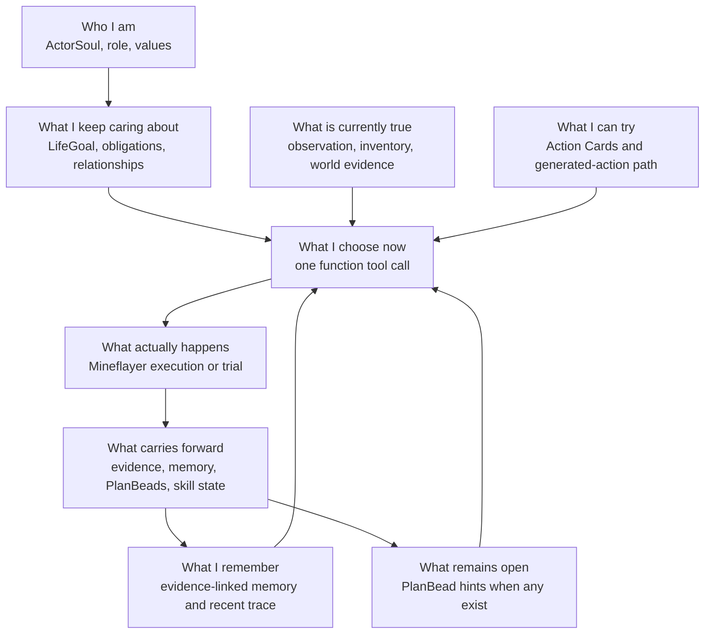
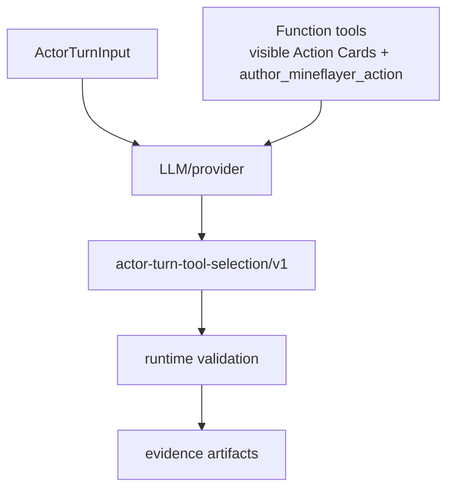
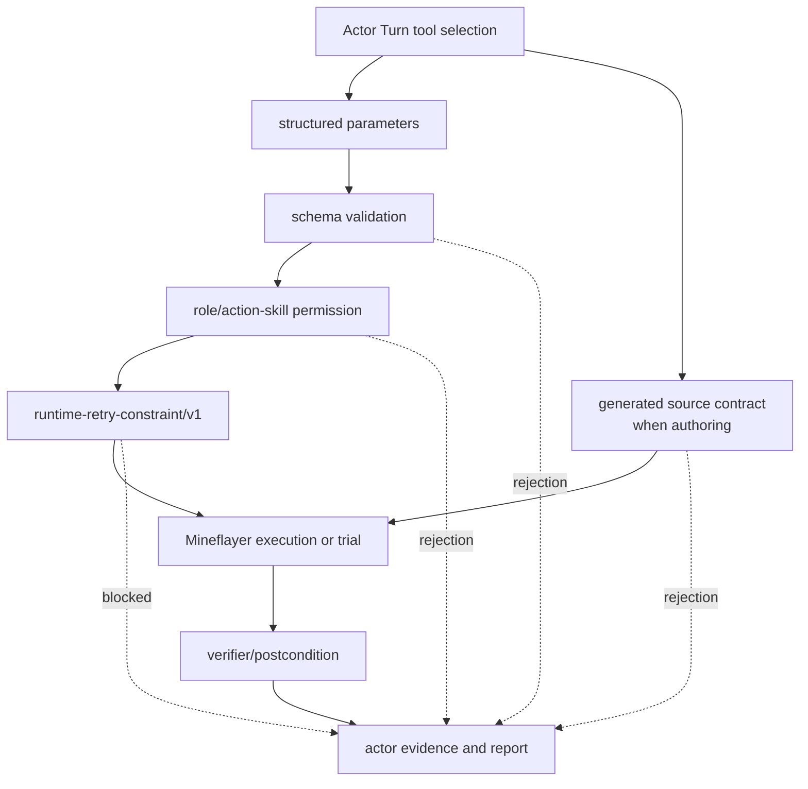
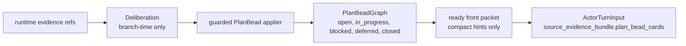
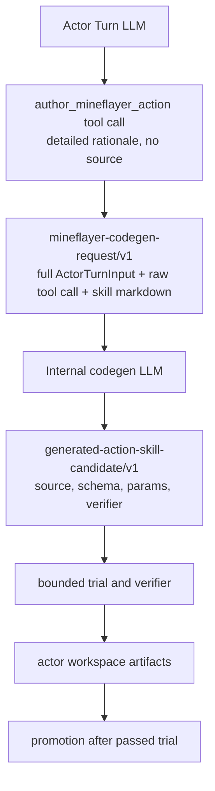

# Current Project Implementation Architecture Review

Search token: `CURRENT_IMPLEMENTATION_ARCHITECTURE_REVIEW`.

Status: repo-internal current implementation map. This is an orientation
document for the checked-out repository state, not a PR summary and not a
replacement for `SPEC.md`.

Location: project root. This is not a Docusaurus public page.

## What This Document Is For

This document helps a reader who is new to the current repository answer these
questions quickly:

1. What is this project building right now?
2. What does the LLM/provider own, and what do the TypeScript runtime,
   Mineflayer, and actor workspace own?
3. How do Actor Turn, Action Cards, PlanBeads, and generated action skills fit
   together?
4. How does the runtime distinguish real Minecraft progress from fake progress?
5. Where does the shared-session experiment substrate fit?
6. What are the largest current implementation risks?

In one sentence: this repository is building a **bounded, observable headless
Minecraft runtime where Soul/LifeGoal-grounded actors first demonstrate
individual competence and goal continuity, then act in materially interdependent
shared sessions whose long-run evidence, metrics, and video support phenomenon
discovery and controlled follow-up studies**.

The important boundary is that the LLM/provider does not own Minecraft truth.
During Actor Turn, the provider chooses one visible Action Card function tool or
`author_mineflayer_action`. The runtime checks structured parameters,
permissions, retry constraints, source guards, verifier output, and evidence.
Mineflayer calls the actual Minecraft client API. The actor workspace carries
evidence, memory, PlanBeads, relationships, and generated action-skill state
into later turns.

Runtime verification is mandatory hygiene, not the research contribution. The
active program separates individual task competence, autonomous goal
continuity, interdependent social behavior, and later scientific claims.
Acting success, physical competence, social consequence, continuity,
robustness, efficiency, and any optional prediction quality must be reported
separately.

## One-Page Mental Model

```mermaid
flowchart LR
  Soul["ActorSoul + LifeGoal<br/>identity and long-lived direction"]
  Workspace["Actor workspace<br/>evidence, memory, PlanBeads, skills"]
  Observe["Observation<br/>world, inventory, actors, transcript"]
  Input["ActorTurnInput<br/>current_state + source_evidence_bundle,<br/>Action Cards, guide"]
  LLM["Actor Turn LLM<br/>function tool selection"]
  Choice{"Exactly one tool call"}
  Card["Visible Action Card<br/>schema-bound parameters"]
  Author["author_mineflayer_action<br/>request codegen with full context"]
  Runtime["Runtime gates<br/>schema, permission, retry, verifier"]
  Codegen["Internal Mineflayer codegen<br/>full ActorTurnInput + raw tool call + skill markdown"]
  MC["Mineflayer + Minecraft"]
  Row["transition-row/v1<br/>state_before + executed_action + observed_delta"]
  Window["response window<br/>other actor subsequent turns or timeout"]
  Report["capability, continuity,<br/>and long-run reports"]
  Video["synchronized review video"]
  Phenomenon["candidate phenomenon<br/>and follow-up study"]
  Evidence["Evidence Trace append<br/>reports and artifacts"]

  Soul --> Input
  Workspace --> Input
  Observe --> Input
  Input --> LLM --> Choice
  Choice --> Card --> Runtime
  Choice --> Author --> Codegen --> Runtime
  Runtime --> MC --> Row
  Row --> Window --> Evidence --> Workspace
  Evidence --> Report --> Phenomenon
  Evidence --> Video --> Phenomenon
```

Arrows show information and artifact flow, not authority transfer. Provider text
does not establish execution or success. Only validated runtime actions,
Mineflayer execution, and runtime-observed evidence create Minecraft progress.
Offline analysis and video are review-only. They do not select actions, fill
runtime parameters, decide success, mutate actor state, or override runtime
checks.

## Current Product Scope

The active direction is defined in
`central-plan-capability-gated-social-sandbox.md`. The provider-free
implementation now includes individual capability manifests/reports with full
case budget stopping, continuity bag loading and offline evaluation, declared
continuity cases, interdependent scenario files, long-run observation formats,
and a fixture-only phenomenon index. A5, live B3, and live multi-actor C2/C3
still require provider approval and current-run evidence.

The detailed sequence and current status are in
`capability-gated-social-sandbox-implementation-plan.md`. No provider-backed
batch or live multi-actor V4 session has been run.

| Scope | Current target |
| --- | --- |
| Actor count | single actor for competence/continuity gates; small attributable multi-actor sessions first; scale later as an explicit axis |
| Minecraft client | multiple Mineflayer bots in one server session |
| Runtime loop | observe -> Actor Turn slot -> gate -> execute/trial -> verify -> record row -> close response window |
| Provider hot path | per-actor provider routing; deterministic providers remain calibration tools |
| Generated behavior | Actor Turn-only `author_mineflayer_action`, then bounded codegen/trial |
| Continuity | actor workspace evidence, memory, PlanBeads, relationships, action skill state |
| Research data | benchmark reports, goal-lifecycle artifacts, `transition-row/v1` observations, long-run reports, metrics, and video refs |

Current non-goals:

- Voyager-style architecture revival;
- race-to-diamond benchmark optimization;
- shelter, storage, mining, travel, or conversation as an always-on planner;
- persona text alone pretending to be social simulation;
- hidden Minecraft heuristics that choose for the LLM while claiming the LLM
  stayed free;
- provider prose being treated as runtime authority;
- verification, screenshots, logs, or benchmark artifacts being presented as
  the research contribution.
- a preselected prediction or legibility experiment driving the build before a
  recurring phenomenon is observed.
- Qwen-AgentWorld, JarvisVLA, VLA arms, model training, fine-tuning, or
  society-scale claims before capability, continuity, and attributable social
  runs work.

## Actor Perspective

From the NPC/actor perspective, the current runtime should be read this way:

```mermaid
flowchart TD
  Identity["Who I am<br/>ActorSoul, role, values"]
  Direction["What I keep caring about<br/>LifeGoal, obligations, relationships"]
  EvidenceNow["What is currently true<br/>observation, inventory, world evidence"]
  Memory["What I remember<br/>evidence-linked memory and recent trace"]
  Work["What remains open<br/>PlanBead hints when any exist"]
  Body["What I can try<br/>Action Cards and generated-action path"]
  Turn["What I choose now<br/>one function tool call"]
  World["What actually happens<br/>Mineflayer execution or trial"]
  Consequence["What carries forward<br/>evidence, memory, PlanBeads, skill state"]

  Identity --> Direction --> Turn
  EvidenceNow --> Turn
  Memory --> Turn
  Work --> Turn
  Body --> Turn
  Turn --> World --> Consequence
  Consequence --> Memory
  Consequence --> Work
```

If `ActorSoul` says the actor is cautious, the runtime must not secretly guess a
safe coordinate and move there. If `LifeGoal` values the community, the runtime
must not turn every turn into a storage or shelter planner. The LLM reads the
current evidence and Action Cards and decides directly. The runtime executes
only when that decision passes explicit structured parameters and gates.

`current_state` is the bounded typed fact layer. `source_evidence_bundle` is the
bounded source layer that keeps observation, world-event, memory, recent-action,
and PlanBead cards beside those facts. This pairing is intentional: compact
summaries may help low-cost models, but summary-only observation/social/action
context loses too much information and recreates a hidden planner bottleneck.
The public-history exporter must derive predictor input only from allowlisted
runtime evidence, after the runtime has recorded action and observation truth.

## Core Terms

| Term | Current meaning |
| --- | --- |
| `ActorSoul` | actor identity seed. Long-lived context, not decoration. |
| `LifeGoal` | actor's long-lived direction. It shapes choices but does not execute. |
| `ActiveEpisode` | current bounded focus window for ordinary Actor Turns. |
| `ActorTurnInput` | provider-facing packet: `current_state`, `source_evidence_bundle`, Action Cards, Minecraft Basic Guide, relationship context, retry constraints, and budget hint. |
| Action Card | visible function-tool affordance with a strict parameter schema and runtime mapping. |
| `author_mineflayer_action` | logical tool selection that starts internal full-context Mineflayer codegen. It does not carry source. |
| runtime action | validated resolved action or generated candidate trial that may reach Mineflayer. |
| PlanBeads | passive actor-owned work graph for open work, blockers, obligations, followups. |
| Evidence Trace | compact window of runtime-backed action/evidence results for the next Actor Turn. |
| actor workspace | source of truth for actor artifacts: evidence, memory, PlanBeads, relationships, provider snapshots, generated action skills. |
| `transition-row/v1` | independent state/action/observed-delta row used across benchmarks, sandbox runs, and later studies; no embedded prediction authority. |
| public-history export | allowlisted analysis artifact derived from runtime evidence; excludes ActorSoul, LifeGoal, memory, PlanBeads, provider IO, and private workspace fields of the target. |
| response window | bounded post-action period that closes only after every other active actor has completed a subsequent Actor Turn slot or a declared timeout fires. |
| offline predictor artifact | analysis-only prediction joined by `row_id` after labels are locked; it is not runtime authority. |

`agent skill` and `action skill` are different. An `agent skill` is a Codex or
Claude capability such as `.agents/skills/mineflayer-code-generation/SKILL.md`.
An `action skill` is a Minecraft behavior the runtime can validate, execute,
verify, and persist for an actor.

## Provider Boundary

Provider output is tool selection, not Minecraft truth.

```mermaid
flowchart TD
  Input["ActorTurnInput"]
  Tools["Function tools<br/>visible Action Cards + author_mineflayer_action"]
  Provider["LLM/provider"]
  Selection["actor-turn-tool-selection/v1"]
  Runtime["runtime validation"]
  Evidence["evidence artifacts"]

  Input --> Provider
  Tools --> Provider
  Provider --> Selection
  Selection --> Runtime
  Runtime --> Evidence
```

| Provider can | Provider cannot |
| --- | --- |
| Choose one visible function tool | Call hidden primitives, hidden action skills, or raw Mineflayer |
| Fill strict `parameters` for that tool | Supply missing parameters through rationale text |
| Explain detailed situation/rationale | Claim physical success |
| Choose `author_mineflayer_action` when no visible card can express the needed bounded behavior | Include generated source in the outer tool call |
| Use PlanBead hints, memory, guide, relationship context as context | Treat PlanBeads or memory as executable authority |

The strongest current anti-pattern is parsing LLM-facing prose as policy.
Runtime code must not search `current_state_requirements`, Action Card
descriptions, Minecraft Basic Guide text, memory, PlanBeads, or rationale with
`includes`, regexes, keyword lists, or domain-family heuristics to choose tools,
supply args, clear retry, grant permission, authorize source, or prove success.

Tool calling and schemas/enums define the flow. Runtime validation and evidence
define execution truth.
Offline predictor artifacts define legibility evaluation; they must not be
collapsed into the Actor Turn success label or into runtime truth.

## Runtime Gates

Runtime gates reject fake progress before Mineflayer work starts.

```mermaid
flowchart TD
  Selection["Actor Turn tool selection"]
  Params["structured parameters"]
  Schema["schema validation"]
  Permission["role/action-skill permission"]
  Retry["runtime-retry-constraint/v1"]
  Source["generated source contract<br/>when authoring"]
  Execute["Mineflayer execution or trial"]
  Verify["verifier/postcondition"]
  Evidence["actor evidence and report"]

  Selection --> Params --> Schema --> Permission --> Retry --> Execute --> Verify --> Evidence
  Selection --> Source --> Execute
  Schema -. rejection .-> Evidence
  Permission -. rejection .-> Evidence
  Retry -. blocked .-> Evidence
  Source -. rejection .-> Evidence
```

Important boundaries:

- Natural-language rationale is review context only.
- Required item/count/position/text parameters must be present in structured
  params before execution.
- Repeated exact blockers become retry constraints over normalized target/args.
- A failed gate writes evidence; it must not silently fall back to movement,
  observe, wait, or guessed parameters.
- Generated source must pass helper allowlist, source contract, schema,
  verifier, timeout, trial, and promotion policy.

## PlanBeads Boundary

PlanBeads are still part of the architecture, but their role is passive and
durable.

```mermaid
flowchart LR
  Beads["PlanBeadGraph<br/>open, in_progress, blocked, deferred, closed"]
  Ready["ready front packet<br/>compact hints only"]
  Turn["ActorTurnInput<br/>source_evidence_bundle.plan_bead_cards"]
  Branch["Deliberation<br/>branch-time only"]
  Applier["guarded PlanBead applier"]
  Evidence["runtime evidence refs"]

  Beads --> Ready --> Turn
  Evidence --> Branch --> Applier --> Beads
```

Good PlanBeads behavior:

- preserve open work, blockers, obligations, and followups across context
  changes;
- expose compact hints to Actor Turn;
- accept guarded operations with evidence refs;
- make long-term work state reviewable.

Bad PlanBeads behavior:

- choosing primitives or action skills;
- supplying runtime parameters;
- acting as a Minecraft strategy checklist;
- claiming physical success;
- requiring the NPC to maintain beads instead of acting.

Latest evidence matters here: the 2026-06-04 fresh-world 50-cycle run wrote
ready-front snapshots on every cycle, but all PlanBead packets were empty:
`selected_plan_bead_refs=0`, `plan_bead_operation_results=0`,
`source_evidence_bundle.plan_bead_cards=[]`. That means PlanBeads were wired but
not substantively used in that run. The next implementation pass must
create/update durable beads from meaningful social requests, completed/blocked
episode work, and repeated no-progress evidence without turning PlanBeads into
an executor.

## Generated Mineflayer Action Authoring

Generated Mineflayer behavior must originate from Actor Turn.

```mermaid
flowchart TD
  Turn["Actor Turn LLM"]
  Author["author_mineflayer_action tool call<br/>detailed rationale, no source"]
  Request["mineflayer-codegen-request/v1<br/>full ActorTurnInput + raw tool call + skill markdown"]
  Codegen["Internal codegen LLM"]
  Candidate["generated-action-skill-candidate/v1<br/>source, schema, params, verifier"]
  Trial["bounded trial and verifier"]
  Workspace["actor workspace artifacts"]
  Promote["promotion after passed trial"]

  Turn --> Author --> Request --> Codegen --> Candidate --> Trial --> Workspace --> Promote
```

The outer Actor Turn model selects codegen. It does not choose a `context_to_preserve`
summary and does not provide source. The internal codegen call receives the full
original Actor Turn context plus the full raw tool call and the
`.agents/skills/mineflayer-code-generation/SKILL.md` body.

## Actor Workspace And Evidence

Actor workspace is the continuity source of truth.

| Workspace data | Why it matters |
| --- | --- |
| soul and LifeGoal | preserve actor identity and direction |
| provider input/output snapshots | show exactly what the model saw and returned |
| action/evidence artifacts | distinguish execution, blocker, timeout, verifier result |
| memory | influences later turns without pretending to prove progress |
| PlanBeads | durable open work and blockers when created |
| relationships | social context and consequences |
| action skill records | actor-owned candidate/active/retired behavior state |
| provider usage | budget and free-tier guard evidence |

Weak evidence must stay weak. Observation, wait, provider narration, or memory
can provide context, but they are not physical success unless observed world,
inventory, position, block, container, chat, or transcript evidence
supports the claim.

## How To Diagnose A Run

Use this order.

1. Read the report summary and provider usage.
2. Open the Actor Turn provider input snapshot for the bad turn.
3. Check the raw provider output/tool call.
4. Check the parsed tool-selection artifact and resolver/gate evidence.
5. Check Mineflayer execution evidence and postcondition/verifier output.
6. Check Evidence Trace, judgment/memory, PlanBead operation results, and
   relationship events that carried forward.

This separates four failure classes:

- provider selected a poor action;
- provider selected a good action with invalid parameters;
- runtime incorrectly allowed/rejected the action;
- Mineflayer/verifier/artifact logic made the result look stronger or weaker
  than reality.

## Code Reading Map

| Question | Start here |
| --- | --- |
| Where does the run orchestrate? | `probe/src/runtime/socialCycleRunner.ts` |
| What does Actor Turn see? | `probe/src/runtime/goals/actorEpisode/turnInput.ts` and sibling projection modules |
| How are Action Cards built? | `probe/src/runtime/goals/actorEpisode/actionCards.ts` |
| How is one tool call parsed? | `probe/src/provider/socialActorTurnToolParser.ts` |
| How does OpenAI/Gemini tool calling run? | `probe/src/provider/openaiApiToolProvider.ts`, `probe/src/provider/geminiApiToolProvider.ts` |
| How is Actor Turn resolved? | `probe/src/runtime/goals/actorEpisode/resolver.ts` |
| How does codegen run? | `probe/src/provider/socialActorTurnCodegenProvider.ts` |
| How are generated candidates checked? | `probe/src/skills/generated/sourceContracts.ts`, `probe/src/skills/generated/verifierEvaluation.ts` |
| How are PlanBeads stored/applied? | `probe/src/runtime/goals/planBeads/**` |
| How are retry constraints handled? | `probe/src/runtime/retryConstraints.ts` |
| How are runs audited? | `probe/src/runtime/goals/socialCycleReportAuditCli.ts`, `probe/src/runtime/goals/socialCycleReviewSummary.ts` |

`socialCycleRunner.ts` remains large. That is a review risk. The architectural
question is whether provider authority, runtime validation, Mineflayer execution,
evidence, and persistence stay traceable despite that size.

## Current Implementation Strengths

- Actor Turn function-tool selection is now the ordinary hot path.
- Existing Action Card parameters are schema-bound and validated before
  execution.
- `author_mineflayer_action` uses full-context internal codegen instead of a
  lossy archived summary.
- Runtime code rejects missing parameters rather than inferring them from prose.
- Provider usage and artifacts make live runs auditable.
- Runtime retry constraints can block exact repeated failures before another
  Mineflayer call.
- Generated action candidates now leave source, schema, helper, verifier, trial,
  and promotion artifacts.
- The active research plan now separates individual capability, goal continuity,
  social opportunity, observation, and controlled claims.

## Current Implementation Risks

1. The runtime does not yet expose the active program as one integrated live
   path. A3 limit handling and B2 bag loading pass provider-free tests, but a
   case signal still does not cancel a provider SDK request already in flight.
   Social/observation/phenomenon files are not connected to a live V4
   multi-actor session, and A5/B3 live still need provider approval.
2. Response-window semantics are the highest-risk logic. A window that closes on
   immediate post-action observation recreates the old `no_observable_response`
   vacuity and makes social-response labels uninformative.
3. The C3 public export rejects its named private fields, but no live V4 writer
   yet proves that raw actor workspaces and provider snapshots stay outside the
   bundle. Live export still needs an explicit allowlisted producer.
4. `socialCycleRunner.ts` is still a large orchestration file; the architecture
   risk is not size by itself, but whether slot events, actor routing, row
   assembly, evidence, and response-window closure remain traceable through it.
5. PlanBeads are wired but can still be substantively empty; they preserve
   continuity only when meaningful social requests, blockers, obligations, and
   repeated no-progress evidence create/update durable records.
6. Long-run behavior can still loop on observe/inspect/wait or repeated
   low-value actions even when runtime status is `passed`; capability and
   continuity diagnostics must separate substrate failure from social behavior.
7. A docs/test green state is not enough. Each benchmark pass needs current-run
   target evidence, and each social observation needs competence controls,
   scenario provenance, and linked long-run evidence before interpretation.

## Documentation Authority

If documents disagree, start from:

1. `SPEC.md`
2. `AGENTS.md`
3. `project-docs/research/current-spine/central-plan-capability-gated-social-sandbox.md`
4. `project-docs/research/current-spine/capability-gated-social-sandbox-implementation-plan.md`
5. `project-docs/research/benchmarks/project-level-benchmark-plan.md`
6. `project-docs/runtime/actor-turn/actor-turn-tool-calling-and-full-context-codegen.md`
7. `project-docs/runtime/actor-turn/actor-episode-and-actor-turn-architecture.md`
8. `project-docs/operations/handoffs/current-handoff-and-next-work.md`
9. `project-docs/orientation/documentation-map.md`
10. `project-docs/orientation/terminology.md`

Reference docs under `project-docs/references/**` and historical docs under
`project-docs/archive/**` are not active implementation specs unless a current
architecture document explicitly routes to them.
