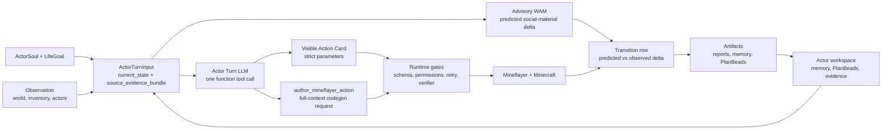

# minecraft-llm-agent-community

Headless Minecraft runtime-loop research for advisory social-material World
Action Models in wild Minecraft.

This repository is not a Voyager clone, a race-to-diamond benchmark, or a
house-building planner. Minecraft task completion is a competence gate, not the
final research target. The target is to study whether an advisory model can
predict how embodied Minecraft actions change physical state, material access,
obligations, relationships, and future action opportunities in natural,
reproducible worlds.

Runtime verification, evidence artifacts, seed/reset records, screenshots, and
scoring scripts are mandatory experiment hygiene. They are not the research
claim by themselves. The research claim is about action-conditioned
social-material consequence prediction, with acting outcome and prediction
accuracy reported separately.

[Documentation & Web Portal](https://gigio1023.github.io/minecraft-llm-agent-community/)

## Current Direction

Near-term proof:

- one actor, one Mineflayer bot;
- ActorSoul and LifeGoal shape intent, but do not replace runtime observation;
- Actor Turn is the ordinary decision hot path;
- Action Cards expose what the actor can try now;
- generated Mineflayer action authoring starts only from Actor Turn
  `author_mineflayer_action`;
- PlanBeads preserve passive open work, blockers, obligations, and followups;
- Minecraft progress requires runtime execution and ordinary runtime checks;
- simple target-state benchmarks remain calibration gates before transition
  prediction and social-material trajectory evaluation.

Long-term north star:

- an advisory social-material WAM that predicts physical, material, and social
  deltas for embodied Minecraft actions;
- actors with role context, memory, relationships, action skill ownership,
  obligations, material claims, public affordances, weak commons, and visible
  consequences that persist after one immediate task is completed;
- a bounded coding-agent autoresearch loop that improves prompts, predictor
  code, action-skill candidates, scenarios, and reporting only against locked
  transition-scoring targets.

Research framing:

- existing Minecraft LLM-agent benchmarks mostly evaluate bounded task
  completion or task-oriented collaboration;
- existing Minecraft world models and visual-policy systems mostly model pixels
  or task competence, not material claims, obligations, or social consequences;
- existing LLM social simulations provide useful social vocabulary but often
  resolve outcomes in text rather than through embodied material change;
- this project aims to measure predicted-vs-observed social-material deltas in
  natural open-world Minecraft seeds, including possession, access, obligations,
  public-affordance use, memory continuity, recovery from blockers, and
  post-goal continuation.

## Runtime Shape



The LLM chooses directly, but it does not own Minecraft truth. Structured tool
parameters, generated-source guards, retry constraints, timeouts, Mineflayer
execution, runtime checks, and actor-workspace artifacts decide what happened.
The advisory WAM predicts what should change; transition rows compare that
prediction with what the runtime observed.

## Context Philosophy

The runtime should help the LLM think, not quietly think for it.

Compression is acceptable for bounded facts such as inventory counts, hunger,
health, food candidates, retry constraints, and provider budget status.

Compression is not enough for observation geometry, action/failure history,
social pressure, PlanBead work state, or generated action trials. Those surfaces
must move as compact summaries plus source evidence refs/cards. Summary-only
context is treated as information loss.

Do not add hidden domain planners such as `deposit_candidates`,
`open_social_requests`, generated chat text, shelter-first phases, or hardcoded
recipe/placement strategy filters. If a runtime decision matters, express it as
a typed contract, strict schema, permission gate, retry constraint, or verifier.

## Active Boundaries

- `current_state` is bounded typed context, not proof of success.
- `source_evidence_bundle` preserves bounded raw evidence cards and refs beside
  summaries.
- Action Card `parameters` are executable contracts.
- Natural-language rationale explains intent but never supplies missing args.
- PlanBeads are passive issue-like actor state, not executable authority.
- Actor Turn actions are direct tool selections with schema-bound parameters.
- External Minecraft-agent papers are references to adapt, not product specs.
- The advisory WAM predicts deltas; it never selects the executed action, fills
  missing parameters, closes obligations, or overrides runtime checks.
- Verification is audit hygiene, not a headline contribution.

## Key Documents

Read in this order:

1. `SPEC.md`
2. `AGENTS.md`
3. `CURRENT_IMPLEMENTATION_ARCHITECTURE_REVIEW.md`
4. `project-docs/specification/advisory-social-material-wam.md`
5. `project-docs/orientation/documentation-map.md`
6. `project-docs/orientation/agent-search-index.md`
7. `project-docs/runtime/actor-turn/actor-episode-and-actor-turn-architecture.md`
8. `project-docs/runtime/actor-turn/actor-turn-tool-calling-and-full-context-codegen.md`
9. `project-docs/runtime/actor-turn/context-projection-and-source-evidence.md`
10. `project-docs/runtime/planbeads/actor-persistent-state-and-planbeads.md`
11. `project-docs/research/benchmarks/grounded-social-trajectory-benchmark-spec.md`
12. `project-docs/research/benchmarks/material-claims-and-social-economy-benchmark-plan.md`
13. `project-docs/runtime/overview/minecraft-basic-guide.md`
14. `project-docs/operations/setup/headless-server.md`
15. `project-docs/operations/setup/provider-setup.md`

## Running Checks

Useful focused checks:

```bash
cd probe && bun run typecheck
cd probe && bun test test/actorTurnProviderInput.test.ts
cd docs && npm run build
git diff --check
```

For live Minecraft experiments, use `project-docs/operations/setup/headless-server.md` and
`project-docs/operations/setup/provider-setup.md`. Treat provider quota, Docker platform,
and server lifecycle as experiment hygiene, not as actor behavior.
