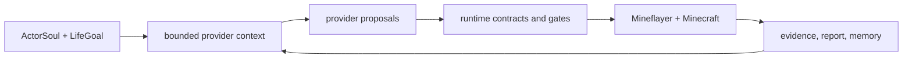
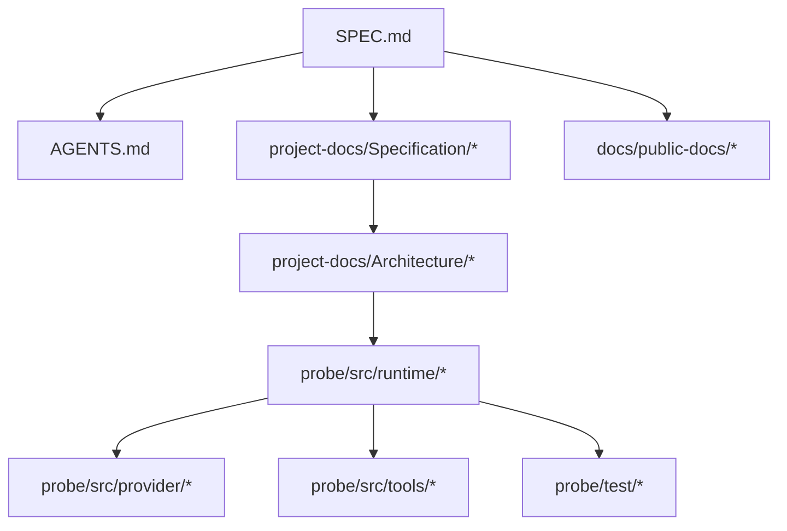

# minecraft-llm-agent-community


Headless Minecraft runtime-loop research for a Soul-grounded social simulation
seed.

This repository is not currently trying to ship a full multi-actor society.
It is rebuilding a small, bounded, observable runtime whose near-term proof is a
single-actor social-life simulation seed.

[Documentation & Web Portal](https://naem1023.github.io/minecraft-llm-agent-community/)

## Current Direction

Short-term product:

- a tiny headless Minecraft runtime;
- one actor that acts in Minecraft from `ActorSoul`, `LifeGoal`, and
  `WorldEvent` pressure;
- memory and CycleJudgment records that affect later cycles;
- real end-to-end progress on boring gameplay tasks;
- strong observability through transcript and runtime artifacts;
- truthful reconnect/session lifecycle evidence when reconnect is in scope;
- architecture space for per-actor action skill ownership and later action
  skill evolution;
- an autonomy substrate that exposes context, `action_surface`, hooks,
  verification, and artifacts without turning one domain goal into the runtime
  strategy.

Long-term north star:

- a social simulation seed in Minecraft;
- actors, represented by Mineflayer bots, with role pressure, memory, action
  skill ownership, and eventually richer social interaction with each other and
  a human player.

Not current goals:

- persona richness as a content deliverable;
- full human-like personhood;
- long-run autonomy as a product deliverable;
- a Voyager clone;
- a house-building or structure-planning architecture;
- pretending partial animation is the same thing as competence.

## Current Runtime Shape

The current implementation is a bounded Actor Turn runtime. On the ordinary hot
path, the Actor Turn provider sees current state, recent evidence, Action Cards,
the Minecraft Basic Guide, memory, relationship context, and passive PlanBead
hints. It then chooses exactly one visible function tool: either an Action Card
with strict `parameters`, or `author_mineflayer_action` when a new bounded
Mineflayer behavior needs to be generated and trialed.

Minecraft truth stays inside the runtime: schemas, gates, retry constraints,
Mineflayer execution, verification, artifacts, and actor workspace state.

For a review-friendly architecture walkthrough with focused Mermaid diagrams,
see
[Current Implementation Architecture Review](CURRENT_IMPLEMENTATION_ARCHITECTURE_REVIEW.md).



In short:

- `action_surface` is the actor's current body, not a domain-specific checklist;
- `world-state-summary/v1` is query-neutral evidence with explicit scan limits;
- Action Card tool `parameters` are executable contracts, not prose suggestions;
- `runtime-retry-constraint/v1` blocks exact repeated target/args failures
  before another Mineflayer call;
- memory can influence later cycles, but Minecraft progress still requires
  verifier-backed runtime evidence.
- `ActionIntent` is legacy terminology for migration artifacts only; it is not
  the current Actor Turn provider or codegen boundary.

## What Success Looks Like

The first meaningful success is not a big multi-agent story.

It is this:

- an actor chooses a bounded CycleGoal from soul, life goal, world pressure,
  memory, and previous judgment;
- the actor actually attempts Minecraft actions selected from current evidence
  and `action_surface` affordances through runtime gates;
- every action attempt is recorded, including blocked and no-progress attempts;
- later cycles reuse previous judgment or memory;
- failures are explainable from transcript, checkpoint-like artifacts, and traces;
- builtin or deterministic fallback is labeled as fallback, not LLM agency;
- the runtime is small enough to refactor without guesswork;
- later social simulation work can build on top without starting over again.

## Current Evidence Baseline

The current action-skill baseline is 14 implemented seed action skills with
fresh current-run live matrix proof:

```text
matrix_summary verdict=passed passed=14 failed=0 error=0 total=14/14
matrix_scope_counts current_run=14 historical_transcript=0 missing=0 environment_blocked=0
```

The latest long-horizon OpenAI social-cycle stress test asked one actor to work
under broad settlement pressure for up to 100 cycles. It reached 54 recorded
cycles before a cleanup-only file-permission blocker stopped the command. The
report audited cleanly and stayed truthful:

- `builtin_goal_authority=false`;
- `builtin_execution_source=false`;
- `fixture_dependency=false`;
- prior `CycleJudgment` and memory were reused in later provider context;
- the actor produced concrete Minecraft evidence across inventory, crafting,
  and block-placement attempts;
- the run did not claim broader goal completion without verifier support.

That run is a stress test, not a product identity change. The main next work
remains planner/control substrate hardening, not a domain-specific architecture:
partial-progress reporting, review-summary schema catch-up, fresh-world cleanup
ownership, broader action-surface diagnostics, and bounded target discovery.
Required action arguments and exact repeated-blocker retry constraints are now
baseline runtime gates.
See `project-docs/Architecture/Future-Works.md`.

The active social-cycle implementation now carries runtime-owned
`action-surface/v1`, `runtime-retry-constraint/v1`, `settlement-state/v1`, and
`settlement-checklist/v1` context/report fields. These fields summarize
direct/deferred affordances, exact repeated retry gates, inventory, shared
storage, known positions, recent blockers, available action skills, missing
primitive blockers, memory reuse, and checklist progress. They are evidence
packets and runtime gates, not provider claims or a fixed domain plan. New
runtime logic should treat settlement compatibility state as diagnostic state
until it is renamed or retired behind a broader typed state contract.

Recent hardening also makes several fake-success paths visible as blocked
runtime evidence:

- direct primitive tool selections cannot carry `action_skill_id`;
- direct shared-storage transfer selections require explicit `count` or
  `targetCount`;
- `wait` and `remember` go through CycleGoal and active action-skill gates;
- repeated exact target/args blockers become runtime retry constraints and are
  blocked before another Mineflayer call, with review-summary counts;
- review summaries and report audits only count explicit
  `world-state-summary/v1` or `world-state-scan/v1` artifacts as world-scan
  evidence.

## Core Principles

- no raw JavaScript `eval` gameplay loop;
- deterministic-first runtime development;
- runtime-owned validation, timeout, verification, and artifacts;
- query-neutral world-state diagnostics instead of provider-facing gameplay
  taxonomies;
- structured function-tool argument contracts instead of hidden executor
  defaults;
- actor workspace is the source of truth for actor-owned action skill state;
- tests stay small and Detroit-style;
- live transcript is the primary behavior evidence;
- social simulation should emerge from Minecraft task pressure, not persona text alone.

## Docker And ARM Platform Notes

This branch is actively used on Apple Silicon macOS and Linux ARM. Platform
setup is part of the runtime evidence story because Docker socket state,
container engine choice, native binaries, and Java/Minecraft server behavior can
otherwise be misdiagnosed as agent failure.

On the current Linux ARM setup, use official Docker Engine rather than Podman
compatibility shims:

```bash
docker --version
docker compose version
docker info
```

If `docker info` fails from an existing shell after installation, refresh group
membership with `newgrp docker` or reconnect the shell.

## Canonical Documents

Read these first:

1. `SPEC.md`
2. `AGENTS.md`
3. `CLAUDE.md`
4. `project-docs/Specification/Soul-Grounded-Social-Simulation.md`
5. `project-docs/Specification/Runtime-Evidence-And-Action-Skills.md`
6. `project-docs/Specification/Engineering-Governance-And-Testing.md`
7. `project-docs/Specification/Reference-Adaptation-Guide.md`
8. `project-docs/Documentation-Map.md`
9. `project-docs/Agent-Search-Index.md`
10. `project-docs/Terminology.md`
11. `project-docs/Architecture/Minimal-Probe.md`
12. `project-docs/Architecture/Soul-Life-Goal-Runtime-Architecture.md`
13. `project-docs/Architecture/Actor-Persistent-State-And-PlanBeads.md`
14. `CURRENT_IMPLEMENTATION_ARCHITECTURE_REVIEW.md`
15. `project-docs/Architecture/Real-Server-Simulation-Test-Plan.md`
16. `project-docs/Architecture/Future-Works.md`
17. `project-docs/Architecture/composer-2.5-Soul-Life-Goal-Runtime-Implementation-Plan.md`

Historical plans, research pages, and raw paper dumps live under
`project-docs/research-archive/`. They are preserved for context, but they are not
active implementation instructions unless an active spec or handoff doc promotes
them.

## Quick Start

### Requirements

- Docker Engine and Docker Compose plugin
- Bun 1.3+
- Node.js 22+ for docs builds

### Install probe dependencies

```bash
cd probe && bun install
```

### Start the headless server

```bash
bun run --cwd probe server:ready
```

The command prints `minecraft_direct_connect=127.0.0.1:25565` for a local
Minecraft Java client. It starts the Docker server if needed or reports the
existing managed endpoint. Stop it with `bun run --cwd probe server:stop`.

### Provider auth and usage guard

Social-cycle runs are deterministic by default. Live provider calls must be
explicit so free-tier or paid usage does not happen by accident.

Gemini API is the preferred lightweight live social-cycle path for current
experiments. Gemma 4 31B uses the Gemini API model id `gemma-4-31b-it`.

```text
GEMINI_API_KEY=...
GEMINI_MODEL=gemma-4-31b-it
```

OpenAI API remains available when explicitly selected, but do not use it for
cost-sensitive tests unless the local account budget has been checked.

```text
OPENAI_API_KEY=...
OPENAI_MODEL=...
```

Use `.env.example` as the secret-free template. Do not commit `.env` or provider
auth stores.

Every provider-backed call writes usage metadata into provider output snapshots
and the ignored JSONL ledger:

```text
build/provider-usage/provider-usage-ledger.jsonl
```

The usage guard checks configured free-tier budgets before a request. Built-in
guardrails cover `gemini-api` + `gemma-4-31b-it` with the current operator
reference budget, and local overrides can be supplied with:

```text
PROVIDER_USAGE_BUDGETS_PATH=build/provider-usage/free-tier-budgets.json
PROVIDER_USAGE_BUDGETS_JSON='{"budgets":[...]}'
PROVIDER_USAGE_ENFORCEMENT=enforce
```

Gameplay paths that use `openai-codex` are separate. They use an ignored local
auth store such as:

```text
build/provider-auth/openai-codex-auth.json
```

Deterministic mode should remain usable without live provider access.

### Run the social cycle

```bash
cd probe
GEMINI_MODEL=gemma-4-31b-it bun run probe:social-cycle -- \
  --actor npc_b \
  --provider gemini-api \
  --cycles 2 \
  --max-actions-per-cycle 3 \
  --report ../tmp/social-cycle-npc-b-gemma31b.json \
  --no-dashboard
```

For a very small provider-only check before a real run:

```bash
cd probe
bun run probe:gemini-json-smoke -- \
  --model gemma-4-31b-it \
  --report ../tmp/gemini-json-smoke.json
```

This is the social-life runtime. Long-objective and direct-generated objective
commands are evaluation or propagation tracks, and their reports must state when
they use builtin fallback or primitive helper expansion.

The CLI exits non-zero for every status except `passed`. `blocked`,
`environment_blocked`, and `failed` are useful evidence states, but automation
must not treat them as success. By default, CLI social-cycle runs use a
run-scoped actor workspace under `data/actors/social-runs/<run_id>/`; reuse a
workspace only when that is the explicit experiment.

### Run the probe

```bash
bun run --cwd probe src/cli.ts
```

Useful runtime options:

```bash
bun run --cwd probe src/cli.ts --npcs 3 --observe-ms 60000
bun run --cwd probe src/cli.ts --provider openai-codex --npcs 3 --observe-ms 120000
bun run --cwd probe src/cli.ts --npcs 3 --dashboard-port 4174
bun run --cwd probe src/cli.ts --npcs 3 --no-dashboard
```

The CLI starts the dashboard by default at `http://127.0.0.1:4173` while the
probe runs. The dashboard is a read-only local artifact server: it reads actor
workspace files, provider inputs/outputs, evidence, memory, relationships, and
action skills. If the dashboard port is already in use, the probe continues and
the existing dashboard can be reused.

Run artifacts should be inspectable after execution.

Primary evidence should come from:

- transcript output;
- checkpoint-like runtime artifacts;
- actor workspace evidence and world-state diagnostic summaries;
- provider input/output snapshots and usage ledger records;
- Langfuse traces when provider-backed paths are used.

## Repository Structure

| Directory | Purpose |
|-----------|---------|
| `probe/` | Runtime code, bot orchestration, tools, server setup, transcript handling. |
| `project-docs/` | Internal project docs: specs, architecture, setup, handoffs, terminology, routing. |
| `docs/public-docs/` | Docusaurus-exposed public docs for external readers. |
| `project-docs/research-archive/` | Internal historical research, old plans, and paper dumps. |
| `docs/blog/` | Docusaurus blog posts. |
| `build/provider-auth/` | Ignored local provider auth storage. |



## Documentation Status

- `SPEC.md` is the canonical rebuild spec.
- `AGENTS.md` is the canonical repo guidance for agents.
- `CLAUDE.md` mirrors the binding repo-agent rules for Claude Code and points
  back to `AGENTS.md` when rules conflict.
- `project-docs/Documentation-Map.md` classifies docs as active spec, active
  architecture, current state, supporting track, or historical context.
- `project-docs/Terminology.md` is the normative vocabulary for docs, comments,
  prompts, and report labels.
- `project-docs/Architecture/Minimal-Probe.md` describes the active current-phase goal.
- `project-docs/Architecture/Soul-Life-Goal-Runtime-Architecture.md` separates
  runtime success from actor soul, life goal, and cycle-goal authority.
- `CURRENT_IMPLEMENTATION_ARCHITECTURE_REVIEW.md`
  explains the current implementation with focused diagrams for review.
- `project-docs/Architecture/Future-Works.md` records live-run follow-ups and
  external reference ideas without changing the long-term spec.
- `project-docs/Architecture/composer-2.5-Soul-Life-Goal-Runtime-Implementation-Plan.md`
  is the current Composer 2.5 implementation handoff for that architecture.
- Docusaurus-exposed public docs live under `docs/public-docs/`.
- Internal specs, setup notes, provider/API access notes, handoffs, and
  implementation plans live under `project-docs/`.
- Internal research and old plans live under `project-docs/research-archive/`.

## License

This repository is a reference and migration staging area.
Do not revive the old Voyager-style architecture as the active implementation path.
