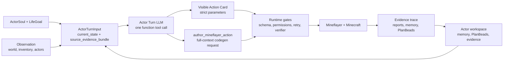

# minecraft-llm-agent-community

Headless Minecraft runtime-loop research for a Soul-grounded social simulation
seed.

This repository is not a Voyager clone, a race-to-diamond benchmark, or a
house-building planner. The current target is smaller and stricter: one
Mineflayer-backed actor should perform boring Minecraft tasks end to end while
the runtime records truthful evidence for success, failure, stalls, retries, and
state continuity.

[Documentation & Web Portal](https://naem1023.github.io/minecraft-llm-agent-community/)

## Current Direction

Near-term proof:

- one actor, one Mineflayer bot;
- ActorSoul and LifeGoal shape intent, but do not replace runtime evidence;
- Actor Turn is the ordinary decision hot path;
- Action Cards expose what the actor can try now;
- generated Mineflayer action authoring starts only from Actor Turn
  `author_mineflayer_action`;
- PlanBeads preserve passive open work, blockers, obligations, and followups;
- Minecraft progress requires runtime execution and verifier-backed artifacts.

Long-term north star:

- a Soul-grounded Minecraft social simulation seed where actors have role
  context, memory, relationships, action skill ownership, obligations, and
  visible consequences.

## Runtime Shape



The LLM chooses directly, but it does not own Minecraft truth. Structured tool
parameters, generated-source guards, retry constraints, timeouts, Mineflayer
execution, verifiers, and actor-workspace artifacts decide what happened.

## Context Philosophy

The runtime should help the LLM think, not quietly think for it.

Compression is acceptable for bounded facts such as inventory counts, hunger,
health, food candidates, retry constraints, and provider budget status.

Compression is not enough for observation geometry, action/failure history,
social pressure, PlanBead work state, or generated action trials. Those surfaces
must move as compact summaries plus source evidence refs/cards. Summary-only
context is treated as information loss.

Do not add hidden domain planners such as `deposit_candidates`,
`open_social_requests`, generated chat text, shelter-first phases, or hardcoded
recipe/placement strategy filters. If a runtime decision matters, express it as
a typed contract, strict schema, permission gate, retry constraint, or verifier.

## Active Boundaries

- `current_state` is bounded typed context, not proof of success.
- `source_evidence_bundle` preserves bounded raw evidence cards and refs beside
  summaries.
- Action Card `parameters` are executable contracts.
- Natural-language rationale explains intent but never supplies missing args.
- PlanBeads are passive issue-like actor state, not executable authority.
- Actor Turn actions are direct tool selections with schema-bound parameters.
- External Minecraft-agent papers are references to adapt, not product specs.

## Key Documents

Read in this order:

1. `SPEC.md`
2. `AGENTS.md`
3. `CURRENT_IMPLEMENTATION_ARCHITECTURE_REVIEW.md`
4. `project-docs/Documentation-Map.md`
5. `project-docs/Agent-Search-Index.md`
6. `project-docs/Architecture/Actor-Episode-And-Actor-Turn-Architecture.md`
7. `project-docs/Architecture/Actor-Turn-Tool-Calling-And-Full-Context-Codegen.md`
8. `project-docs/Architecture/Context-Projection-And-Source-Evidence.md`
9. `project-docs/Architecture/Actor-Persistent-State-And-PlanBeads.md`
10. `project-docs/Architecture/Minecraft-Basic-Guide.md`
11. `project-docs/Setup/Headless-Server.md`
12. `project-docs/Setup/Provider-Setup.md`

## Running Checks

Useful focused checks:

```bash
cd probe && bun run typecheck
cd probe && bun test test/actorTurnProviderInput.test.ts
cd docs && npm run build
git diff --check
```

For live Minecraft experiments, use `project-docs/Setup/Headless-Server.md` and
`project-docs/Setup/Provider-Setup.md`. Treat provider quota, Docker platform,
and server lifecycle as part of the evidence story, not as actor behavior.
