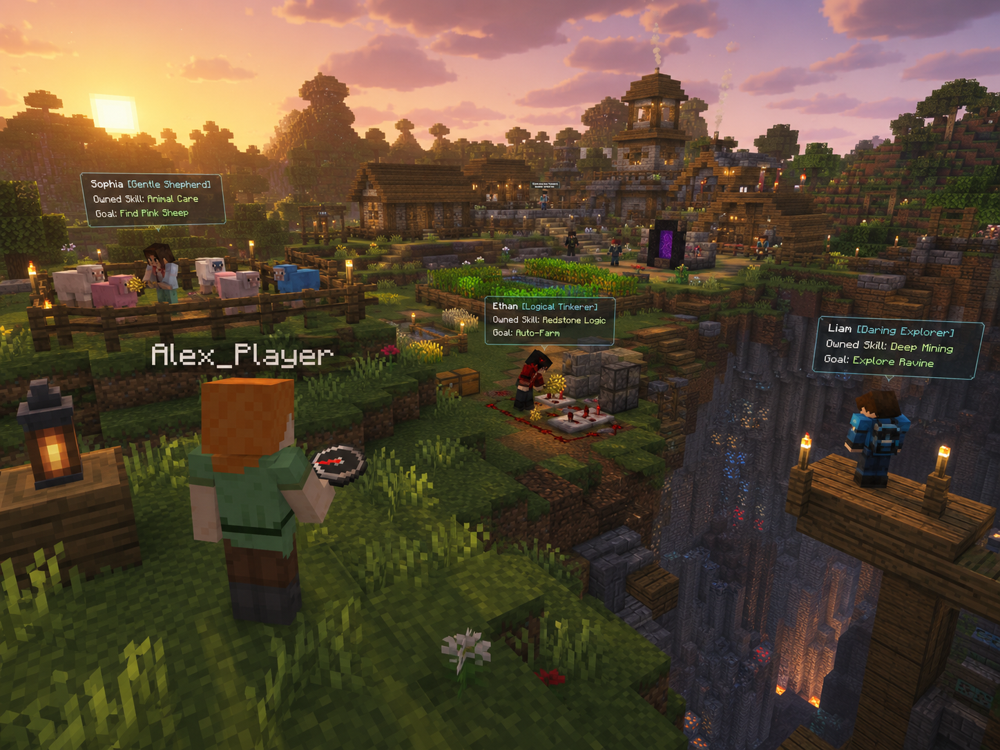
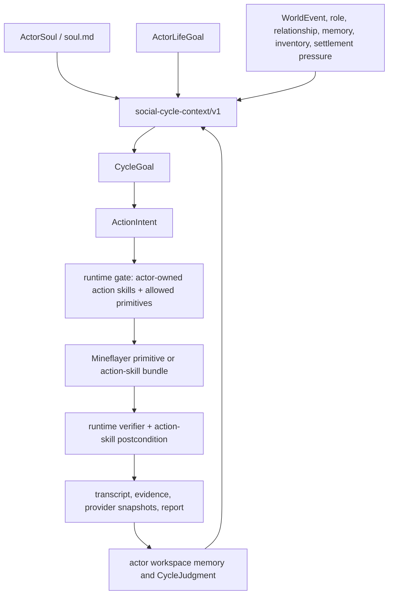
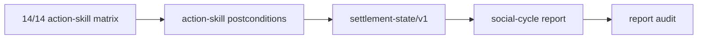
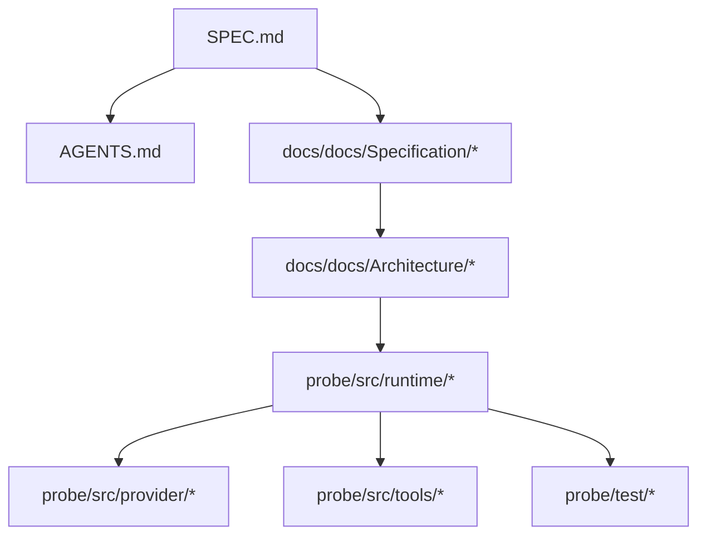

# minecraft-llm-agent-community



Headless Minecraft runtime-loop research for a Soul-grounded social simulation
seed.

This repository is not currently trying to ship a full multi-actor society.
It is rebuilding a small, bounded, observable runtime whose near-term proof is a
single-actor social-life simulation seed.

[Documentation & Web Portal](https://naem1023.github.io/minecraft-llm-agent-community/)

## Current Direction

Short-term product:

- a tiny headless Minecraft runtime;
- one actor that acts in Minecraft from `ActorSoul`, `LifeGoal`, and
  `WorldEvent` pressure;
- memory and CycleJudgment records that affect later cycles;
- real end-to-end progress on boring gameplay tasks;
- strong observability through transcript and runtime artifacts;
- truthful reconnect/session lifecycle evidence when reconnect is in scope;
- architecture space for per-actor action skill ownership and later action
  skill evolution.

Long-term north star:

- a social simulation seed in Minecraft;
- actors, represented by Mineflayer bots, with role pressure, memory, action
  skill ownership, and eventually richer social interaction with each other and
  a human player.

Not current goals:

- persona richness as a content deliverable;
- full human-like personhood;
- long-run autonomy as a product deliverable;
- a Voyager clone;
- pretending partial animation is the same thing as competence.

## Current Runtime Shape



The provider proposes goals and actions. The runtime owns Minecraft truth:
validation, execution, timeout, cancellation, verification, transcript, and
artifact persistence.

## What Success Looks Like

The first meaningful success is not a big multi-agent story.

It is this:

- an actor chooses a bounded CycleGoal from soul, life goal, world pressure,
  memory, and previous judgment;
- the actor actually attempts Minecraft actions like collecting logs, mining
  coal, or preparing simple shelter through runtime gates;
- every action attempt is recorded, including blocked and no-progress attempts;
- later cycles reuse previous judgment or memory;
- failures are explainable from transcript, checkpoint-like artifacts, and traces;
- builtin or deterministic fallback is labeled as fallback, not LLM agency;
- the runtime is small enough to refactor without guesswork;
- later social simulation work can build on top without starting over again.

## Current Evidence Baseline

The current action-skill baseline is 14 implemented seed action skills with
fresh current-run live matrix proof:

```text
matrix_summary verdict=passed passed=14 failed=0 error=0 total=14/14
matrix_scope_counts current_run=14 historical_transcript=0 missing=0 environment_blocked=0
```

The latest long-horizon OpenAI social-cycle stress test asked one actor to work
toward a small home base for up to 100 cycles. It reached 54 recorded cycles
before a cleanup-only file-permission blocker stopped the command. The report
audited cleanly and stayed truthful:

- `builtin_goal_authority=false`;
- `builtin_execution_source=false`;
- `fixture_dependency=false`;
- prior `CycleJudgment` and memory were reused in later provider context;
- the actor collected logs, crafted planks, and placed partial shelter shell
  blocks;
- the run did not claim a completed home without shelter verification.

The main next work is planner/control hardening, not changing the long-term
spec: required action arguments, repeated-blocker pivot rules, partial-progress
reporting, review-summary schema catch-up, and fresh-world cleanup ownership.
See `docs/docs/Architecture/Future-Works.md`.

The active social-cycle implementation now carries a runtime-owned
`settlement-state/v1` packet and `settlement-checklist/v1` report fields. Those
fields summarize inventory, shared storage, known table/chest/shelter positions,
recent blockers, available action skills, missing primitive blockers, memory
reuse, and checklist progress. They are evidence packets, not provider claims.



## Core Principles

- no raw JavaScript `eval` gameplay loop;
- deterministic-first runtime development;
- runtime-owned validation, timeout, verification, and artifacts;
- actor workspace is the source of truth for actor-owned action skill state;
- tests stay small and Detroit-style;
- live transcript is the primary behavior evidence;
- social simulation should emerge from Minecraft task pressure, not persona text alone.

## Docker And ARM Platform Notes

This branch is actively used on Apple Silicon macOS and Linux ARM. Platform
setup is part of the runtime evidence story because Docker socket state,
container engine choice, native binaries, and Java/Minecraft server behavior can
otherwise be misdiagnosed as agent failure.

On the current Linux ARM setup, use official Docker Engine rather than Podman
compatibility shims:

```bash
docker --version
docker compose version
docker info
```

If `docker info` fails from an existing shell after installation, refresh group
membership with `newgrp docker` or reconnect the shell.

## Canonical Documents

Read these first:

1. `SPEC.md`
2. `AGENTS.md`
3. `docs/docs/Specification/Soul-Grounded-Social-Simulation.md`
4. `docs/docs/Specification/Runtime-Evidence-And-Action-Skills.md`
5. `docs/docs/Specification/Engineering-Governance-And-Testing.md`
6. `docs/docs/Specification/Reference-Adaptation-Guide.md`
7. `docs/docs/Documentation-Map.md`
8. `docs/docs/Agent-Search-Index.md`
9. `docs/docs/Terminology.md`
10. `docs/docs/Architecture/Minimal-Probe.md`
11. `docs/docs/Architecture/Soul-Life-Goal-Runtime-Architecture.md`
12. `docs/docs/Architecture/Real-Server-Simulation-Test-Plan.md`
13. `docs/docs/Architecture/Future-Works.md`
14. `docs/docs/Architecture/composer-2.5-Soul-Life-Goal-Runtime-Implementation-Plan.md`

Historical plans and research still exist in `docs/docs/Plans/` and
`docs/docs/Research/`, but not every older plan is still an active implementation
instruction.

## Quick Start

### Requirements

- Docker Engine and Docker Compose plugin
- Bun 1.3+
- Node.js 22+ for docs builds

### Install probe dependencies

```bash
cd probe && bun install
```

### Start the headless server

```bash
bun run --cwd probe server:ready
```

The command prints `minecraft_direct_connect=127.0.0.1:25565` for a local
Minecraft Java client. It starts the Docker server if needed or reports the
existing managed endpoint. Stop it with `bun run --cwd probe server:stop`.

### Provider auth

Social-cycle provider calls use the OpenAI API through `OPENAI_API_KEY` in the
repo-root `.env`. The default social-cycle model is `gpt-5.4-mini` when the
local account has access to that free-tier mini model.

```text
OPENAI_API_KEY=...
OPENAI_MODEL=gpt-5.4-mini
```

Use `.env.example` as the secret-free template. Do not commit `.env` or provider
auth stores.

Gameplay paths that use `openai-codex` are separate. They use an ignored local
auth store such as:

```text
build/provider-auth/openai-codex-auth.json
```

Deterministic mode should remain usable without live provider access.

### Run the social cycle

```bash
cd probe
OPENAI_MODEL=gpt-5.4-mini bun run probe:social-cycle -- \
  --actor npc_b \
  --provider openai-api \
  --cycles 2 \
  --max-actions-per-cycle 3 \
  --report ../tmp/social-cycle-npc-b-gpt54-mini.json \
  --no-dashboard
```

This is the social-life runtime. Long-objective and direct-generated objective
commands are evaluation or propagation tracks, and their reports must state when
they use builtin fallback or primitive helper expansion.

The CLI exits non-zero for every status except `passed`. `blocked`,
`environment_blocked`, and `failed` are useful evidence states, but automation
must not treat them as success. By default, CLI social-cycle runs use a
run-scoped actor workspace under `data/actors/social-runs/<run_id>/`; reuse a
workspace only when that is the explicit experiment.

### Run the probe

```bash
bun run --cwd probe src/cli.ts
```

Useful runtime options:

```bash
bun run --cwd probe src/cli.ts --npcs 3 --observe-ms 60000
bun run --cwd probe src/cli.ts --provider openai-codex --npcs 3 --observe-ms 120000
bun run --cwd probe src/cli.ts --npcs 3 --dashboard-port 4174
bun run --cwd probe src/cli.ts --npcs 3 --no-dashboard
```

The CLI starts the dashboard by default at `http://127.0.0.1:4173` while the
probe runs. The dashboard is a read-only local artifact server: it reads actor
workspace files, provider inputs/outputs, evidence, memory, relationships, and
action skills. If the dashboard port is already in use, the probe continues and
the existing dashboard can be reused.

Run artifacts should be inspectable after execution.

Primary evidence should come from:

- transcript output;
- checkpoint-like runtime artifacts;
- Langfuse traces when provider-backed paths are used.

## Repository Structure

| Directory | Purpose |
|-----------|---------|
| `probe/` | Runtime code, bot orchestration, tools, server setup, transcript handling. |
| `docs/` | Search index, architecture docs, setup guides, research, and plans. |
| `build/provider-auth/` | Ignored local provider auth storage. |



## Documentation Status

- `SPEC.md` is the canonical rebuild spec.
- `AGENTS.md` is the canonical repo guidance for agents.
- `docs/docs/Documentation-Map.md` classifies docs as active spec, active
  architecture, current state, supporting track, or historical context.
- `docs/docs/Terminology.md` is the normative vocabulary for docs, comments,
  prompts, and report labels.
- `docs/docs/Architecture/Minimal-Probe.md` describes the active current-phase goal.
- `docs/docs/Architecture/Soul-Life-Goal-Runtime-Architecture.md` separates
  runtime success from actor soul, life goal, and cycle-goal authority.
- `docs/docs/Architecture/Future-Works.md` records live-run follow-ups and
  external reference ideas without changing the long-term spec.
- `docs/docs/Architecture/composer-2.5-Soul-Life-Goal-Runtime-Implementation-Plan.md`
  is the current Composer 2.5 implementation handoff for that architecture.
- Older plan docs are useful as historical context, but some are now archived and
  should not be treated as the current build plan.

## License

This repository is a reference and migration staging area.
Do not revive the old Voyager-style architecture as the active implementation path.
