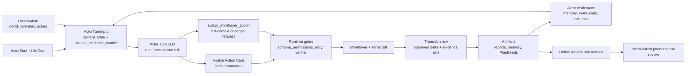

# minecraft-llm-agent-community

Headless Minecraft research on what happens when individually capable,
persistent LLM actors pursue their own goals in a shared world where economic,
cooperative, and quest activity makes their roles materially interdependent.

This repository is not a Voyager clone, a race-to-diamond benchmark, or a
house-building planner. Minecraft task completion and long-horizon goal
continuity are competence gates, not the final research target. The active plan
is `project-docs/research/current-spine/central-plan-capability-gated-social-sandbox.md`;
the V3 lived-vs-told plan, V2 co-actor legibility plan, and former "advisory
social-material WAM" framing are historical.

Runtime verification, evidence artifacts, seed/reset records, screenshots, and
scoring scripts are mandatory experiment hygiene. They are not the research
claim by themselves. Acting outcome, physical competence, goal continuity,
social consequence, efficiency, and any later prediction quality are reported
separately.

[Documentation & Web Portal](https://gigio1023.github.io/minecraft-llm-agent-community/)

## Current Direction

Goal — a staged path from capable individuals to observable social phenomena:

1. **Individual capability:** dataset-free scenario benchmarks verify item
   acquisition, crafting, navigation, multi-hop goals, efficiency, truthful
   failure, and blocker recovery.
2. **Goal continuity:** long-horizon cases test whether actors create, retain,
   revise, resume, and close intermediate work using memory and PlanBeads
   without claiming unsupported progress.
3. **Interdependent sandbox:** economic, cooperative, and quest scenarios give
   actors repeated material reasons to affect one another without scripting the
   social response.
4. **Phenomenon discovery:** long-run structured evidence, metrics, and video
   are reviewed for recurring behavior.
5. **Controlled follow-up:** baselines, falsifiers, and preregistration are
   introduced after a phenomenon is worth explaining.

Start with a small session that is easy to debug and attribute. Actor count,
role strength, model mix, and scenario pressure may expand later as explicit
experimental axes; scale never substitutes for missing individual competence or
unobservable interaction.

Near-term proof:

- a 2-3 actor shared session: one focal actor plus 1-2 responders on
  per-actor provider routing;
- ActorSoul and LifeGoal shape intent, but do not replace runtime observation;
- Actor Turn is the ordinary decision hot path;
- Action Cards expose what the actor can try now;
- generated Mineflayer action authoring starts only from Actor Turn
  `author_mineflayer_action`;
- PlanBeads preserve passive open work, blockers, obligations, and followups;
- Minecraft progress requires runtime execution and ordinary runtime checks;
- response windows close only after every other active actor completed a
  subsequent Actor Turn slot or a declared timeout;
- deterministic calibration and provider quota preflight gate relevant live
  provider runs.

Long-term north star:

- actors with strong Minecraft competence, persistent goals, role context,
  memory, relationships, action skill ownership, obligations, material claims,
  public affordances, weak commons, and visible consequences that persist after
  one immediate task is completed;
- long-running social behavior that is inspectable in both metrics and video;
- recurring phenomena that generate research questions instead of being forced
  into a preselected narrow headline;
- controlled follow-up studies that separate social behavior from competence,
  scenario scripting, prompt effects, and evaluator imagination.

Research framing:

- existing Minecraft LLM-agent benchmarks mostly evaluate bounded task
  completion or task-oriented collaboration;
- existing Minecraft world models and visual-policy systems mostly model pixels
  or task competence, not material claims, obligations, or social consequences;
- existing LLM social simulations provide useful social vocabulary but often
  resolve outcomes in text rather than through embodied material change;
- this project first separates individual competence and goal continuity from
  social interpretation, then studies recurring social-material behavior in
  natural and explicitly fixture-labeled Minecraft scenarios.

## Runtime Shape


```mermaid
flowchart LR
  Soul["ActorSoul + LifeGoal"]
  Observe["Observation<br/>world, inventory, actors"]
  Workspace["Actor workspace<br/>memory, PlanBeads, evidence"]
  Input["ActorTurnInput<br/>current_state + source_evidence_bundle"]
  Analysis["Offline reports and metrics"]
  Review["Video-linked phenomenon review"]
  LLM["Actor Turn LLM<br/>one function tool call"]
  Card["Visible Action Card<br/>strict parameters"]
  Author["author_mineflayer_action<br/>full-context codegen request"]
  Runtime["Runtime gates<br/>schema, permissions, retry, verifier"]
  MC["Mineflayer + Minecraft"]
  Row["Transition row<br/>observed delta + evidence refs"]
  Evidence["Artifacts<br/>reports, memory, PlanBeads"]

  Soul --> Input
  Observe --> Input
  Workspace --> Input
  Input --> LLM
  LLM --> Card --> Runtime
  LLM --> Author --> Runtime
  Runtime --> MC --> Row --> Evidence --> Workspace
  Evidence --> Analysis --> Review
```

The LLM chooses directly, but it does not own Minecraft truth. Structured tool
parameters, generated-source guards, retry constraints, timeouts, Mineflayer
execution, runtime checks, and actor-workspace artifacts decide what happened.
Offline reports, metrics, video review, and optional predictors analyze recorded
artifacts after runtime execution. They never become action or success authority.

## Context Philosophy

The runtime should help the LLM think, not quietly think for it.

Compression is acceptable for bounded facts such as inventory counts, hunger,
health, food candidates, retry constraints, and provider budget status.

Compression is not enough for observation geometry, action/failure history,
social pressure, PlanBead work state, or generated action trials. Those surfaces
must move as compact summaries plus source evidence refs/cards. Summary-only
context is treated as information loss.

Do not add hidden domain planners such as `deposit_candidates`,
`open_social_requests`, generated chat text, shelter-first phases, or hardcoded
recipe/placement strategy filters. If a runtime decision matters, express it as
a typed contract, strict schema, permission gate, retry constraint, or verifier.

## Active Boundaries

- `current_state` is bounded typed context, not proof of success.
- `source_evidence_bundle` preserves bounded raw evidence cards and refs beside
  summaries.
- Action Card `parameters` are executable contracts.
- Natural-language rationale explains intent but never supplies missing args.
- PlanBeads are passive issue-like actor state, not executable authority.
- Actor Turn actions are direct tool selections with schema-bound parameters.
- External Minecraft-agent papers are references to adapt, not product specs.
- Offline analysis is advisory; it never selects the executed action, fills
  missing parameters, closes obligations, or overrides runtime checks.
- Verification is audit hygiene, not a headline contribution.

## Key Documents

Read in this order:

1. `SPEC.md`
2. `AGENTS.md`
3. `CURRENT_IMPLEMENTATION_ARCHITECTURE_REVIEW.md`
4. `project-docs/research/current-spine/central-plan-capability-gated-social-sandbox.md`
5. `project-docs/research/benchmarks/project-level-benchmark-plan.md`
6. `project-docs/orientation/documentation-map.md`
7. `project-docs/orientation/agent-search-index.md`
8. `project-docs/runtime/actor-turn/actor-episode-and-actor-turn-architecture.md`
9. `project-docs/runtime/actor-turn/actor-turn-tool-calling-and-full-context-codegen.md`
10. `project-docs/runtime/actor-turn/context-projection-and-source-evidence.md`
11. `project-docs/runtime/planbeads/actor-persistent-state-and-planbeads.md`
12. `project-docs/research/benchmarks/grounded-social-trajectory-benchmark-spec.md`
13. `project-docs/research/benchmarks/material-claims-and-social-economy-benchmark-plan.md`
14. `project-docs/runtime/overview/minecraft-basic-guide.md`
15. `project-docs/operations/setup/headless-server.md`
16. `project-docs/operations/setup/provider-setup.md`

## Running Checks

Useful focused checks:

```bash
cd probe && bun run typecheck
cd probe && bun test test/actorTurnProviderInput.test.ts
cd docs && npm run build
git diff --check
```

For live Minecraft experiments, use `project-docs/operations/setup/headless-server.md` and
`project-docs/operations/setup/provider-setup.md`. Treat provider quota, Docker platform,
and server lifecycle as experiment hygiene, not as actor behavior.
