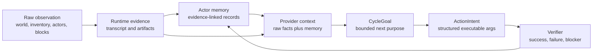
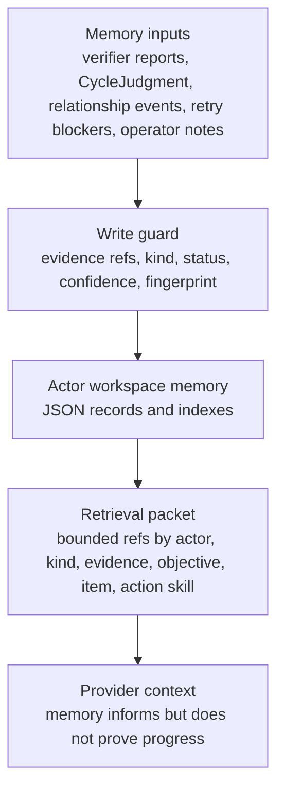
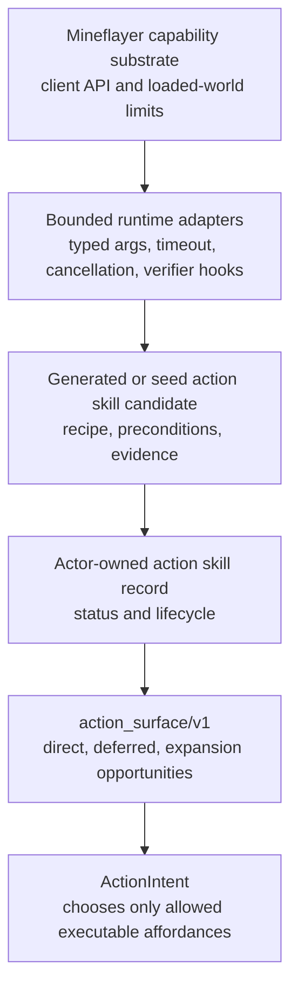

# Actor Memory, Observation, And Mineflayer Action Space Plan

Search token: `ACTOR_MEMORY_OBSERVATION_ACTION_SPACE`.

Status: active implementation plan for the next memory and action-surface
refactor.

This plan responds to two implementation review notes:

1. raw observation must stay raw and rich instead of being pre-classified by the
   runtime;
2. Mineflayer should be treated as the actor's broad capability substrate, not
   as a small hand-authored action menu.

It also folds in the Hermes memory-system research archived under
`docs/research-archive/hermes-memory-system/`.

## Plain Model

The runtime should not decide that a world fact is urgent, dangerous, desirable,
or socially important before the model sees it. The runtime should observe,
record evidence, preserve raw Minecraft names and limits, and expose broad
Mineflayer affordances. The model decides what matters for the actor in the
current turn.

A dark area, a missing crafting table, a nearby actor, or a failed dig attempt
should reach the model as evidence and context. If the model decides "eat now",
"avoid that entity", "craft a table", "ask for help", or "try a different block",
that decision should come from the model's interpretation, not from a runtime
taxonomy.

## Memory IO Contract

Current implementation already has `ActorMemoryRecord` and
`actor-memory-retrieval/v1`. The missing piece is a clearer IO boundary:

Memory inputs should be explicit:

| Input | Owner | Becomes memory when |
|-------|-------|---------------------|
| runtime observation | runtime | evidence ref exists and the record says what was observed |
| verifier result | runtime/verifier | current-run evidence proves success, failure, or blocker |
| `CycleJudgment.memory_writes` | provider proposal | runtime attaches evidence refs and downgrades weak confidence |
| relationship event proposal | reviewer/runtime guard | event has actor direction, kind, and evidence refs |
| retry constraint | runtime gate | exact structured target/args repeat with blocker evidence |
| action skill candidate | runtime/reviewer | primitive contract, verifier, evidence, and status are present |
| operator note | human/operator | marked as operator assertion, not physical proof |

Memory outputs should also be explicit:

| Output | Used by | Rule |
|--------|---------|------|
| `memory_packet` | CycleGoal and ActionIntent providers | context only, never proof of current physical success |
| relationship context | goal provider | social context only, never tool authority |
| blocker refs | action surface and planner | suppress exact bad retries, avoid broad superstition |
| action-skill notes | action-skill review/promotion | candidate evidence, not active behavior by itself |
| compaction summary | later cycles | retain evidence refs, drop unverified chatter |

## Hermes Lessons Adapted

Hermes memory is useful because of its contracts, not because its personal
assistant semantics map directly to NPCs.

Keep these ideas:

- bounded writes;
- prompt-injection and unsafe-text screening for free-text summaries;
- frozen per-turn or per-cycle context snapshots;
- provider lifecycle hooks such as prefetch, sync, pre-compress, and shutdown;
- failure isolation for optional external memory;
- tests that prevent memory from becoming a diary.

Reject or reframe these ideas:

- global `USER.md` as the core memory model;
- user/assistant peer relationships as the NPC relationship model;
- cloud recall as source of truth;
- generic trust scores as success evidence;
- completed-task diary entries without verifier-backed artifacts.

## Action Space Model

The actor's broad body is Mineflayer. Seed action skills are examples,
best-practice recipes, and validated bundles. They are not the whole body.

The runtime should expose three different things without confusing them:

| Surface part | Meaning |
|--------------|---------|
| direct primitive/action skill | executable now under role and active actor-owned state |
| deferred primitive/action skill | known runtime affordance, but not executable now |
| Mineflayer expansion opportunity | plausible capability to open through a bounded adapter or action-skill candidate |

Expansion opportunities are not raw API permission. They are a way to tell the
provider and reviewer that the actor body is bigger than the currently active
seed recipes.

## First Implementation Slice

This branch starts with low-risk substrate changes:

1. add `ActorMemoryKind` to actor memory records and retrieval refs;
2. classify social-cycle writes, direct-generated objective memories, and
   long-objective phase memories by kind;
3. keep retrieval deterministic and evidence-linked;
4. add Mineflayer expansion opportunities to `action_surface/v1`;
5. update provider prompts so observation remains raw evidence and runtime
   context does not pre-classify what the model should care about;
6. add tests for the new memory kind and action-space expansion signals.

This does not yet open raw Mineflayer execution. The next step after this slice
is a bounded adapter/codegen pipeline that can turn selected expansion
opportunities into candidate action skills with verifiers.

## Later Slices

1. Add a memory write guard that rejects unsafe provider-proposed summaries,
   missing evidence refs for physical claims, and duplicate blocker
   fingerprints.
2. Add actor-memory lifecycle hooks: `prefetchActorMemory`, `recordCycleMemory`,
   `syncRunMemory`, and `compactActorMemory`.
3. Integrate relationship ledger events and retry constraints as first-class
   memory inputs without duplicating their source-of-truth stores.
4. Add dry-run migration tooling for legacy generated-skill output.
5. Add read-only artifact migration checks for old context field names once
   schema compatibility requirements are explicit.
6. Add SQLite/FTS indexes only after JSON record semantics and evidence refs are
   stable.
