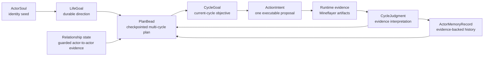
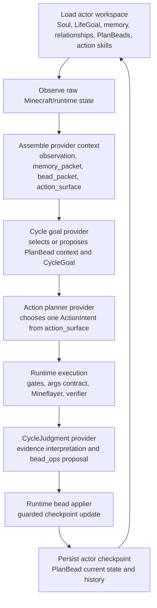

# Actor Persistent State And PlanBeads

Search token: `ACTOR_PERSISTENT_STATE_PLAN_BEADS`.

Status: active architecture plan for durable actor state, checkpointed
multi-cycle plans, and restart-safe social-cycle continuity.

This document records the design direction from the 2026-05-29 review: actor
state must survive process restarts, not only provider context windows. The
runtime should preserve the actor's durable identity, living plans, memory,
relationships, action skill ownership, evidence, and current blockers as
checkpoint-ready actor workspace state.

## Background

The current runtime already has important pieces:

- `ActorSoul` and `ActorLifeGoal` preserve durable identity and direction;
- `StrategicGoal`, `ActorCycleGoal`, `ActionIntent`, and `CycleJudgment` shape
  the social-cycle loop;
- `ActorMemoryRecord` stores evidence-linked memories by layer and kind;
- actor workspace records action skill state, evidence, provider snapshots,
  relationship artifacts, goals, and reviews;
- context compaction preserves evidence-linked state without treating summaries
  as physical progress.

The missing piece is a durable middle layer between LifeGoal and CycleGoal.
`LifeGoal` is too broad to hold a concrete project such as "secure food" or
"build a shared shelter." `CycleGoal` is too short-lived; it should describe
the current cycle, not carry a multi-cycle plan. `StrategicGoal` is the closest
existing concept, but it is thin: it records a summary, rationale, success
direction, and blockers without enough checkpointed state to survive long runs
or restarts as a living plan.

PlanBeads fill that gap.

## Design Intent

The goal is not to add a hidden domain planner. The goal is to let the actor
carry forward large, revisable, evidence-linked planning context while keeping
action selection open.

Examples of the right grain:

- "Find or secure food before taking on more settlement work."
- "Prepare materials for a simple shared shelter."
- "Repair the repeated blocker around unreachable logs."
- "Fulfill a teammate obligation without draining private survival resources."

Examples that are too small for a PlanBead:

- "Move to x=12 y=64 z=-3."
- "Mine this single oak log."
- "Craft four planks now."

Those smaller executable choices belong in `CycleGoal`, `ActionIntent`, runtime
primitive args, action skills, or verifier contracts.

## State Model



The separation is:

| Record | Owns | Must not own |
|--------|------|--------------|
| `ActorSoul` | identity seed and durable values | satisfiable task progress |
| `ActorLifeGoal` | long-running social-life direction | current Minecraft action |
| `PlanBead` | living multi-cycle plan state | executable authority or physical proof |
| `ActorCycleGoal` | bounded current-cycle objective | whole long-running project |
| `ActionIntent` | one structured executable proposal | missing args hidden in prose |
| `CycleJudgment` | evidence-backed interpretation | unverified success |
| `ActorMemoryRecord` | historical evidence-linked recall | active plan source of truth |
| runtime evidence | observed game/runtime facts | provider intention |

## PlanBead Definition

A **PlanBead** is actor-owned checkpoint state for a large, living plan. It is
planning memory, not a separate planner. It preserves what the actor is trying
to keep alive across cycles, why it matters under LifeGoal, what is understood,
what remains open, and which evidence or judgments changed the plan.

PlanBeads should be first-class records, but they can reuse the actor memory
envelope for compatibility:

```ts
type ActorPlanBeadRecord = ActorMemoryRecord & {
  kind: "plan_bead";
  layer: "working" | "semantic" | "social";
  content: ActorPlanBead;
};

type ActorPlanBead = {
  schema: "actor-plan-bead/v1";
  bead_id: string;
  actor_id: string;
  life_goal_id: string;
  run_id?: string;
  status: "candidate" | "active" | "blocked" | "paused" | "satisfied" | "abandoned";
  horizon: "few_cycles" | "long_running";
  title: string;
  intention: string;
  why_for_life_goal: string;
  current_understanding: string;
  subtasks: Array<{
    id: string;
    summary: string;
    status: "open" | "active" | "blocked" | "satisfied" | "abandoned";
    evidence_required: string[];
    evidence_refs: string[];
  }>;
  blockers: Array<{
    summary: string;
    evidence_refs: string[];
    repair_hint?: string;
  }>;
  open_questions: string[];
  supporting_refs: {
    memory_refs: string[];
    evidence_refs: string[];
    judgment_refs: string[];
    cycle_goal_refs: string[];
    action_intent_refs: string[];
    relationship_refs: string[];
    world_event_refs: string[];
    action_skill_refs: string[];
    plan_bead_refs: string[];
  };
  checkpoint: {
    version: number;
    updated_at: string;
    last_touched_cycle_id?: string;
    reason: string;
    evidence_refs: string[];
  };
  assertion_policy: {
    plan_is_context_not_success: true;
    physical_success_requires_current_evidence: true;
  };
};
```

The top-level `ActorMemoryRecord.summary`, `evidence_refs`, `tags`, and `index`
should mirror the high-signal fields for existing memory retrieval. The full
living plan structure belongs in `content`.

## Checkpoint Requirement

PlanBeads must behave like checkpointed actor state. A process restart must not
erase them, and context compaction must not reduce them to vague prose.

The target actor workspace layout is:

```text
data/actors/
  <actor_id>/
    plan-beads/
      active/
        <bead_id>.json
      resolved/
        <bead_id>.json
      abandoned/
        <bead_id>.json
      history/
        <bead_id>/
          0001-created.json
          0002-updated.json
          0003-blocked.json
    memory/
      working/
      episodic/
      semantic/
      procedural/
      social/
      beliefs/
      guardrails/
```

The current checkpoint lives under `active/`, `resolved/`, or `abandoned/`.
Every accepted mutation also writes an append-only transition under
`history/<bead_id>/`.

If the implementation initially stores PlanBeads through `ActorMemoryRecord`,
it must still provide equivalent checkpoint behavior:

- a current-state lookup for active PlanBeads;
- an append-only transition history;
- evidence refs for every state change that claims progress, blockage, or
  satisfaction;
- restart-safe reconstruction from actor workspace files;
- compaction support that carries active bead summaries and refs forward.

## Runtime Loop



Provider-facing context should include a compact `bead_packet`:

```ts
type PlanBeadPacket = {
  schema: "plan-bead-packet/v1";
  active_beads: ActorPlanBead[];
  recent_inactive_beads: Array<{
    bead_id: string;
    status: string;
    title: string;
    summary: string;
    evidence_refs: string[];
  }>;
  rules: {
    beads_are_context_not_authority: true;
    action_surface_controls_execution: true;
    runtime_verifies_bead_progress: true;
  };
};
```

Only a small number of active PlanBeads should be injected, usually one to
three. The provider should not receive unbounded bead history.

## Provider Proposal Boundary

Providers may propose `bead_ops`. They do not directly mutate PlanBeads.

Allowed operations:

- `create`;
- `activate`;
- `update_understanding`;
- `add_subtask`;
- `update_subtask`;
- `add_blocker`;
- `clear_blocker`;
- `pause`;
- `satisfy`;
- `abandon`;
- `link_memory`;
- `link_relationship`;

Every operation must include:

```ts
type PlanBeadOperation = {
  schema: "plan-bead-operation/v1";
  op: string;
  bead_id?: string;
  rationale: string;
  evidence_refs: string[];
  confidence: "observed" | "reviewed" | "inferred" | "uncertain";
  patch: Record<string, unknown>;
};
```

Runtime application rules:

- `create` may use inferred provider rationale, but it must cite current
  LifeGoal context or a relevant evidence/judgment/memory ref.
- `satisfy`, `clear_blocker`, and subtask satisfaction require verifier-backed
  evidence or guarded relationship evidence.
- `blocked` requires concrete blocker evidence, not only a provider guess.
- `abandon` requires a reason and should preserve the bead history.
- provider prose cannot supply missing `ActionIntent` args.
- `wait`, `remember`, or a memory note cannot satisfy a PlanBead.

## Relationship To Memory

PlanBeads are not outside memory. They are large-grain planning memory with
checkpoint behavior. Ordinary memory records remain the evidence-linked past.
PlanBeads are the actor's living plan state.

The runtime should allow these links:

- PlanBead cites memory records as supporting history;
- memory records cite PlanBeads when a cycle changes a living plan;
- CycleGoal records cite selected PlanBeads in `derived_from.plan_bead_refs`;
- CycleJudgment records cite or update PlanBeads after evidence is interpreted;
- context compaction preserves active PlanBead refs and summaries.

Do not duplicate physical truth. Inventory, block, position, container, chat,
and transcript facts remain evidence/runtime artifacts. A PlanBead can point to
those facts, but it is not the fact itself.

## Restart-Safe Actor State

The broader requirement is that all actor-owned state needed for continuity
survives process restart:

| State | Restart-safe source |
|-------|---------------------|
| identity | `soul.md`, `soul.json`, actor profile bootstrap |
| LifeGoal | `goals/life/active.json` |
| living plans | `plan-beads/active/*.json` or equivalent `plan_bead` memory records |
| cycle history | `goals/cycle/*.json`, `judgments/*.json` |
| memory | `memory/*/*.json` and memory indexes |
| relationships | `relationships/*.json` and guarded relationship events |
| action skill ownership | `action-skills/active/*.json` and lifecycle records |
| candidate action work | `action-skills/candidates/`, `action-skills/direct-trials/` |
| evidence | `evidence/*.json` and transcript artifacts |
| provider audit | `provider-inputs/*.json`, `provider-outputs/*.json` |
| retry gates | runtime retry constraints written into artifacts and later checkpoint state |
| compaction | social-cycle context checkpoints with evidence refs |

Startup should load the actor workspace and reconstruct the actor's durable
state. Initialization should restore missing directories and baseline indexes;
it must not delete existing actor state unless an explicit cleanup operation
requests it.

## Compaction And Reports

Context compaction must add a PlanBead scope:

- include active PlanBead ids, titles, statuses, open subtasks, blockers, and
  evidence refs;
- state `physical_progress_claim: false` for PlanBead summary facts;
- preserve refs to the current PlanBead checkpoint files;
- never mark a PlanBead as satisfied from compaction itself.

Run reports should expose:

- active PlanBeads at run start and end;
- PlanBead refs cited by each CycleGoal and ActionIntent;
- accepted and rejected bead operations;
- bead transitions by status;
- cycles that made verified or partial verified progress on a bead;
- cycles that repeated a blocker without bead-aware pivot.

Review summaries should use these metrics to judge closed-loop behavior:

- did the actor continue or revise a living plan after evidence changed?
- did the actor avoid exact repeated blockers?
- did the actor choose actions from the broad action surface rather than a
  deterministic plan script?
- did PlanBeads improve continuity without laundering provider prose into
  progress?

## First Implementation Slice

1. Add `PlanBead` terminology and `plan_bead` memory kind.
2. Add `ActorPlanBead` and `PlanBeadOperation` types.
3. Add a PlanBead store with current checkpoint files and append-only history.
4. Add actor workspace directories for `plan-beads/active`, `resolved`,
   `abandoned`, and `history`.
5. Add `bead_packet` to `SocialCycleContextPacket`.
6. Add optional `plan_bead_refs` to `ActorCycleGoal.derived_from` and
   `CycleJudgment`.
7. Add provider schema support for `bead_ops`, initially accepted only from
   CycleJudgment.
8. Add a guarded runtime bead applier.
9. Add compaction, report, audit, and review-summary coverage.
10. Run a baseline and PlanBead-enabled 100-cycle comparison with the same
    actor, provider, seed, and action limits.

## Non-Goals

- Do not make PlanBeads a hard-coded house, shelter, farming, mining, or storage
  planner.
- Do not force every cycle to serve the highest-priority PlanBead.
- Do not put executable primitive args in PlanBeads.
- Do not allow PlanBeads to grant action permissions.
- Do not treat PlanBeads, memory notes, provider text, or compaction summaries
  as physical progress.
- Do not replace raw observation or broad Mineflayer action-space exposure with
  a deterministic plan checklist.

## Success Criteria

The design is successful when a long social-cycle run can be stopped and
restarted while preserving:

- active actor identity and LifeGoal;
- one to three active PlanBeads with status, subtasks, blockers, and evidence
  refs;
- prior judgments and memories that explain why those PlanBeads exist;
- action skill ownership and action surface continuity;
- enough evidence refs to audit every claimed PlanBead transition.

The behavioral proof is not that the actor always completes the plan. The proof
is that the actor carries large intentions forward, revises them from evidence,
pivots after blockers, and keeps choosing actions from the current Mineflayer
action surface without losing truth across restarts.
