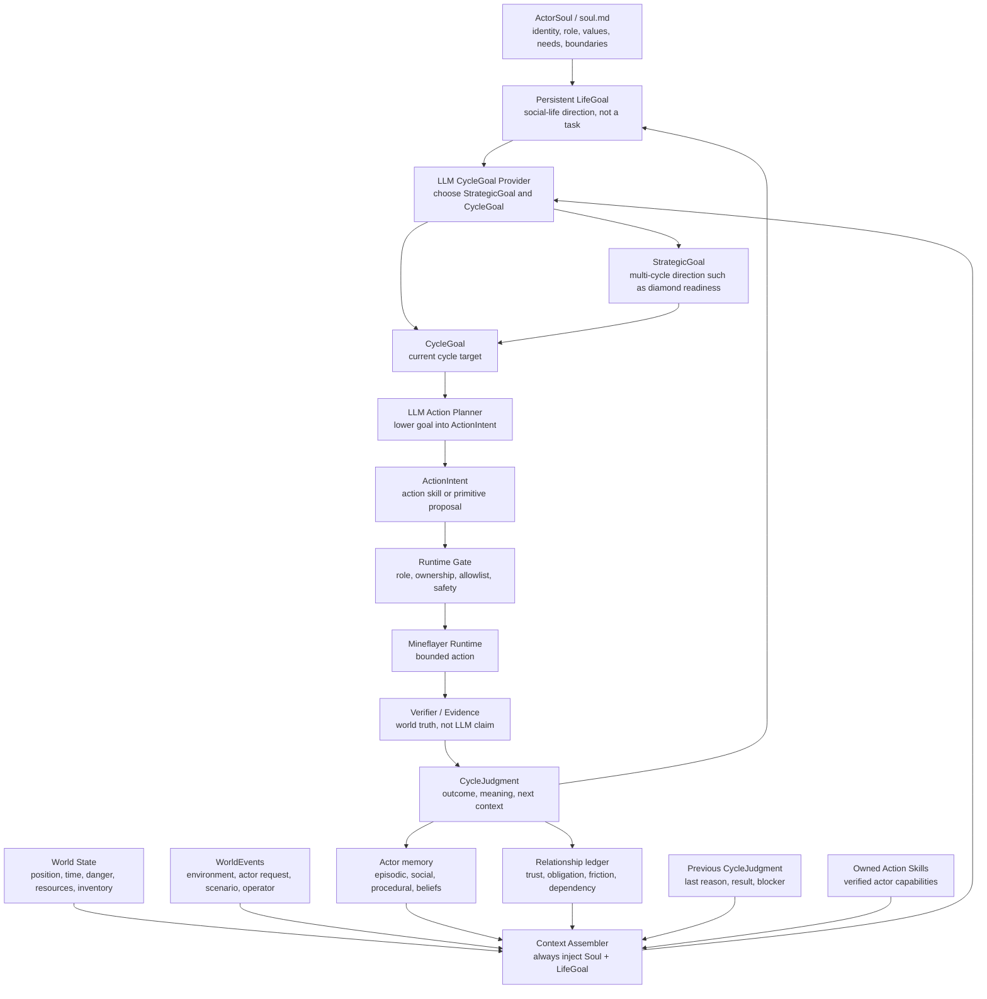
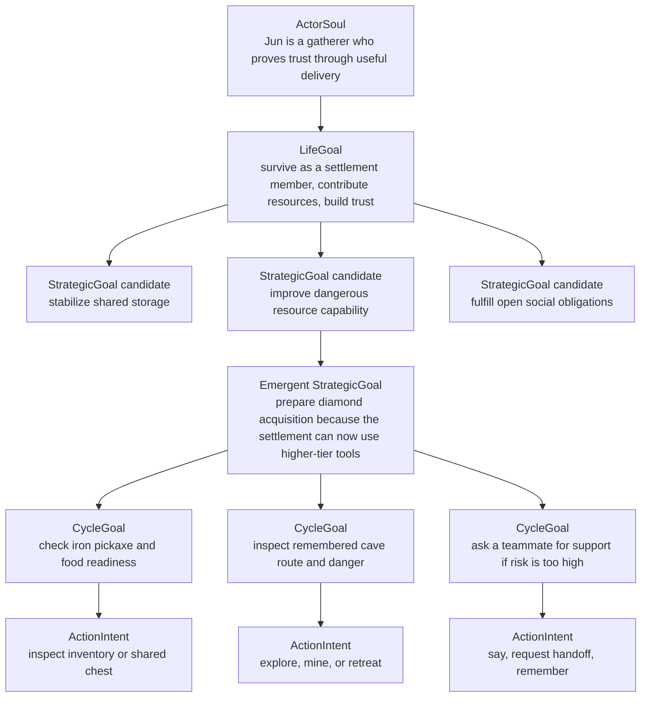

# Soul Life Goal Runtime Architecture

Search tokens:

- `SOUL_LIFE_GOAL_RUNTIME`
- `ACTOR_SOUL_GOAL_LEDGER`
- `SOCIAL_LIFE_CYCLE_GOAL`
- `NO_USER_TASK_AS_TOP_LEVEL_GOAL`
- `CODEX_GOAL_REFERENCE`
- `NO_PROBE_PASSED_AUTONOMY_METRIC`

Status: proposal, 2026-05-23.

## One Sentence

오너가 원하는 구조는 “외부 사람이 입력한 작업을 수행하는 bot”이 아니다.

```text
actor는 soul.md 같은 지속 정체성과 LifeGoal을 가진 사회 구성원으로 계속
살아가며, 매 cycle마다 world state + memory + relationships + previous
judgment + owned action skills를 보고 현재 CycleGoal을 정하고, runtime은 그
목표 안에서 bounded action을 실행하고 evidence로 검증한다.
```

따라서 `돌을 캔다` 같은 operator/scenario input이 있더라도 그것은 top-level
goal이 아니라 외부 압력, 요청, 실험 제약, 또는 scenario event다. 아무 입력이
없어도 actor는 “사회 시뮬레이션을 위해 사회 구성원으로 살아간다”는 최상위
목표 아래에서 soul, 사회적 역할, 기억, 관계, 생존 상태, 이전 cycle 판단을
근거로 하위 목표를 계속 만들어야 한다.

## Near-Term Proof

The near-term proof is a bounded social-life simulation seed for one actor.

That actor must:

- act in Minecraft through the runtime gate;
- reason from `ActorSoul`, `LifeGoal`, observation, and `WorldEvent` context;
- store or refine memory from verifier-backed evidence;
- use prior CycleJudgment or memory in a later cycle;
- leave artifacts that explain success, failure, stall, and no progress.

This proof is not full human-like personhood, long-run autonomy, or a Voyager
clone. It is also not optimistic LLM narration. The runtime may prove concepts
with primitive implementations, but reports must say exactly what was primitive,
builtin, helper-expanded, blocked, or unimplemented.

## Correction

이전 `SessionPlan` 중심 표현은 너무 “외부 task를 per-run catalog로 컴파일”
하는 쪽으로 읽힌다. 이 repo에 필요한 missing layer는 단발 SessionPlan보다
더 위에 있는 actor-owned goal continuity다.

새 기준:

- `ActorSoul`: actor가 어떤 존재로 살 것인지 정의하는 durable identity contract.
- `LifeGoal`: 완료를 쉽게 선언하지 않는 장기 목표. 예: “settlement의 gatherer로
  살아남고, 공동체에 기여하며, 신뢰를 쌓는다.”
- `CycleGoal`: 현재 cycle에서 무엇을 할지에 대한 작은 목표. LLM 또는
  LLM-authored policy가 memory/context를 보고 정한다.
- `ActionIntent`: CycleGoal을 실행 가능한 primitive/action skill 후보로 낮춘
  intent.
- runtime verifier: 성공 주장은 LLM이 아니라 current-run evidence가 판단한다.

## Approved Revision

2026-05-23 review에서 승인된 추가 기준:

- LifeGoal은 매우 크고 추상적인 삶의 방향이다.
- `다이아몬드를 캔다` 같은 구체 목표는 LifeGoal 자체가 아니라, LifeGoal대로
  살아가다가 상황과 기억과 관계 압력에서 생기는 `StrategicGoal`이어야 한다.
- `ActorSoul`과 `LifeGoal`은 매 cycle LLM context에 항상 주입되어야 한다.
- 외부 개입은 prompt가 아니라 `WorldEvent`로 모델링한다. `WorldEvent`는
  환경 변화, 다른 actor 요청, scenario 사건, operator 개입을 모두 포함한다.
- 구현은 반쪽짜리 P0가 아니라 최종 형태를 상상한 vertical slice로 계획한다.

## Codex Goal Reference

2026-05-23에 `codex` clone을 `origin/main`으로 fast-forward해 goal 구현을
확인했다. 참고한 주요 파일:

- `codex-rs/ext/goal/src/spec.rs`
- `codex-rs/ext/goal/src/tool.rs`
- `codex-rs/ext/goal/src/extension.rs`
- `codex-rs/ext/goal/src/steering.rs`
- `codex-rs/core/src/goals.rs`
- `codex-rs/core/templates/goals/continuation.md`
- `codex-rs/state/src/runtime/goals.rs`
- `codex-rs/protocol/src/protocol.rs`
- `codex-rs/app-server-protocol/src/protocol/v2/thread.rs`

Codex goal의 핵심은 goal 문자열이 아니라 lifecycle이다.

| Codex feature | Minecraft adaptation |
|---|---|
| `thread_goals` persisted row | actor workspace의 `life-goal` / `cycle-goal` ledger |
| `objective`, `status`, `token_budget`, usage counters | `life_goal.objective`, `status`, cycle/action/world budgets, evidence counters |
| `active`, `paused`, `blocked`, `usage_limited`, `budget_limited`, `complete` | `active`, `paused`, `blocked`, `stalled`, `satisfied`, `abandoned`, `superseded` |
| `goal_id` compare-and-set | stale cycle judgment이 새 goal을 덮어쓰지 못하게 `expected_goal_id` 사용 |
| turn/tool lifecycle accounting | cycle/action execution accounting: action attempts, verifier status, world time |
| continuation prompt | active LifeGoal이 있으면 idle cycle에서 다음 CycleGoal을 생성 |
| budget-limit steering | danger, starvation, tool loss, action budget limit steering |
| completion audit | LifeGoal completion은 거의 금지; CycleGoal만 evidence로 satisfied 가능 |
| blocked audit | 같은 blocker가 반복될 때만 blocked/stalled 기록 |

Codex의 continuation prompt에서 특히 중요한 원칙:

- 목표는 turn을 넘어 지속된다.
- 임시로 작은 일을 해도 전체 objective를 축소하지 않는다.
- 완료는 현재 evidence로 요구사항별 audit을 통과해야 한다.
- blocked는 첫 실패가 아니라 반복된 impasse에서만 선언한다.

Minecraft actor에도 같은 철학이 필요하다. 단, Codex의 goal은 대화 thread의
명시 objective이고, 이 repo의 top-level goal은 actor-owned social life다.

## Goal Hierarchy

| Layer | Owner | Purpose | Example | Must not do |
|---|---|---|---|---|
| Project North Star | owner + architecture docs | 왜 Minecraft agent를 만드는지 | social simulation seed | 단일 probe pass로 축소 |
| Society Scenario | owner / scenario config | 이 세계의 사회적 조건 | shared settlement, scarce resources | actor 개인 task로 대체 |
| ActorSoul | human+LLM, durable artifact | actor의 정체성, 역할, 욕구, 한계 | `Jun`, gatherer, wants trust through delivery | 행동 성공을 주장 |
| LifeGoal | ActorSoul에서 파생된 persistent goal | 살아가는 방향과 장기 압력 | survive, contribute, gain trust | 매 run마다 새 외부 task로 reset |
| CycleGoal | LLM or LLM-authored policy | 현재 cycle에서 실제로 할 일 | deposit logs because Iris is blocked | global deterministic ladder를 goal로 사용 |
| ActionIntent | runtime planner/selector | 허용 action skill/primitive 후보 | `fulfill_obligation -> depositSharedItems` | action skill gate 우회 |
| Execution | runtime | bounded Mineflayer action | `mine_block`, `deposit_shared` | success 판정 소유 |
| Verification | runtime evidence | current-run pass/fail | inventory delta, chest delta, chat event | LLM claim 신뢰 |

## Minimal Artifacts

### `soul.md` And Compiled Soul

`soul.md`는 사람이 읽고 고칠 수 있는 actor charter다. runtime은 같은 내용을
구조화한 `actor-soul/v1` packet을 provider context에 넣는다.

```ts
type ActorSoul = {
  schema: "actor-soul/v1";
  actor_id: string;
  display_name: string;
  society_id: string;
  role: "quartermaster" | "gatherer" | "crafter" | "scout" | string;
  life_goal: string;
  public_responsibilities: string[];
  private_drives: string[];
  values: string[];
  needs: {
    survival: string[];
    social: string[];
    learning: string[];
  };
  boundaries: {
    forbidden_actions: string[];
    requires_evidence_before_claiming: string[];
    shared_resource_rules: string[];
  };
  action_skill_policy: {
    prefer_owned_action_skills: boolean;
    allow_primitive_fallback: boolean;
    allow_generated_action_skill_trials: boolean;
  };
  memory_policy: {
    retrieve_layers: ("working" | "episodic" | "semantic" | "procedural" | "social" | "belief" | "guardrail")[];
    must_consider_recent_cycle_judgment: boolean;
  };
  speech_style: string;
};
```

저장 위치 가설:

```text
data/actors/<actor_id>/soul.md
data/actors/<actor_id>/soul.json
```

현재 repo에는 이와 동등한 durable soul 파일이 없다. `probe/src/npc/profiles.ts`
의 `ActorProfile`은 좋은 bootstrap seed지만, `private_goal` 문자열과
`public_responsibility`만으로 actor의 지속 삶을 대표하기에는 작다.

### Life Goal

LifeGoal은 Codex `ThreadGoal`과 가장 유사하지만, 외부 task가 아니라
actor-owned social life objective다.

```ts
type ActorLifeGoal = {
  schema: "actor-life-goal/v1";
  actor_id: string;
  goal_id: string;
  objective: string;
  status: "active" | "paused" | "blocked" | "stalled" | "retired";
  source: "actor_soul" | "scenario" | "operator_override";
  created_at: string;
  updated_at: string;
  cycle_count: number;
  action_count: number;
  evidence_refs: string[];
  memory_refs: string[];
  relationship_refs: string[];
};
```

LifeGoal은 보통 `complete`하지 않는다. “사회 구성원으로 살아간다”는 목표는
end state라기보다 runtime을 계속 steer하는 constitution이다.

### Strategic Goal

StrategicGoal은 LifeGoal을 따라 살다가 생기는 중장기 목표다. `다이아몬드를
캔다`는 여기에 속한다. 이 목표는 외부 task로 주입되는 것이 아니라, 공동체
상태, 도구 단계, 위험, 기억, 관계 의무, 이전 cycle 판단에서 정당화되어야 한다.

```ts
type StrategicGoal = {
  schema: "actor-strategic-goal/v1";
  actor_id: string;
  strategic_goal_id: string;
  life_goal_id: string;
  status: "active" | "paused" | "blocked" | "satisfied" | "retired";
  summary: string;
  rationale: string;
  derived_from: {
    soul_ref: string;
    world_event_refs: string[];
    memory_refs: string[];
    relationship_refs: string[];
    previous_cycle_judgment_refs: string[];
  };
  success_direction: string;
  current_blockers: string[];
  updated_at: string;
};
```

### Cycle Goal

CycleGoal은 매 cycle 또는 macro-step에서 갱신되는 현재 목표다.

```ts
type ActorCycleGoal = {
  schema: "actor-cycle-goal/v1";
  actor_id: string;
  goal_id: string;
  life_goal_id: string;
  cycle_id: string;
  status: "active" | "satisfied" | "blocked" | "stalled" | "abandoned" | "interrupted" | "superseded";
  source: "llm_planner" | "llm_authored_policy" | "runtime_rule" | "world_event_context";
  summary: string;
  rationale: string;
  derived_from: {
    soul_ref: string;
    observation_refs: string[];
    memory_refs: string[];
    relationship_refs: string[];
    previous_cycle_judgment_refs: string[];
    world_event_refs: string[];
  };
  success_condition: {
    verifier: string;
    evidence_required: string[];
  };
  allowed_action_skill_ids: string[];
  allowed_primitive_ids: string[];
  stop_conditions: string[];
};
```

`source: "runtime_rule"`는 허용된다. 다만 그 rule은 repo-global ladder가 아니라
ActorSoul/LifeGoal/사회 scenario가 승인한 policy여야 한다.

### World Event

이 runtime에는 일반적인 `user prompt`가 없다. 외부에서 들어오는 것은 모두
world 안에서 actor가 해석해야 하는 사건이다.

```ts
type WorldEvent = {
  schema: "world-event/v1";
  event_id: string;
  kind: "environment_event" | "actor_event" | "scenario_event" | "operator_event";
  authority: "context_only" | "scenario_rule" | "debug_override";
  summary: string;
  actor_refs: string[];
  evidence_refs: string[];
  created_at: string;
};
```

`operator_event`도 LifeGoal이 아니다. 예를 들어 사람이 `다이아몬드를 확보해 봐`
라고 넣으면, actor는 그것을 WorldEvent context로 받고 다음을 판단한다. 현재
schema의 `context_only` 값은 "context only, not command"라는 현재 canonical 의미다.

- 내 LifeGoal과 역할상 이 요청을 받아들이는가?
- 현재 능력과 owned action skill로 가능한가?
- 바로 들어가면 위험한가?
- 먼저 도구, 식량, 경로, 동료 도움을 준비해야 하는가?
- 이 요청이 공동체 신뢰나 의무와 어떻게 연결되는가?

### Cycle Judgment

Cycle이 끝나면 “무엇을 했는가”보다 “다음 cycle이 무엇을 배워야 하는가”를
남겨야 한다.

```ts
type CycleJudgment = {
  schema: "cycle-judgment/v1";
  actor_id: string;
  cycle_id: string;
  cycle_goal_id: string;
  outcome: "verified_progress" | "partial_verified_progress" | "no_progress" | "blocked" | "unsafe" | "socially_resolved";
  what_happened: string;
  why_it_mattered_for_life_goal: string;
  verifier_status: "passed" | "failed" | "not_applicable";
  evidence_refs: string[];
  memory_writes: string[];
  next_goal_context: string[];
};
```

## Target Runtime



Important boundary:

```text
LLM decides why and what goal to pursue.
Runtime decides what actually happened.
Actor workspace remembers both.
```

## Goal Emergence Example



`다이아몬드를 캔다`는 이 그림의 LifeGoal이 아니다. LifeGoal대로 살아가다가
공동체의 발전, 도구 단계, 관계 의무, 이전 실패 기억이 맞물릴 때 생기는
StrategicGoal이다.

## LLM Stage Inputs And Outputs

### Stage 1 - CycleGoal Provider

CycleGoal provider는 매 cycle ActorSoul과 LifeGoal을 항상 받는다. 이 stage의
output은 실행 명령이 아니라 목표 판단이다.

```ts
type CycleGoalProviderInput = {
  actor_soul: ActorSoul;
  life_goal: ActorLifeGoal;
  active_strategic_goals: StrategicGoal[];
  current_world_state: WorldStateSummary;
  world_events: WorldEvent[];
  relationship_context: RelationshipSummary[];
  retrieved_memory: ActorMemoryRef[];
  previous_cycle_judgments: CycleJudgmentRef[];
  owned_action_skills: OwnedActionSkillSummary[];
  current_limits: {
    max_actions_this_cycle: number;
    danger_tolerance: "low" | "medium" | "high";
    must_verify_success: true;
  };
};

type CycleGoalProviderOutput = {
  strategic_goal_updates: StrategicGoalUpdate[];
  selected_cycle_goal: {
    summary: string;
    rationale: string;
    derived_from_refs: string[];
    success_condition: string;
    evidence_required: string[];
    stop_conditions: string[];
    priority: "background" | "normal" | "urgent" | "blocking";
  };
  allowed_action_skill_ids: string[];
  allowed_primitive_ids: string[];
};
```

### Stage 2 - Action Planner

Action Planner는 이미 선택된 CycleGoal을 실행 가능한 의도로 낮춘다. 이 stage도
ActorSoul/LifeGoal을 받지만, goal을 새로 발명하지 않는다.

```ts
type ActionPlannerInput = {
  actor_soul: ActorSoul;
  life_goal: ActorLifeGoal;
  active_cycle_goal: ActorCycleGoal;
  current_observation: WorldStateSummary;
  owned_action_skills: OwnedActionSkillSummary[];
  allowed_primitives: PrimitiveContract[];
  recent_failures: CycleJudgmentRef[];
};

type ActionPlannerOutput = {
  action_intent: {
    kind: "use_action_skill" | "use_primitive" | "wait" | "remember";
    action_skill_id?: string;
    primitive_id?: string;
    args: Record<string, unknown>;
    why_this_action: string;
    expected_evidence: string[];
    fallback_if_blocked: string;
  };
};
```

### Stage 3 - Cycle Judgment

Cycle Judgment는 runtime result와 verifier evidence를 받아 다음 cycle의 판단
재료를 만든다. 관계 변화는 proposal로만 쓰고, 실제 적용은 evidence guard가
맡는다.

```ts
type CycleJudgmentOutput = {
  outcome: "verified_progress" | "partial_verified_progress" | "no_progress" | "blocked" | "unsafe" | "socially_resolved";
  what_happened: string;
  why_it_mattered_for_life_goal: string;
  evidence_refs: string[];
  memory_writes: {
    layer: "episodic" | "procedural" | "social" | "belief" | "guardrail";
    summary: string;
    confidence: "observed" | "inferred" | "uncertain";
  }[];
  relationship_event_proposals: {
    target_actor_id: string;
    kind: "request_made" | "request_accepted" | "fulfilled" | "blocked" | "helped" | "failed_obligation";
    evidence_refs: string[];
  }[];
  next_goal_context: string[];
};
```

## Mapping To Current Repo

| Existing surface | Current use | Needed change |
|---|---|---|
| `probe/src/npc/profiles.ts` | static profile seed | become bootstrap input to `ActorSoul`, not full soul |
| `probe/src/runtime/actorWorkspacePaths.ts` | memory/evidence/action skill dirs | add `soul`, `goals/life`, `goals/cycles`, `judgments` paths |
| `probe/src/runtime/actorWorkspace.ts` | rewrites `actor.json` per run, preserves memory/action skills | preserve/load soul and life goal across runs |
| `probe/src/npc/goals/goalStack.ts` | mirrors `DeterministicTask` into provider frames | build from `ActorCycleGoal` + relationship context |
| `probe/src/runtime/contextIntent.ts` | deterministic context-signal helper | accept CycleGoal-derived intent source; include needs, obligations, scarcity, social memory |
| `probe/src/runtime/intentToSkill.ts` | tested candidate compiler, not wired | compile candidates from CycleGoal intent and actor-owned action skills |
| `probe/src/gameplay/seedSkills/registry.ts` | seed capability catalog | remain capability inventory, never motive source |
| `probe/src/provider/actorProviderContext.ts` | exposes profile, relationships, active action skills, memory | include ActorSoul, LifeGoal, active CycleGoal, previous CycleJudgment |
| `probe/src/memory/actorMemory.ts` | objective-scoped typed retrieval | retrieve by life goal, cycle goal, relationship actor, prior blocker |
| `probe/src/gameplay/curriculum/deterministicCurriculum.ts` | repo-global early-game ladder | demote to optional baseline policy, not default goal authority |
| `probe/src/objectives/longObjective/*` | phase ladder/codegen harness | keep as evaluation/training track; do not treat as social runtime |

## Decision Authority By Path

| Path | Current authority | Why it misses the intent | Target authority |
|---|---|---|---|
| Live runtime loop | `selectDeterministicTask()` chooses task; provider chooses primitive | actor is following repo ladder, not living from soul/memory | CycleGoal provider chooses current goal from soul, life goal, state, memory, relationships |
| Short objective | CLI objective registry or generated runner | external objective behaves like top-level task | operator/scenario input becomes event/context; LifeGoal remains actor-owned |
| Long objective | fixed phase ladder plus generated/builtin `run(ctx)` | “passed” can mean builtin/helper chain worked | separate evaluation harness from social runtime; builtin opt-in only |

## Exploration And Propagation

Exploration tasks such as mining coal or building a simple wooden or stone
shelter are useful only when they stay behind runtime evidence gates.

Accepted paths:

- objective phase: a bounded objective asks for one current-run outcome and
  passes only from world, inventory, container, position, or transcript evidence;
- direct-generated trial: generated TypeScript attempts one objective, records
  source, helper calls, timeout/error, verifier output, and actor memory writes;
- social-cycle context: a `WorldEvent` may make coal or shelter relevant, but
  the actor still chooses a CycleGoal from soul, life goal, memory, relationship,
  and previous judgment context.

Rejected paths:

- LLM text saying the actor explored, mined coal, or built shelter without
  current-run evidence;
- helper chains that solve the dependency while the report credits actor
  judgment;
- builtin fallback counted as OpenAI-authored agency.

Primitive implementations are allowed. A report can say “the shelter concept was
proven by placing a minimal block outline” or “coal search stopped at a
truthful blocker.” It must not call that a complete social-life capability.

## Primitive-Only Vs Action Skill Execution

P0 should keep primitive execution available because it is observable and already
guarded. But the actor should be allowed to select action-skill-level intent once
CycleGoal exists.

| Option | Benefit | Risk | Recommendation |
|---|---|---|---|
| Primitive-only | easiest verifier path; less hidden behavior | LLM micromanages low-level actions; social intent is noisy | keep for P0 fallback |
| Action skill as execution unit | closer to actor intent; preserves atomic Minecraft actions like digging | action skill can hide too much planning | introduce for owned, implemented action skills with verifier contracts |
| Generated action skill trial | enables evolution | easy to recreate Voyager-style uncontrolled eval | only candidate/trial path, never silent active path |

Target:

```text
CycleGoal -> choose action skill when owned and applicable
CycleGoal -> primitive fallback when no owned action skill exists
CycleJudgment -> propose candidate action skill when primitive loop repeats
```

## Probe Metrics

`probe passed` must remain a runtime evidence metric, not an autonomy metric.

Use separate fields:

```ts
type RuntimeStatus = "passed" | "failed" | "blocked" | "timeout";
type AgencyStatus = {
  life_goal_source: "actor_soul" | "scenario" | "operator_override";
  cycle_goal_source: "llm_planner" | "llm_authored_policy" | "runtime_rule" | "world_event_context";
  used_previous_judgment: boolean;
  used_memory_refs: number;
  used_relationship_refs: number;
  builtin_goal_authority: boolean;
  builtin_execution_source: boolean;
  fixture_dependency: boolean;
  helper_expansion_count: number;
  non_builtin_action_ratio: number;
};
```

Good social runtime metrics:

- `life_goal_continuity`: same LifeGoal persists across cycles/runs.
- `cycle_goal_grounding`: CycleGoal cites observation, memory, relationship, or previous judgment refs.
- `memory_reuse_rate`: later CycleGoal uses prior CycleJudgment or typed memory.
- `relationship_obligation_resolution`: obligations move from requested/accepted to fulfilled/blocked with evidence.
- `goal_churn`: actor does not randomly abandon goals without evidence.
- `verified_social_value`: shared chest delta, chat request, handoff, or relationship event is backed by evidence.
- `non_builtin_source_ratio`: % CycleGoals and actions not sourced from builtin fallback.
- `action_attempt_coverage`: every action attempt has ActionIntent, runtime
  result, verifier status, and evidence or blocker refs.
- `no_progress_rejection`: synthetic no-progress, empty helper output, and
  terminal memory notes cannot produce a pass.
- `audit_ref_integrity`: report audit fails when required refs are missing.

## Minimum Experiments

These are in-game social-life slices, not arbitrary external task automation.

### Experiment 1 - Single Actor Survival Cycle

Purpose: prove actor can choose a first CycleGoal from soul and world state
without an external objective.

Setup:

- actor has `soul.md` / compiled `ActorSoul`;
- LifeGoal is active: “survive and contribute as settlement gatherer”;
- deterministic curriculum is disabled as goal authority;
- primitive/action skill execution remains runtime-gated.

Success:

- CycleGoal source is `llm_planner` or `llm_authored_policy`;
- CycleGoal cites soul + observation;
- actor makes verified progress or writes truthful blocked CycleJudgment;
- every action attempt is recorded, including wait or no-progress attempts;
- no `builtin` or fixed ladder is counted as goal authority.

### Experiment 2 - Social Obligation Handoff

Purpose: prove relationship context can generate a goal.

Setup:

- `npc_a` requests logs or shared storage support;
- `npc_b` has gatherer soul and prior memory;
- relationship ledger records `request_made` / `accepted`.

Success:

- `npc_b` CycleGoal cites relationship context and request evidence;
- action deposits or attempts shared value with current-run evidence;
- relationship event is updated only from verifier-backed evidence.

### Experiment 3 - Memory-Based Replanning

Purpose: prove previous cycle judgment affects next goal.

Setup:

- first cycle fails because tool/resource/precondition is missing;
- CycleJudgment records the blocker;
- next cycle planner receives previous judgment and memory.

Success:

- next CycleGoal directly references the previous blocker;
- actor either repairs prerequisite or marks repeated blocker as stalled;
- no helper chain silently solves the missing condition without attribution.

## Roadmap

### P0 - Define Soul And Goal Ledger

Files likely touched:

- `probe/src/npc/profiles.ts`
- `probe/src/runtime/actorWorkspacePaths.ts`
- `probe/src/runtime/actorWorkspace.ts`
- new `probe/src/npc/soul/*`
- new `probe/src/runtime/goals/*`
- `docs/blog-doc/Architecture/Social-Actor-Profiles-And-Relationships.md`

Deliverables:

- human-editable `soul.md` example for one actor;
- compiled `ActorSoul` packet;
- persisted active `ActorLifeGoal`;
- `ActorCycleGoal` and `CycleJudgment` JSON artifacts;
- no gameplay change required yet.

Success criteria:

- actor workspace initialization preserves soul/life goal across runs;
- provider context can include soul/life/cycle fields;
- tests prove stale cycle update cannot overwrite a newer cycle goal.

### P1 - Replace Deterministic Goal Authority In Live Loop

Files likely touched:

- `probe/src/runtime/agentLoop.ts`
- `probe/src/npc/goals/goalStack.ts`
- `probe/src/runtime/contextIntent.ts`
- `probe/src/runtime/intentToSkill.ts`
- `probe/src/provider/actorProviderContext.ts`

Deliverables:

- `--goal-authority soul-cycle` mode;
- CycleGoalPlanner provider adapter;
- goalStack derived from CycleGoal;
- primitive/action skill allowlist intersected with actor-owned active action skills.

Success criteria:

- live loop can run with deterministic curriculum off;
- current intent source is not `runtime_default` when CycleGoal is provider-authored;
- every action cites active CycleGoal id;
- verifier pass/fail is separate from agency score.

### P2 - Social Cycle Experiments

Files likely touched:

- relationship ledger/store;
- shared storage ledger;
- transcript projectors;
- objective/probe reports.

Deliverables:

- three experiments above;
- report fields for runtime status and agency status;
- relationship events only from evidence.

Success criteria:

- at least one run shows memory-based next CycleGoal;
- at least one run shows social obligation -> action -> evidence -> relationship update;
- `probe passed` is never the only success claim.

### P3 - Long Objective Demotion And Opt-In Builtins

Files likely touched:

- `probe/src/objectives/longObjective/runner.ts`
- `probe/src/provider/planner/planDirectGeneratedSource.ts`
- `probe/src/provider/planner/builtinPhaseSources.ts`
- long-objective CLI/report schema.

Deliverables:

- builtin phase source off by default in agency experiments;
- helper expansion metrics;
- long objective clearly labeled as evaluation harness, not active social life loop.

Success criteria:

- “passed with builtin” and “passed with LLM/social goal authority” are visibly different outcomes;
- `ensureItem`-style helpers cannot be confused with actor judgment.

## Anti-Patterns

- Treating an operator/scenario input as the actor's LifeGoal.
- Treating `ActorProfile.private_goal` as enough soul.
- Letting `deterministicCurriculum` choose the goal in social runtime mode.
- Counting `probe passed` as LLM autonomy.
- Silent builtin fallback.
- `ensureItem` chains that solve dependency planning while reports credit the actor.
- Synthetic no-progress reports that pass without current-run evidence.
- Missing refs hidden by friendly summary text.
- Dialogue-only social simulation with no obligation, inventory, memory, or relationship evidence.
- Writing memory but not retrieving it before the next CycleGoal.
- Random goal churn without previous CycleJudgment or world-state reason.

## Costs And Risks

| Risk | Cost | Mitigation |
|---|---|---|
| Soul text becomes decorative persona | high | compile to structured ActorSoul and require fields in CycleGoal rationale |
| CycleGoal planner over-calls LLM | medium | allow LLM-authored policy/rule selector after first plan |
| Action skill execution hides agency | medium | require CycleGoal id, action skill id, verifier contract, helper metrics |
| Social simulation outruns single-actor competence | high | keep first experiments boring and evidence-backed |
| Memory pollution | medium | CycleJudgment schema separates observed, inferred, and failed outcomes |
| Long objective path confuses the team | medium | label as evaluation harness and disable builtin in agency experiments |

## Open Questions

Priority 0:

1. Should `soul.md` be canonical with generated `soul.json`, or should JSON be
   canonical with Markdown as a view?
2. What is the first default LifeGoal sentence for `npc_b`?
3. Should LifeGoal ever be `complete`, or only `retired`/`replaced`?
4. Is P0 allowed to add actor workspace goal files before changing live gameplay?

Priority 1:

1. Should CycleGoal be produced every primitive turn, every macro-step, or only
   when current CycleGoal is satisfied/blocked?
2. Which provider should own the first CycleGoalPlanner?
3. Should deterministic curriculum remain available only under
   `--goal-authority deterministic-baseline`?
4. Which action skills are safe to expose as first-class execution units in P1?

Priority 2:

1. How many actors are needed before calling a run “social”?
2. Should operator intervention always be `WorldEvent.kind = "operator_event"`,
   or do we need a separate debug-only override channel?
3. What relationship event is enough to show “social value” in the first demo?
