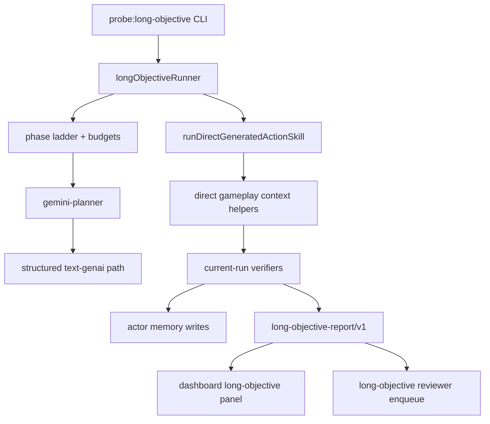

# Composer 2.5 — Single Actor Long-Term Diamond Plan

Search token: `COMPOSER_25_SINGLE_ACTOR_LONG_TERM_DIAMOND_PLAN`.

Implementation plan derived from
[Single-Actor-Long-Term-Diamond-Handoff](./Single-Actor-Long-Term-Diamond-Handoff.md).
Execution agent: Cursor Composer 2.5.

Status: supporting evaluation plan. This is not the active social-life runtime,
and it must not be used to make diamond acquisition the project goal.

## Goal

When this harness is explicitly selected, prove one actor can **complete or
truthfully progress** through a dependency ladder with **current-run Minecraft
evidence**, not provider text.

Target ladder (phases, not one opaque objective):

1. `craft_current_run_stone_axe_1` — sanity (existing proof)
2. `craft_current_run_stone_pickaxe_1`
3. `obtain_current_run_iron_ingot_1`
4. `craft_current_run_iron_pickaxe_1`
5. `locate_current_run_diamond_ore_1`
6. `obtain_current_run_diamond_1`

Composite runner entry: `obtain_current_run_diamond_1` walks the ladder until pass
or explicit stop.

## Architecture



Principle: **LLM plans and generates TypeScript; runtime owns truth.**

## Workstream A — Gemini planner provider

| Deliverable | Path | Notes |
|-------------|------|-------|
| Auth loader | `probe/src/provider/gemini/auth.ts` | `GEMINI_API_KEY` or `build/provider-auth/gemini.env`; never log key |
| Config | `probe/src/provider/gemini/config.ts` | Env from handoff: text model, live model, order, timeouts |
| Text path | `probe/src/provider/gemini/textGenai.ts` | `@google/genai` `generateContent` with `responseMimeType: "application/json"` and `responseJsonSchema` |
| Facade | `probe/src/provider/gemini/geminiLivePlanner.ts` | Legacy-named facade; provider id `gemini-planner`; snapshots structured source metadata |
| Smoke CLI | `probe/src/provider/gemini/smokeCli.ts` | `probe:gemini-planner-smoke` |

Provider order: `PROBE_LONG_OBJECTIVE_PROVIDER_ORDER=text-genai` (default).
On `429`/quota, classify `provider_blocked`; do not recover through Native
Audio Dialog.

## Workstream B — Long objective harness

| Deliverable | Path | Notes |
|-------------|------|-------|
| Types / stop reasons | `probe/src/objectives/longObjective/types.ts` | `long-objective-report/v1` |
| Ladder | `probe/src/objectives/longObjective/ladder.ts` | Phase ids, target items, helper hints |
| Verifiers | `probe/src/objectives/longObjective/verifiers.ts` | Inventory / observation checks |
| Runner | `probe/src/objectives/longObjective/runner.ts` | Phases, budgets, memory, reviewer |
| CLI | `probe/src/objectives/longObjective/cli.ts` | `probe:long-objective` |
| Registry | `probe/src/objectives/registry.ts` | New `ObjectiveId` entries |

Stop reasons (explicit): `objective_passed`, `phase_failed`, `environment_blocked`,
`provider_blocked`, `missing_helper`, `missing_verifier`, `budget_exhausted_with_progress`,
`budget_exhausted_without_progress`, `unsafe_or_rejected_source`.

## Workstream C — Minecraft substrate

Extend `createDirectContext` substrate in `directGeneratedRunner.ts`:

- `stone_pickaxe` — cobblestone + sticks + table craft (Gate 2)
- `iron_ingot` — mine `iron_ore`, smelt via `smeltItem` helper (stub → blocked with reason if furnace missing)
- `iron_pickaxe`, `diamond` — incremental; locator records block scan evidence

New tool modules (evidence-first, minimal):

- `probe/src/tools/longObjectiveHelpers.ts` — `smeltItem`, `mineOre`, `scanNearbyBlocks` wrappers used by ctx

## Workstream D — Dashboard

- List `action-skills/long-objectives/*/report.json` in `dashboardServer.ts`
- Render phase timeline: phase id, verifier, stop reason, next phase

## Workstream E — Reviewer

- `probe/src/objectives/longObjective/reviewer.ts` — deterministic findings:
  missing helper, helper bug, bad source, memory, verifier, environment, budget
- Enqueue on failed / partial long runs with `action_skill_direct_trial` ref

## Test gates

| Gate | Command | Pass |
|------|---------|------|
| 1 | `bun run probe:gemini-planner-smoke` | Snapshot + no secret leak |
| 2 | `probe:long-objective --objective craft_current_run_stone_pickaxe_1` | `stone_pickaxe >= 1` (live) |
| 3 | iron ingot objective | pass or precise `missing_helper` / `missing_verifier` |
| 4 | diamond attempt | diamond or truthful ladder + stop reason |

CI without keys: unit tests for verifiers, planner classification, deterministic fallbacks.

## Commands after implementation

```bash
cd probe
bun test
bun run typecheck
bun run probe:gemini-planner-smoke -- --prompt 'Return JSON: {"ok":true}' --report ../tmp/gemini-planner-smoke.json
bun run probe:long-objective -- --objective craft_current_run_stone_pickaxe_1 --actor npc_b --provider gemini-planner --max-phases 4 --max-actions-per-phase 10 --report ../tmp/long-stone-pickaxe.json
```

```bash
cd docs && npm run build
```

## Non-goals (this PR)

- Replacing the Soul/LifeGoal social-cycle runtime
- Making diamond acquisition the top-level product metric
- actor relationship proof
- Multi-actor scheduling
- Committing `build/provider-auth/*`, `tmp/*`, or evidence

## Review checklist (from handoff)

- Deepest phase reached?
- Current-run evidence per passed phase?
- Missing helper/verifier at stop?
- Provider path (text vs live) in snapshots?
- Memory retrievable for resume?
