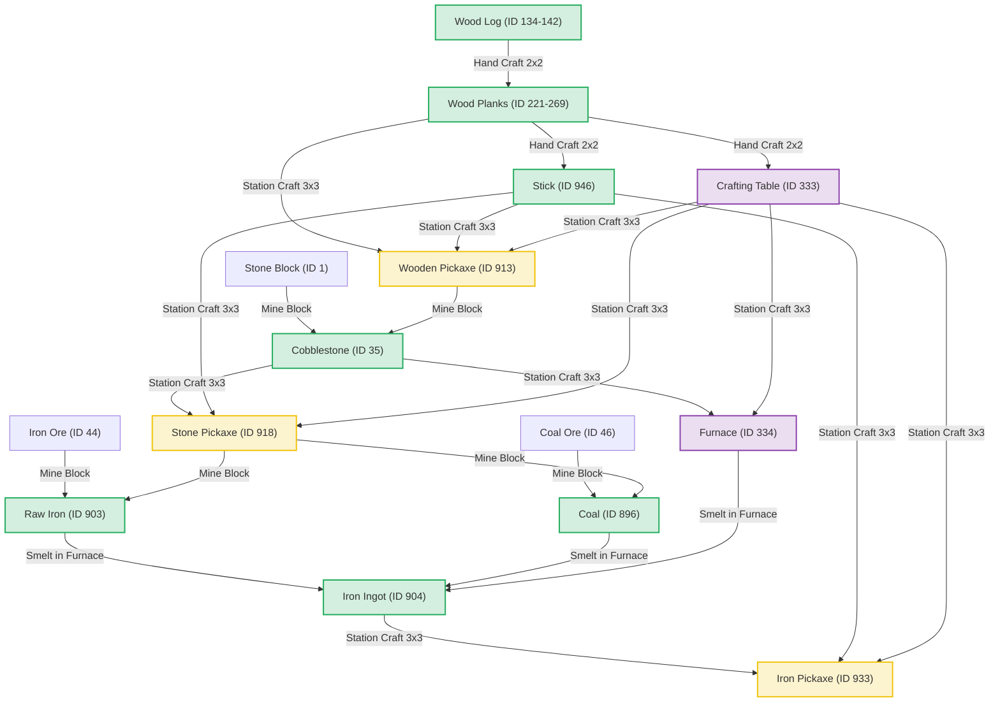

# Early Survival Progression Graph

This document provides a visual and structural representation of early-game survival progression, mapping the dependencies from raw wood logs to advanced iron mining tools in Minecraft Java 1.21.11.

---

## 🗺️ Progression Dependency Flowchart

The diagram below maps how raw materials, crafting grids, and tools progress. Rectangles represent blocks or items, and rounded shapes represent crafting/mining actions.

---

## 📈 Milestone Progression Checklist

### 🌲 Phase 1: Forestry & Hand Crafting
*   [ ] Collect 3-4 Wood Logs.
*   [ ] Craft 12-16 Wood Planks.
*   [ ] Craft 8 Sticks.
*   [ ] Craft 1 Crafting Table.

### 🪓 Phase 2: Wooden Pickaxe & Stone Age
*   [ ] Place Crafting Table.
*   [ ] Craft Wooden Pickaxe.
*   [ ] Mine 11+ Cobblestone.
*   [ ] Craft Stone Pickaxe and Wooden Axe.

### 🔥 Phase 3: Metallurgy & Smelting
*   [ ] Craft Furnace.
*   [ ] Mine Coal (at least 3-4 pieces) using Stone Pickaxe.
*   [ ] Mine Iron Ore (at least 3 pieces) using Stone Pickaxe.
*   [ ] Ignite Furnace using Coal; smelt Raw Iron to produce Iron Ingots.
*   [ ] Craft Iron Pickaxe using Crafting Table.
