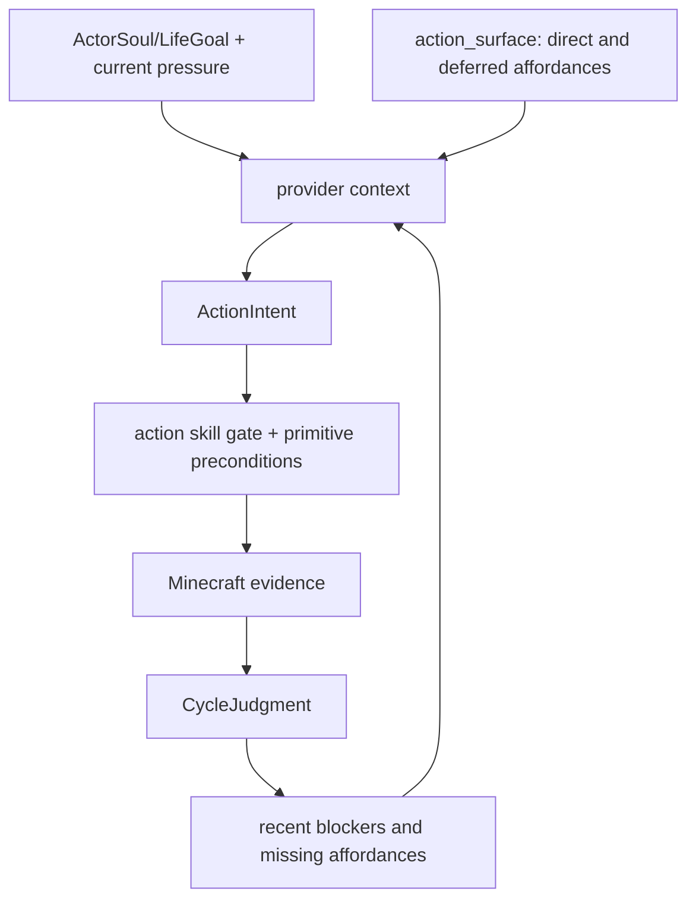
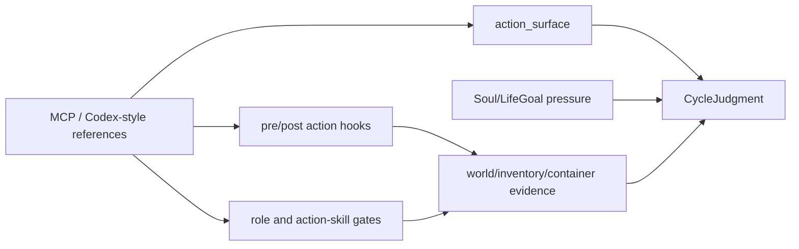

# Future Works

Search token: `FUTURE_WORKS`.

Status: active future-work backlog, not a long-term spec change.

This page records implementation ideas discovered from live runs and external
references. It must not override `SPEC.md`, ActorSoul/LifeGoal semantics, or the
runtime evidence rules. If a future item changes product direction, move it
through explicit spec approval before implementing it as a durable contract.

## Latest Live Inputs

### 14/14 Action-Skill Matrix

The current implemented action-skill surface passed a fresh live matrix on
Linux ARM with Docker Engine:

```text
matrix_summary verdict=passed passed=14 failed=0 error=0 total=14/14
matrix_scope_counts current_run=14 historical_transcript=0 missing=0 environment_blocked=0
```

This proves the seed action skills can pass when each skill is isolated with
runtime-owned fixtures and current-run postcondition evidence.

### 100-Cycle Home-Base Stress Test

The long-horizon OpenAI social-cycle test used one actor, one fresh world, and a
WorldEvent pressure to make a small believable home base.

Run artifact:

```text
tmp/live-social-cycle-openai-home-100.json
```

Observed result:

- requested `100` cycles;
- completed `54` cycles before cleanup hit a host file-permission blocker;
- `provider=openai-api`, `model=gpt-5.4-mini`;
- `builtin_goal_authority=false`;
- `builtin_execution_source=false`;
- `fixture_dependency=false`;
- `used_world_event_refs=1`;
- `used_previous_judgment=true`;
- `used_memory_refs=8`;
- `memory_writes=224`;
- report audit passed.

Concrete Minecraft progress happened, but the home was not completed:

- cycle 35: `collect_logs` collected logs with inventory delta `+2`;
- cycle 36: `craft_item` crafted `oak_planks` with inventory delta `+4`;
- cycle 38: `build_pattern` placed four shelter shell blocks, then returned
  `progressing` because the full shelter verifier still saw an incomplete
  shell.

The test did not lie about completion. The run remained `blocked` rather than
claiming a finished home.

## Behavior Verdict

Verdict: `DIAGNOSABLE_FAILURE`.

The current runtime is good at rejecting fake success and preserving context.
The current planner/control surface is not yet good at turning a long-horizon
home-base pressure into a reliable precondition-aware action sequence.

Repeated blockers from the 54 recorded cycles:

| Blocker | Count | Meaning |
|---------|------:|---------|
| `collect_logs found no reachable low log block within 24 blocks` | 8 | Resource discovery and bounded movement are not integrated enough. |
| `craft_item requires itemName` | 6 | Provider argument contract is too weak. |
| `mine_block requires a pickaxe before mining stone` | 5 | Planner repeats post-pickaxe actions before the precondition is satisfied. |
| `build_pattern found no solid build material in inventory` | 2 | Shelter building is attempted before material readiness. |
| `No craftable inventory recipe found for oak_planks` | 2 | Crafting retries need better inventory/recipe context. |
| `No craftable inventory recipe found for crafting_table` | 2 | Station progression still needs stronger prerequisites. |

## Priority Work

### P0: Planner Argument Contract Hardening

`craft_item` should not reach execution without a valid `itemName`.

Future implementation options:

- reject malformed `ActionIntent` before execution and request a repaired
  provider output;
- expose a small enum or structured alias map for craftable items;
- convert common natural-language outputs into canonical Minecraft item ids
  only when the conversion is unambiguous;
- write a failed intent artifact when required fields are missing, so the next
  cycle sees the exact schema problem.

The goal is not broad prompt polish. The goal is to stop wasting live cycles on
primitive calls that the runtime can prove are malformed before touching
Mineflayer.

### P0: Blocker-Aware Pivot Rule

After the same primitive fails with the same blocker twice in a recent window,
the next provider context should make that exact primitive/argument pair
temporarily unavailable or mark it as a prohibited retry.

Example:

```text
collect_logs + no reachable low log within 24 blocks
-> do not retry collect_logs immediately
-> choose bounded scout movement, observe resource direction, or another
   precondition action
```

This should be a runtime rule over recent evidence, not a provider memory note
that the model may ignore.

### P0: Autonomy Surface And Blocker-Aware Context

The 100-cycle home-base run should not create a home-base architecture. It
showed a broader substrate gap: the provider needs a clearer actor body, recent
blockers, malformed-argument feedback, and partial-progress semantics.

Future context should expose `action_surface` plus pressure-specific state:



The context should make prerequisite gaps explicit without making one activity
mandatory:

- which primitives and action skills are executable now;
- which affordances are deferred because actor ownership, role permission, or
  primitive support is missing;
- whether a recent blocker repeats the same primitive and argument shape;
- what exact argument or precondition is missing;
- whether current-run evidence is full progress, partial progress, blocked, or
  no progress.

If a WorldEvent asks for a home, shelter-specific checklist items may appear as
pressure-specific state. If the WorldEvent asks for storage, repair, social
handoff, scarcity, or exploration, the context must not force a home/shelter
plan.

### P0: Partial Progress Semantics

`build_pattern:progressing` can contain real block-placement evidence. The
report should distinguish:

- `verified_progress`: completed meaningful verifier condition;
- `partial_verified_progress`: current-run world mutation that is useful but
  not enough for final success;
- `no_progress`: observe, wait, memory, or blocked attempts only.

This avoids two bad outcomes:

- counting a partial shell as a finished home;
- hiding real block placement under a report-level `gameplay_progress_verified=false`.

### P1: Review Summary Schema Catch-Up

The social-cycle report itself carried `action_attempts`, provider refs,
previous judgment, and memory context. The generated review summary treated most
cycles as `missing:?`, which means the review CLI has fallen behind the current
report shape.

Fix target:

- read nested `cycles[].action_attempts[]`;
- count `executed_tools` and `tool_statuses` from current report fields;
- detect previous judgment from provider input snapshots under `.input`;
- surface `partial_verified_progress` once that status exists.

### P1: Fresh-World Cleanup Ownership

The 100-cycle run ended during cleanup because the fresh-world data directory
was written by the container user and the host process could not delete it.

Fix target:

- make fresh-world server data directories host-cleanable;
- or run cleanup through Docker/compose with the same effective user;
- or record cleanup failure as cleanup-only without obscuring the completed
  report.

### P1: Resource Discovery And Bounded Movement

`collect_logs` can pass in a fixture, but the long-horizon run repeatedly found
no reachable low logs nearby. The next layer should connect observation hints to
bounded movement and resource discovery.

Potential action-skill candidates:

- `scout_for_low_logs`;
- `move_to_observed_resource_hint`;
- `explore_until_resource`;
- `return_to_home_base`.

Keep movement bounded and evidence-first. Do not turn exploration into
unbounded wandering.

## Minecraft MCP And Codex-Style Tool Runtime References

External examples are references, not product goals. The remembered
"Claude/Claude Code MCP builds a house" example is useful because it shows how
much leverage comes from a clean action interface. It is not evidence that this
repo should become a house-building architecture.

Research status, 2026-05-24:

- [`joshdevous/minecraft-builder-claude-mcp-server`](https://github.com/joshdevous/minecraft-builder-claude-mcp-server)
  has Claude produce JSON block coordinates and converts them into
  WorldEdit-compatible `.schem` files. Use it as an offline planning reference
  for typed coordinate data. Do not treat `.schem` generation or WorldEdit paste
  as embodied actor progress.
- [`yuniko-software/minecraft-mcp-server`](https://github.com/yuniko-software/minecraft-mcp-server)
  exposes Mineflayer movement, inventory, block, crafting, furnace, chat,
  flight, and game-state tools through MCP. Use it as a tool-surface and
  argument-schema reference. Do not copy text-only success semantics.
- [`FundamentalLabs/minecraft-mcp`](https://github.com/FundamentalLabs/minecraft-mcp)
  includes high-level building helpers backed by `/setblock`, `/fill`, `/clone`,
  raw commands, or dynamic JavaScript. Use it as a warning about powerful admin
  surfaces. Those paths are not actor action skills in this repo.
- [`gerred/mcpmc`](https://github.com/gerred/mcpmc) exposes typed resources and
  tools for navigation, digging, placement, inventory, crafting, containers, and
  real-time state. Use it as a reference for resource-style context and progress
  notifications.
- [`arjunkmrm/mcp-minecraft`](https://github.com/arjunkmrm/mcp-minecraft) is a
  compact Claude Desktop Mineflayer bridge. Use it as a primitive checklist and
  setup-ergonomics reference, not as a verification model.
- [`openai/codex`](https://github.com/openai/codex) is the stronger architecture
  analogy: a tool runtime with direct/deferred exposure, hooks, permission
  checks, event streams, and evidence accounting. It does not hard-code a
  strategy for Python, TypeScript, or C# tasks.

Reference links:

- [yuniko-software/minecraft-mcp-server](https://github.com/yuniko-software/minecraft-mcp-server)
- [joshdevous/minecraft-builder-claude-mcp-server](https://github.com/joshdevous/minecraft-builder-claude-mcp-server)
- [FundamentalLabs/minecraft-mcp](https://github.com/FundamentalLabs/minecraft-mcp)
- [gerred/mcpmc](https://github.com/gerred/mcpmc)
- [arjunkmrm/mcp-minecraft](https://github.com/arjunkmrm/mcp-minecraft)
- [OpenAI Codex](https://github.com/openai/codex)
- [Claude Code MCP documentation](https://code.claude.com/docs/en/mcp)
- [Model Context Protocol](https://modelcontextprotocol.io/)

Translation into this repo:



Ideas to adapt:

- typed, bounded argument schemas for provider-visible actions;
- compact world-status context: position, health, food, game mode, time,
  selected item, inventory summary, nearby entities, and known blocks;
- direct/deferred action exposure so the model can see both usable affordances
  and missing affordances;
- block-affordance diagnostics: target-before block, support block, face vector,
  occupied-target guard, target-after block, and inventory delta;
- reachability/preflight helpers for movement, block search, resource targeting,
  equipment, and container access;
- recipe affordance summaries with exact item id, table requirement, missing
  ingredients, result count, and nearest crafting table;
- bounded chat history as social pressure/evidence, not as free authority;
- optional offline design artifacts only when a specific action skill needs
  them.

Do not translate:

- MCP as the active runtime boundary;
- WorldEdit or `.schem` paste as actor progress;
- `/setblock`, `/fill`, `/clone`, `/give`, raw commands, or dynamic JavaScript;
- creative/peaceful/flat-world defaults for survival competence proof;
- "success" strings from Mineflayer calls without world or inventory rereads;
- fuzzy item matching unless the chosen alias is explicit and recorded;
- `StructureBlueprint`, `ShelterBlueprint`, or similar building artifacts as
  mandatory core cycle context.

Seed action skill and primitive implications:

- Do not add `buildHouseFromDescription`, `StructurePlacementPlan`, or a
  building-first planner as core runtime architecture.
- Keep `buildBasicShelter` and `build_pattern` as bounded affordances selected
  only when current pressure makes building relevant.
- Promote small, general affordances before larger domain behaviors:
  `collectDroppedItems`, `equipBestTool`, `findReachableBlocks`,
  `checkPathToBlock`, `recipe_affordance`/`can_craft`, `use_furnace`, richer
  container access, and better observation packets.
- If a future structure artifact becomes useful, keep it local to a bounded
  action skill or offline design workflow. It must compile into ordinary
  verified runtime actions and cannot claim progress before world verification.

This keeps the external insight where it helps: better affordances, better
diagnosis, and better runtime evidence. It avoids changing the core architecture
or bypassing embodied Mineflayer work.

## Suggested Next Implementation Order

1. Harden `ActionIntent` argument validation for `craft_item` and
   `craft_with_table`.
2. Add runtime-level repeated-blocker suppression and pivot pressure.
3. Add partial-progress status to social-cycle reports and review summaries.
4. Update review summary CLI to read the current nested report shape.
5. Fix fresh-world cleanup ownership.
6. Expand `action_surface` with direct/deferred affordances, missing-argument
   diagnostics, and pressure-specific state.
7. Add bounded resource-discovery and equipment affordances only after
   blocker-aware pivot logic is in place.
8. Consider domain-local design artifacts only when a specific action skill
   needs them; do not add building artifacts as core cycle context.
