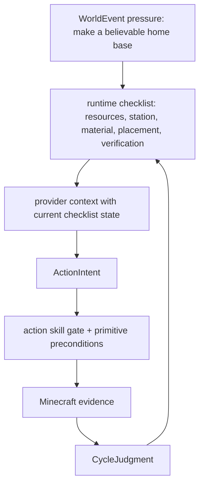
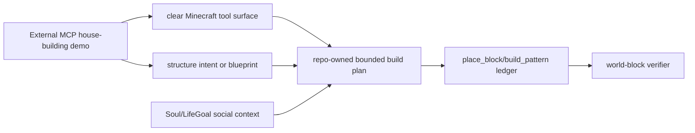

# Future Works

Search token: `FUTURE_WORKS`.

Status: active future-work backlog, not a long-term spec change.

This page records implementation ideas discovered from live runs and external
references. It must not override `SPEC.md`, ActorSoul/LifeGoal semantics, or the
runtime evidence rules. If a future item changes product direction, move it
through explicit spec approval before implementing it as a durable contract.

## Latest Live Inputs

### 14/14 Action-Skill Matrix

The current implemented action-skill surface passed a fresh live matrix on
Linux ARM with Docker Engine:

```text
matrix_summary verdict=passed passed=14 failed=0 error=0 total=14/14
matrix_scope_counts current_run=14 historical_transcript=0 missing=0 environment_blocked=0
```

This proves the seed action skills can pass when each skill is isolated with
runtime-owned fixtures and current-run postcondition evidence.

### 100-Cycle Home-Base Stress Test

The long-horizon OpenAI social-cycle test used one actor, one fresh world, and a
WorldEvent pressure to make a small believable home base.

Run artifact:

```text
tmp/live-social-cycle-openai-home-100.json
```

Observed result:

- requested `100` cycles;
- completed `54` cycles before cleanup hit a host file-permission blocker;
- `provider=openai-api`, `model=gpt-5.4-mini`;
- `builtin_goal_authority=false`;
- `builtin_execution_source=false`;
- `fixture_dependency=false`;
- `used_world_event_refs=1`;
- `used_previous_judgment=true`;
- `used_memory_refs=8`;
- `memory_writes=224`;
- report audit passed.

Concrete Minecraft progress happened, but the home was not completed:

- cycle 35: `collect_logs` collected logs with inventory delta `+2`;
- cycle 36: `craft_item` crafted `oak_planks` with inventory delta `+4`;
- cycle 38: `build_pattern` placed four shelter shell blocks, then returned
  `progressing` because the full shelter verifier still saw an incomplete
  shell.

The test did not lie about completion. The run remained `blocked` rather than
claiming a finished home.

## Behavior Verdict

Verdict: `DIAGNOSABLE_FAILURE`.

The current runtime is good at rejecting fake success and preserving context.
The current planner/control surface is not yet good at turning a long-horizon
home-base pressure into a reliable precondition-aware action sequence.

Repeated blockers from the 54 recorded cycles:

| Blocker | Count | Meaning |
|---------|------:|---------|
| `collect_logs found no reachable low log block within 24 blocks` | 8 | Resource discovery and bounded movement are not integrated enough. |
| `craft_item requires itemName` | 6 | Provider argument contract is too weak. |
| `mine_block requires a pickaxe before mining stone` | 5 | Planner repeats post-pickaxe actions before the precondition is satisfied. |
| `build_pattern found no solid build material in inventory` | 2 | Shelter building is attempted before material readiness. |
| `No craftable inventory recipe found for oak_planks` | 2 | Crafting retries need better inventory/recipe context. |
| `No craftable inventory recipe found for crafting_table` | 2 | Station progression still needs stronger prerequisites. |

## Priority Work

### P0: Planner Argument Contract Hardening

`craft_item` should not reach execution without a valid `itemName`.

Future implementation options:

- reject malformed `ActionIntent` before execution and request a repaired
  provider output;
- expose a small enum or structured alias map for craftable items;
- convert common natural-language outputs into canonical Minecraft item ids
  only when the conversion is unambiguous;
- write a failed intent artifact when required fields are missing, so the next
  cycle sees the exact schema problem.

The goal is not broad prompt polish. The goal is to stop wasting live cycles on
primitive calls that the runtime can prove are malformed before touching
Mineflayer.

### P0: Blocker-Aware Pivot Rule

After the same primitive fails with the same blocker twice in a recent window,
the next provider context should make that exact primitive/argument pair
temporarily unavailable or mark it as a prohibited retry.

Example:

```text
collect_logs + no reachable low log within 24 blocks
-> do not retry collect_logs immediately
-> choose bounded scout movement, observe resource direction, or another
   precondition action
```

This should be a runtime rule over recent evidence, not a provider memory note
that the model may ignore.

### P0: Home-Base Precondition Planner

The WorldEvent "make a home" should compile into a small runtime-visible
checklist without replacing the ActorLifeGoal:



The checklist should make prerequisite gaps explicit:

- reachable wood exists;
- enough wood or planks are in inventory;
- crafting table is present or placeable;
- enough solid material exists for `build_pattern`;
- shelter shell placement has partial or complete verifier evidence.

### P0: Partial Progress Semantics

`build_pattern:progressing` can contain real block-placement evidence. The
report should distinguish:

- `verified_progress`: completed meaningful verifier condition;
- `partial_verified_progress`: current-run world mutation that is useful but
  not enough for final success;
- `no_progress`: observe, wait, memory, or blocked attempts only.

This avoids two bad outcomes:

- counting a partial shell as a finished home;
- hiding real block placement under a report-level `gameplay_progress_verified=false`.

### P1: Review Summary Schema Catch-Up

The social-cycle report itself carried `action_attempts`, provider refs,
previous judgment, and memory context. The generated review summary treated most
cycles as `missing:?`, which means the review CLI has fallen behind the current
report shape.

Fix target:

- read nested `cycles[].action_attempts[]`;
- count `executed_tools` and `tool_statuses` from current report fields;
- detect previous judgment from provider input snapshots under `.input`;
- surface `partial_verified_progress` once that status exists.

### P1: Fresh-World Cleanup Ownership

The 100-cycle run ended during cleanup because the fresh-world data directory
was written by the container user and the host process could not delete it.

Fix target:

- make fresh-world server data directories host-cleanable;
- or run cleanup through Docker/compose with the same effective user;
- or record cleanup failure as cleanup-only without obscuring the completed
  report.

### P1: Resource Discovery And Bounded Movement

`collect_logs` can pass in a fixture, but the long-horizon run repeatedly found
no reachable low logs nearby. The next layer should connect observation hints to
bounded movement and resource discovery.

Potential action-skill candidates:

- `scout_for_low_logs`;
- `move_to_observed_resource_hint`;
- `explore_until_resource`;
- `return_to_home_base`.

Keep movement bounded and evidence-first. Do not turn exploration into
unbounded wandering.

## MCP House-Building Reference

External examples are references, not product goals. The useful reference here
is a Minecraft MCP server that exposes Mineflayer-backed Minecraft control to
Claude-compatible MCP clients and advertises building/structure interaction.

Reference links:

- [yuniko-software/minecraft-mcp-server](https://github.com/yuniko-software/minecraft-mcp-server)
- [Claude Code MCP documentation](https://code.claude.com/docs/en/mcp)
- [Model Context Protocol](https://modelcontextprotocol.io/)

Ideas to adapt, not copy:

- clear tool surface for position, movement, inventory, block placement, and
  structure manipulation;
- tool descriptions that make the model aware of available Minecraft actions;
- explicit client permission boundaries;
- the ability to describe or upload a building target, then let tools perform
  bounded world edits.

Translation into this repo:



Do not import the MCP demo as the active architecture. This repo should keep the
actor workspace, action-skill ownership, runtime postconditions, and
Soul/LifeGoal continuity as the governing frame. The MCP idea is useful because
it highlights how much leverage comes from a clean action interface, not because
it proves that arbitrary model-directed building is enough.

## Suggested Next Implementation Order

1. Harden `ActionIntent` argument validation for `craft_item` and
   `craft_with_table`.
2. Add runtime-level repeated-blocker suppression and pivot pressure.
3. Add partial-progress status to social-cycle reports and review summaries.
4. Update review summary CLI to read the current nested report shape.
5. Fix fresh-world cleanup ownership.
6. Add a small home-base checklist compiler that remains WorldEvent pressure,
   not LifeGoal replacement.
7. Add bounded resource-discovery action skills only after blocker-aware pivot
   logic is in place.
