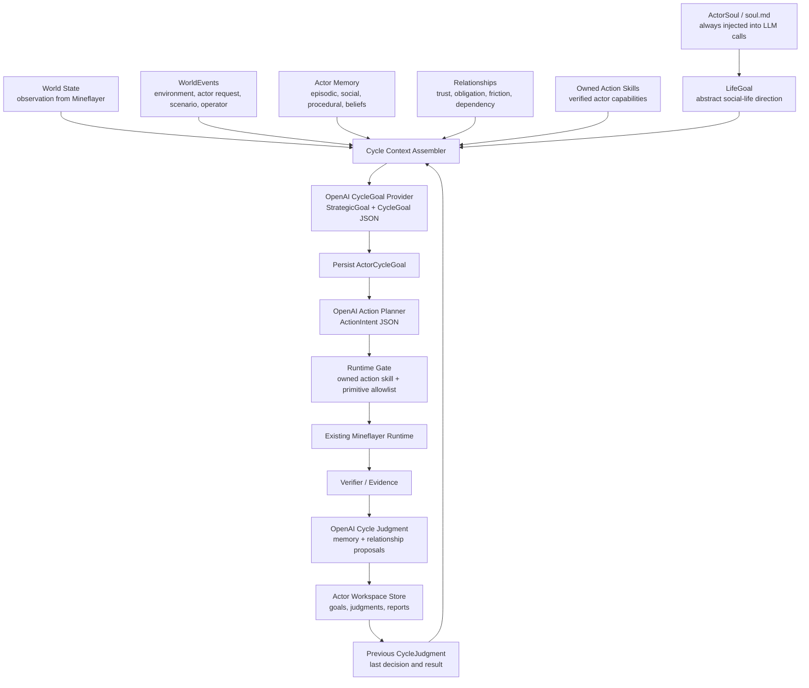

# Composer 2.5 Soul Life Goal Runtime Implementation Plan

Search tokens:

- `COMPOSER_25_SOUL_LIFE_GOAL_RUNTIME_PLAN`
- `SOUL_CYCLE_VERTICAL_SLICE`
- `OPENAI_API_GPT54_MINI_SOCIAL_RUNTIME`
- `WORLD_EVENT_NOT_USER_PROMPT`

Status: handoff plan, 2026-05-23.

## Request To Composer 2.5

Implement the first complete vertical slice of the Soul/LifeGoal/CycleGoal
runtime. Do not implement a thin P0 that only writes files. Build the smallest
end-to-end loop where an actor can:

```text
load ActorSoul + LifeGoal
observe the Minecraft world
retrieve memory, relationships, previous CycleJudgment, owned action skills, WorldEvents
ask an OpenAI API model for StrategicGoal/CycleGoal
ask the model for ActionIntent
execute through the existing runtime gate
verify with current-run evidence
write CycleJudgment, memory writes, and report metrics
run a second cycle that can cite the previous judgment
```

The near-term proof is a bounded social-life simulation seed. One actor should
act in Minecraft, reason from `ActorSoul`, `LifeGoal`, and `WorldEvent`
pressure, store or refine memory from evidence, and use prior judgment or memory
in later cycles. It is not full human-like personhood, long-run autonomy, or a
Voyager clone.

The target provider is OpenAI API `gpt-5.4-mini` through `OPENAI_API_KEY` in the
repo-root `.env`, not the existing `openai-codex` ChatGPT backend auth store.
Keep `OPENAI_MODEL` configurable and default to `gpt-5.4-mini` because eligible
accounts may have free-tier mini model access. If the model is unavailable in
the local account, the implementation must fail with a clear provider setup
error and support `OPENAI_MODEL=gpt-5-mini` as an explicit fallback.

Official reference notes:

- OpenAI model docs list GPT-5.4 mini as a mini model for coding/agentic tasks:
  `https://platform.openai.com/docs/models`.
- OpenAI Help documents complimentary daily tokens for eligible data-sharing
  projects, including mini/nano model pools:
  `https://help.openai.com/en/articles/9883556-sharing-model-feedback-through-the-api`.
- Repo-local setup note:
  `docs/docs/Setup/OpenAI-Tier3-Free-Usage.md`.

Do not treat complimentary token eligibility as guaranteed. The CLI must report
model/provider failure truthfully.

## Architecture To Build



Key rule:

```text
WorldEvent is not a prompt.
WorldEvent is a world fact or pressure that the actor may accept, defer, reject,
or transform based on ActorSoul and LifeGoal.
```

## Files To Add

Use small modules. Avoid adding another large runner.

```text
probe/src/runtime/goals/types.ts
probe/src/runtime/goals/actorSoulStore.ts
probe/src/runtime/goals/lifeGoalStore.ts
probe/src/runtime/goals/strategicGoalStore.ts
probe/src/runtime/goals/cycleGoalStore.ts
probe/src/runtime/goals/cycleJudgmentStore.ts
probe/src/runtime/goals/worldEventStore.ts
probe/src/runtime/goals/cycleContextAssembler.ts
probe/src/runtime/goals/cycleReport.ts
probe/src/runtime/goals/socialCycleReportAuditCli.ts
probe/src/provider/openaiApiJsonProvider.ts
probe/src/provider/socialGoalMindProvider.ts
probe/src/provider/socialActionPlannerProvider.ts
probe/src/provider/socialCycleJudgmentProvider.ts
probe/src/runtime/socialCycleRunner.ts
probe/src/socialCycleCli.ts
probe/test/socialGoalTypes.test.ts
probe/test/socialCycleStores.test.ts
probe/test/socialCycleContext.test.ts
probe/test/socialCycleRunner.test.ts
```

Update existing files:

```text
probe/package.json
probe/src/config.ts
probe/src/runtime/actorWorkspacePaths.ts
probe/src/runtime/actorWorkspace.ts
probe/src/provider/actorProviderContext.ts
probe/src/npc/goals/goalStack.ts
probe/src/runtime/intentToSkill.ts
docs/docs/Setup/Provider-Setup.md
docs/docs/Agent-Search-Index.md
```

## Workspace Layout

Add actor-owned durable goal paths:

```text
data/actors/<actor_id>/
  soul.md
  soul.json
  goals/
    life/active.json
    strategic/*.json
    cycle/*.json
  judgments/*.json
  world-events/*.json
  provider-inputs/*.json
  provider-outputs/*.json
  evidence/*.json
```

`initializeActorWorkspaces()` must create directories but must not delete:

- `soul.md`
- `soul.json`
- `goals/`
- `judgments/`
- `world-events/`
- memory
- relationships
- action skills

It may still clear volatile provider/evidence dirs for fresh runs, but the
social runtime should preserve enough refs for CycleJudgment continuity.

## Data Model

Implement schemas as TypeScript types plus runtime validators. Do not add a
large validation dependency unless already available. Small hand-written
validators are enough for this slice.

Required records:

```ts
type ActorSoul = {
  schema: "actor-soul/v1";
  actor_id: string;
  display_name: string;
  society_id: string;
  role: string;
  life_goal: string;
  public_responsibilities: string[];
  private_drives: string[];
  values: string[];
  needs: {
    survival: string[];
    social: string[];
    learning: string[];
  };
  boundaries: {
    forbidden_actions: string[];
    requires_evidence_before_claiming: string[];
    shared_resource_rules: string[];
  };
  action_skill_policy: {
    prefer_owned_action_skills: boolean;
    allow_primitive_fallback: boolean;
    allow_generated_action_skill_trials: boolean;
  };
  memory_policy: {
    retrieve_layers: string[];
    must_consider_recent_cycle_judgment: boolean;
  };
  speech_style: string;
};
```

```ts
type ActorLifeGoal = {
  schema: "actor-life-goal/v1";
  actor_id: string;
  goal_id: string;
  objective: string;
  status: "active" | "paused" | "blocked" | "stalled" | "retired";
  source: "actor_soul" | "scenario" | "operator_override";
  created_at: string;
  updated_at: string;
  cycle_count: number;
  action_count: number;
  evidence_refs: string[];
  memory_refs: string[];
  relationship_refs: string[];
};
```

```ts
type StrategicGoal = {
  schema: "actor-strategic-goal/v1";
  actor_id: string;
  strategic_goal_id: string;
  life_goal_id: string;
  status: "active" | "paused" | "blocked" | "satisfied" | "retired";
  summary: string;
  rationale: string;
  derived_from: {
    soul_ref: string;
    world_event_refs: string[];
    memory_refs: string[];
    relationship_refs: string[];
    previous_cycle_judgment_refs: string[];
  };
  success_direction: string;
  current_blockers: string[];
  updated_at: string;
};
```

```ts
type ActorCycleGoal = {
  schema: "actor-cycle-goal/v1";
  actor_id: string;
  goal_id: string;
  life_goal_id: string;
  cycle_id: string;
  status: "active" | "satisfied" | "blocked" | "stalled" | "abandoned" | "interrupted" | "superseded";
  source: "llm_planner" | "llm_authored_policy" | "runtime_rule" | "world_event_pressure";
  summary: string;
  rationale: string;
  derived_from: {
    soul_ref: string;
    observation_refs: string[];
    world_event_refs: string[];
    memory_refs: string[];
    relationship_refs: string[];
    previous_cycle_judgment_refs: string[];
  };
  success_condition: {
    verifier: string;
    evidence_required: string[];
  };
  allowed_action_skill_ids: string[];
  allowed_primitive_ids: string[];
  stop_conditions: string[];
};
```

```ts
type WorldEvent = {
  schema: "world-event/v1";
  event_id: string;
  kind: "environment_event" | "actor_event" | "scenario_event" | "operator_event";
  authority: "pressure_only" | "scenario_rule" | "debug_override";
  summary: string;
  actor_refs: string[];
  evidence_refs: string[];
  created_at: string;
};
```

```ts
type ActionIntent = {
  schema: "action-intent/v1";
  actor_id: string;
  cycle_id: string;
  cycle_goal_id: string;
  kind: "use_action_skill" | "use_primitive" | "wait" | "remember";
  action_skill_id?: string;
  primitive_id?: string;
  args: Record<string, unknown>;
  why_this_action: string;
  expected_evidence: string[];
  fallback_if_blocked: string;
};
```

```ts
type CycleJudgment = {
  schema: "cycle-judgment/v1";
  actor_id: string;
  cycle_id: string;
  cycle_goal_id: string;
  outcome: "verified_progress" | "partial_verified_progress" | "no_progress" | "blocked" | "unsafe" | "socially_resolved";
  what_happened: string;
  why_it_mattered_for_life_goal: string;
  verifier_status: "passed" | "failed" | "not_applicable";
  evidence_refs: string[];
  memory_writes: Array<{
    layer: "episodic" | "procedural" | "social" | "belief" | "guardrail";
    summary: string;
    confidence: "observed" | "inferred" | "uncertain";
  }>;
  relationship_event_proposals: Array<{
    target_actor_id: string;
    kind: "request_made" | "request_accepted" | "fulfilled" | "blocked" | "helped" | "failed_obligation";
    evidence_refs: string[];
  }>;
  next_goal_pressure: string[];
};
```

## Provider Implementation

Use OpenAI API with the official `openai` npm package already present in
`probe/package.json`.

Config:

```text
# repo-root .env
OPENAI_API_KEY=...
OPENAI_MODEL=gpt-5.4-mini
SOCIAL_CYCLE_PROVIDER=openai-api
SOCIAL_CYCLE_REASONING=low
SOCIAL_CYCLE_MAX_COMPLETION_TOKENS=1600
```

Implementation rules:

- Read repo-root `.env` before provider calls. Existing scripts use
  `loadRepoDotEnv`; reuse or extract that helper.
- Use Chat Completions with `response_format.type = "json_schema"` for v1.
- Use `max_completion_tokens` for OpenAI API models in this family.
- Persist every provider input and output packet under actor workspace.
- Include `provider_id`, `model`, `reasoning`, `schema_name`, `cycle_id`,
  `actor_id`, and elapsed time in output records.
- If OpenAI returns model not found, quota, billing, rate limit, or data sharing
  is not eligible, fail the provider stage truthfully and write a provider error
  artifact.

Do not use `openai-codex` auth or `build/provider-auth/openai-codex-auth.json`
for this slice.

## LLM Stage Contracts

### Stage 1 - CycleGoal Provider

Input must always contain:

- `ActorSoul`
- `ActorLifeGoal`
- active `StrategicGoal[]`
- current world state summary
- `WorldEvent[]`
- relationship context
- retrieved memory
- previous CycleJudgment refs
- owned action skill summaries
- current limits

Expected JSON output:

- strategic goal updates;
- selected CycleGoal;
- rationale citing refs;
- success condition;
- evidence requirements;
- stop conditions;
- allowed action skill ids;
- allowed primitive ids.

### Stage 2 - Action Planner

Input must contain:

- `ActorSoul`
- `ActorLifeGoal`
- active `ActorCycleGoal`
- current observation
- owned action skill summaries
- allowed primitive contracts
- recent failed/blocked judgments

Expected JSON output:

- `ActionIntent`;
- one action skill id or primitive id, unless `wait`/`remember`;
- arguments;
- why this action;
- expected evidence;
- fallback if blocked.

### Stage 3 - Cycle Judgment

Input must contain:

- `ActorSoul`
- `ActorLifeGoal`
- active `ActorCycleGoal`
- `ActionIntent`
- runtime result
- verifier evidence refs
- transcript/evidence summary

Expected JSON output:

- `CycleJudgment`;
- memory write proposals;
- relationship event proposals;
- next pressure hints.

## Runtime Runner

Add:

```bash
bun run probe:social-cycle -- \
  --actor npc_b \
  --provider openai-api \
  --model gpt-5.4-mini \
  --cycles 2 \
  --max-actions-per-cycle 3 \
  --report ../tmp/social-cycle-npc-b-gpt54-mini.json
```

CLI flags:

```text
--actor <id>
--provider deterministic-social | openai-api
--model <model>
--cycles <n>
--max-actions-per-cycle <n>
--world-event <string>
--world-event-kind scenario_event|operator_event|actor_event|environment_event
--report <path>
--no-dashboard
```

`deterministic-social` is allowed only for tests and baseline reports. It must
write `cycle_goal_source: "runtime_rule"` and `provider_id:
"deterministic-social"` so it cannot be confused with OpenAI agency.

## Execution Semantics

For the first vertical slice, do not build a new action runtime. Reuse the
existing primitive execution and active action-skill gate where possible.

Minimum accepted action kinds:

- `observe`
- `wait`
- `remember`
- one safe resource action already supported by the runtime, such as
  `collect_logs` or `mine_block`, if preconditions are met
- `say` for social/world-event acknowledgement if role permits it

If action skill execution as a unit is too large, write ActionIntent with
`kind: "use_primitive"` and record the intended action skill candidate. The
report must mark `action_skill_execution_unit: false`.

## Exploration And Propagation Semantics

Mining coal, scouting for a safer route, or building a simple wooden or stone
shelter are allowed as exploration/propagation concepts only when they are
represented as objective phases or direct-generated trials behind runtime
evidence gates.

Implementation rules:

- An objective phase asks for one bounded current-run outcome and passes only
  from verifier-backed world, inventory, container, position, or transcript
  evidence.
- A direct-generated trial records generated source, helper calls, action
  attempts, timeout/error, verifier output, and memory writes before any cleanup
  into an action skill candidate.
- A social-cycle `WorldEvent` may create pressure to mine coal or prepare
  shelter, but the actor must still choose a CycleGoal from ActorSoul, LifeGoal,
  memory, relationship context, and previous CycleJudgment.
- Primitive proofs are acceptable when the artifact says what was primitive.
  Example: a report may state that shelter proof placed a minimal block outline
  but did not solve navigation, roof coverage, mob safety, or long-term reuse.

Reject:

- optimistic LLM text without current-run evidence;
- helper expansion credited as actor judgment;
- builtin fallback counted as OpenAI-authored agency.

## Report Schema

Write one report per run:

```ts
type SocialCycleRunReport = {
  schema: "social-cycle-run-report/v1";
  run_id: string;
  actor_id: string;
  provider: {
    provider_id: "openai-api" | "deterministic-social";
    model: string;
    reasoning: string;
  };
  runtime_status: "passed" | "failed" | "blocked" | "timeout";
  agency_status: {
    life_goal_source: "actor_soul" | "scenario" | "operator_override";
    strategic_goal_source: "llm_planner" | "runtime_rule";
    cycle_goal_source: "llm_planner" | "runtime_rule" | "world_event_pressure";
    used_soul: boolean;
    used_life_goal: boolean;
    used_previous_judgment: boolean;
    used_memory_refs: number;
    used_relationship_refs: number;
    used_world_event_refs: number;
    builtin_goal_authority: boolean;
    builtin_execution_source: boolean;
    fixture_dependency: boolean;
    helper_expansion_count: number;
  };
  cycles: Array<{
    cycle_id: string;
    cycle_goal_ref: string;
    action_intent_ref: string;
    action_attempt_refs: string[];
    provider_input_refs: string[];
    provider_output_refs: string[];
    evidence_refs: string[];
    judgment_ref: string;
    verifier_status: "passed" | "failed" | "not_applicable";
  }>;
};
```

Run-level `passed` means the social-life cycle loop completed and wrote truthful
artifacts. It does not mean the actor achieved every StrategicGoal.

## Tests

Minimum tests:

```bash
cd probe
bun test test/socialGoalTypes.test.ts
bun test test/socialCycleStores.test.ts
bun test test/socialCycleContext.test.ts
bun test test/socialCycleRunner.test.ts
bun run typecheck
```

Test requirements:

- `ActorSoul` and LifeGoal are always present in cycle goal provider input.
- WorldEvent is represented as pressure, not objective replacement.
- A second cycle can cite the first CycleJudgment.
- Stale `expected_goal_id` cannot overwrite a newer goal.
- Deterministic baseline report sets `builtin_goal_authority: true` or
  `cycle_goal_source: "runtime_rule"`.
- OpenAI provider errors write provider output artifacts and do not fake
  `runtime_status: "passed"`.
- Synthetic no-progress cannot pass from a terminal memory note, empty helper
  output, provider text, or missing verifier evidence.
- Every action attempt is present in the report, including wait, remember,
  blocked, provider-error, and no-progress attempts.
- Builtin fallback is explicitly marked and never counted as OpenAI-authored
  agency.

## Real Implementation Testing Plan

Smoke testing is not enough. The required test ladder is deliberately short and
linear:

```text
unit tests -> deterministic implementation run -> OpenAI provider run without
world mutation expectations -> OpenAI real world-action run -> report audit
```

Do not mark the implementation done from provider smoke alone.

### Gate 1 - Unit And Store Tests

Purpose: prove the data model and stores cannot lie.

Required checks:

- `ActorSoul` and LifeGoal are always present in cycle goal provider input.
- WorldEvent is pressure, not objective replacement.
- A second cycle can cite the first CycleJudgment.
- Stale `expected_goal_id` cannot overwrite a newer goal.
- Provider errors write provider output artifacts and never fake pass.
- Synthetic no-progress fixtures fail the report pass condition.
- Action attempt coverage includes blocked and no-progress attempts.
- Builtin fallback cannot masquerade as LLM agency in report fields.

Command:

```bash
cd probe
bun test test/socialGoalTypes.test.ts \
  test/socialCycleStores.test.ts \
  test/socialCycleContext.test.ts \
  test/socialCycleRunner.test.ts
bun run typecheck
```

### Gate 2 - Deterministic Full Implementation Run

Purpose: prove the actual runner writes the same artifact chain without relying
on OpenAI availability.

This is not the final proof of LLM agency. It is a real implementation run for
the full local loop:

```bash
cd probe
bun run probe:social-cycle -- \
  --actor npc_b \
  --provider deterministic-social \
  --cycles 2 \
  --max-actions-per-cycle 2 \
  --report ../tmp/social-cycle-deterministic-implementation.json \
  --no-dashboard
```

Pass criteria:

- report has two cycles;
- every cycle has `cycle_goal_ref`, `action_intent_ref`, `judgment_ref`;
- every attempted action is recorded with runtime result and verifier status;
- second provider/context packet cites first `CycleJudgment`;
- `agency_status.cycle_goal_source` is `runtime_rule`;
- `agency_status.builtin_goal_authority` is true or otherwise clearly marked;
- no current-run verifier evidence is fabricated.

### Gate 3 - OpenAI Provider Contract Run

Purpose: prove `gpt-5.4-mini` can produce schema-valid CycleGoal provider,
Action Planner, and Cycle Judgment outputs against real actor context.

This gate may use `observe`, `wait`, or `remember`; it checks provider contract
and continuity, not resource success.

```bash
cd probe
OPENAI_MODEL=gpt-5.4-mini bun run probe:social-cycle -- \
  --actor npc_b \
  --provider openai-api \
  --cycles 2 \
  --max-actions-per-cycle 1 \
  --report ../tmp/social-cycle-openai-contract.json \
  --no-dashboard
```

Pass criteria:

- OpenAI provider outputs are schema-valid for all three stages;
- provider inputs include ActorSoul and LifeGoal on every LLM call;
- first cycle writes CycleJudgment;
- second cycle goal provider input cites previous CycleJudgment;
- `agency_status.used_soul = true`;
- `agency_status.used_life_goal = true`;
- `agency_status.used_previous_judgment = true`;
- provider failures produce `runtime_status: "blocked"` or `"failed"`, not pass.

### Gate 4 - OpenAI Real World-Action Run

Purpose: prove the complete implementation can drive a real Mineflayer action
or truthfully stop from the social-life loop.

This requires the Minecraft server to be ready:

```bash
cd probe
bun run server:ready
OPENAI_MODEL=gpt-5.4-mini bun run probe:social-cycle -- \
  --actor npc_b \
  --provider openai-api \
  --cycles 2 \
  --max-actions-per-cycle 3 \
  --world-event "The settlement needs useful gathered materials. Treat this as a world pressure, not as a command." \
  --world-event-kind scenario_event \
  --report ../tmp/social-cycle-openai-real-action.json \
  --no-dashboard
```

Pass criteria:

- at least one cycle attempts a runtime-gated action beyond pure provider text;
- each attempted action has verifier evidence or a truthful blocked reason;
- if inventory/chest/world state changes, evidence refs prove it;
- if no world progress happens, CycleJudgment explains the blocker and next
  pressure;
- synthetic no-progress, provider text, or a terminal memory note cannot produce
  `runtime_status: "passed"`;
- objective-phase/direct-generated exploration, such as coal or shelter, is
  labeled as trial evidence and does not masquerade as social-life completion;
- report separates `runtime_status` from `agency_status`;
- no deterministic curriculum task appears as goal authority.

### Gate 5 - Report Audit Script

Purpose: make review quick and non-subjective.

Add a small report checker:

```text
probe/src/runtime/goals/socialCycleReportAuditCli.ts
```

Command:

```bash
cd probe
bun run src/runtime/goals/socialCycleReportAuditCli.ts \
  ../tmp/social-cycle-openai-real-action.json
```

The audit must fail non-zero if:

- any LLM provider input is missing ActorSoul or LifeGoal;
- a cycle has no CycleGoal, ActionIntent, or CycleJudgment artifact;
- cycle 2 does not cite cycle 1 judgment in context;
- any action attempt lacks runtime result, verifier status, or evidence/blocker
  refs;
- runtime pass is claimed without evidence refs;
- synthetic no-progress is labeled as pass;
- provider error is reported as pass;
- deterministic curriculum is used as goal authority in an OpenAI social run;
- builtin fallback is not explicitly marked or is counted as OpenAI agency;
- any artifact refs are missing, malformed, or point outside the actor workspace;
- WorldEvent is copied as LifeGoal.

## Real Validation Commands

Provider smoke is still useful, but it is only a quick availability check:

```bash
cd probe
OPENAI_MODEL=gpt-5.4-mini bun run probe:social-cycle -- \
  --actor npc_b \
  --provider openai-api \
  --cycles 1 \
  --max-actions-per-cycle 1 \
  --report ../tmp/social-cycle-openai-smoke.json \
  --no-dashboard
```

Two-cycle memory continuity:

```bash
cd probe
OPENAI_MODEL=gpt-5.4-mini bun run probe:social-cycle -- \
  --actor npc_b \
  --provider openai-api \
  --cycles 2 \
  --max-actions-per-cycle 2 \
  --report ../tmp/social-cycle-openai-two-cycle.json \
  --no-dashboard
```

WorldEvent pressure:

```bash
cd probe
OPENAI_MODEL=gpt-5.4-mini bun run probe:social-cycle -- \
  --actor npc_b \
  --provider openai-api \
  --cycles 2 \
  --max-actions-per-cycle 2 \
  --world-event "The settlement needs higher-tier mining capability; consider whether diamond readiness matters." \
  --world-event-kind scenario_event \
  --report ../tmp/social-cycle-diamond-readiness.json \
  --no-dashboard
```

Fallback model if `gpt-5.4-mini` is not available:

```bash
cd probe
OPENAI_MODEL=gpt-5-mini bun run probe:social-cycle -- \
  --actor npc_b \
  --provider openai-api \
  --cycles 1 \
  --max-actions-per-cycle 1 \
  --report ../tmp/social-cycle-openai-gpt5-mini-smoke.json \
  --no-dashboard
```

## Done Definition

The implementation is done when:

- `soul.md` / compiled `ActorSoul` exists for `npc_b`;
- active LifeGoal exists and is loaded every cycle;
- cycle goal provider input includes ActorSoul and LifeGoal every time;
- at least one StrategicGoal or CycleGoal is model-authored by OpenAI API;
- Action Planner returns a schema-valid ActionIntent;
- runtime gate executes or truthfully blocks the action;
- every action attempt is recorded;
- verifier result is written;
- CycleJudgment is written;
- second cycle can reference first CycleJudgment;
- memory written from evidence is retrieved or cited in a later cycle;
- report separates `runtime_status` from `agency_status`;
- synthetic no-progress cannot pass;
- report audit catches missing refs and provider-error pass claims;
- builtin fallback never masquerades as LLM agency;
- objective-phase/direct-generated exploration artifacts state limitations
  honestly;
- deterministic curriculum is not used as social runtime goal authority;
- `bun run typecheck` and targeted tests pass.

## Explicit Non-Goals

- Do not implement a full village simulator.
- Do not make `diamond` a hardcoded LifeGoal.
- Do not use `probe:long-objective` as the social-life runtime.
- Do not silently fall back to builtin phase source.
- Do not treat LLM text as evidence.
- Do not inspect or print raw OpenAI keys.
