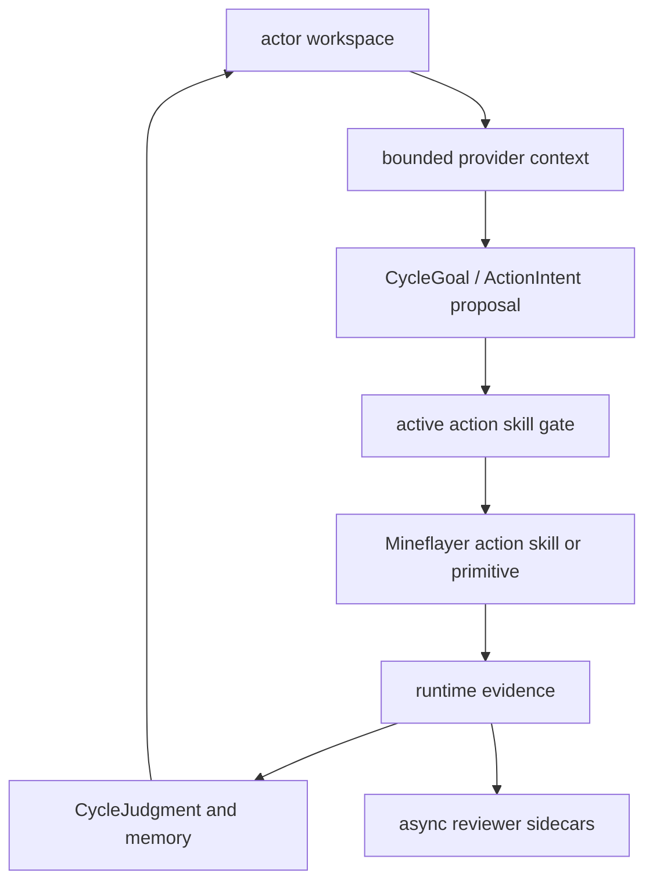

# Overview

**minecraft-llm-agent-community** is a headless Mineflayer runtime for
Soul/LifeGoal-grounded social-cycle experiments, where Minecraft provides live
pressure and evidence.

The project is intentionally small. It tests whether an actor can act from
ActorSoul, LifeGoal, memory, relationship pressure, and world state while
leaving enough runtime evidence to explain the result.

## What It Does

- starts or connects to a local Minecraft server;
- runs Mineflayer actors through a bounded TypeScript loop;
- lets a provider propose one action at a time;
- verifies progress from Minecraft state, not model text;
- writes transcripts, provider inputs, evidence, and review artifacts.

## Core Model

Each actor has a workspace under `data/actors/<actor_id>/`.

That workspace owns the actor's active action skills, candidate repairs, memory,
evidence, provider inputs, reviews, and relationships. Runtime code reads from
that workspace before it allows a primitive to execute.

The hot path stays narrow:

```text
observe -> gate -> execute -> verify -> record
```

Reviewer and repair work runs after the turn from saved artifacts.



The next architecture layer is actor-owned goal continuity: `soul.md`, a
persistent LifeGoal, per-cycle CycleGoal selection, and CycleJudgment artifacts.
It separates "Minecraft evidence passed" from "the actor's social-life judgment
actually controlled the current goal."

The latest live testing showed this separation matters. A 100-cycle home-base
stress test with the OpenAI social-cycle provider reused prior judgment and
memory, collected logs, crafted planks, and placed partial shelter shell blocks,
but did not claim a finished home because the shelter verifier did not pass.
That result belongs in future work, not the long-term spec.


## What It Is Not

This is not a loose generated-code gameplay loop, generic Minecraft benchmark,
race-to-diamond project, or persona-first NPC demo.

The current proof is simpler: complete concrete Minecraft tasks, reject fake
progress, and make failures easy to inspect.

This is not a revival of unverifiable Voyager-style generated-code execution.
Direct generated TypeScript is allowed when it is tied to an objective,
helper-call artifacts, and current-run evidence.

The repo should not treat a model-written JavaScript file, a progress-looking
animation, or an optimistic provider explanation as success. Success belongs to
runtime verification backed by world, inventory, position, container, or
transcript evidence.

## Read Next

- [Soul-Grounded Social Simulation](Specification/Soul-Grounded-Social-Simulation.md)
- [Runtime Evidence And Action Skills](Specification/Runtime-Evidence-And-Action-Skills.md)
- [Engineering Governance And Testing](Specification/Engineering-Governance-And-Testing.md)
- [Reference Adaptation Guide](Specification/Reference-Adaptation-Guide.md)
- [Documentation Map](Documentation-Map.md)
- [Runtime Loop And Verification](Architecture/Runtime-Loop-And-Verification.md)
- [Actor Workspace And Action Skill Memory](Architecture/Actor-Workspace-And-Action-Skill-Memory.md)
- [Soul Life Goal Runtime Architecture](Architecture/Soul-Life-Goal-Runtime-Architecture.md)
- [Composer 2.5 Soul Life Goal Runtime Implementation Plan](Architecture/composer-2.5-Soul-Life-Goal-Runtime-Implementation-Plan.md)
- [Future Works](Architecture/Future-Works.md)
- [Async Reviewer Sidecars](Architecture/Async-Reviewer-Sidecars.md)
- [Social Actor Profiles And Relationships](Architecture/Social-Actor-Profiles-And-Relationships.md)
- [Headless Server Setup](Setup/Headless-Server.md)
- [Provider Setup](Setup/Provider-Setup.md)
- [Architecture Spec](Architecture/SPEC.md)
- [Agent Search Index](Agent-Search-Index.md)
- [Terminology](Terminology.md)
