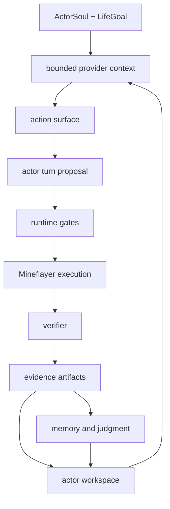

# Architecture

The runtime keeps a narrow loop:

```text
observe -> choose -> gate -> execute -> verify -> record
```

The LLM can choose from visible action options, but the runtime decides whether
the action is valid, whether Mineflayer can execute it, and whether the result
counts as progress.

## Actor Workspace

Each actor has a workspace under `data/actors/<actor_id>/`. It stores the
actor's memory, evidence, action skill ownership, provider inputs, reviews,
relationships, and longer-running work state.

That workspace is the source of truth for what the actor owns and what evidence
survives later context changes.

## Action Surface

The action surface describes what the current actor body can attempt. It is not
a hidden Minecraft planner. A tool or action skill should become unavailable
through typed readiness, permission, schema, retry, or evidence rules rather
than through invisible domain heuristics.

## Action Skills

An action skill is a Minecraft/Mineflayer behavior that the runtime can validate,
execute, verify, and record. Actor-owned action skills can be active,
candidate, retired, or under review, but a generated candidate does not become
runtime authority until its lifecycle promotion succeeds.

## PlanBeads

PlanBeads are actor-owned work-state records for concerns that should survive
context changes. They help preserve "what remains open" without turning that
state into executable authority.

PlanBeads do not supply missing action arguments, grant permissions, prove
physical success, or clear retry constraints.

## Evidence Flow


