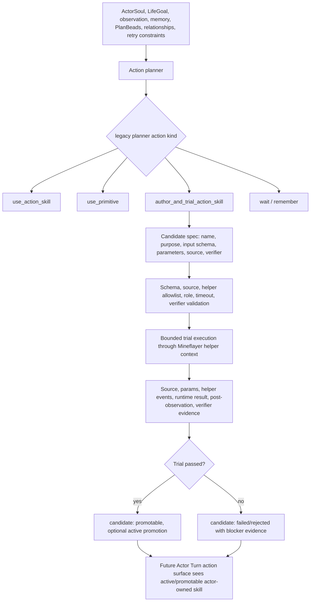

# Action-Selection-Gated Action Skill Authoring Plan

Search token: `ACTION_SELECTION_GATED_ACTION_SKILL_AUTHORING`.

Status: superseded as the outer action-selection architecture; retained as the
generated action-skill candidate, trial, helper allowlist, verifier, and
promotion mechanics plan.

Active outer-selection spec:
`Actor-Turn-Tool-Calling-And-Full-Context-Codegen.md`.

Recorded: 2026-06-01.

Implementation checkpoint: 2026-06-01.

Historical implemented slice:

- The legacy planner action path accepted `author_and_trial_action_skill` and
  schema-bound `parameters` while keeping `args` as a migration alias.
- The action planner provider schema exposes `parameters`, generated candidate
  contracts, and `action_selection_modes`.
- Generated TypeScript runs as `export async function run(ctx, params)`.
- Candidate `input_schema` validates current `parameters` before trial.
- Generated helper calls are limited by `helper_allowlist`, logged as helper
  events, and run through the bounded generated executor.
- The current executor keeps this legacy path behind `executeLegacyPlannerAction`
  while the ordinary Actor Turn path uses `author_mineflayer_action` and
  `ActorTurnResolvedAction`.
- The authoring branch writes candidate proposal, direct-trial source,
  helper-event/tool evidence, and `action_skill_candidate_trial` evidence under
  the actor workspace.
- Passed trials become `generated_lifecycle_status: "promotable"` in the
  candidate proposal, never active promotion.
- Async reviewer proposal creation is gated on an existing
  `action_skill_candidate` input ref, so reviewers cannot originate action
  skills from scratch.

Not yet implemented:

- Full primitive JSON Schema catalog and `parameters_schema_ref` artifacts.
- Active action skill parameter schemas.
- Automatic promotion from `promotable` to `active`.
- Live provider proof that the model chooses this mode in a real Minecraft
  blocker scenario.

## Current Adaptation Rule

Use this document only for the mechanics after action authoring has been
selected: generated candidate shape, input schema, source guard, helper
allowlist, trial evidence, actor-workspace persistence, and later lifecycle
promotion.

Do not use this document's legacy planner action-centered outer planner flow as the active
Actor Turn architecture. The ordinary path is now:

```text
ActorTurnInput
-> strict function tool selection
-> visible Action Card parameters OR author_mineflayer_action rationale
-> ActorTurnResolvedAction / full-context codegen
-> runtime validation, trial, evidence, actor workspace
```

Visible Action Card tool args use logical `parameters`, not
`runtime_parameters`. `author_mineflayer_action` is a logical selection gate and
does not carry generated source or parameters; the internal codegen LLM receives
the full ActorTurnInput, raw outer function call, parsed author args, and
mineflayer codegen agent skill markdown.

## Active Capability Boundary

The active Actor Turn provider must be able to choose a new action-skill
authoring path when no visible Action Card can express the useful bounded
Minecraft behavior. That active choice is the `author_mineflayer_action`
function tool. The outer tool call carries detailed rationale and desired
behavior, not generated source.

This is not a background code-generation loop. Action skill creation starts only
from the action-selection stage. In the active Actor Turn architecture, this is
the `author_mineflayer_action` function tool. In the legacy planner path, the
same mechanics may still appear as an explicit `author_and_trial_action_skill`
legacy planner action for historical compatibility. Other systems may review,
modify, retire, promote, or persist candidates afterward, but the first creation
of a new action skill must be selected by the actor's current
Actor Turn/action-selection context under ActorSoul, LifeGoal, observation,
memory, PlanBeads, relationship context, retry constraints, and runtime
affordances.

The intended effect is more Mineflayer agency, not a narrower scripted planner.
The LLM should be encouraged to generate bounded Mineflayer helper code when the
current situation asks for a new reusable behavior pattern. The runtime must
still make the generated behavior schema-bound, evidence-backed, reviewable,
and actor-owned.

## Harness Insights

The plan adapts workflow patterns from the local harness shelf:

- `gstack` shows that a useful harness exposes explicit workflow choices rather
  than hiding major mode changes in prose. This repo should expose
  `author_mineflayer_action` as a first-class Actor Turn function tool instead
  of smuggling generation through prose, `args`, or a reviewer side effect.
- `gstack` review and spec flows separate decision gates from execution. This
  repo should separate authoring, schema validation, trial execution, promotion,
  and later background review.
- `gstack-game` prototype planning emphasizes the smallest slice that can fail
  informatively. The first implementation should prove one generated candidate
  can clear a real blocker, not build a broad open-ended skill factory.
- `clawhip` and `oh-my-codex` style hook surfaces show the value of typed event
  contracts. Generated action skill authoring should emit provider input,
  provider output, source, schema, helper-event, verifier, and promotion events
  as separate artifacts.
- `ouroboros` and `gstack` both make workflow state durable across contexts. A
  generated candidate should become an actor workspace record immediately, even
  when the current trial fails.
- The harness shelf itself is a reminder not to let background systems become
  hidden authority. Background reviewers can improve or promote a candidate, but
  they must not originate a new action skill outside the action-selection gate.

## Problem Evidence

The 2026-06-01 Gemini social-cycle run showed the current weakness.

The LLM correctly reasoned that `placeCraftingTable` failed because the target
was blocked by `oak_leaves`. It then explained that the actor should move to
coordinates or mine the obstructing leaves. However, the executable legacy planner action
kept emitting empty primitive args:

```json
{
  "kind": "use_primitive",
  "primitive_id": "move_to",
  "args": {}
}
```

The provider had enough context to think about the situation, but the current
planner schema only required `args` to be an object. Runtime args-contract gates
correctly blocked the attempt, but the actor had no first-class path to say:

```text
I need a new bounded behavior: find a replaceable nearby cell and place the
crafting table there. Generate and trial that behavior now.
```

## Historical Core Decision

This mode list documents the legacy planner implementation shape. It is not the
active outer Actor Turn contract.

Legacy action selection became a mode choice:

1. `use_action_skill`: execute an existing active actor-owned action skill.
2. `use_primitive`: execute one direct primitive with schema-valid parameters.
3. `author_and_trial_action_skill`: generate a new schema-bound Mineflayer
   action skill candidate and trial it in the current cycle.
4. `wait` or `remember`: runtime control and continuity actions.

Only mode 3 could create a new action skill in that legacy shape. In the active
Actor Turn shape, only `author_mineflayer_action` can originate a generated
Mineflayer candidate.

Background reviewers, async sidecars, PlanBead operations, legacy generated
skill importers, and offline scripts must not create new action skill candidates
from scratch. They may:

- inspect an existing candidate;
- attach reviews;
- patch candidate metadata through guarded lifecycle operations;
- run another trial;
- reject, retire, supersede, or promote with evidence;
- propose a PlanBead that says a new action skill is needed, without creating
  the action skill itself.

## Historical Target Flow

The flow below documents the legacy planner implementation shape. Translate it
through the active Actor Turn tool-calling spec before applying it to new work.



## Schema-First Legacy Planner Action

Replace weak free-object `args` semantics with schema-bound `parameters`.

This section remains useful for explicit legacy-path maintenance only. Active
Actor Turn Action Card tools already use schema-bound `parameters`; do not
route new provider or codegen context through this legacy planner action object.
Compatibility can keep `args` as a legacy alias during migration, but active
provider inputs, provider outputs, artifacts, tests, and docs should use
`parameters`.

### Primitive Intent

```ts
type UsePrimitiveIntent = {
  schema: "legacy-planner-action/v2";
  kind: "use_primitive";
  primitive_id: RuntimePrimitiveId;
  parameters_schema_ref: string;
  parameters: JsonObject;
  why_this_action: string;
  expected_evidence: string[];
  fallback_if_blocked: string;
};
```

The runtime validates `parameters` against the primitive's JSON Schema before
the intent is persisted. Execution-stage validation stays as a defense-in-depth
gate, but empty physical parameters should fail before Mineflayer execution.

### Action Skill Intent

```ts
type UseActionSkillIntent = {
  schema: "legacy-planner-action/v2";
  kind: "use_action_skill";
  action_skill_id: string;
  parameters_schema_ref?: string;
  parameters: JsonObject;
  why_this_action: string;
  expected_evidence: string[];
  fallback_if_blocked: string;
};
```

An existing action skill can allow empty parameters only if its own active
record declares an empty input schema. Otherwise, runtime validates the
parameters against the action skill input schema.

### Author And Trial Intent

```ts
type AuthorAndTrialActionSkillIntent = {
  schema: "legacy-planner-action/v2";
  kind: "author_and_trial_action_skill";
  candidate: {
    proposed_skill_id: string;
    purpose: string;
    actor_role_scope: string[];
    input_schema: JsonSchemaObject;
    source_language: "typescript";
    source: string;
    helper_api_version: "mineflayer-action-skill-helper/v1";
    helper_allowlist: string[];
    timeout_ms: number;
    verifier: ActionSkillVerifierSpec;
    promotion_policy: "promote_after_passed_trial";
    known_failure_modes: string[];
  };
  parameters: JsonObject;
  why_this_action: string;
  expected_evidence: string[];
  fallback_if_blocked: string;
};
```

The candidate `input_schema` is the source of truth for `parameters`.
`parameters` must validate against it before trial execution.

## Schema Source Of Truth

Use JSON Schema or OpenAPI-style components as the runtime source of truth.
Pydantic is the right conceptual model: typed models generate schemas, validate
input, and make invalid output impossible to ignore. Because this repo is
TypeScript, the implementation should use TypeScript schema modules plus JSON
Schema artifacts rather than adding Python as a runtime dependency.

Required schema surfaces:

- `runtime/parameters/primitiveSchemas.ts`: one schema per primitive.
- `skills/generated/authoringSchemas.ts`: legacy planner action v2 and candidate schemas.
- `skills/generated/helperApiManifest.ts`: helper API manifest exposed to
  generated TypeScript.
- `project-docs/Architecture/Action-Selection-Gated-Action-Skill-Authoring-Plan.md`:
  architecture contract.
- Provider snapshots should store `parameters_schema_ref`, schema version, and
  validation result.

OpenAPI-style components are useful for provider prompts because the model sees
named operation contracts:

```yaml
components:
  schemas:
    MoveToParameters:
      type: object
      required: [targetPosition]
      properties:
        targetPosition:
          $ref: "#/components/schemas/Position"
    AuthorAndTrialActionSkillIntent:
      type: object
      required: [kind, candidate, parameters]
```

## Generated Mineflayer Helper Boundary

Generated source must not receive raw unrestricted Mineflayer authority.

The trial runner should execute:

```ts
export async function run(ctx, params) {
  // generated behavior
}
```

The helper context should expose bounded helper calls first:

- `observe()`;
- `inventoryItems()`;
- `scanNearbyBlocks(query?)`;
- `moveTo(positionOrScoutParams)`;
- `mineBlock(parameters)`;
- `placeBlock(parameters)`;
- `craftItem(parameters)`;
- `craftWithTable(parameters)`;
- `consumeItem(parameters)`;
- `inspectChest(parameters)`;
- `depositShared(parameters)`;
- `say(parameters)`;
- `wait(parameters)`;
- `remember(parameters)`.

Raw `mineflayer(method, args)` may remain available only as an explicitly
manifested helper with a narrow allowlist and helper-event evidence. If it is
too hard to verify safely in the first slice, keep raw Mineflayer calls out and
let generated code compose existing helpers.

Generated source guardrails:

- no imports;
- no filesystem, network, process, eval, Function, Bun, Deno, or child process;
- no unbounded loops;
- bounded timeout;
- helper-event recording for every helper call;
- post-observation after trial;
- verifier evidence before any promotion.

## Actor Workspace Artifacts

Each authoring attempt must write actor-relative artifacts:

- provider input snapshot for Actor Turn/codegen, or legacy action planner when
  explicitly testing that path;
- provider output snapshot with raw generated candidate;
- candidate action skill record;
- candidate input schema artifact;
- generated TypeScript source artifact;
- validated parameters artifact;
- helper event log;
- trial result evidence;
- post-observation evidence;
- verifier decision;
- lifecycle status transition result.

Candidate status should be durable even when the trial fails. A failed generated
candidate is useful evidence for future planning and retry constraints.

## Lifecycle Rules

Initial lifecycle statuses:

- `draft`: generated but not validated;
- `candidate`: validated and trialable;
- `trial_failed`: trial ran but verifier failed or runtime blocked;
- `promotable`: trial passed, promotion policy says human or background review
  may decide;
- `active`: promoted actor-owned action skill;
- `rejected`: invalid, unsafe, unsupported, or repeatedly failed;
- `retired` / `superseded`: existing lifecycle statuses.

The initial implementation stores `trial_failed` and `promotable` as
`generated_lifecycle_status` metadata on the draft candidate proposal, not as
new active action skill record statuses. That keeps the existing promotion path
unchanged while preserving the trial decision for review.

Promotion can be automatic only when all are true:

- the candidate chose `promotion_policy: "promote_after_passed_trial"`;
- the source guard passed;
- parameters schema validation passed;
- role and primitive/helper permissions passed;
- the bounded trial completed without timeout;
- verifier evidence passed;
- at least one current-run world, inventory, position, container, chat, or
  transcript fact changed in the expected direction.

Otherwise, mark `promotable` and let background review or user approval promote
later.

## Historical Provider Input Changes

The legacy action planner input needed to show creation as a valid mode, not an
implicit fallback:

- `action_selection_modes`: active action skill, primitive, author-and-trial,
  wait, remember;
- `primitive_parameter_schemas`: compact schemas for direct primitives;
- `active_action_skill_parameter_schemas`: schemas for existing active skills;
- `authoring_contract`: required candidate fields, helper API, source guard,
  verifier options, promotion policy;
- `recent_authoring_attempts`: failed generated candidates and reasons;
- `runtime_retry_constraints`: exact target and parameter gates;
- `mineflayer_expansion_opportunities`: situations where authoring a candidate
  is appropriate.

Do not expose a giant always-on strategy checklist. In active Actor Turn mode,
the LLM should decide whether authoring is appropriate from the full
`ActorTurnInput`, visible Action Cards, current state, Evidence Trace, Minecraft
Basic Guide, memory, relationships, PlanBeads, and runtime retry constraints.

## Implementation Slices

### Slice 1: Legacy Planner Action V2 And Parameter Schemas

Goal: make primitive parameters schema-bound before execution.

Tasks:

1. Add `parameters` to legacy planner action while keeping `args` as legacy read alias.
2. Add primitive parameter schemas for the existing direct primitives.
3. Validate provider output immediately after parse.
4. Fail provider output or run one repair call when physical parameters are
   empty or invalid.
5. Update provider snapshots and report audit to classify invalid parameters.

Acceptance:

- `move_to` with prose coordinates and empty parameters fails before execution.
- `move_to` with `targetPosition` passes validation.
- `mine_block` requires `blockName` or `targetBlock`.
- Existing deterministic-social tests still pass through compatibility aliases.

### Slice 2: Author-And-Trial Legacy Planner Action Mode

Goal: allow the current action-selection stage to create one new candidate. In
active Actor Turn mode this means `author_mineflayer_action`; in legacy tests it
means `author_and_trial_action_skill`.

Tasks:

1. Extend legacy planner action validator and provider schema with
   `author_and_trial_action_skill`.
2. Add candidate authoring schema.
3. Add provider instructions that authoring is the only creation path.
4. Persist raw candidate and validation result under the actor workspace.
5. Reject background-originated candidate creation unless it references an
   existing action-selection candidate.

Acceptance:

- Provider can emit a candidate with source, input schema, parameters, verifier,
  and promotion policy.
- Invalid source or invalid parameters produce rejected candidate artifacts.
- Async reviewer tests prove reviewers cannot originate a new action skill from
  scratch.

### Slice 3: Mineflayer Helper Trial Runner

Goal: trial generated source with helper events and verifier evidence.

Tasks:

1. Upgrade direct generated executor from `run(ctx)` to `run(ctx, params)`.
2. Bind helper methods to existing social-cycle primitive implementations.
3. Record helper events as actor evidence.
4. Run post-observation and verifier after trial.
5. Store trial result in the existing action skill lifecycle path.

Acceptance:

- A generated candidate can observe, choose a replaceable nearby cell, and place
  a crafting table without hard-coded target args.
- Timeout, source rejection, helper failure, and verifier failure all leave
  diagnosable artifacts.
- Trial success does not count as active action skill promotion unless promotion
  policy and evidence allow it.

### Slice 4: Action Surface And Memory Integration

Goal: make successful candidates usable in later cycles without flooding context.

Tasks:

1. Add candidate and promotable summaries to Actor Turn/action-surface context
   or explicit legacy action planner input.
2. Add active action skill input schemas to action surface records.
3. Add memory writes for generated behavior patterns and failure modes.
4. Add PlanBead operation guidance for blockers that need an authored
   candidate, without letting PlanBeads create the candidate.
5. Keep provider packets compact with bounded recent authoring windows.

Acceptance:

- A promoted generated action skill appears in `direct_action_skills` with an
  input schema.
- Failed candidates appear only as compact recent evidence and do not dominate
  future prompts.
- PlanBeads can track "needs new action skill" as work state but cannot create
  source or executable authority.

### Slice 5: Live Runtime Proof

Goal: prove the design with a real social-cycle run.

Tasks:

1. Build a realistic scenario where `placeCraftingTable` fails from a blocked
   target.
2. Let the LLM choose `author_and_trial_action_skill`.
3. Verify generated helper code finds or creates a valid placement position.
4. Run at least 20 live cycles under provider budget.
5. Audit provider inputs, generated source, helper events, trial evidence,
   verifier result, lifecycle status, and later reuse.

Acceptance:

- The actor uses generated Mineflayer code to make real world progress.
- Empty physical parameters no longer reach execution.
- The report distinguishes trial success, active promotion, and future reuse.
- Provider usage ledger remains under budget and records all live calls.

## Tests

Required focused tests:

- legacy planner action v2 validates primitive parameters by primitive schema.
- Legacy `args` maps to `parameters` during migration and emits a deprecation
  marker in artifacts.
- Action planner rejects empty physical parameters before execution.
- Author-and-trial candidates require input schema, parameters, source,
  timeout, helper API version, verifier, and promotion policy.
- Generated source guard rejects imports, filesystem/network/process access,
  eval, Function, and obvious unbounded loops.
- Trial runner records helper events and post-observation.
- Promotion requires passed current-run verifier evidence.
- Background reviewer cannot create a new candidate unless it modifies or
  reviews an existing action-selection candidate.
- Social-cycle report audit detects candidates with missing source, missing
  schema, invalid parameters, or promotion without trial evidence.

Live tests:

- 2-cycle smoke with deterministic generated fallback.
- 5-cycle provider run with one authored candidate.
- 20-cycle provider run under usage guard after free-tier reset.

## Non-Goals

- Do not revive Voyager-style global generated code libraries.
- Do not let background reviewers originate action skills.
- Do not let PlanBeads create executable source or parameters.
- Do not expose raw unrestricted Mineflayer API to generated code.
- Do not treat generated source text or provider claims as success.
- Do not require Pydantic or Python in the runtime.
- Do not turn crafting-table placement, shelter, mining, or any single domain
  target into the core planner.

## Open Design Questions

- Should a passed trial promote immediately, or default to `promotable` until
  an async reviewer or human approves it?
- Should raw `mineflayer(method,args)` be available in the first generated
  helper API, or should v1 allow only named bounded helpers?
- Should generated source be stored as TypeScript text only, or also compiled
  into a canonical recipe summary for future review?
- Should action skill input schemas be stored inline with active records, or
  by schema refs under a shared schema directory?

Recommended defaults:

- Default passed trials to `promotable`, not `active`, unless the user opts into
  automatic promotion for the run.
- Allow raw `mineflayer(method,args)` only when it is named in the candidate's
  helper allowlist; the helper itself still exposes only a narrow method
  allowlist and logs helper events.
- Store source plus a generated recipe summary.
- Store schemas as actor workspace artifacts with refs from action skill
  records.

## Review Checklist

Before implementation lands, check:

- Is new action skill creation possible only through
  `author_and_trial_action_skill`?
- Does every executable parameter object validate against a schema before
  execution?
- Can artifacts explain source, params, helper calls, verifier, and lifecycle
  decision without rerunning?
- Does generated code make the actor more capable in Minecraft, or only produce
  more planning text?
- Did the implementation preserve Soul/LifeGoal and social context as the
  reason for action selection?
- Can a failed generated candidate teach the next cycle without becoming prompt
  clutter?
