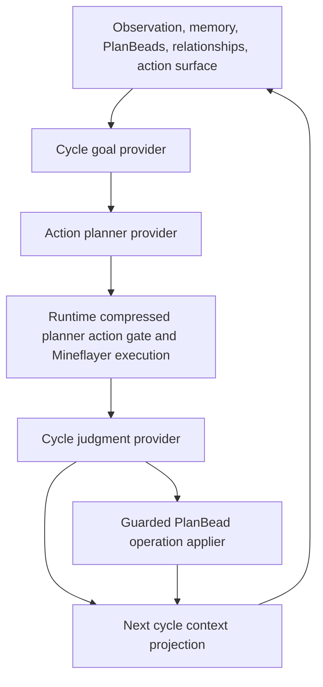
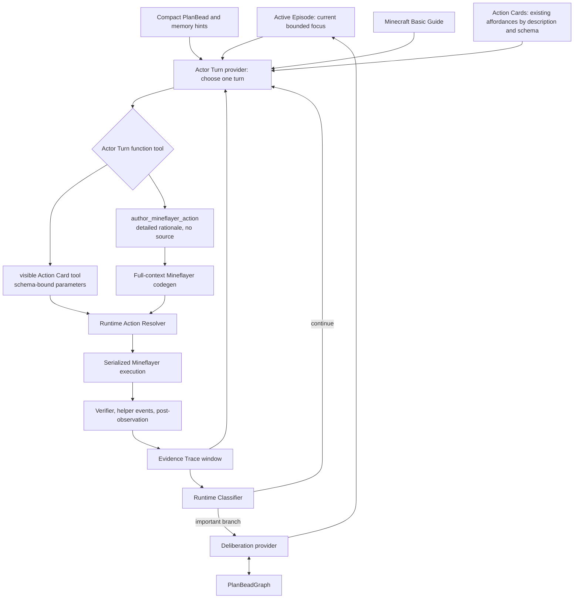

# Actor Episode And Actor Turn Architecture

Search token: `ACTOR_EPISODE_ACTOR_TURN`.

Status: active for Active Episode, evidence trace, passive PlanBeads, and branch
semantics; superseded for outer Actor Turn tool selection by
`Actor-Turn-Tool-Calling-And-Full-Context-Codegen.md`.

Recorded: 2026-06-03 (`Asia/Seoul`).

## Capability And Non-Goals

The runtime should let a low-cost LLM actor act more directly in Minecraft while
keeping long-running work, blockers, and social context coherent across turns.
The target replacement is:

```text
Active Episode
-> Actor Turn provider
-> Runtime Action Resolver
-> Mineflayer execution and verifier evidence
-> Evidence Trace append
-> Runtime Classifier
-> continue Actor Turn or branch to Deliberation
```

This document replaces the per-cycle mental model where separate provider calls
for cycle goal, action planning, and cycle judgment all run on every cycle. It
does not remove runtime evidence, PlanBeads, action skill ownership, or schema
validation. For the ordinary hot path, read `Runtime Action Resolver` as direct
Actor Turn function-tool selection into `ActorTurnResolvedAction`, not as a
compressed planner action bridge. It narrows authority boundaries so the hot path is
simpler and more actionful.

Non-goals:

- no Voyager-style generated-code authority;
- no always-on critic loop that decides Minecraft truth from prose;
- no domain-specific planner for shelter, mining, crafting, storage, or travel;
- no PlanBeads-as-checklist executor;
- no unbounded transcript stuffing;
- no provider pass/fail verdict without runtime evidence refs.

## Harness Lessons Applied

This spec borrows method, not product direction, from the local harness shelf:

- Codexplain: explain capability boundaries before file names.
- clawhip: freeze small versioned contracts with additive compatibility rules.
- Everything Claude Code: separate the stable "why and what" contract from the
  implementation campaign.
- career-ops: define source-of-truth ownership so generated or user-owned state
  cannot be overwritten by an updater.
- local Minecraft agent projects: keep post-action observation in the same turn,
  detect exact-args loops at runtime, serialize actions per bot, and feed
  prioritized events into focus selection without making them executable
  authority.

## Spec Shape

This document is the stable runtime contract. It defines durable capabilities,
authority boundaries, versioned artifacts, evidence requirements, and acceptance
semantics. It should not carry dated command output, temporary live-run
anecdotes, or a file-by-file task list.

| Belongs in this spec | Belongs in the implementation plan or handoff |
|----------------------|-----------------------------------------------|
| `active-episode/v1`, `actor-turn-input/v1`, `actor-turn-output/v1`, Action Card, Evidence Trace, Deliberation, and PlanBead authority rules | Current implementation checkpoint, temporary bridge status, commands, live-run paths, and worker lane status |
| What counts as executable authority, current-state contract, provider repair boundary, and generated Mineflayer authoring gate | Which files were touched in a phase and which focused tests were just run |
| Evidence classifications such as verified mutation, position-only context, container inspection context, and no-progress observation | Specific 30/60-cycle run results and their review notes |
| Compatibility and cleanup invariants for old `cycle-judgment/v1` and `actor-cycle-goal/v1` artifacts | Cleanup order for removed hot-path calls |

## As-Is Social-Cycle Architecture



This structure made the runtime easy to inspect, but long live runs exposed weak
behavior:

- three provider calls fragmented responsibility;
- per-cycle goal selection made the actor cautious and repetitive;
- `move_to` could make a whole run look meaningful even when inventory,
  crafting, storage, and social state did not advance;
- PlanBead closure could be over-eager when generic runtime success was treated
  as satisfaction of a specific concern;
- prompt guardrails were already dense, so adding more prose was unlikely to
  fix the loop.

## Target Runtime Flow



The hot path is intentionally short. The Actor Turn provider should usually get
one provider call per turn, choose one action, and let the runtime validate,
execute, verify, and append evidence.

An initial Deliberation or cycle-goal call may open the first Active Episode.
After that, ordinary Actor Turn cycles should reuse the same Active Episode. A
new Deliberation call is justified only when a typed branch condition is
recorded.

## State And Authority Boundaries

| Surface | Owns | Must not do |
|---------|------|-------------|
| Active Episode | Current bounded focus, selected concern refs, success signals, pivot triggers, mistake budget, social pressure | Execute actions, close PlanBeads by itself, prove physical progress |
| Actor Turn provider | One turn proposal from episode, evidence, current observation, action cards, and guide context | Decide runtime success, bypass schemas, choose by primitive-vs-action-skill taxonomy |
| Action Card | Provider-visible affordance description plus parameter contract for currently plausible choices | Become a strategy checklist, expose hidden authority, or invite choices that `current_state` clearly cannot satisfy |
| Runtime Action Resolver | Map cards to primitives or actor-owned action skills, validate parameters, enforce retry constraints, trial generated candidates | Infer missing physical args from prose, parse LLM-facing text as policy, or hide cards through Minecraft domain heuristics |
| Mineflayer execution boundary | Run one serialized action boundary for one bot, with timeout and cancellation | Batch unrelated turn actions outside an action skill |
| Evidence Trace | Append runtime facts, refs, post-observations, verifier output, and helper events | Store provider narration as proof |
| Runtime Classifier | Decide continue, close, defer, or branch based on evidence and thresholds | Invent new PlanBeads or executable actions |
| Deliberation provider | Reframe Active Episode and propose guarded PlanBead operations only when branch rules fire | Run every turn, choose an action, generate Mineflayer code |
| PlanBeadGraph | Durable actor-owned work graph, dependencies, blockers, ready front | Supply runtime action parameters, grant permissions, mark physical success without evidence |

Deliberation output is intentionally narrower than Actor Turn output. It can
write a new `active-episode/v1` and raw PlanBead operation proposals for the
guarded applier. It must not emit planner actions, `ActionCard`, `primitive_id`,
`action_skill_id`, generated source, helper configuration, `args`, or
executable parameters.

## Source Of Truth Map

| Record | Source of truth | Writer | Reader |
|--------|-----------------|--------|--------|
| `active-episode/v1` | actor workspace `goals/episodes/*` | Active Episode builder or branch-time Deliberation | Actor Turn provider, compatibility CycleGoal writer, report/audit |
| `actor-turn-input/v1` | provider input snapshots | Actor Turn input builder | provider, run review, token/budget audit |
| `actor-turn-output/v1` | provider output snapshots | Actor Turn provider parser | Runtime Action Resolver, run review |
| Action Card projection | runtime action surface projection | runtime, from primitives and actor-owned action skills | Actor Turn provider, Runtime Action Resolver |
| `evidence-trace/v1` | actor workspace evidence/review records | runtime execution/classifier | next Actor Turn, episode review |
| PlanBeadGraph | actor workspace `plan-beads/*` | guarded PlanBead applier only | ready-front builder, Deliberation, Actor Turn compact hints |
| `plan-bead-operation-result/v1` | actor workspace `plan-beads/events/operation-results/*` | guarded PlanBead applier | report/audit, ready-front review |
| settlement state | social-cycle context assembly | runtime settlement consolidator | Actor Turn current state, report/audit |
| provider usage | provider usage ledger/report summary | provider wrappers and budget guard | live-gate review, budget guard |

If a record appears in multiple reports, the actor workspace artifact remains
the authority and report fields are refs or summaries. Provider prose never
overrides runtime artifacts.

## Versioned Artifact Contracts

The first implementation should introduce or losslessly map these contracts.
Field names are intentionally stable enough for tests and reports, but the
implementation may store them in existing actor-workspace layouts during
migration.

Contract stability policy:

- `schema` names are compatibility anchors. Add fields when needed, but do not
  silently rename required fields.
- Optional fields must have a documented default or a documented absence
  meaning.
- Provider-facing contracts must stay compact enough for low-cost models:
  bounded Action Cards, bounded Evidence Trace, bounded PlanBead hints, and
  refs instead of unbounded history.
- Runtime-owned contracts may reject provider output before Mineflayer
  execution. A rejection is not a provider crash; it is a repair signal with an
  evidence artifact.
- Deprecation must preserve old report readability through compatibility
  records until the migration doc explicitly removes that compatibility path.

### `active-episode/v1`

```ts
type ActiveEpisodeV1 = {
  schema: "active-episode/v1";
  episode_id: string;
  actor_id: string;
  actors_visible_or_relevant: string[];
  life_goal_ref: string;
  purpose: string;
  current_focus: string;
  selected_plan_bead_refs: string[];
  related_plan_bead_refs: string[];
  success_signals: EvidenceExpectation[];
  pivot_triggers: PivotTrigger[];
  mistake_budget: {
    allow_exploration_turns: number;
    observe_repeat_limit: number;
    exact_blocker_repeat_limit: number;
  };
  social_pressure: SocialPressureSummary[];
  opened_from_refs: string[];
  started_at_turn_ref?: string;
  status: "active" | "closing" | "deferred" | "blocked" | "completed";
};
```

Active Episode is not a second PlanBeadGraph. It is the current working window
over durable actor state.

### `action-card/v1`

```ts
type ActionCardV1 = {
  schema: "action-card/v1";
  action_card_id: string;
  title: string;
  description: string;
  parameters_schema_ref: string;
  eligibility_contract_ref: string;
  parameter_hints: string[];
  current_state_requirements: string[];
  expected_evidence: string[];
  likely_blockers: string[];
  readiness: "ready" | "risky" | "requires_current_state_check";
  runtime_mapping_ref: string;
};
```

The provider chooses the card by what it does and what parameters it needs. The
provider should not have to care whether the runtime mapping is a primitive,
seed action skill, actor-owned action skill, or promoted generated action skill.
`current_state_requirements` describe the card's runtime contract; they are not
prompt decoration, and they are not the enforcement mechanism by themselves. If
a cheap model chooses a `requires_current_state_check` card while the current
state clearly lacks the required inventory, world, social, or parameter
condition, the runtime must reject that choice before Mineflayer execution and
feed the blocker back as a repair constraint.

The enforceable contract must be structured. Do not implement those checks by
searching `current_state_requirements` strings, Action Card descriptions,
Minecraft Basic Guide text, memory, PlanBeads, or rationale with `includes`,
regexes, keyword lists, or other prose heuristics. Use typed
readiness/eligibility records, schemas/enums, structured current-state fields,
permission gates, retry constraints, and evidence refs. The prose fields explain
the card to the provider and reviewers; they do not decide visibility,
eligibility, executable arguments, permissions, retry clearance, generated-source
authority, or success.

The runtime must also not become a hidden Minecraft planner by filtering cards
through hardcoded item-family, station-family, construction-readiness,
survival-priority, shelter-first, or single-domain strategy heuristics. Within a
selected visible tool/action, the LLM keeps decision freedom with full context
and schema-bound logical parameters. Runtime authority starts at explicit
validation and evidence, not secret domain planning.

### `actor-turn-input/v1`

```ts
type ActorTurnInputV1 = {
  schema: "actor-turn-input/v1";
  turn_id: string;
  active_episode: ActiveEpisodeV1;
  actor_context: ActorSoulAndLifeGoalProjection;
  current_observation_refs: string[];
  current_state: ActorTurnCurrentStateV1;
  recent_evidence_trace: EvidenceTraceEntryV1[];
  compact_plan_bead_hints: PlanBeadHintV1[];
  memory_refs: string[];
  relationship_context: RelationshipContextProjection;
  runtime_retry_constraints: RuntimeRetryConstraintSummary[];
  action_cards: ActionCardV1[];
  minecraft_basic_guide: MinecraftBasicGuideProjection;
  provider_budget_hint: ProviderBudgetHint;
};
```

The input should be compact enough for cheap models. It should still preserve
the evidence refs needed to audit claims.

### `plan-bead-hint/v1`

```ts
type PlanBeadHintV1 = {
  bead_id: string;
  title: string;
  status: "open" | "in_progress" | "blocked" | "deferred" | "closed";
  priority: 0 | 1 | 2 | 3 | 4;
  why_it_matters: string;
  next_hints: string[];
  blockers: string[];
  acceptance_evidence_required: string[];
  evidence_refs: string[];
  dependency_refs: string[];
  checkpoint_ref: string;
};
```

`compact_plan_bead_hints` are a lossy read-only projection from the
PlanBeadGraph. They must preserve the parts a cheap model needs to avoid
forgetting durable work: priority, what remains open, blockers, dependency refs,
checkpoint ref, and acceptance evidence. They must not expose executable args,
primitive ids, action-skill ids, or physical success claims.

### `actor-turn-current-state/v1`

```ts
type ActorTurnCurrentStateV1 = {
  schema: "actor-turn-current-state/v1";
  observer_id: string;
  position?: { x: number; y: number; z: number };
  inventory_counts: Record<string, number>;
  vitals?: {
    health?: number;
    food?: number;
    held_item?: { name: string; count?: number };
    food_candidates: Array<{ name: string; count: number }>;
  };
  visible_actors: Array<{ id: string; distance?: number; busy?: boolean }>;
  nearby_block_observations: Array<{
    name: string;
    position?: { x: number; y: number; z: number };
    distance?: number;
    source: "world_scan_nearest" | "observation_nearby_block";
    evidence_refs: string[];
  }>;
  world_scan?: {
    scan_id: string;
    scan_ref?: string;
    center?: { x: number; y: number; z: number };
    radius?: number;
    vertical_range?: { min_y: number; max_y: number; center_y: number };
    coverage_scope: string;
    absence_claims_exhaustive: boolean;
    total_verified_blocks: number;
    truncated: boolean;
    retained_block_counts: Array<{ name: string; count: number }>;
    nearest_blocks: Array<{
      name: string;
      position: { x: number; y: number; z: number };
      distance: number;
    }>;
    named_block_examples: Array<{
      name: string;
      count: number;
      nearest: Array<{ position: { x: number; y: number; z: number }; distance: number }>;
    }>;
    limitations: string[];
  };
  shared_storage: {
    status: string;
    chest_id?: string;
    items: Array<{ name: string; count: number }>;
    evidence_refs: string[];
  };
  settlement_progress: {
    inventory_counts: Record<string, number>;
    shared_storage_status: string;
    known_positions: {
      actor?: { position: { x: number; y: number; z: number }; evidence_refs: string[] };
      crafting_table?: {
        status: string;
        position?: { x: number; y: number; z: number };
        distance_from_actor?: number;
        usable_now?: boolean;
        evidence_refs: string[];
      };
      shared_chest?: { status: string; evidence_refs: string[] };
      shelter?: { status: string; anchor?: { x: number; y: number; z: number }; evidence_refs: string[] };
    };
    checklist: Array<{
      id: string;
      status: string;
      reason: string;
      evidence_ref_count: number;
    }>;
    recent_blockers: Array<{ key: string; count: number; example?: string }>;
  };
};
```

This projection is the cheap-model state surface. It prevents the Actor Turn
provider from reasoning only from old episode wording or opaque evidence refs.
It is still context, not proof; verifier and runtime artifacts decide what
changed.

### `actor-turn-source-evidence-bundle/v1`

`current_state` is not the only context surface. Actor Turn also receives a
bounded source-evidence bundle so compact facts do not erase the raw evidence
needed for interpretation.

```ts
type ActorTurnSourceEvidenceBundleV1 = {
  schema: "actor-turn-source-evidence-bundle/v1";
  observation: {
    observation_refs: string[];
    position?: { x: number; y: number; z: number };
    inventory_items: Array<{ name: string; count: number }>;
    visible_actors: Array<{ id: string; distance?: number; busy?: boolean }>;
    nearby_blocks: ActorTurnCurrentStateV1["nearby_block_observations"];
    world_scan?: ActorTurnCurrentStateV1["world_scan"];
  };
  world_event_cards: Array<{
    event_id: string;
    kind: string;
    authority: string;
    summary: string;
    actor_refs: string[];
    evidence_refs: string[];
    created_at: string;
  }>;
  memory_cards: Array<{
    memory_id: string;
    kind: string;
    layer: string;
    confidence: string;
    summary: string;
    evidence_refs: string[];
    reason: string;
  }>;
  recent_action_details: Array<{
    turn_id: string;
    outcome: EvidenceTraceOutcome;
    compact_summary: string;
    selected_action?: { kind: string; id: string; title: string };
    parameters?: Record<string, unknown>;
    tool_statuses?: Array<{ tool: string; status: string }>;
    blocker_reason?: string;
    evidence_refs: string[];
  }>;
  plan_bead_cards: PlanBeadHintV1[];
};
```

Use `Context-Projection-And-Source-Evidence.md` for the compression rule:
bounded facts may be compacted, but observation, action, social, and work-state
summaries must travel with source evidence cards or refs.

### `actor-turn-output/v1`

The active Actor Turn output is a parsed function-tool selection. Existing
Action Card tools carry logical `parameters`. `author_mineflayer_action` carries
the outer model's detailed judgment and starts a separate full-context codegen
call; it does not contain TypeScript source.

```ts
type ActorTurnOutputV1 =
  | {
      schema: "actor-turn-output/v1";
      choice: "action_card";
      action_card_id: string;
      parameters: JsonObject;
      situation_assessment: string;
      why_this_tool: string;
      success_evidence: string[];
      failure_handling: string;
    }
  | {
      schema: "actor-turn-output/v1";
      choice: "author_mineflayer_action";
      situation_assessment: string;
      why_codegen_is_needed: string;
      desired_minecraft_behavior: string;
      existing_tools_considered: Array<{
        action_card_id: string;
        title: string;
        why_not_enough: string;
      }>;
      success_evidence: string[];
      failure_handling: string;
    };
```

The internal codegen provider then returns generated source, input schema,
runtime parameters, helper allowlist, timeout, verifier, failure modes, and
promotion policy as a generated action skill candidate. That is a second
provider boundary, not part of the outer Actor Turn tool call.

### `evidence-trace/v1`

```ts
type EvidenceTraceEntryV1 = {
  schema: "evidence-trace/v1";
  turn_id: string;
  episode_id: string;
  action_ref: string;
  runtime_gate_ref: string;
  execution_ref?: string;
  verifier_ref?: string;
  post_observation_ref?: string;
  provider_usage_ref?: string;
  outcome:
    | "verified_mutation"
    | "partial_verified_progress"
    | "blocked"
    | "rejected_by_contract"
    | "timed_out"
    | "no_progress"
    | "environment_blocked";
  compact_summary: string;
};
```

Post-action observation belongs in the same turn evidence when possible. The
next Actor Turn should not need to waste a full observe just to learn whether
the previous action changed inventory, position, blocks, containers, or chat.

### `deliberation-branch/v1`

```ts
type DeliberationBranchV1 = {
  schema: "deliberation-branch/v1";
  branch_id: string;
  reason:
    | "episode_success"
    | "episode_blocked"
    | "repeated_exact_blocker"
    | "new_social_pressure"
    | "danger_or_survival_pressure"
    | "missing_affordance"
    | "context_change"
    | "budget_or_compaction_pressure"
    | "user_or_world_event";
  evidence_refs: string[];
  current_episode_ref: string;
};
```

Deliberation may write a new `active-episode/v1` record and propose PlanBead
operations. The guarded PlanBead applier still owns acceptance or rejection of
those operations.

## Only-On-Branch Deliberation Rules

Deliberation is expensive and should not run every turn. It runs when one of
these branch conditions is met:

- Active Episode success signals are satisfied by runtime evidence.
- The same exact target plus structured args hit a repeated blocker.
- The actor needs a materially different focus after failed attempts.
- A new social pressure, request, obligation, chat event, visible actor, or
  shared-storage event should change priorities.
- The current action surface lacks a useful affordance and generated action
  skill authoring may be justified.
- Context compaction is due and would otherwise erase the reason for current
  work.
- Provider budget or quota requires downgrade, early stop, or scenario shrink.
- Environment setup, reconnect, server state, or platform issues invalidate
  stale action assumptions.

Deliberation must not run only because a cycle ended.
In current reports, a repeated cycle-goal provider input without a matching
`deliberation-branch/v1` artifact is evidence that the actor_turn hot path has
regressed toward the old per-cycle provider loop.

Scenario examples:

- Given an Active Episode is trying to repair crafting-table access and
  `current_state.inventory_counts` is empty, when Actor Turn chooses a
  `placeCraftingTable` card that requires `inventory has crafting_table`, then
  Runtime Action Resolver rejects the choice before `place_block`, records the
  rejection as a repair constraint, and the provider must choose a prerequisite
  action such as gathering logs or crafting planks/table.
- Given concern A is selected and a new social request B appears, when
  Deliberation branches, then the next Active Episode preserves A as selected,
  related, blocked, or deferred while linking B; no PlanBead is closed unless a
  guarded operation result cites matching evidence.
- Given Deliberation proposes a free-form PlanBead hint, when the guarded
  applier receives it, then only a schema-valid, evidence-linked
  `plan-bead-operation/v1` may mutate the actor-owned PlanBeadGraph. Malformed
  proposals become rejected operation-result artifacts, not hidden state
  changes.
- Given Deliberation proposes a branch-only generic PlanBead such as
  `Branch concern <branch_id>`, when parsing or applying operations, then the
  proposal is dropped or rejected and must not pollute the ready front.
- Given two open PlanBeads have the same durable title and description, when a
  new create operation repeats that concern, then the guarded applier rejects
  the duplicate and writes an operation-result artifact.
- Given an action skill requires `inventory has planks >= 4`, when current state
  has only two planks, then Runtime Action Resolver rejects the Action Card
  before Mineflayer execution and feeds the exact requirement back as a repair
  constraint.
- Given an Action Card has prose `current_state_requirements`, when the runtime
  decides visibility or rejection, then the decision is based on structured
  readiness/eligibility state, schemas/enums, gates, retry constraints, or
  evidence refs, not string includes, regexes, or Minecraft keyword heuristics.
- Given `craft_item` is selected for `stick`, `oak_planks`, or
  `crafting_table`, when current inventory lacks the exact inventory-grid
  ingredients, then Runtime Action Resolver rejects it before Mineflayer and
  Actor Turn input should either hide `Craft Item` or show the exact missing
  recipe ingredients.
- Given direct `say` is available and the social context justifies a message,
  when no target actor is visible in a single-bot run, then targetless `Say`
  may fall back to world chat and must record `targetId=world_chat` as truthful
  chat evidence.
- Given `deposit_shared` succeeds and `inspect_chest` later verifies the chest
  contents, when settlement state is rebuilt, then `shared_storage` and
  `known_positions.shared_chest` both carry the chest id, status, and evidence
  refs.
- Given a run has no visible actors, chat, relationship events, requests, or
  obligations, when review classifies behavior, then it may count as bounded
  single-actor settlement competence but must not be accepted as a social
  simulation proof.

## Cleanup From The Old Social Cycle

| Old surface | Current surface | Cleanup rule |
|----------------|----------------|----------------|
| `goal_mind` provider | Deliberation provider | Run only on branch conditions, not every turn |
| `CycleGoal` | Field inside Active Episode and Actor Turn context | Keep compatibility records while the new episode contract lands |
| `action_planner` provider | Actor Turn provider | Collapse action choice into one visible Action Card function tool or `author_mineflayer_action` |
| `use_primitive` vs `use_action_skill` provider choice | Runtime Action Resolver mapping | Provider chooses Action Card, runtime chooses primitive or action skill mapping |
| Old author-and-trial planner mode | `author_mineflayer_action` provider choice plus full-context codegen/trial | Keep candidate validation, source guard, trial, verifier, and promotion mechanics as implementation authority |
| `CycleJudgment` every cycle | Runtime Classifier plus optional boundary review | Runtime computes ordinary turn outcome; provider review is reserved for branch or learning-worthy events |
| StrategicGoal live accumulation | PlanBeadGraph plus compact episode hints | Do not create another persistent middle layer |
| Social-cycle report pass | Episode review summary | Pass/fail must cite episode-specific evidence, not generic movement |

## PlanBeads In The Target Architecture

PlanBeads are not removed. They move behind the hot path:

```text
PlanBeadGraph
-> Deliberation branch context
-> Active Episode selected/related bead refs
-> compact hints for Actor Turn
-> guarded operation results on branch-time mutation
```

The Actor Turn provider should see enough PlanBead context to avoid forgetting
open work, but not the whole graph as a checklist. Closing or satisfying a
PlanBead requires evidence that matches the bead's closure criteria. A
successful `move_to` does not satisfy a wood/log blocker unless the bead's
accepted evidence specifically allowed travel as the resolution.

Observable PlanBead presence in Actor Turn mode is this artifact chain:

```text
actor workspace plan-beads/*
-> plan_bead_ready_fronts[] in the report
-> cycle.plan_bead_packet_ref
-> provider input compact_plan_bead_hints
-> plan_bead_graph_summary.last_ready_front_ref
```

An ordinary Actor Turn may have `bead_op_proposals: []`. That is not evidence
that PlanBeads disappeared. It means the actor continued the current episode
without a justified branch-time work-graph mutation. Mutation authority in the
Actor Turn path belongs to branch-time Deliberation plus the guarded PlanBead
applier.

However, an empty graph for an entire long run is still a behavior gap. If a
report has ready-front snapshots every cycle but zero selected bead refs, zero
operation results, and empty `compact_plan_bead_hints`, reviewers should record
"PlanBeads wired but not substantively used" rather than treating packet
presence as planning continuity.

Deliberation may emit either valid `plan-bead-operation/v1` objects or looser
work-state proposals. The runtime may adapt looser branch-time proposals into
evidence-linked `create` operations, but it must not invent status closure,
dependencies, executable parameters, or action authority from them.

## Acceptance Criteria

Architecture acceptance requires:

- Actor Turn input exposes Action Cards instead of making the provider choose
  primitive-vs-action-skill categories.
- Actor Turn output has exactly one function-tool choice: one visible Action
  Card tool with schema-bound `parameters`, or `author_mineflayer_action`.
- Tool calling plus strict schemas/enums enforce Actor Turn flow. LLM-facing
  prose is never parsed as hidden policy for tool visibility, eligibility,
  executable args, permissions, retry, source authority, or success.
- Action Cards are not hidden by hardcoded Minecraft domain heuristics. Hiding
  or rejection is traceable to typed readiness/eligibility, structured state,
  schemas, permission gates, retry constraints, or evidence.
- Generic Mineflayer program runners such as `run_mineflayer_program` and the
  seed `runBoundedMineflayerProgram` are not exposed as ordinary existing
  Action Cards for fresh source. New generated source must use
  `author_mineflayer_action`; already promoted actor-owned action skills may be
  exposed by their specific behavior description.
- Ordinary turns require one provider planning call, unless a live provider
  fallback or repair path is explicitly recorded.
- `requires_current_state_check` Action Cards are rejected before Mineflayer
  execution when their current-state requirements are clearly false.
- Enforceable eligibility/readiness contracts associated with
  `current_state_requirements` include exact recipe counts when the recipe
  requires them; "has planks" is not enough for a crafting table or pickaxe
  recipe.
- Table-bound recipes such as `wooden_pickaxe` must not pass through the
  inventory-grid `craft_item` card even when current inventory has enough
  planks and sticks; they require a table-bound action path or a contract
  rejection that repairs toward one.
- Inventory-grid recipes such as planks, sticks, and `crafting_table` must also
  enforce exact ingredients before execution. A generic "inventory has items"
  check is not enough to expose or execute `Craft Item`.
- Direct `say` may be exposed when social context justifies communication. If
  no target actor is visible, targetless `Say` must use the explicit world-chat
  fallback contract and record `targetId=world_chat`; it must not pretend a
  hidden actor target was reached.
- Deliberation does not run on every turn.
- Evidence Trace entries cite runtime artifacts and never treat provider prose,
  memory notes, `wait`, observe-only records, or movement-only `position_delta`
  as durable physical success.
- `inspect_chest` may verify container access and update known state, but the
  inspection itself is not durable social-cycle progress unless a later action
  uses that state for inventory, shared-storage, relationship, or other
  episode-relevant mutation.
- After observe produces `no_progress` while `current_state` already has a world
  scan, the next Actor Turn must use that state for action or justified movement
  instead of repeating observe.
- After shared storage has been inspected and no container-changing event occurs,
  repeated chest inspection is context reuse failure, not new progress.
- Malformed `author_mineflayer_action` fields should become repairable contract
  feedback when enough structure exists to identify the intended choice; they
  should not silently execute or silently fail the run before repair.
- Active Episode selection cites the ready/in-progress PlanBeads that anchor the
  current concern when such beads exist; these refs are audit anchors, not
  executable authority.
- Episode pass/fail cites episode-specific evidence refs.
- Exact repeated blockers become runtime retry constraints before a third
  equivalent Mineflayer attempt.
- PlanBead satisfaction requires evidence matching the bead concern.
- Branch-time PlanBead proposals either become accepted/rejected guarded
  operation-result artifacts or remain non-mutating provider output.
- Generic branch-only PlanBead creates and duplicate open creates are rejected
  or dropped before they can dominate the ready front.
- Actor Turn mode records PlanBead ready-front/context artifacts every cycle;
  empty `compact_plan_bead_hints` is interpreted as "no current graph hints",
  not as PlanBeads removal.
- Actor Turn `compact_plan_bead_hints` preserve priority, next hints, blockers,
  dependency refs, checkpoint ref, and evidence refs.
- Settlement state consolidates shared chest inspect/deposit evidence into both
  `shared_storage` and `known_positions.shared_chest`.
- Branch-time Deliberation carries current Active Episode fields forward when a
  cheap provider emits a sparse `next_episode`, without accepting executable
  authority from Deliberation.
- Generated Mineflayer code remains schema-bound, helper-limited, trialed, and
  actor-workspace owned before any promotion.

The live-run exit criteria for this architecture are defined in
`Actor-Episode-And-Actor-Turn-Implementation-Plan.md`.
