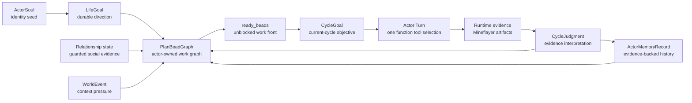

# Actor Persistent State And PlanBeads

Search token: `ACTOR_PERSISTENT_STATE_PLAN_BEADS`.

Status: active architecture plan for restart-safe actor work graphs, PlanBeads,
and social-cycle continuity.

Recorded: 2026-05-31 10:11:10 UTC (`Etc/UTC`).

Implementation campaign spec:
`project-docs/Architecture/PlanBeads-Implementation-Campaign.md`.

This document records the current plan after reviewing the upstream Beads issue
tracker concept (`steveyegge/beads`, redirected publicly as `gastownhall/beads`).
The important correction is that a PlanBead should not be treated as a vague
"planning memory" blob. In Beads, the durable unit is an issue-like work item,
and the plan emerges from issue fields, dependency edges, status, notes, and the
ready front.

The Minecraft adaptation is:

```text
ActorSoul + LifeGoal
-> actor-owned PlanBeadGraph
-> ready PlanBeads
-> Active Episode selected/related refs
-> Actor Turn compact hints
-> Actor Turn function-tool selection
-> runtime action, generated-action trial, and evidence
-> branch-time Deliberation when needed
-> guarded PlanBead updates
```

PlanBeads are Beads-inspired, not Beads CLI integration. The game runtime does
not require `bd`, `br`, `beads-mcp`, `.beads`, or downloaded Beads binaries.
Actor PlanBeads are repo-owned TypeScript/JSON records in each actor workspace.
External task tools may still help implementation campaigns, but they must stay
separate from NPC runtime state.

## Beads Reference Lessons

Mechanically, Beads teaches these ideas:

- each bead is a durable issue/work item, not the whole plan;
- issue fields preserve resumable context: title, description, design,
  acceptance criteria, notes, status, priority, labels, metadata, and owner;
- dependency edges define ordering and blocking;
- `ready` is computed from open work with no active blockers;
- epics/molecules are work graphs, and children are parallel unless dependencies
  create sequence;
- gates bridge external conditions into the work graph;
- memories are separate from issues;
- the database is the source of truth, while JSON export is an interchange view;
- compaction summarizes old closed issues, but active work remains resumable.

Adapted to this repo:

- PlanBeads are actor-owned issue-like work items under a LifeGoal.
- The PlanBeadGraph is the actor's living work graph, not a hidden domain
  strategy.
- `ready_beads` are unblocked concerns that may justify the next Active Episode
  focus, CycleGoal compatibility record, or compact Actor Turn hint.
- PlanBead closure requires runtime evidence, guarded relationship evidence, or
  a truthful non-physical resolution.
- Ordinary memory remains recall/context; it does not own active work state.
- The actor workspace is the source of truth for PlanBead records, dependency
  edges, events, and history.

## Core Definition

A **PlanBead** is one actor-owned issue-like work item for a concern that may
span more than one cycle.

Examples:

- "Secure a reliable food path before taking on more settlement work."
- "Repair the repeated blocker around unreachable logs."
- "Fulfill a teammate obligation without draining private survival resources."
- "Investigate why shared chest deposits are not verified."
- "Prepare enough materials for shelter work requested by the settlement."

A **PlanBeadGraph** is the actor-owned dependency graph of PlanBeads. The graph,
not any single PlanBead, is the actor's current multi-cycle plan.

A **ready PlanBead** is an open PlanBead that is not blocked by another open
blocking dependency, not deferred, and still relevant under current LifeGoal,
observation, action surface, and evidence.

Active Episode / Deliberation may select from ready PlanBeads, but Actor Turn may
also choose an urgent current-state action when the world demands it. PlanBeads
guide continuity; they do not force every cycle through a checklist.

## What A PlanBead Answers

A PlanBead answers:

- what work item or concern is being tracked?
- why does it matter under the actor's LifeGoal?
- what evidence would let the runtime close it, block it, or defer it?
- what is currently known, completed, in progress, blocked, or next?
- which dependencies must clear before this bead is ready?
- which runtime artifacts, memories, relationships, world events, judgments, or
  other PlanBeads explain its current state?

A PlanBead does not answer:

- what primitive should execute now;
- which action skills are permitted;
- whether physical Minecraft progress happened;
- whether a runtime retry constraint should be created or cleared;
- what the actor's durable identity or LifeGoal is.

Satisfied closure is intentionally stricter than ordinary updates. The LLM may
freely create, defer, block, link, and update PlanBeads as context changes, but
`closed` with `close_kind: "satisfied"` must cite runtime evidence, guarded
relationship evidence, or settlement evidence. Provider prose, memory notes, and
judgment text alone can explain a proposed transition; they cannot prove that a
tracked concern is satisfied.

## Separation Of Records

| Record | Owns | Must not own |
|--------|------|--------------|
| `ActorSoul` | identity seed, durable values, role frame | satisfiable task progress |
| `ActorLifeGoal` | long-running social-life direction | current Minecraft action |
| `PlanBead` | one durable issue-like work item under LifeGoal | executable args, permissions, or physical proof |
| `PlanBeadDependency` | ordering, blocking, and provenance edges between PlanBeads | runtime truth or broad domain strategy |
| `PlanBeadGraph` | actor-owned ready/blocked work graph | hidden deterministic planner |
| `ActorCycleGoal` | bounded current-cycle objective | whole multi-cycle work graph |
| Actor Turn tool selection | one visible Action Card or `author_mineflayer_action` function call | missing args hidden in prose |
| runtime action/trial | validated execution unit or generated-action trial | provider narration or unchecked source |
| `CycleJudgment` | evidence-backed interpretation and bead-op proposals | unverified success |
| `ActorMemoryRecord` | historical evidence-linked recall | active work source of truth |
| runtime evidence | observed game/runtime facts | provider intention |

`StrategicGoal` is a archived-adjacent medium-horizon interpretation. New
restart-safe multi-cycle work should become PlanBeads and PlanBead dependencies,
not a second persistent middle layer.

## Target State Model



## PlanBead Record Shape

PlanBeads should be first-class checkpoint records. They may be indexed or
mirrored into memory for retrieval, but the PlanBead store owns active state.

```ts
type PlanBeadStatus =
  | "open"
  | "in_progress"
  | "blocked"
  | "deferred"
  | "closed";

type PlanBeadCloseKind =
  | "satisfied"
  | "abandoned"
  | "superseded"
  | "duplicate"
  | "not_relevant";

type PlanBeadKind =
  | "concern"
  | "obligation"
  | "blocker_repair"
  | "investigation"
  | "resource_project"
  | "relationship_repair"
  | "action_skill_followup";

type ActorPlanBead = {
  schema: "actor-plan-bead/v1";
  bead_id: string;
  actor_id: string;
  life_goal_id: string;
  run_id?: string;
  kind: PlanBeadKind;
  status: PlanBeadStatus;
  priority: 0 | 1 | 2 | 3 | 4;
  title: string;
  description: string;
  design_notes: string;
  acceptance_criteria: {
    evidence_required: string[];
    non_physical_resolution_allowed: boolean;
  };
  notes: {
    completed: string[];
    in_progress: string[];
    blockers: string[];
    next: string[];
    key_decisions: string[];
  };
  labels: string[];
  metadata: Record<string, string | number | boolean | string[]>;
  refs: {
    evidence_refs: string[];
    memory_refs: string[];
    judgment_refs: string[];
    cycle_goal_refs: string[];
    relationship_refs: string[];
    world_event_refs: string[];
    action_skill_refs: string[];
  };
  checkpoint: {
    version: number;
    created_at: string;
    updated_at: string;
    last_touched_cycle_id?: string;
    close_kind?: PlanBeadCloseKind;
    close_reason?: string;
    evidence_refs: string[];
  };
  assertion_policy: {
    bead_is_context_not_authority: true;
    physical_success_requires_current_evidence: true;
  };
};
```

The field names intentionally echo issue trackers:

- `description` says what work/concern exists and why;
- `design_notes` records current approach and alternatives;
- `acceptance_criteria.evidence_required` says what must be proven before close;
- `notes` is the resumability surface after context compaction;
- `metadata` is for bounded implementation or review annotations that do not
  deserve first-class schema yet.

Automatic lifecycle updates are opt-in structured metadata, not title,
description, or acceptance-prose parsing. If runtime evidence may close or update
a PlanBead, use metadata signals such as:

```json
{
  "lifecycle_close_signals": ["deposit_shared:oak_log", "crafted:crafting_table"],
  "lifecycle_incomplete_signals": ["inspect_chest"]
}
```

Without those signals, matching runtime evidence can still be shown to the Actor
Turn LLM or branch-time Deliberation as context, but the lifecycle helper must
not infer a close/update operation from PlanBead prose.

## Dependency Edges

The PlanBead graph uses explicit dependency records:

```ts
type PlanBeadDependencyType =
  | "blocks"
  | "parent_child"
  | "waits_for"
  | "tracks"
  | "discovered_from"
  | "caused_by"
  | "validates"
  | "relates_to"
  | "supersedes";

type PlanBeadDependency = {
  schema: "actor-plan-bead-dependency/v1";
  actor_id: string;
  bead_id: string;
  depends_on_bead_id: string;
  type: PlanBeadDependencyType;
  rationale: string;
  evidence_refs: string[];
  created_at: string;
};
```

Blocking dependency types affect readiness:

| Type | Meaning |
|------|---------|
| `blocks` | this bead cannot be ready until the dependency closes |
| `parent_child` | child work belongs under a parent bead; blocked parent can suppress child readiness |
| `waits_for` | this bead waits for all required children/dependencies |

Non-blocking dependency types preserve graph knowledge:

| Type | Meaning |
|------|---------|
| `tracks` | monitors another bead without blocking it |
| `discovered_from` | work found while handling another bead |
| `caused_by` | blocker or failure provenance |
| `validates` | verifier/test/audit bead validating another bead |
| `relates_to` | useful association only |
| `supersedes` | replacement relation |

## Ready Front

The runtime computes `ready_beads` before provider context assembly.

A bead is ready when:

- `status` is `open`;
- no open blocking dependency remains;
- `defer_until`, if present in metadata, is not in the future;
- current ActorSoul/LifeGoal still makes the bead relevant;
- current action surface has at least one plausible next affordance, or the bead
  is ready for a non-physical resolution such as recording a truthful blocker;
- the bead has enough context in `description`, `acceptance_criteria`, and
  `notes.next` to support a bounded Active Episode focus or compatibility
  CycleGoal.

The ready front is context, not a command. It helps archived CycleGoal routing
when that path is explicitly under migration, and it helps branch-time
Deliberation / Active Episode selection on the Actor Turn path. The Actor Turn
provider may see only compact hints. Any selected Action Card or
`author_mineflayer_action` call still must pass runtime schema, permission,
retry, source, verifier, and evidence gates. Episode selection may auto-cite one
or two matching ready/in-progress beads as `selected_plan_bead_refs` for audit
continuity; this citation is not executable authority and does not force Actor
Turn to follow a checklist action.

## Actor Workspace Layout

The target actor workspace layout is:

```text
data/actors/
  <actor_id>/
    plan-beads/
      beads/
        <bead_id>.json
      dependencies/
        dependencies.jsonl
      events/
        <bead_id>.jsonl
      history/
        <bead_id>/
          0001-created.json
          0002-updated.json
          0003-blocked.json
      indexes/
        ready-cache.json
    memory/
      working/
      episodic/
      semantic/
      procedural/
      social/
      beliefs/
      guardrails/
```

The JSON record status is authoritative. Directories are storage organization,
not status. Startup should rebuild indexes from `beads/`, `dependencies/`, and
`events/` rather than trusting a stale cache.

Every accepted mutation writes:

- the updated current bead record;
- an append-only event for audit;
- a history snapshot when the mutation changes status, evidence, dependency
  state, or close resolution.

## Provider Context Packet

Providers should receive a compact, read-only projection:

```ts
type PlanBeadContextSummary = {
  bead_id: string;
  kind: PlanBeadKind;
  status: PlanBeadStatus;
  priority: 0 | 1 | 2 | 3 | 4;
  title: string;
  description_summary: string;
  acceptance_evidence_required: string[];
  notes_next: string[];
  blockers: string[];
  labels: string[];
  evidence_refs: string[];
  dependency_refs: string[];
  checkpoint_ref: string;
};

type PlanBeadPacket = {
  schema: "plan-bead-packet/v1";
  ready_beads: PlanBeadContextSummary[];
  in_progress_beads: PlanBeadContextSummary[];
  blocked_beads: PlanBeadContextSummary[];
  recently_closed_beads: Array<{
    bead_id: string;
    title: string;
    close_kind: PlanBeadCloseKind;
    close_reason: string;
    evidence_refs: string[];
  }>;
  graph_summary: {
    open_count: number;
    ready_count: number;
    blocked_count: number;
    deferred_count: number;
    closed_recent_count: number;
  };
  rules: {
    beads_are_context_not_authority: true;
    ready_front_guides_goal_selection: true;
    action_surface_controls_execution: true;
    runtime_verifies_physical_progress: true;
  };
};
```

Do not inject unbounded bead history. Usually inject one to three ready beads,
plus a small blocked/in-progress summary when it explains current choice.

## Provider Proposal Boundary

Providers may propose `bead_op_proposals` only through runtime-approved stages.
The archived social-cycle path accepts them from `CycleJudgment`, because judgment
has the latest evidence interpretation in that path. The Actor Episode / Actor
Turn path moves ordinary turns away from provider `CycleJudgment`; branch-time
Deliberation is the approved transport for PlanBead operation proposals there.
Loose Deliberation hints may be adapted into guarded `create` operations, but
status changes, satisfied closure, dependencies, and executable authority still
require schema-valid operation records and guarded-applier acceptance.

The CycleGoal provider, Active Episode builder, and Actor Turn provider may
select or cite bead refs, but they must not directly mutate the PlanBeadGraph.
Ordinary Actor Turn continuation may correctly produce no PlanBead operations.
PlanBead presence is then proven by ready-front and provider-context artifacts,
not by per-turn operation counts.

Allowed operation families for the implemented vertical slice:

- create a bead;
- update notes;
- claim or release a bead for current-cycle work;
- block, unblock, defer, or close a bead;
- add dependency edges.

Future operation families such as richer design/acceptance edits, ref-only
updates, supersession, duplicate marking, or dependency removal should still go
through the same typed, guarded operation path rather than broad state patches.

Operation records must be typed. Avoid broad `Record<string, unknown>` patches
for durable actor state.

`CycleJudgment.bead_op_proposals` is a transport field for proposal candidates.
The judgment should survive malformed candidates so the guarded applier can
reject each bad operation with an operation-result artifact instead of silently
dropping the model's attempted work-state update.

```ts
type PlanBeadOperationBase = {
  schema: "plan-bead-operation/v1";
  actor_id: string;
  rationale: string;
  evidence_refs: string[];
  confidence: "observed" | "reviewed" | "inferred" | "uncertain";
  expected_checkpoint_version?: number;
};

type PlanBeadOperation =
  | (PlanBeadOperationBase & {
      op: "create";
      patch: {
        kind: PlanBeadKind;
        title: string;
        description: string;
        acceptance_evidence_required: string[];
        notes_next: string[];
        priority: 0 | 1 | 2 | 3 | 4;
      };
    })
  | (PlanBeadOperationBase & {
      op: "update_notes";
      bead_id: string;
      patch: Partial<ActorPlanBead["notes"]>;
    })
  | (PlanBeadOperationBase & {
      op: "set_status";
      bead_id: string;
      patch: {
        status: PlanBeadStatus;
        close_kind?: PlanBeadCloseKind;
        close_reason?: string;
      };
    })
  | (PlanBeadOperationBase & {
      op: "add_dependency";
      patch: Omit<PlanBeadDependency, "schema" | "actor_id" | "created_at">;
    });
```

Runtime application rules:

- `create` may produce an `open` bead when there is a non-LifeGoal grounding ref;
  otherwise it should be created as deferred or rejected.
- `in_progress` means the current cycle or run has claimed the bead for active
  work. It does not imply success.
- `blocked` requires concrete blocker evidence or a dependency edge to an open
  blocking bead.
- `closed` with `satisfied` requires actor-relative runtime evidence, guarded
  relationship evidence, or settlement evidence. Provider prose, memory, or
  judgment text alone cannot satisfy a bead.
- `closed` with `abandoned`, `not_relevant`, `duplicate`, or `superseded` needs
  a reason and should preserve history.
- PlanBead blockers may cite runtime retry constraints, but PlanBead operations
  must not create, clear, or override runtime retry constraints.
- PlanBead operations must not add executable primitive args, alter action-skill
  permissions, or mutate ActorSoul/LifeGoal.

## Relationship To Memory

PlanBeads are not ordinary memory. They are actor-owned work state.

Memory records remain evidence-linked recall: what happened, what was learned,
what risk or pattern should be remembered. PlanBeads are the current work graph:
what remains open, what is blocked, what is ready, and what evidence would close
the item.

Allowed links:

- PlanBead cites memory records as supporting history;
- memory records cite PlanBeads when a cycle changes work state;
- CycleGoal records cite selected PlanBeads in `derived_from.plan_bead_refs`;
- CycleJudgment proposes typed bead operations after evidence is interpreted;
- context compaction preserves ready/in-progress/blocked bead refs and summaries.

Do not duplicate physical truth. Inventory, block, position, container, chat,
and transcript facts remain evidence/runtime artifacts. A PlanBead can point to
those facts, but it is not the fact itself.

## Restart-Safe Actor State

All actor-owned state needed for continuity should survive process restart:

| State | Restart-safe source |
|-------|---------------------|
| identity | `soul.md`, `soul.json`, actor profile bootstrap |
| LifeGoal | `goals/life/active.json` |
| work graph | `plan-beads/beads/*.json`, dependencies, events, history |
| cycle history | `goals/cycle/*.json`, `judgments/*.json` |
| memory | `memory/*/*.json` and memory indexes |
| relationships | `relationships/*.json` and guarded relationship events |
| action skill ownership | `action-skills/active/*.json` and lifecycle records |
| candidate action work | `action-skills/candidates/`, `action-skills/direct-trials/` |
| evidence | `evidence/*.json` and transcript artifacts |
| provider audit | `provider-inputs/*.json`, `provider-outputs/*.json` |
| retry gates | runtime retry constraints written into artifacts and later checkpoint state |
| compaction | social-cycle context checkpoints with evidence refs |

Startup should load actor workspace state and rebuild the PlanBead ready front.
Initialization should restore missing directories and baseline indexes; it must
not delete existing actor state unless an explicit cleanup operation requests it.

## Compaction And Reports

Context compaction must include a PlanBead scope:

- include ready, in-progress, blocked, and recently closed bead refs;
- include dependency edges needed to explain why work is blocked or ready;
- include `notes.next`, blockers, acceptance evidence, and evidence refs;
- state `physical_progress_claim: false` for PlanBead summary facts;
- preserve refs to checkpoint files;
- never close a PlanBead from compaction itself.

Run reports should expose:

- PlanBeadGraph summary at run start and end;
- ready front at each cycle, when available;
- cycle-level `plan_bead_packet_ref` values that point at ready-front snapshots;
- provider input `source_evidence_bundle.plan_bead_cards`, including empty
  arrays when no current graph cards exist;
- PlanBead refs cited by each CycleGoal, Active Episode, Actor Turn selection,
  or runtime action artifact;
- accepted and rejected bead operations;
- dependency edges created or cleared;
- bead status transitions;
- cycles that made checked or partial observed progress on a bead;
- cycles that repeated a blocker without bead-aware pivot.

Review summaries should ask:

- did the actor preserve resumable work state across cycles and restarts?
- did ready beads guide CycleGoal selection without becoming a script?
- did the actor avoid exact repeated blockers?
- did dependency edges explain what was blocked and what could run in parallel?
- did PlanBeads improve continuity without laundering provider prose into
  progress?

## Detailed Implementation Plan

This plan is intentionally staged so the first slice can be verified without
building a broad planner.

### Slice 1 - Documentation And Types

1. Align terminology so `PlanBead` means actor-owned issue-like work item.
2. Add `PlanBeadGraph`, `ready_beads`, and `PlanBeadDependency` terminology.
3. Add TypeScript types for:
   - `ActorPlanBead`;
   - `PlanBeadDependency`;
   - `PlanBeadContextSummary`;
   - `PlanBeadPacket`;
   - `PlanBeadOperation`.
4. Add focused tests for schema validators and status categories.

Success: docs and types make it impossible to confuse a PlanBead with ordinary
memory or an executable plan script.

### Slice 2 - Actor Workspace Store

1. Add actor workspace paths for:
   - `plan-beads/beads`;
   - `plan-beads/dependencies`;
   - `plan-beads/events`;
   - `plan-beads/history`;
   - `plan-beads/indexes`.
2. Implement read/write/list helpers for current beads and dependencies.
3. Write append-only events for every accepted mutation.
4. Rebuild ready cache from records on startup.

Success: a process restart reconstructs open, in-progress, blocked, deferred,
and closed bead state from files.

### Slice 3 - Ready Front Computation

1. Implement `computeReadyPlanBeads(actorId, lifeGoal, graph, actionSurface)`.
2. Exclude closed, blocked, future-deferred, and dependency-blocked beads.
3. Include dependency explanation for blocked beads.
4. Add small Detroit-style tests for:
   - no dependencies means parallel readiness;
   - open blocker suppresses dependent bead;
   - closed blocker unblocks dependent bead;
   - deferred bead stays out of ready front.

Success: the runtime can produce a truthful ready front without provider help.

### Slice 4 - Provider Packet

1. Add `plan_bead_packet` to social-cycle context assembly.
2. Inject bounded ready/in-progress/blocked summaries, not full checkpoint
   records.
3. Add context manifest entries for PlanBeads with `physical_progress_claim:
   false`.
4. Keep provider packet read-only.

Success: provider sees enough work graph context to choose a CycleGoal, while
runtime state remains protected.

### Slice 5 - Guarded Bead Operations

1. Let `CycleJudgment` carry `bead_op_proposals` candidates.
2. Add a runtime applier that validates:
   - expected checkpoint version;
   - evidence requirements;
   - status transition rules;
   - dependency cycle rejection;
   - no executable args or permission mutation.
3. Persist accepted and rejected operations as evidence/audit artifacts.

Success: provider can suggest work-graph updates, but runtime owns mutation.

### Slice 6 - Reports, Audits, And Comparison Runs

1. Add PlanBeadGraph summary to social-cycle run reports.
2. Add audit checks for:
   - ready front present when beads exist;
   - no memory-only physical completion;
   - rejected invalid bead operations;
   - dependency cycles rejected;
   - repeated blockers becoming explicit work graph state.
3. Compare baseline vs PlanBead-enabled runs with same actor, provider, seed, and
   action limits.

Success: artifacts can explain whether PlanBeads improved continuity without
making the actor follow a deterministic domain checklist.

## Non-Goals

- Do not embed upstream Beads or Dolt as the game runtime implementation.
- Do not make PlanBeads a house, shelter, farming, mining, or storage planner.
- Do not force every CycleGoal to serve the highest-priority PlanBead.
- Do not put executable primitive args in PlanBeads.
- Do not allow PlanBeads to grant action permissions.
- Do not treat PlanBeads, memory notes, provider text, or compaction summaries as
  physical progress.
- Do not replace raw observation or broad Mineflayer action-space exposure with
  a deterministic plan checklist.

## Success Criteria

The design is successful when a long social-cycle run can be stopped and
restarted while preserving:

- active actor identity and LifeGoal;
- an actor-owned PlanBeadGraph with open, in-progress, blocked, deferred, and
  recently closed work items;
- dependency edges that explain the ready front;
- prior judgments and memories that explain why those PlanBeads exist;
- action skill ownership and action surface continuity;
- enough evidence refs to audit every claimed PlanBead transition.

The behavioral proof is not that the actor always completes the graph. The proof
is that the actor carries work state forward, updates it from evidence, chooses
bounded CycleGoals from the current ready front when appropriate, pivots after
blockers, and keeps Minecraft truth in runtime evidence across restarts.
