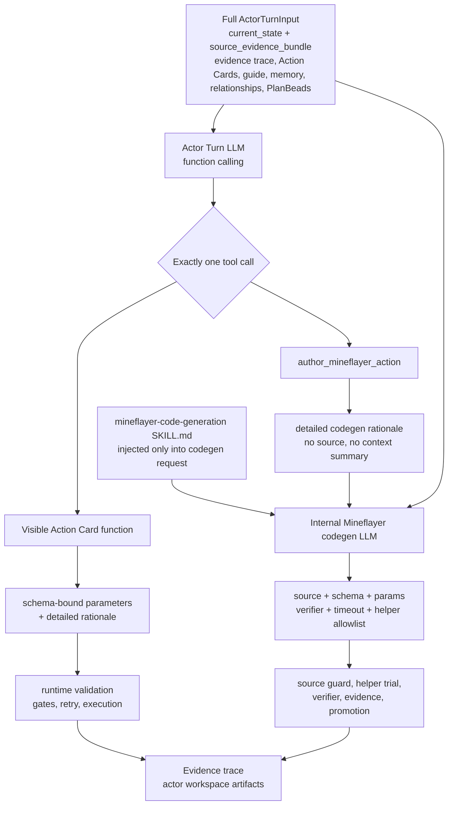

# Actor Turn Tool Calling And Full Context Codegen

Search token: `ACTOR_TURN_TOOL_CALLING_FULL_CONTEXT_CODEGEN`.

Status: active architecture spec.

Recorded: 2026-06-04 (`Asia/Seoul`). Updated: 2026-06-07.

## Purpose

Actor Turn is the ordinary Minecraft decision hot path. The model selects one
runtime tool directly through function calling. If the selected tool is
`author_mineflayer_action`, the generated Mineflayer code provider receives the
full original Actor Turn context plus the full outer tool call.

The core correction is avoiding lossy middle objects. Actor Turn decisions must
not be compressed into planner summaries before execution or codegen. The LLM
keeps freedom inside a strict tool/schema boundary; the runtime keeps validation,
permission, retry, timeout, verifier, and evidence authority.

## Target Shape

## Authority Boundaries

| Surface | May Do | Must Not Do |
| --- | --- | --- |
| Actor Turn LLM | choose exactly one visible function tool; provide schema-bound logical `parameters` and detailed rationale | execute Mineflayer directly; claim physical success; invent hidden tools |
| Action Card tool | carry logical `parameters`, `expected_outcome`, `situation_assessment`, `why_this_tool`, `success_evidence`, and `failure_handling` | include runtime ids, primitive ids, action skill ids, evidence paths, generated source, or missing args hidden in prose |
| `author_mineflayer_action` | explain why codegen is needed and what bounded Minecraft behavior should be generated | include TypeScript source, input schema, helper allowlist, timeout, verifier, promotion policy, or context-selection summaries |
| Internal codegen LLM | generate bounded Mineflayer TypeScript source, params schema, verifier, timeout, helper allowlist, and failure modes | operate from a compressed planner summary; use hidden imports, raw bot access, filesystem, network, `eval`, or unbounded loops |
| Runtime | validate params/source, execute or trial, record evidence, enforce retry and permission gates | silently repair missing params; parse prose as policy; hide tools through Minecraft domain heuristics; let PlanBeads provide executable authority |
| PlanBeads | preserve passive open work, blockers, obligations, and followups | provide tool args, Action Card choice, Minecraft strategy, generated source, physical success, or retry permission |

## Function Tool Contract

Each visible Action Card becomes its own function tool. The Actor Turn provider
does not choose between only two function names; it chooses exactly one function
from the current visible Action Card tools plus `author_mineflayer_action`.

The Action Card tool schema exposes:

- `parameters`: the logical parameters the LLM must fill;
- `expected_outcome`: enum of the evidence delta that should prove success;
- `situation_assessment`;
- `why_this_tool`;
- `success_evidence`;
- `failure_handling`.

The `author_mineflayer_action` tool schema exposes:

- `situation_assessment`;
- `why_codegen_is_needed`;
- `desired_minecraft_behavior`;
- `existing_tools_considered`;
- `expected_outcome`;
- `success_evidence`;
- `failure_handling`.

No outer function tool may expose `context_to_preserve`, `selected_context`,
generated source, helper settings, runtime ids, or hidden execution fields.

## Full-Context Codegen

When Actor Turn selects `author_mineflayer_action`, the runtime builds a
codegen request from:

1. the full original `ActorTurnInput`;
2. the raw outer function call, which is the preserved Actor Turn
   `author_mineflayer_action` output;
3. the parsed outer tool arguments, which are the same output after local schema
   validation;
4. the full Mineflayer code-generation agent skill markdown, injected by the
   codegen request builder rather than carried in the outer Actor Turn input;
5. any concrete validation/source-guard error when repairing a generated
   candidate.

The codegen provider output must include:

- `runtime_parameters`;
- generated candidate `input_schema`;
- generated TypeScript `source`;
- helper API version and helper allowlist;
- timeout;
- verifier;
- known failure modes;
- promotion policy;
- detailed codegen rationale.

Generated source must pass source guard, input-schema validation, helper
allowlist checks, timeout handling, bounded trial, verifier evaluation,
post-observation recording, and actor-workspace persistence.

## Artifact Requirements

Every turn should leave enough evidence for review:

- provider input snapshot with the full `ActorTurnInput`;
- raw provider output with the function call;
- parsed tool-selection artifact;
- selected Action Card or authoring request details;
- runtime validation result;
- execution/trial evidence refs;
- verifier output;
- post-observation or explicit failure artifact;
- actor workspace candidate or active action-skill record when applicable.

## Anti-Patterns

Do not reintroduce:

- compressed planner action summaries between Actor Turn and runtime execution;
- `ActionIntent` as a provider or codegen boundary;
- `args` aliases beside active `parameters`;
- prose parsing to supply missing parameters or policy;
- hardcoded Minecraft domain filters that hide tools from the LLM;
- `context_to_preserve` or any model-selected context-survival field;
- generated source execution from archive/debug directories;
- compatibility shims inside active schemas.

## Acceptance

This spec is implemented when:

- Actor Turn uses function calling for ordinary action selection;
- exactly one visible Action Card tool or `author_mineflayer_action` is selected;
- tool args are schema-bound and preserve detailed rationale;
- generated action authoring receives the full original Actor Turn context;
- generated candidates are validated, trialed, verified, and persisted before
  promotion;
- PlanBeads stay passive;
- runtime artifacts make tool selection, codegen, execution, and failures
  reviewable without replaying the provider call.
