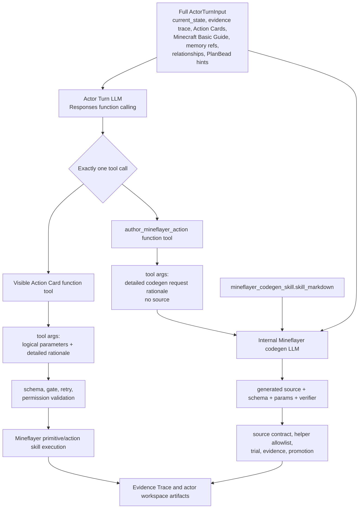

# Actor Turn Tool Calling And Full Context Codegen

Search token: `ACTOR_TURN_TOOL_CALLING_FULL_CONTEXT_CODEGEN`.

Status: active architecture spec.

Recorded: 2026-06-04 (`Asia/Seoul`).

## Purpose

This document defines the next Actor Turn runtime shape after the
legacy-intent-centered implementation proved too lossy for Minecraft behavior and
generated Mineflayer action skill authoring.

The key correction is simple:

- Actor Turn should select a runtime tool directly through Responses function
  calling.
- Generated Mineflayer codegen should receive the full original Actor Turn
  context plus the full outer tool call.
- A legacy planner action must not be the provider-facing or codegen-facing context
  boundary.

The runtime may keep a `LegacyPlannerAction` adapter for the explicit legacy
planner path, but that adapter is internal plumbing only. It must not be the
conceptual architecture, provider output contract, codegen input, or artifact
that reviewers use to understand the actor's ordinary Actor Turn decision.

There is no compatibility requirement to preserve a prose-parsing middle layer
in this side project. Any legacy adapter that encourages parsing rationale or
`current_state_requirements` as policy should be removed or fenced as explicit
legacy plumbing.

## Problem Statement

The prior hot path compressed the model's decision into a legacy planner action
object:

```text
ActorTurnInput
-> provider output
-> legacy planner action
-> runtime execution or generated action authoring
```

That helped reject missing physical args, but it also created a major product
failure:

- detailed situation understanding was reduced to short fields such as
  `why_this_action`;
- current-state nuance, recent evidence, Action Card tradeoffs, Minecraft Basic
  Guide details, relationship pressure, memory refs, and PlanBead hints were not
  reliably carried into Mineflayer codegen;
- `author_mineflayer_action` became a small abstract intent instead of a
  continuation of the actor's actual decision context;
- low-cost models were forced through a narrow schema and then later expected to
  recover lost context.

This is the wrong boundary for a Minecraft LLM actor. The LLM should have more
direct control over tool selection, while the runtime keeps validation,
evidence, permission, timeout, retry, and artifact authority.

The strongest anti-pattern is replacing tool calling with hidden text parsing:
checking `current_state_requirements`, `why_this_action`, Action Card
descriptions, Minecraft Basic Guide text, memory, PlanBeads, or provider
rationale through string `includes`, regexes, keyword lists, or other prose
heuristics. That approach gives the runtime secret strategy authority while
pretending the provider made a free decision.

The target design is stricter and simpler: tool calling and schemas/enums
control the flow; the selected tool/action receives full context and lets the
LLM decide within that contract; the runtime validates only explicit structured
parameters, schema conformance, permission, retry/safety, source guardrails,
timeout, verifier output, and evidence artifacts.

## Target Shape



The outer Actor Turn call chooses one tool. It does not produce a legacy planner
action.
If the chosen tool is `author_mineflayer_action`, the runtime starts a second LLM
call for codegen and passes the whole original context into it.

## Authority Boundaries

| Surface | May Do | Must Not Do |
| --- | --- | --- |
| Actor Turn LLM | choose exactly one function tool; provide detailed rationale and schema-bound logical `parameters` | execute Mineflayer directly; claim physical success; choose hidden or deferred tools |
| Existing Action Card function tool | carry logical `parameters` and rich rationale for one visible Action Card | include runtime ids, primitive ids, action skill ids, timeouts, evidence paths, generated source, or infer missing args from rationale text |
| `author_mineflayer_action` function tool | explain why codegen is needed and what Minecraft behavior should be generated | include TypeScript source; summarize or choose which original context survives |
| Internal codegen LLM | generate bounded Mineflayer TypeScript source, params schema, verifier, timeout, helper allowlist, failure modes | operate from legacy planner action summary; use hidden imports, raw bot access, filesystem, network, `eval`, or unbounded loops |
| Runtime | validate args/source, execute or trial, record evidence, enforce retry and permission gates | silently repair missing args; parse prose as policy; hide tools through Minecraft domain heuristics; let PlanBeads provide executable authority |
| PlanBeads | preserve passive open work, blockers, obligations, followups | provide tool args, Action Card choice, Minecraft strategy, generated source, physical success, or retry permission |

Tool and Action Card visibility must come from typed readiness/eligibility
contracts, structured current state, permission gates, retry constraints, and
evidence. Do not hide cards through hardcoded Minecraft strategy heuristics such
as item-family, station-family, construction-readiness, survival-priority,
shelter-first, or one-domain planner filters. If the runtime cannot prove a tool
is unavailable from structured state, expose it with honest risk/readiness or
reject the selected call with a typed validation artifact.

## Decision Frame Boundary

`decision_frame` is context, not a hidden planner. It may carry compact current
truths, recent action verdicts, completed work,
do-not-repeat notes, open progress fronts, and next-action guidance. It must not
carry `parameter_candidates`, `top_eligible_action_cards`,
`recommended_next_action_candidates`, generated `Say` text, placement
coordinates, recipe decisions, or any other field that lets the runtime pre-pick
the action while pretending the Actor Turn LLM decided.

The Actor Turn LLM should choose from the visible `action_cards` array and fill
the selected function tool's strict `parameters` from `current_state`,
`source_evidence_bundle`, `recent_evidence_trace`, `active_episode`,
relationships, memory refs, PlanBead hints, and Minecraft Basic Guide. If the
parameters are missing or invalid, the runtime rejects or repairs the structured
tool call. It must not synthesize those parameters from `decision_frame` prose or
from summary-only social-request projections.

## Branch Gate Boundary

Deliberation is branch-time only. Ordinary Actor Turn cycles should not call
Goal Mind or Deliberation just to choose another Minecraft action.

A branch may be opened when runtime-owned signals indicate a meaningful episode
boundary:

- a runtime retry constraint blocks the exact same target/args again;
- the verifier or execution status marks the episode blocked or failed;
- a new visible actor appears that was not part of the current Active Episode;
- a new actor-linked world event appears that was not in the episode's
  `opened_from_refs`;
- a new world-event ref appears that was not in the episode's `opened_from_refs`.

The branch gate must not parse free-form `pivot_triggers` such as "inventory has
planks" or "chest inspection completed" with regexes to infer success. If such
state matters, it should appear as runtime evidence, current-state projection,
or a structured event ref that the next Actor Turn or branch-time Deliberation
can read.

## Function Tool Contract

The OpenAI Actor Turn provider should use Responses function calling with these
request properties:

- `tools`: the currently visible/eligible Action Card tools plus
  `author_mineflayer_action`;
- `tool_choice`: `required`;
- `parallel_tool_calls`: `false`;
- `text.format`: not used for the outer Actor Turn decision in this mode;
- `background`: allowed if the provider budget and polling path support it;
- `store`: follow the provider retention policy already selected for Responses.

The model must return exactly one `function_call` output item. A message-only
answer, multiple function calls, a hidden tool name, or malformed arguments is a
provider contract failure and should enter the repair path with the full
original context and the rejected raw tool call.

### Existing Action Card Tool

Each visible Action Card becomes one function tool. The function name is stable
for the request but does not become runtime authority by itself:

```text
action_card_<ordinal>_<sanitized_title>
```

The runtime stores a local mapping:

```json
{
  "tool_name": "action_card_003_craft_item",
  "action_card_id": "action-card-003",
  "runtime_mapping_ref": "action-card-mappings/action-card-003.json"
}
```

The tool arguments must separate logical parameters from rationale:

```json
{
  "parameters": {
    "itemName": "oak_planks"
  },
  "situation_assessment": "The actor has visible log inventory and needs planks before sticks or a crafting table. Recent evidence does not show that planks are already sufficient for the next step.",
  "why_this_tool": "Craft Item is the visible Action Card for inventory-grid recipes. It can craft planks without a placed crafting table.",
  "success_evidence": [
    "inventory_delta showing oak_planks or another plank item increased"
  ],
  "failure_handling": "If ingredients are missing, record the blocker and choose a resource-gathering or observe action next turn."
}
```

Only `parameters` may become executable after runtime validation. The provider
must not include runtime-owned fields such as actor ids, primitive ids,
action-skill ids, timeout values, evidence refs, verifier ids, generated source,
or hidden target defaults. Placement cells, anchors, item names, counts, and
other executable parameters must be present in the strict tool arguments before
runtime validation; the runtime must not synthesize them from hints or prose.

Rationale fields are stored as decision evidence and code-review context. They
never supply missing coordinates, item names, counts, action skill ids, or
permission.

`current_state_requirements` and other LLM-facing Action Card prose are likewise
not machine policy. They can explain why a tool might be appropriate, but
runtime hiding/rejection must be backed by structured eligibility/readiness
records, schemas/enums, current-state facts, retry constraints, or evidence refs,
not by matching words inside those strings.

### `author_mineflayer_action` Tool

`author_mineflayer_action` is a selection tool, not a code container. It means:

> No visible Action Card can express the needed bounded Mineflayer behavior, so
> start the internal Mineflayer codegen stage with the full original context.

The tool arguments must be detailed enough to preserve the outer model's
judgment:

```json
{
  "situation_assessment": "The actor has already completed the log to planks to sticks chain, and the next useful step is to place or use a crafting table for table-bound recipes. Recent evidence shows repeated observation after table placement/search failures, so another observe-only turn would not move the episode forward.",
  "why_codegen_is_needed": "The visible Place Block Action Card requires an explicit target cell. The current state does not provide a reliable empty placement cell, and the needed behavior is to scan nearby support blocks, choose a valid empty cell, place the crafting_table, and verify the placed block.",
  "desired_minecraft_behavior": "Find a nearby solid support block with an empty or replaceable adjacent cell, place one crafting_table from inventory there, then verify that a crafting_table block is observed nearby.",
  "existing_tools_considered": [
    {
      "action_card_id": "action-card-007",
      "title": "Place Block",
      "why_not_enough": "It can place a block only after a valid targetPosition or supportPosition is already known."
    },
    {
      "action_card_id": "action-card-001",
      "title": "Observe",
      "why_not_enough": "Recent evidence already contains enough blocker context; another observe-only turn would repeat the stall."
    }
  ],
  "success_evidence": [
    "helper event records selected support block and target cell",
    "post-observation contains a nearby crafting_table block",
    "inventory count decreases if placement succeeds"
  ],
  "failure_handling": "If there is no crafting_table item, no valid support, or the target cell is occupied or unreachable, return explicit blocker evidence and do not claim placement success."
}
```

Do not add `context_to_preserve`, `selected_context`, `relevant_context_refs`,
or similar fields. Those fields recreate the same lossy summary bottleneck. The
runtime, not the LLM, is responsible for passing the full original context into
codegen.

## Full Context Codegen Contract

When `author_mineflayer_action` is selected, the internal codegen LLM input must
include all of the following:

1. the full original `ActorTurnInput` object exactly as the outer Actor Turn
   provider saw it;
2. the full raw outer Responses `function_call` item;
3. the parsed `author_mineflayer_action` arguments;
4. the full `actor_turn_input.mineflayer_codegen_skill.skill_markdown` body;
5. the codegen output contract for generated source, parameters schema,
   parameters, helper allowlist, timeout, verifier, failure modes, trial policy,
   and evidence expectations;
6. any validation error from a previous codegen attempt, if this is a repair.

The codegen LLM must not receive a legacy planner action or legacy planner
summary as its main task context. If a legacy adapter exists for explicit legacy
execution, the codegen request must treat it as forbidden context replacement.

### Codegen Output

The internal codegen provider should return a generated action skill proposal:

```json
{
  "runtime_parameters": {
    "itemName": "crafting_table",
    "searchRadius": 4
  },
  "candidate": {
    "schema": "generated-action-skill-candidate/v1",
    "proposed_skill_id": "placeNearbyCraftingTable",
    "purpose": "Place a crafting table on a nearby valid support cell and verify the placed block.",
    "source_language": "typescript",
    "source": "export async function run(ctx, params) { ... }",
    "input_schema": {
      "type": "object",
      "properties": {
        "itemName": { "type": "string" },
        "searchRadius": { "type": "integer" }
      },
      "required": ["itemName", "searchRadius"],
      "additionalProperties": false
    },
    "helper_api_version": "mineflayer-action-skill-helper/v1",
    "helper_allowlist": ["observe", "placeBlock", "mineflayer"],
    "timeout_ms": 15000,
    "verifier": {
      "kind": "nearby_block_exists",
      "blockName": "crafting_table"
    },
    "promotion_policy": "promote_after_passed_trial",
    "known_failure_modes": [
      "crafting_table item missing",
      "no valid support surface nearby",
      "target cell occupied",
      "placement timed out"
    ]
  },
  "codegen_rationale": "Detailed explanation of how the source uses the full ActorTurnInput, selected tool-call rationale, current_state, Minecraft Basic Guide, and evidence trace."
}
```

The generated source and parameters still pass through existing source-contract,
helper allowlist, input-schema, timeout, verifier, trial, promotion, and actor
workspace artifact checks.

## Artifact Requirements

Every Actor Turn should leave enough artifacts to review the decision without
replaying the provider call.

Required artifacts:

- provider input snapshot containing the full `ActorTurnInput`;
- raw Responses output with the full `function_call` item;
- parsed `actor-turn-tool-selection/v1` artifact:
  - selected tool name;
  - action card id or `author_mineflayer_action`;
  - parsed arguments;
  - local tool mapping;
  - provider usage ref;
  - validation status;
- for existing Action Card execution:
  - logical parameters selected by the tool call;
  - runtime mechanical parameter injections, if any;
  - detailed rationale fields;
  - runtime validation result;
  - execution and verifier evidence refs;
- for generated action authoring:
  - `mineflayer-codegen-request/v1` artifact that contains or references the
    full original `ActorTurnInput`, the full outer tool call, and the full
    codegen skill markdown;
  - provider input/output snapshots for the internal codegen call;
  - candidate proposal, source, trial evidence, verifier output, and promotion
    artifacts.

If a legacy planner adapter is used, its artifact must say:

```json
{
  "compatibility_only": true,
  "not_provider_contract": true,
  "not_codegen_context": true
}
```

Reviewers should audit the tool selection and full-context codegen artifacts,
not the adapter.

## Repair Semantics

Repair must preserve context. When a tool call is malformed or rejected:

- keep the full original `ActorTurnInput`;
- keep the raw rejected function call;
- append concrete validation errors;
- ask the model for one corrected function call;
- do not convert the failed call into a legacy planner action summary before repair;
- do not remove relevant context except to hide the exact rejected Action Card
  when the repair policy intentionally prevents repeating it.

For codegen repair, pass the full original codegen request plus the validation
or source-contract failure. Do not ask the codegen model to infer the missing
context from a short failure note.

## PlanBeads Boundary

PlanBeads remain passive actor-owned issue-like state. They can inform the Actor
Turn input as compact hints, but they must not become any of these:

- tool selector;
- Action Card parameter source;
- generated source origin;
- physical success evidence;
- retry permission;
- Minecraft strategy checklist;
- codegen context replacement.

If a PlanBead says that a new behavior is needed, it is only a context hint. The
Actor Turn LLM still must choose `author_mineflayer_action`, and the runtime
must pass the full Actor Turn context into codegen.

## Migration Plan

### Slice 1: Tool Selection Contract

- Add an Actor Turn function-tool contract module.
- Generate function tools from visible Action Cards plus
  `author_mineflayer_action`.
- Derive visible Action Cards from typed readiness/eligibility and structured
  state, not string parsing of `current_state_requirements` or Minecraft-domain
  keyword heuristics.
- Parse Responses `function_call` output into `actor-turn-tool-selection/v1`.
- Reject message-only, multiple-call, hidden-tool, or malformed-args responses.

### Slice 2: Existing Action Card Execution

- Execute selected Action Cards from schema-bound logical `parameters`.
- Reject `runtime_parameters`, hidden ids, generated source, context summaries,
  and unknown extra fields in the outer Action Card tool args.
- Expose promoted/generated action-skill `input_schema` as the Action Card tool's
  `parameters` schema instead of defaulting action skills to `{}`.
- Store detailed rationale fields in artifacts.
- Keep runtime validation and retry gates before Mineflayer execution.
- Keep any legacy planner adapter internal and explicit; do not shim `intent`
  onto Actor Turn provider results.

### Slice 3: Full Context Codegen

- Add `mineflayer-codegen-request/v1`.
- When `author_mineflayer_action` is selected, call the internal codegen provider
  with the full `ActorTurnInput`, full outer function call, parsed authoring
  request, and full mineflayer codegen skill markdown.
- Validate codegen output using generated action skill candidate contracts.
- Trial, record evidence, and promote only after a passed trial.

### Slice 4: Legacy Cleanup

- Remove provider-facing legacy planner action language from Actor Turn prompts,
  docs, and provider snapshots.
- Keep only narrow compatibility adapters until execution code is migrated.
- Update review/audit reports to inspect tool selection and codegen artifacts.

### Slice 5: Runtime Proof

- Run focused tests for tool-call parsing, Action Card execution, authoring
  request preservation, full-context codegen input construction, and compatibility
  shim boundaries.
- Run typecheck and docs build.
- Run a budget-guarded low-cost runtime smoke when provider quota allows.

## Done Criteria

This spec is implemented only when all of these are true:

- OpenAI Actor Turn uses Responses function calling for ordinary selection.
- Exactly one visible Action Card tool or `author_mineflayer_action` is selected
  per turn.
- No runtime code parses LLM-facing prose, `current_state_requirements`, guide
  text, memory, PlanBeads, or rationale with string includes/regexes/keywords to
  decide tool visibility, eligibility, args, permission, retry, source authority,
  or success.
- No Action Card or tool is hidden by hardcoded Minecraft domain heuristics; all
  hiding/rejection is traceable to typed readiness/eligibility, structured state,
  schemas, gates, retry constraints, or evidence.
- Existing Action Card execution uses direct schema-bound `parameters`, not
  provider-facing legacy planner action.
- `author_mineflayer_action` carries detailed rationale and no source.
- Codegen receives full original Actor Turn context, full outer tool call, and
  full mineflayer codegen skill markdown.
- No `context_to_preserve`-style model-selected context survives in the
  authoring contract.
- Any legacy planner adapter is compatibility-only and never used as the
  provider or codegen context boundary.
- Runtime artifacts preserve enough detail to diagnose why the actor selected a
  tool, why codegen was needed, what code was generated, how it was validated,
  and what happened in Minecraft.
- Focused tests, typecheck, docs build, and live-run review support the claim.

## Non-Goals

- Do not expose raw Mineflayer bot access to the outer Actor Turn provider.
- Do not use OpenAI built-in web, file, shell, computer-use, or MCP tools for
  Minecraft runtime execution.
- Do not make PlanBeads a planner or codegen context selector.
- Do not turn one Minecraft task such as shelter, crafting table placement, or
  mining into always-on architecture.
- Do not keep compatibility shims that preserve prose parsing or hidden
  Minecraft-planner behavior in the Actor Turn hot path.
- Do not remove runtime validation, retry gates, source contracts, timeouts,
  verifier evidence, or actor workspace persistence in the name of directness.
