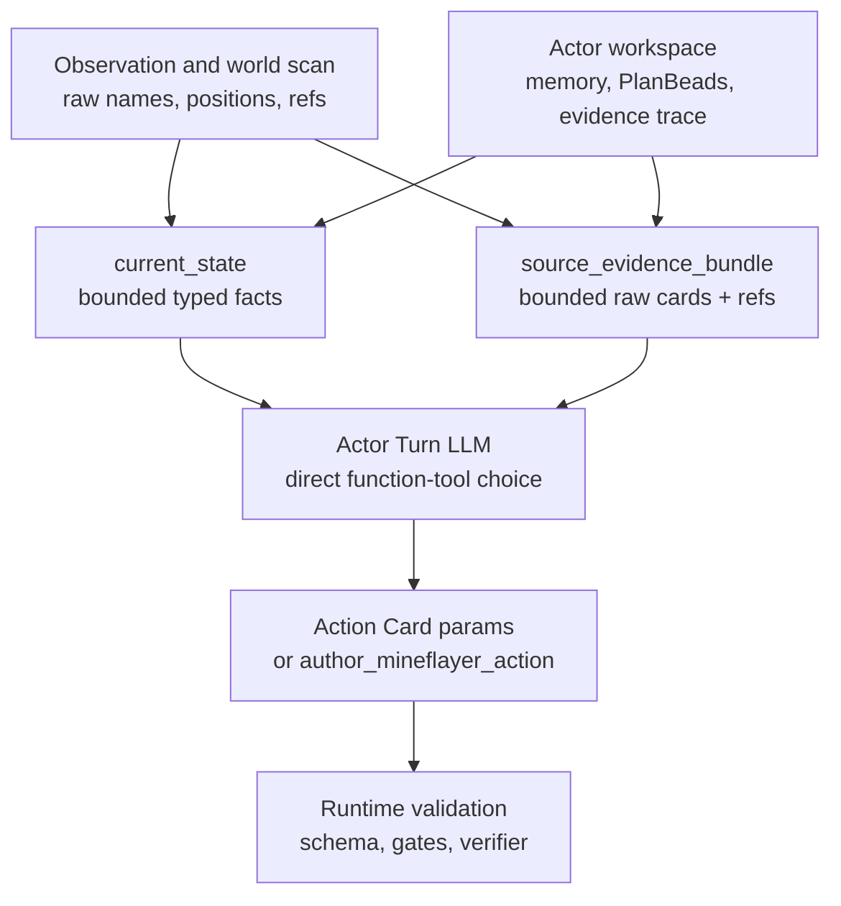

# Context Projection And Source Evidence

Search token: `CONTEXT_PROJECTION_SOURCE_EVIDENCE`.

Status: active architecture rule for Actor Turn provider input, context
compaction, and run review.

## Purpose

Actor Turn exists so the LLM can make the ordinary Minecraft decision directly:
choose one visible Action Card function tool, or choose
`author_mineflayer_action` when a new bounded Mineflayer behavior is needed.

That only works when context projection helps the model without secretly
choosing for it. The runtime may compact bounded facts, but it must not replace
rich world, action, social, or work history with summary-only fields that erase
the evidence a model needs to reason.

## Compression Policy

Compression is allowed when the state is naturally bounded, easy to audit, and
easy to reconstruct from the current runtime state.

Good examples:

- own hunger, health, held item, and food candidates;
- inventory item counts;
- exact retry constraints over a selected tool and structured args;
- provider budget status;
- checklist entries that are backed by specific verifier refs;
- PlanBead hint cards that point back to the actor workspace record.

Compression is not enough when the state is geometric, relational, temporal, or
interpretive.

For these surfaces, provide a compact projection and source evidence together:

- observations and world scans;
- nearby block examples and their positions;
- action attempts, failures, blockers, helper events, and verifier refs;
- social requests, relationship pressure, and world events;
- PlanBead work state and blocker history;
- generated action-skill trials and promotion evidence.

Summary-only context is invalid for these surfaces because it turns the runtime
into an information bottleneck. The model sees a conclusion but loses the facts
needed to challenge, reinterpret, or adapt it.

## Active Actor Turn Shape

`ActorTurnInput` therefore carries two complementary layers:

1. `current_state`: bounded typed facts that are safe to compact, such as
   inventory counts, vitals, shared-storage status, known positions, retry-safe
   recent blockers, and optional world-scan summaries.
2. `source_evidence_bundle`: bounded raw cards and refs that preserve where the
   facts came from: observation refs, inventory item entries, visible actor
   cards, nearby block observations with positions, world-event cards, memory
   cards, recent action details, and PlanBead cards.

`current_state` should be readable and small. `source_evidence_bundle` should be
bounded but not over-interpreted. Together they let the model reason from actual
Minecraft and social evidence without forcing the runtime to become a hidden
planner.

## Forbidden Runtime Patterns

Do not add provider-facing fields that preselect a domain action while pretending
the Actor Turn LLM still decided.

Forbidden examples:

- `deposit_candidates`;
- `open_social_requests`;
- `obligation_summaries`;
- `nearby_block_hints` without positions or evidence source;
- `known_position_summaries`;
- `parameter_candidates`;
- `recommended_next_action_candidates`;
- generated chat text;
- fixed shelter, storage, crafting, or mining strategy fields.

Do not parse LLM-facing prose with `includes`, regexes, or keyword lists to decide
tool visibility, args, permissions, retry clearance, or physical success. If a
decision must be enforced by the runtime, represent it as structured state,
schema validation, a permission gate, a retry constraint, or verifier evidence.

## PlanBeads Boundary

PlanBeads are passive actor-owned issue-like state. They preserve open work,
blockers, obligations, dependencies, and followups. They do not provide action
parameters, action choices, Minecraft strategy, source code, success, or retry
permission.

Actor Turn may read compact PlanBead cards and their refs, then decide what to
do. The guarded PlanBead applier remains the only mutation authority.

Automatic PlanBead lifecycle updates must also avoid prose matching. Use
structured metadata signals such as `lifecycle_close_signals` and
`lifecycle_incomplete_signals`; otherwise runtime evidence should remain context
for Actor Turn or Deliberation rather than silently mutating the work graph.

## Review Checklist

When reviewing a provider-input or context-compaction change, ask:

- Does the model receive both the compact fact and the source evidence needed to
  reinterpret it?
- Is the compressed field naturally bounded and easy to audit?
- Did the change remove raw observation/action/social context that should travel
  with a summary?
- Did the runtime start hiding tools or preselecting an action through domain
  heuristics?
- Are executable decisions still enforced by strict schemas, gates, retry
  constraints, and verifiers rather than prose?
