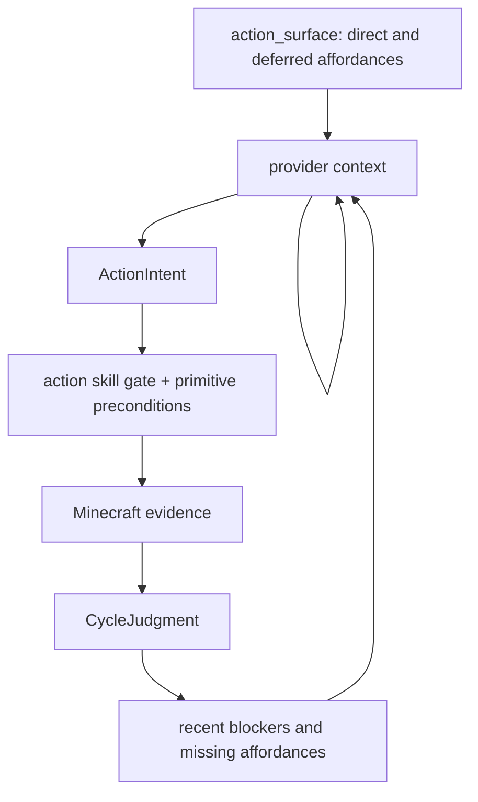
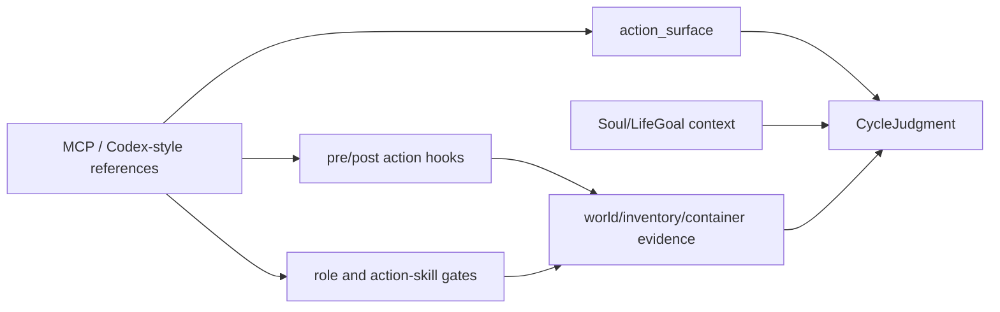

# Future Works

Search token: `FUTURE_WORKS`.

Status: active future-work backlog, not a long-term spec change.

This page records implementation ideas discovered from live runs and external
references. It must not override `SPEC.md`, ActorSoul/LifeGoal semantics, or the
runtime evidence rules. If a future item changes product direction, move it
through explicit spec approval before implementing it as a durable contract.

## Latest Live Inputs

### 14/14 Action-Skill Matrix

The current implemented action-skill surface passed a fresh live matrix on
Linux ARM with Docker Engine:

```text
matrix_summary verdict=passed passed=14 failed=0 error=0 total=14/14
matrix_scope_counts current_run=14 historical_transcript=0 missing=0 environment_blocked=0
```

This proves the seed action skills can pass when each skill is isolated with
runtime-owned fixtures and current-run postcondition evidence.

### Long-Horizon Social-Cycle Stress Test

The long-horizon OpenAI social-cycle test used one actor, one fresh world, and a
broad settlement WorldEvent context. The scenario is historical evidence for
runtime substrate gaps, not a product architecture.

Run artifact. The file name is historical and should not be copied as a future
scenario naming convention:

```text
tmp/live-social-cycle-openai-home-100.json
```

Observed result:

- requested `100` cycles;
- completed `54` cycles before cleanup hit a host file-permission blocker;
- `provider=openai-api`, `model=gpt-5.4-mini`;
- `builtin_goal_authority=false`;
- `builtin_execution_source=false`;
- `fixture_dependency=false`;
- `used_world_event_refs=1`;
- `used_previous_judgment=true`;
- `used_memory_refs=8`;
- `memory_writes=224`;
- report audit passed.

Concrete Minecraft progress happened, but the broader goal was not completed:

- current-run inventory, crafting, and block-placement evidence appeared in the
  report;
- partial progress remained partial because the matching verifier did not pass.

The test did not lie about completion. The run remained `blocked` rather than
claiming completed goal success.

## Behavior Verdict

Verdict: `DIAGNOSABLE_FAILURE`.

The current runtime is good at rejecting fake success and preserving context.
The current planner/control surface is not yet good at turning a long-horizon
context packet into a reliable precondition-aware action sequence.

Repeated blockers from the 54 recorded cycles:

| Blocker Class | Meaning |
|---------------|---------|
| no matching reachable target | World-state diagnostics and bounded movement are not integrated enough. |
| missing required primitive arg | Provider output must fail contract validation before execution. |
| missing tool/item/station precondition | Planner repeats an action before its precondition is satisfied. |
| missing usable material/container state | Provider context needs clearer current inventory/container evidence. |
| recipe or target mismatch | Runtime should expose exact blocker evidence and require a pivot or repair. |

## Priority Work

### P1: Worksite Support For Physical Building Tasks

Status: future investigation item recorded on 2026-06-07. This is not an
approved architecture contract.

`worksite support` is a project-local label, not a standard Minecraft,
Mineflayer, MCP, or agent-architecture term. It means a small runtime support
layer for choosing, preserving, and diagnosing the physical place where an actor
is trying to do work.

The idea comes from roofless-starter-hut runs where the actor did collect and
craft useful materials, but started building in a poor forest/canopy pocket and
then drifted into observation or memory instead of continuing a coherent
physical build. This should not become a house planner, shelter planner, or
building-first architecture. It is a possible autonomy substrate improvement:
make physical work locations explicit enough that Actor Turn can reason from
current evidence without hidden domain strategy.

Future investigation should ask whether the runtime needs bounded capabilities
such as:

- finding a nearby reachable, loaded, mostly clear work area;
- preserving the selected worksite anchor across several Actor Turns;
- recording why a site is unsuitable, such as obstructed, unsafe, unreachable,
  unsupported, too far from needed station, or too short on build material;
- moving to the selected worksite and rechecking reachability before placement;
- attaching build, repair, or gathering attempts to the same local anchor until
  evidence shows a pivot is needed;
- improving visual evidence with a better review camera when first-person
  screenshots are blocked by nearby geometry.

Non-goals:

- do not encode a universal shelter, base, or construction strategy;
- do not make PlanBeads executable authority for coordinates, materials, or
  success;
- do not hide action cards through hardcoded material, station, or construction
  heuristics;
- do not treat screenshots as verifier authority when block/inventory/world
  evidence disagrees.

If this item is implemented later, it should use strict action schemas,
runtime-owned reachability and placement evidence, bounded Mineflayer helpers,
and Actor Turn freedom over visible action cards. The first useful proof would
be a small physical task where the actor chooses or rejects a local worksite,
uses it for multiple actions, and records a truthful blocker if the site or
materials are insufficient.

### P0: Planner Argument Contract Hardening

Status: baseline implemented for direct primitive execution. Keep extending this
as new primitives become provider-visible.

Current contract rule:

- direct provider `use_primitive` cannot rely on prose fields for executable
  targets;
- direct provider `use_primitive` cannot spoof `args.actionSkillId` to borrow an
  action-skill-local fallback;
- direct provider shared-storage transfers must provide explicit `count` or
  `targetCount`;
- safe-looking control actions such as `wait` and `remember` still pass through
  CycleGoal and active action-skill gates;
- resolved actor-owned action skill primitive calls may use documented local
  fallbacks at that resolved boundary;
- contract failure should be persisted as evidence.

Future implementation options:

- reject malformed `ActionIntent` before execution and request a repaired
  provider output;
- expose structured primitive arg schemas and current affordance hints without
  naming preferred strategies;
- convert common natural-language outputs into canonical Minecraft ids only when
  the conversion is unambiguous and recorded;
- write a failed intent artifact when required fields are missing, so the next
  cycle sees the exact schema problem.

The goal is not broad prompt polish. The goal is to stop wasting live cycles on
primitive calls that the runtime can prove are malformed before touching
Mineflayer.

### P0: Blocker-Aware Pivot Rule

Status: baseline implemented as `runtime-retry-constraint/v1`. Keep extending
the rule as report audit and live-run review uncover new blocker shapes.

After the same primitive fails with the same blocker twice in a recent window,
the next provider context should make that exact primitive/argument pair
temporarily unavailable or mark it as a prohibited retry.

Example:

```text
same primitive + same structured args + same blocker reason
-> do not retry the same primitive/args immediately
-> choose a different valid affordance, observe, repair args, move within a
   bounded target, or record a truthful memory/judgment
```

This should be a runtime rule over recent evidence, not a provider memory note
that the model may ignore.

Current implementation:

- derives constraints from recent action attempts by actor id, ActionIntent
  target, normalized structured args, and normalized blocker reason;
- injects `runtime_retry_constraints` into CycleGoal and ActionIntent provider
  context;
- blocks a matching retry before Mineflayer execution;
- writes `retry_constraint_blocked` evidence so the next turn can diagnose the
  gate without treating it as progress.

Open follow-up:

- live runs should verify whether the provider repairs args or pivots after the
  first blocked retry;
- the constraint window may need tuning after longer provider-backed runs.

### P0: Autonomy Surface And Blocker-Aware Context

The long-horizon run should not create a domain-specific architecture. It showed
a broader substrate gap: the provider needs a clearer actor body, recent
blockers, malformed-argument feedback, and partial-progress semantics.

Future context should expose `action_surface` plus context-specific state:



The context should make prerequisite gaps explicit without making one activity
mandatory:

- which primitives and action skills are executable now;
- which affordances are deferred because actor ownership, role permission, or
  primitive support is missing;
- whether a recent blocker repeats the same primitive and argument shape;
- what exact argument or precondition is missing;
- whether current-run evidence is full progress, partial progress, blocked, or
  no progress.

If a WorldEvent or CycleGoal makes a specific domain activity relevant, local
state for that activity may appear as context-specific context. That local
state must not become the general cycle architecture or a standing planner
checklist.

### P0: Partial Progress Semantics

`build_pattern:progressing` can contain real block-placement evidence. The
report should distinguish:

- `verified_progress`: completed meaningful verifier condition;
- `partial_verified_progress`: current-run world mutation that is useful but
  not enough for final success;
- `no_progress`: observe, wait, memory, or blocked attempts only.

This avoids two bad outcomes:

- counting partial block placement as a finished target;
- hiding real block placement under a report-level `gameplay_progress_verified=false`.

### P1: Review Summary Schema Catch-Up

Status: baseline implemented for current report shape, movement contract status,
and world-scan evidence counts. Keep this item open for future report schema
additions.

Fix target:

- keep reading nested `cycles[].action_attempts[]`;
- keep counting `executed_tools` and `tool_statuses` from current report fields;
- keep detecting previous judgment from provider input snapshots under `.input`;
- surface `action_intent_contract_failure` and world-state diagnostics clearly;
- surface `partial_verified_progress` once that status exists.

### P1: Fresh-World Cleanup Ownership

The 100-cycle run ended during cleanup because the fresh-world data directory
was written by the container user and the host process could not delete it.

Fix target:

- make fresh-world server data directories host-cleanable;
- or run cleanup through Docker/compose with the same effective user;
- or record cleanup failure as cleanup-only without obscuring the completed
  report.

### P1: Target Discovery And Bounded Movement

An action skill can pass in a fixture while a long-horizon run still fails
because the target is not nearby, not loaded, unreachable, or not represented in
the provider context. The next layer should connect raw world-state diagnostics
to bounded target discovery and movement without adding a domain strategy.

Potential action-skill candidates:

- `scout_toward_observed_target`;
- `move_to_verified_position`;
- `find_reachable_blocks`;
- `check_path_to_block`;
- `collect_dropped_items`.

Keep movement bounded and evidence-first. Do not turn exploration into unbounded
wandering or into a hidden strategy phase.

## Minecraft MCP And Codex-Style Tool Runtime References

External examples are references, not product goals. The remembered Minecraft
MCP/Claude construction example is useful because it shows how much leverage
comes from a clean action interface. It is not evidence that this repo should
become a construction-first architecture.

Research status, 2026-05-24:

- [`joshdevous/minecraft-builder-claude-mcp-server`](https://github.com/joshdevous/minecraft-builder-claude-mcp-server)
  has Claude produce JSON block coordinates and converts them into
  WorldEdit-compatible `.schem` files. Use it as an offline planning reference
  for typed coordinate data. Do not treat `.schem` generation or WorldEdit paste
  as embodied actor progress.
- [`yuniko-software/minecraft-mcp-server`](https://github.com/yuniko-software/minecraft-mcp-server)
  exposes Mineflayer movement, inventory, block, crafting, furnace, chat,
  flight, and game-state tools through MCP. Use it as a tool-surface and
  argument-schema reference. Do not copy text-only success semantics.
- [`FundamentalLabs/minecraft-mcp`](https://github.com/FundamentalLabs/minecraft-mcp)
  includes high-level building helpers backed by `/setblock`, `/fill`, `/clone`,
  raw commands, or dynamic JavaScript. Use it as a warning about powerful admin
  surfaces. Those paths are not actor action skills in this repo.
- [`gerred/mcpmc`](https://github.com/gerred/mcpmc) exposes typed resources and
  tools for navigation, digging, placement, inventory, crafting, containers, and
  real-time state. Use it as a reference for resource-style context and progress
  notifications.
- [`arjunkmrm/mcp-minecraft`](https://github.com/arjunkmrm/mcp-minecraft) is a
  compact Claude Desktop Mineflayer bridge. Use it as a primitive checklist and
  setup-ergonomics reference, not as a verification model.
- [`openai/codex`](https://github.com/openai/codex) is the stronger architecture
  analogy: a tool runtime with direct/deferred exposure, hooks, permission
  checks, event streams, and evidence accounting. It does not hard-code a
  strategy for Python, TypeScript, or C# tasks.

Reference links:

- [yuniko-software/minecraft-mcp-server](https://github.com/yuniko-software/minecraft-mcp-server)
- [joshdevous/minecraft-builder-claude-mcp-server](https://github.com/joshdevous/minecraft-builder-claude-mcp-server)
- [FundamentalLabs/minecraft-mcp](https://github.com/FundamentalLabs/minecraft-mcp)
- [gerred/mcpmc](https://github.com/gerred/mcpmc)
- [arjunkmrm/mcp-minecraft](https://github.com/arjunkmrm/mcp-minecraft)
- [OpenAI Codex](https://github.com/openai/codex)
- [Claude Code MCP documentation](https://code.claude.com/docs/en/mcp)
- [Model Context Protocol](https://modelcontextprotocol.io/)

Translation into this repo:



Ideas to adapt:

- typed, bounded argument schemas for provider-visible actions;
- compact world-status context: position, health, food, game mode, time,
  selected item, inventory summary, nearby entities, raw observed names, and
  scan limits;
- direct/deferred action exposure so the model can see both usable affordances
  and missing affordances;
- block-affordance diagnostics: target-before block, support block, face vector,
  occupied-target guard, target-after block, and inventory delta;
- reachability/preflight helpers for movement, block search, target lookup,
  equipment, and container access;
- recipe affordance summaries with exact item id, table requirement, missing
  ingredients, result count, and nearest crafting table;
- bounded chat history as social context/evidence, not as free authority;
- optional offline design artifacts only when a specific action skill needs
  them.

Do not translate:

- MCP as the active runtime boundary;
- WorldEdit or `.schem` paste as actor progress;
- `/setblock`, `/fill`, `/clone`, `/give`, raw commands, or dynamic JavaScript;
- creative/peaceful/flat-world defaults for survival competence proof;
- "success" strings from Mineflayer calls without world or inventory rereads;
- fuzzy item matching unless the chosen alias is explicit and recorded;
- `StructureBlueprint`, `ShelterBlueprint`, or similar building artifacts as
  mandatory core cycle context.

Seed action skill and primitive implications:

- Do not add `buildHouseFromDescription`, `StructurePlacementPlan`, or a
  building-first planner as core runtime architecture.
- Keep `buildBasicShelter` and `build_pattern` as bounded affordances selected
  only when current context makes building relevant.
- Promote small, general affordances before larger domain behaviors:
  `collectDroppedItems`, `equipBestTool`, `findReachableBlocks`,
  `checkPathToBlock`, `recipe_affordance`/`can_craft`, `use_furnace`, richer
  container access, and better observation packets.
- If a future structure artifact becomes useful, keep it local to a bounded
  action skill or offline design workflow. It must compile into ordinary
  verified runtime actions and cannot claim progress before world verification.

This keeps the external insight where it helps: better affordances, better
diagnosis, and better runtime evidence. It avoids changing the core architecture
or bypassing embodied Mineflayer work.

## Suggested Next Implementation Order

1. Keep `ActionIntent` argument validation as a regression gate and extend it
   whenever a new primitive becomes provider-visible.
2. Extend runtime-level repeated-blocker suppression from the current exact
   target/args gate into live-run diagnosis and threshold/window tuning.
3. Add partial-progress status to social-cycle reports and review summaries.
4. Fix fresh-world cleanup ownership.
5. Expand `action_surface` with direct/deferred affordances, missing-argument
   diagnostics, and context-specific state.
6. Add bounded target-discovery and equipment affordances only after
   blocker-aware pivot logic is in place.
7. Consider domain-local design artifacts only when a specific action skill
   needs them; do not add building artifacts as core cycle context.
