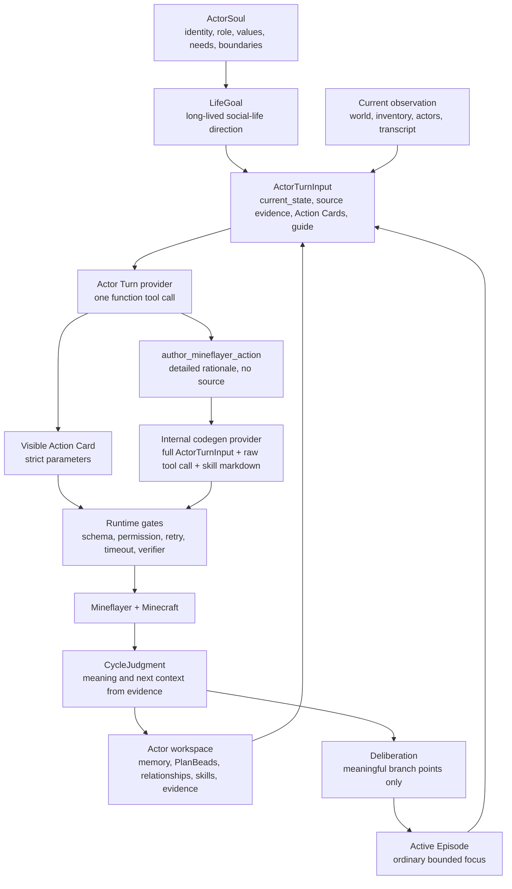
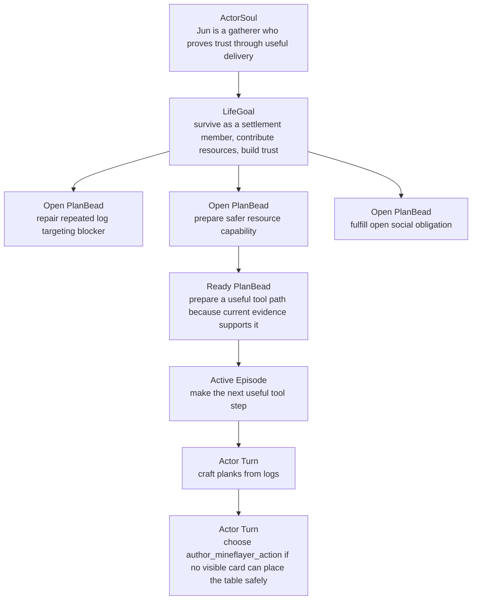

# Soul Life Goal Runtime Architecture

Search tokens:

- `SOUL_LIFE_GOAL_RUNTIME`
- `ACTOR_SOUL_GOAL_LEDGER`
- `SOCIAL_LIFE_CYCLE_GOAL`
- `NO_USER_TASK_AS_TOP_LEVEL_GOAL`
- `CODEX_GOAL_REFERENCE`
- `NO_PROBE_PASSED_AUTONOMY_METRIC`

Status: active architecture orientation, updated for the Actor Turn tool-calling
runtime.

Original proposal date: 2026-05-23.

Research-direction update, 2026-06-18: this Soul/LifeGoal layer remains the
actor frame for the active Advisory Social-Material WAM direction. The runtime
may ask an advisory predictor what physical, material, and social consequences
a candidate action is likely to produce, but the Actor Turn remains responsible
for action selection and the Mineflayer runtime remains responsible for
execution and outcome checks. Verification is expected runtime hygiene, not the
research contribution.

## Core Decision

This repo is not building a bot that simply completes an external task string.
It is building an actor that lives inside Minecraft under an `ActorSoul` and a
`LifeGoal`.

External input such as "collect stone" or "build a simple shelter" is not the
actor's top-level goal. It is a `WorldEvent`, scenario pressure, experiment
constraint, or operator event that the actor interprets under its Soul,
LifeGoal, memory, relationships, current world state, and available Action
Cards.

The ordinary decision path is:

```text
ActorSoul + LifeGoal
-> current observation, memory, relationships, PlanBead hints, Evidence Trace
-> optional advisory social-material prediction for candidate actions
-> Active Episode / branch-time Deliberation only when needed
-> Actor Turn function-tool selection
-> runtime validation and Mineflayer execution or generated-action trial
-> checked runtime outcome evidence
-> CycleJudgment, memory, relationships, and PlanBead updates
```

The LLM-facing work should be easy for the LLM:

- read the current actor/world context;
- choose one visible function tool;
- fill that tool's strict `parameters`;
- explain its rationale richly for review;
- choose `author_mineflayer_action` when the current tool surface cannot express
  the needed bounded behavior.

The runtime should be strict where it owns authority:

- schema validation;
- permission and role gates;
- retry constraints;
- source contracts for generated code;
- timeouts;
- Mineflayer execution;
- verifier output;
- actor workspace artifacts.

There is no active `ActionIntent` middle layer in the Actor Turn provider or
codegen boundary. `ActionIntent` is archived terminology for historical planner
artifacts and migration-only compatibility paths.

## Near-Term Proof

The near-term proof is a bounded social-life simulation seed for one actor.

That actor must:

- act in Minecraft through runtime gates;
- reason from `ActorSoul`, `LifeGoal`, current observation, and `WorldEvent`
  context;
- use memory or prior CycleJudgment in later cycles;
- preserve open work through PlanBeads when context changes;
- leave artifacts that explain success, failure, stall, retry, reconnect, and
  no progress.

This proof is not full human-like personhood, long-run autonomy, or a Voyager
clone. It is also not optimistic LLM narration. A report may prove a primitive
or action skill, but it must say exactly what was provider-selected,
runtime-expanded, helper-generated, blocked, or unimplemented.

## Identity And Goal Layers

| Layer | Owner | Purpose | Example | Must Not Do |
| --- | --- | --- | --- | --- |
| Project north star | owner and architecture docs | explain why Minecraft agents are being built | Soul-grounded social simulation seed | collapse into one probe pass |
| Society scenario | scenario config or operator | define world/social pressure | shared settlement, scarce resources | replace an actor's individual frame |
| `ActorSoul` | durable actor artifact | define identity, role, values, drives, boundaries | a gatherer who wants trust through useful delivery | claim action success |
| `LifeGoal` | derived from ActorSoul | preserve long-lived social-life direction | survive, contribute, gain trust | reset every run from a user task |
| PlanBeadGraph | actor workspace | preserve open work, blockers, obligations, and dependencies | repair repeated log targeting blocker | choose executable tools or args |
| Active Episode | runtime/provider state | hold the current bounded focus window | make first usable tool path | become a checklist executor |
| Actor Turn | provider hot path | choose one visible function tool | craft planks, move, observe, generate action | claim physical success |
| Runtime action/trial | runtime | execute or trial a bounded operation | `mine_block`, `place_block`, generated helper run | own social meaning |
| Verification | runtime evidence | decide what happened physically | inventory delta, block reread, position, chat event | trust provider narration as proof |
| CycleJudgment | provider plus guardrails | summarize meaning and next context from evidence | blocked on missing table access | mutate state without evidence guards |

## `soul.md` And Compiled Soul

`soul.md` is the human-readable actor charter. Runtime code should compile or
load the same meaning as an `actor-soul/v1` packet for provider context.

```ts
type ActorSoul = {
  schema: "actor-soul/v1";
  actor_id: string;
  display_name: string;
  society_id: string;
  role: "quartermaster" | "gatherer" | "crafter" | "scout" | string;
  life_goal: string;
  public_responsibilities: string[];
  private_drives: string[];
  values: string[];
  needs: {
    survival: string[];
    social: string[];
    learning: string[];
  };
  boundaries: {
    forbidden_actions: string[];
    requires_evidence_before_claiming: string[];
    shared_resource_rules: string[];
  };
  action_skill_policy: {
    prefer_owned_action_skills: boolean;
    allow_primitive_fallback: boolean;
    allow_generated_action_skill_trials: boolean;
  };
  memory_policy: {
    retrieve_layers: (
      | "working"
      | "episodic"
      | "semantic"
      | "procedural"
      | "social"
      | "belief"
      | "guardrail"
    )[];
    must_consider_recent_cycle_judgment: boolean;
  };
  speech_style: string;
};
```

Expected actor workspace shape:

```text
data/actors/<actor_id>/soul.md
data/actors/<actor_id>/soul.json
```

`probe/src/npc/profiles.ts` is a useful bootstrap seed, but a short profile is
not the full durable Soul. The actor workspace should eventually preserve Soul
and LifeGoal records across runs.

## LifeGoal

`LifeGoal` is closest to a Codex thread goal mechanically, but it is not an
external task. It is the actor's long-lived social-life direction.

```ts
type ActorLifeGoal = {
  schema: "actor-life-goal/v1";
  actor_id: string;
  goal_id: string;
  objective: string;
  status: "active" | "paused" | "blocked" | "stalled" | "retired";
  source: "actor_soul" | "scenario" | "operator_override";
  created_at: string;
  updated_at: string;
  cycle_count: number;
  action_count: number;
  evidence_refs: string[];
  memory_refs: string[];
  relationship_refs: string[];
};
```

A LifeGoal usually should not become `complete`. "Live as a useful settlement
member" is a constitution for ongoing action, not a finite checklist.

## PlanBeads And Medium-Horizon Work

Older docs may use `StrategicGoal` for medium-horizon goals such as preparing
for diamond acquisition. The current persistent middle layer is PlanBeads:
actor-owned issue-like work items plus dependency edges.

Use PlanBeads for restart-safe work state:

- open concerns;
- obligations;
- repeated blockers;
- action-skill followups;
- investigations;
- dependency order.

Do not create a second active persistent goal store when a PlanBead record and
dependency edge can represent the same living work.

## World Events

This runtime should not treat an operator prompt as a direct command. External
input becomes a world event that the actor interprets.

```ts
type WorldEvent = {
  schema: "world-event/v1";
  event_id: string;
  kind:
    | "environment_event"
    | "actor_event"
    | "scenario_event"
    | "operator_event";
  authority: "context_only" | "scenario_rule" | "debug_override";
  summary: string;
  actor_refs: string[];
  evidence_refs: string[];
  created_at: string;
};
```

When an operator event says "try to obtain diamonds," the actor should ask:

- Does this fit my LifeGoal and role?
- Can I attempt it with current tools, food, and action skills?
- Is it socially useful, risky, urgent, or better deferred?
- Do I need to prepare resources, ask for help, or repair a blocker first?
- Should this become a PlanBead, an Active Episode focus, or just context?

## Target Runtime



Important boundary:

```text
The LLM decides which visible tool to attempt and why.
The runtime decides whether that tool call is valid and what actually happened.
The actor workspace remembers both.
```

## Actor Turn Inputs And Outputs

### Actor Turn Input

The ordinary hot-path provider input should include:

- `ActorSoul` and `LifeGoal`;
- active episode context;
- current observation and inventory;
- recent Evidence Trace;
- visible Action Cards with strict parameter schemas;
- Minecraft Basic Guide;
- memory refs;
- relationship context;
- compact PlanBead hints;
- retry constraints and recent blockers;
- budget/provider guard hints.

It should not include:

- hidden tool choices;
- preselected parameter candidates;
- top eligible Action Cards;
- generated coordinates or recipe decisions;
- unbounded transcript dumps;
- PlanBeads as executable authority.

### Actor Turn Output

The Actor Turn provider returns exactly one function tool call:

```ts
type ActorTurnToolSelection =
  | {
      tool_name: "action_card_<ordinal>_<name>";
      arguments: {
        parameters: Record<string, unknown>;
        situation_assessment: string;
        why_this_tool: string;
        success_evidence: string[];
        failure_handling: string;
      };
    }
  | {
      tool_name: "author_mineflayer_action";
      arguments: {
        situation_assessment: string;
        why_codegen_is_needed: string;
        desired_minecraft_behavior: string;
        existing_tools_considered: {
          action_card_id: string;
          title: string;
          why_not_enough: string;
        }[];
        success_evidence: string[];
        failure_handling: string;
      };
    };
```

Only `parameters` on a selected Action Card may become executable after runtime
validation. Rationale fields are important review evidence, but they never
supply missing item names, counts, positions, action-skill ids, permissions, or
success.

When `author_mineflayer_action` is selected, the internal codegen provider
receives:

1. the full original `ActorTurnInput`;
2. the full raw outer function call;
3. the parsed authoring arguments;
4. the full Mineflayer code-generation agent skill markdown injected by the
   codegen request builder.

It does not receive a short `ActionIntent` summary or a model-selected
`context_to_preserve` field.

### CycleJudgment

CycleJudgment records what the next cycle should learn from runtime evidence.
It can propose memory writes, relationship event proposals, and guarded
PlanBead operations. It does not prove physical progress by itself.

```ts
type CycleJudgment = {
  schema: "cycle-judgment/v1";
  actor_id: string;
  cycle_id: string;
  outcome:
    | "verified_progress"
    | "partial_verified_progress"
    | "no_progress"
    | "blocked"
    | "unsafe"
    | "socially_resolved";
  what_happened: string;
  why_it_mattered_for_life_goal: string;
  verifier_status: "passed" | "failed" | "not_applicable";
  evidence_refs: string[];
  memory_writes: string[];
  plan_bead_operation_candidates?: unknown[];
  next_goal_context: string[];
};
```

Malformed PlanBead operation candidates should be rejected by the guarded
PlanBead applier with operation-result artifacts. The whole judgment should not
fail merely because one proposed PlanBead operation was malformed.

## Goal Emergence Example



"Obtain diamonds" is not the LifeGoal in this example. It can become a
medium-horizon PlanBead only when settlement state, tool readiness, relationship
pressure, previous evidence, and current risk make it relevant.

## Mapping To Current Repo

| Surface | Current Use | Target Direction |
| --- | --- | --- |
| `probe/src/npc/profiles.ts` | static profile seed | bootstrap input to `ActorSoul`, not the full durable soul |
| `probe/src/runtime/actorWorkspacePaths.ts` | actor evidence, memory, and action-skill dirs | continue as source of truth for actor-owned state |
| `probe/src/runtime/goals/actorEpisode/*` | Active Episode and Actor Turn input/output contracts | keep as ordinary hot path |
| `probe/src/provider/socialActorTurnProvider.ts` | Actor Turn provider boundary | use direct function-tool selection |
| `probe/src/provider/socialActorTurnToolContract.ts` | function tool schema and parser contracts | keep strict and avoid prose parsing |
| `probe/src/runtime/goals/actorEpisode/resolver.ts` | selected tool resolution | validate explicit parameters, never infer from rationale |
| `probe/src/skills/generated/*` | generated candidate validation and trials | preserve actor-owned candidate lifecycle and evidence |
| `probe/src/runtime/goals/planBeads/*` | actor-owned work graph | keep passive; update only through guarded operations |
| `probe/src/gameplay/seedSkills/registry.ts` | seed action-skill inventory | capability inventory, never motive source |
| `probe/src/gameplay/curriculum/*` | deterministic baseline | optional baseline/evaluation path, not social runtime goal authority |

## Runtime Metrics

`passed` must remain a runtime evidence metric, not an autonomy or social-life
metric.

Use separate fields:

```ts
type RuntimeStatus = "passed" | "failed" | "blocked" | "timeout";
type AgencyStatus = {
  life_goal_source: "actor_soul" | "scenario" | "operator_override";
  actor_turn_provider_used: boolean;
  used_previous_judgment: boolean;
  used_memory_refs: number;
  used_relationship_refs: number;
  plan_bead_hint_count: number;
  builtin_goal_authority: boolean;
  builtin_execution_source: boolean;
  fixture_dependency: boolean;
  generated_action_trial_count: number;
  non_builtin_action_ratio: number;
};
```

Good social runtime metrics:

- `life_goal_continuity`: the same LifeGoal persists across cycles/runs;
- `actor_turn_actionfulness`: Actor Turn selects useful physical or social
  actions instead of looping on observe/wait/remember;
- `cycle_goal_grounding`: current focus cites observation, memory, relationship,
  PlanBead, or previous judgment refs;
- `memory_reuse_rate`: later turns use prior judgment or typed memory;
- `plan_bead_continuity`: open work survives context changes without becoming
  an executor;
- `relationship_obligation_resolution`: obligations move through states with
  evidence;
- `verified_social_value`: shared value, chat, handoff, or relationship change
  is backed by runtime evidence;
- `no_progress_rejection`: weak narration, wait, repeated observe, and terminal
  memory notes cannot produce a pass;
- `audit_ref_integrity`: report audit fails when required refs are missing.

## Minimum Experiments

### Experiment 1: Single Actor Survival Cycle

Purpose: prove one actor can choose useful current actions from Soul/LifeGoal
and world state without an external objective becoming the top-level goal.

Success:

- Actor Turn receives Soul/LifeGoal and current evidence;
- Actor Turn chooses a visible function tool or `author_mineflayer_action`;
- runtime either verifies progress or records a truthful blocker;
- every action attempt has action/evidence refs;
- no builtin or fixed ladder is counted as provider agency.

### Experiment 2: Social Obligation Handoff

Purpose: prove relationship context can make an action socially meaningful.

Success:

- the actor cites relationship/request evidence as context;
- the selected action attempts shared value, communication, or a truthful
  blocker;
- relationship event proposals apply only through evidence guards.

### Experiment 3: Memory-Based Replanning

Purpose: prove previous CycleJudgment affects later turns.

Success:

- a failed or blocked cycle records a clear blocker;
- the next Actor Turn sees that blocker;
- the actor repairs a prerequisite, chooses another viable action, creates a
  PlanBead, or truthfully marks the work stalled;
- no helper chain silently solves the missing condition without attribution.

## Anti-Patterns

- Treating an operator/scenario event as the actor's LifeGoal.
- Treating a short profile string as enough Soul.
- Letting deterministic curriculum choose the social runtime goal.
- Counting `probe passed` as LLM autonomy.
- Keeping a provider-facing `ActionIntent` middle layer on the Actor Turn path.
- Compressing rich context into `why_this_action` and expecting codegen to
  recover it later.
- Parsing rationale, `current_state_requirements`, memory, PlanBeads, or guide
  text as executable policy.
- Silent builtin fallback.
- Helper chains that solve dependency planning while reports credit the actor.
- Dialogue-only social simulation with no obligation, inventory, memory,
  relationship, or runtime evidence.
- Writing memory but not retrieving it before the next relevant turn.
- Random goal churn without previous judgment or world-state reason.

## Open Questions

Priority 0:

1. Should `soul.md` be canonical with generated `soul.json`, or should JSON be
   canonical with Markdown as a view?
2. What is the first default LifeGoal sentence for the current primary actor?
3. Should LifeGoal ever become `complete`, or only `retired`/`replaced`?
4. Which PlanBead operation candidates should CycleJudgment be allowed to
   propose in the first active slice?

Priority 1:

1. Should Active Episode be refreshed every cycle, every macro-step, or only
   when evidence says the current focus is satisfied, blocked, or stale?
2. Which provider owns branch-time Deliberation first?
3. Should deterministic curriculum remain available only under an explicit
   deterministic-baseline mode?
4. Which action skills are safe to expose as first-class Action Cards in early
   live runs?

Priority 2:

1. How many actors are needed before calling a run socially meaningful?
2. Should operator intervention always be `WorldEvent.kind = "operator_event"`,
   or should debug overrides use a separate channel?
3. What relationship event is enough to show social value in the first demo?
