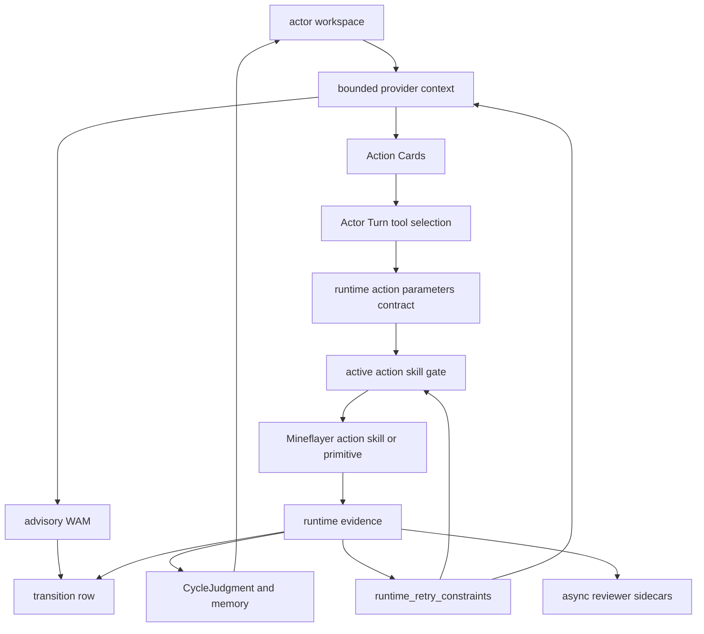
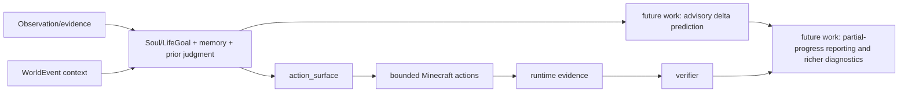

# Overview

**minecraft-llm-agent-community** is a headless Mineflayer runtime for advisory
social-material WAM experiments, where Minecraft provides embodied actions and
observable consequences.

The project is intentionally small. It tests whether actors can act from
ActorSoul, LifeGoal, memory, relationship context, and world state while
leaving transition rows that compare predicted consequences with observed
results.

## What It Does

- starts or connects to a local Minecraft server;
- runs Mineflayer actors through a bounded TypeScript loop;
- lets Actor Turn choose one visible Action Card or
  `author_mineflayer_action` at a time;
- exposes Action Cards projected from the current action surface;
- exposes query-neutral world-state diagnostics with scan limits, not gameplay
  strategy categories;
- rejects malformed physical runtime action parameters before hidden executor
  defaults can look like progress;
- derives `runtime_retry_constraints` after exact repeated target/args blockers
  and blocks another identical attempt before Mineflayer execution;
- checks progress from Minecraft state, not model text;
- records predicted-vs-observed physical/material/social deltas when a WAM is
  present;
- writes transcripts, provider inputs, evidence, and review artifacts.

## Core Model

Each actor has a workspace under `data/actors/<actor_id>/`.

That workspace owns the actor's active action skills, candidate repairs, memory,
PlanBeadGraph state, evidence, provider inputs, reviews, and relationships.
Runtime code reads from that workspace before it allows a primitive to execute.

The runtime hot path stays narrow:

```text
observe -> gate -> execute -> verify -> record
```

The research path adds an advisory prediction before execution:

```text
state_before + candidate_action -> predicted_delta -> observed_delta
```

Reviewer and repair work runs after the turn from saved artifacts.



The next architecture layer is actor-owned goal continuity: `soul.md`, a
persistent LifeGoal, per-cycle CycleGoal selection, and CycleJudgment artifacts.
It separates "Minecraft evidence passed" from "the actor's social-life judgment
actually controlled the current goal."
The WAM layer adds a different separation: prediction quality is not the same
as acting outcome.

The latest live testing showed this separation matters. A 100-cycle
long-objective stress test with the OpenAI social-cycle provider reused prior
judgment and memory and produced concrete Minecraft evidence, but did not claim
goal completion without verifier support.
That result belongs in future work, not the long-term spec. It should improve
the autonomy substrate, not turn one domain activity into the architecture.



## What It Is Not

This is not a loose generated-code gameplay loop, generic Minecraft benchmark,
race-to-diamond project, house-building architecture, or persona-first NPC demo.

The current proof is simpler: complete concrete Minecraft tasks, reject fake
progress, make failures easy to inspect, and prepare transition rows.

This is not a revival of unverifiable Voyager-style generated-code execution.
Direct generated TypeScript is allowed when it is tied to an objective,
helper-call artifacts, and current-run evidence.

The repo should not treat a model-written JavaScript file, a progress-looking
animation, or an optimistic provider explanation as success. Runtime checks are
mandatory hygiene, not the research contribution. The research contribution is
the advisory prediction of social-material consequences and its measurement.

## Read Next

- [Soul-Grounded Social Simulation](../specification/soul-grounded-social-simulation.md)
- [Advisory Social-Material World Action Model](../specification/advisory-social-material-wam.md)
- [Runtime Evidence And Action Skills](../specification/runtime-evidence-and-action-skills.md)
- [Engineering Governance And Testing](../specification/engineering-governance-and-testing.md)
- [Reference Adaptation Guide](../specification/reference-adaptation-guide.md)
- [Documentation Map](documentation-map.md)
- Repo-root review doc: `CURRENT_IMPLEMENTATION_ARCHITECTURE_REVIEW.md`
- [Actor Turn Passive PlanBeads Goal Brief](../runtime/actor-turn/actor-turn-passive-planbeads-goal-brief.md)
- [Low-Cost Social Simulation Campaign Spec](../research/benchmarks/low-cost-social-simulation-campaign-spec.md)
- [Actor Episode And Actor Turn Architecture](../runtime/actor-turn/actor-episode-and-actor-turn-architecture.md)
- [Actor Episode And Actor Turn Implementation Plan](../runtime/actor-turn/actor-episode-and-actor-turn-implementation-plan.md)
- [Actor Persistent State And PlanBeads](../runtime/planbeads/actor-persistent-state-and-planbeads.md)
- [PlanBeads Implementation Campaign](../runtime/planbeads/planbeads-implementation-campaign.md)
- [Action Selection Gated Action Skill Authoring Plan](../runtime/action-skills/action-selection-gated-action-skill-authoring-plan.md)
- [Minecraft Basic Guide](../runtime/overview/minecraft-basic-guide.md)
- [Runtime Loop And Verification](../runtime/overview/runtime-loop-and-verification.md)
- [Actor Workspace And Action Skill Memory](../runtime/actor-state-and-memory/actor-workspace-and-action-skill-memory.md)
- [Soul Life Goal Runtime Architecture](../runtime/actor-state-and-memory/soul-life-goal-runtime-architecture.md)
- [Composer 2.5 Soul Life Goal Runtime Implementation Plan](../runtime/actor-state-and-memory/composer-2.5-soul-life-goal-runtime-implementation-plan.md)
- [Future Works](../operations/future-work/future-works.md)
- [Async Reviewer Sidecars](../runtime/overview/async-reviewer-sidecars.md)
- [Social Actor Profiles And Relationships](../runtime/actor-state-and-memory/social-actor-profiles-and-relationships.md)
- [Headless Server Setup](../operations/setup/headless-server.md)
- [Provider Setup](../operations/setup/provider-setup.md)
- [Provider Free-Tier Reset Windows](../operations/setup/provider-free-tier-reset-windows.md)
- [Architecture Spec](../runtime/overview/architecture-overview.md)
- [Agent Search Index](agent-search-index.md)
- [Terminology](terminology.md)
