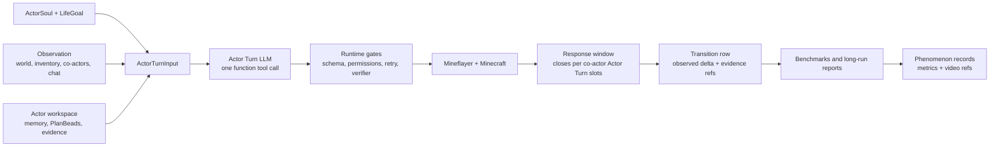

# Overview

**minecraft-llm-agent-community** is a headless Mineflayer runtime for studying
what happens when individually capable, persistent LLM actors pursue their own
goals in a shared Minecraft world where economic, cooperative, and quest
activity makes them materially interdependent.

The project first separates non-social Minecraft competence and long-horizon
goal continuity from social interpretation. It then runs capable actors in an
observable sandbox, records structured evidence, metrics, and video, and uses
recurring phenomena to select later controlled experiments.

Active plan:
`../research/current-spine/central-plan-capability-gated-social-sandbox.md`
(`ACTIVE_CENTRAL_PLAN`). The V3 lived-vs-told and V2 co-actor-legibility plans
are superseded audit trail.

## Program Stages

1. Dataset-free scenario benchmarks establish individual Minecraft competence.
2. Goal-continuity cases test intermediate goal creation, persistence, revision,
   interruption recovery, and evidence-grounded closure.
3. Economic, cooperative, and quest scenarios create material interdependence
   without scripting the actors' social response.
4. Long runs produce phenomenon records grounded in artifacts, metrics, and
   synchronized video.
5. Baselines, falsifiers, preregistration, and novelty claims are introduced
   only for a selected follow-up question.

Initial sessions stay small enough to debug and attribute. Actor count, model
mix, role assignment, and scenario pressure may change later as explicit
experimental axes; scale does not excuse missing competence or weak evidence.

## What It Does

- starts or connects to a local Minecraft server;
- runs one or more Mineflayer actors through a bounded TypeScript loop with
  per-actor provider routing;
- lets each Actor Turn choose one visible Action Card or
  `author_mineflayer_action` at a time;
- captures cross-actor observation and chat as runtime evidence;
- rejects malformed physical runtime action parameters before hidden
  executor defaults can look like progress;
- derives `runtime_retry_constraints` after exact repeated target/args
  blockers and blocks identical retries before Mineflayer execution;
- checks progress from Minecraft state, not model text;
- closes social/material response windows only after every other active actor
  completed a subsequent Actor Turn slot or a declared timeout;
- writes `transition-row/v1` records whose labels come from runtime
  evidence, never from tool names or self-report;
- exports allowlisted public-history artifacts for offline analysis;
- writes transcripts, provider inputs, evidence, and review artifacts.

## Core Model

Each actor has a workspace under `data/actors/<actor_id>/` that owns its
active action skills, candidate repairs, memory, PlanBeadGraph state,
evidence, provider inputs, reviews, and relationships. Runtime code reads
that workspace before it allows a primitive to execute.

The runtime hot path stays narrow:

```text
observe -> choose -> gate -> execute -> verify -> record
```

The active research path builds evidence in stages:

```text
individual capability evidence
-> goal-continuity evidence
-> interdependent social runs
-> phenomenon records
-> controlled follow-up experiments
```


```mermaid
flowchart LR
  Soul["ActorSoul + LifeGoal"]
  Observe["Observation<br/>world, inventory, co-actors, chat"]
  Workspace["Actor workspace<br/>memory, PlanBeads, evidence"]
  Input["ActorTurnInput"]
  LLM["Actor Turn LLM<br/>one function tool call"]
  Runtime["Runtime gates<br/>schema, permissions, retry, verifier"]
  MC["Mineflayer + Minecraft"]
  Window["Response window<br/>closes per co-actor Actor Turn slots"]
  Row["Transition row<br/>observed delta + evidence refs"]
  Report["Benchmarks and long-run reports"]
  Phenomenon["Phenomenon records<br/>metrics + video refs"]

  Soul --> Input
  Observe --> Input
  Workspace --> Input
  Input --> LLM --> Runtime --> MC --> Window --> Row
  Row --> Report --> Phenomenon
```

Offline analysis never selects the executed action, fills missing parameters,
closes obligations, or overrides runtime checks. The actor's
`expected_outcome` is never a target label.

## What It Is Not

- not a Voyager clone, race-to-diamond benchmark, or house-building
  planner — Minecraft task completion is a competence gate, not the
  research target;
- not a scripted society demo — social outcomes must remain open even when
  scenarios create material interdependence;
- not a claim that benchmark or sandbox construction alone is novel research;
- not a verification showcase — runtime verification, screenshots, seed
  and reset records, and scoring scripts are mandatory hygiene, never the
  contribution;
- not a revival of unverifiable generated-code gameplay — generated
  Mineflayer source stays schema-bound, helper-limited, timed, verified,
  and recorded.

## Read Next

- [Central Plan V4: Capability-Gated Social Sandbox](../research/current-spine/central-plan-capability-gated-social-sandbox.md)
- [Project-Level Benchmark Plan](../research/benchmarks/project-level-benchmark-plan.md)
- [Central Plan V3: Lived Vs Told (superseded)](../research/current-spine/central-plan-lived-vs-told-social-history.md)
- [Central Plan V2: Embodied Co-Actor Legibility (superseded)](../research/current-spine/central-plan-embodied-co-actor-legibility.md)
- [Research Documentation Hierarchy](../research/current-spine/research-documentation-hierarchy.md)
- [Transition Row v1 Contract](../research/current-spine/transition-row-v1-contract.md)
- [Transition Row Label Codebook](../research/current-spine/transition-row-label-codebook.md)
- [Seed Reset Record v1 Contract](../research/current-spine/seed-reset-record-v1-contract.md)
- [Society Observable Preflight (deferred branch gate)](../research/current-spine/society-observable-preflight.md)
- [Documentation Map](documentation-map.md)
- [Agent Search Index](agent-search-index.md)
- [Terminology](terminology.md)
- [Soul-Grounded Social Simulation](../specification/soul-grounded-social-simulation.md)
- [Runtime Evidence And Action Skills](../specification/runtime-evidence-and-action-skills.md)
- [Engineering Governance And Testing](../specification/engineering-governance-and-testing.md)
- [Actor Episode And Actor Turn Architecture](../runtime/actor-turn/actor-episode-and-actor-turn-architecture.md)
- [Actor Turn Tool Calling And Full-Context Codegen](../runtime/actor-turn/actor-turn-tool-calling-and-full-context-codegen.md)
- [Context Projection And Source Evidence](../runtime/actor-turn/context-projection-and-source-evidence.md)
- [Actor Persistent State And PlanBeads](../runtime/planbeads/actor-persistent-state-and-planbeads.md)
- [Action Selection Gated Action Skill Authoring Plan](../runtime/action-skills/action-selection-gated-action-skill-authoring-plan.md)
- [Runtime Loop And Verification](../runtime/overview/runtime-loop-and-verification.md)
- [Minecraft Basic Guide](../runtime/overview/minecraft-basic-guide.md)
- [Headless Server Setup](../operations/setup/headless-server.md)
- [Provider Setup](../operations/setup/provider-setup.md)
- [Provider Free-Tier Reset Windows](../operations/setup/provider-free-tier-reset-windows.md)
- Repo-root review doc: `CURRENT_IMPLEMENTATION_ARCHITECTURE_REVIEW.md`
