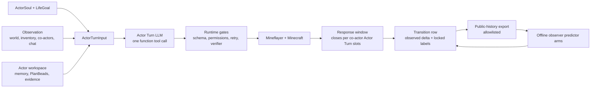

# Overview

**minecraft-llm-agent-community** is a headless Mineflayer runtime built to
run one preregistered experiment: embodied co-actor legibility. The question
is whether an observer model, given only public interaction history, can
predict a soul-grounded co-actor's next-turn social-response and
material-access labels better than baselines that can erase the claim — and
whether that predictability tracks how consistent the co-actor's private
disposition actually is.

Minecraft provides embodied actions and runtime-verified material
consequences (possession, access, refusal, repair, public-affordance use).
The runtime exists so those consequences are recorded truthfully enough to
score predictions against.

Active plan: `../research/current-spine/central-plan-embodied-co-actor-legibility.md`
(`ACTIVE_CENTRAL_PLAN`). Build order:
`../research/current-spine/embodied-co-actor-legibility-implementation-plan.md`
(`LEGIBILITY_IMPLEMENTATION_PLAN`).

## Substrate Premise: Depth, Not Scale

The project is intentionally small — and smallness is a design decision, not
a budget compromise (`DEPTH_NOT_SCALE`):

- 2-3 concurrent actors in one shared session, with cross-actor observation
  and chat capture wired into runtime evidence;
- interaction density: rows must carry material stake and interaction
  opportunity, not observe/wait filler;
- longitudinal depth: public history accumulates about the same responder
  across repeated episodes, because rows per responder is what makes a
  fixed private ActorSoul legible.

Actor-count scale is never a remedy for weak signal. Scale re-enters only
as the deferred social-pattern branch or as a post-positive-result
generalization axis.

## What It Does

- starts or connects to a local Minecraft server;
- runs 2-3 Mineflayer actors through a bounded TypeScript loop with
  per-actor provider routing (live LLM, scripted responder, or resampled
  soul, by condition);
- lets each Actor Turn choose one visible Action Card or
  `author_mineflayer_action` at a time;
- captures cross-actor observation and chat as runtime evidence;
- rejects malformed physical runtime action parameters before hidden
  executor defaults can look like progress;
- derives `runtime_retry_constraints` after exact repeated target/args
  blockers and blocks identical retries before Mineflayer execution;
- checks progress from Minecraft state, not model text;
- closes social/material response windows only after every other active
  actor completed a subsequent Actor Turn slot or a preregistered timeout;
- writes `transition-row/v1` records whose labels come from runtime
  evidence, never from tool names or self-report;
- exports an allowlisted public-history artifact for offline observer
  predictors, which join scored rows by `row_id` after labels are locked;
- writes transcripts, provider inputs, evidence, and review artifacts.

## Core Model

Each actor has a workspace under `data/actors/<actor_id>/` that owns its
active action skills, candidate repairs, memory, PlanBeadGraph state,
evidence, provider inputs, reviews, and relationships. Runtime code reads
that workspace before it allows a primitive to execute.

The runtime hot path stays narrow:

```text
observe -> choose -> gate -> execute -> verify -> record
```

The research path is strictly offline and joins after the fact:

```text
public history H_t + state o_t + executed action a_t
-> observer-predicted social_response / material_access labels
-> scored against locked transition-row/v1 labels (join by row_id)
```


```mermaid
flowchart LR
  Soul["ActorSoul + LifeGoal"]
  Observe["Observation<br/>world, inventory, co-actors, chat"]
  Workspace["Actor workspace<br/>memory, PlanBeads, evidence"]
  Input["ActorTurnInput"]
  LLM["Actor Turn LLM<br/>one function tool call"]
  Runtime["Runtime gates<br/>schema, permissions, retry, verifier"]
  MC["Mineflayer + Minecraft"]
  Window["Response window<br/>closes per co-actor Actor Turn slots"]
  Row["Transition row<br/>observed delta + locked labels"]
  Export["Public-history export<br/>allowlisted"]
  Predictor["Offline observer predictor arms"]

  Soul --> Input
  Observe --> Input
  Workspace --> Input
  Input --> LLM --> Runtime --> MC --> Window --> Row
  Row --> Export --> Predictor --> Row
```

Predictor artifacts never select the executed action, fill missing
parameters, close obligations, or override runtime checks.
`transition-row/v1` never contains `predicted_delta`, and the actor's
`expected_outcome` is never a target label.

## What It Is Not

- not a Voyager clone, race-to-diamond benchmark, or house-building
  planner — Minecraft task completion is a competence gate, not the
  research target;
- not a Project Sid-style society simulation — actor-count scale is
  explicitly banned as a remedy for weak small-N signal;
- not world modeling or "social simulation" as a headline — the claim is
  legibility / other-agent modeling;
- not a verification showcase — runtime verification, screenshots, seed
  and reset records, and scoring scripts are mandatory hygiene, never the
  contribution;
- not a revival of unverifiable generated-code gameplay — generated
  Mineflayer source stays schema-bound, helper-limited, timed, verified,
  and recorded.

## Read Next

- [Central Plan V2: Embodied Co-Actor Legibility](../research/current-spine/central-plan-embodied-co-actor-legibility.md)
- [Implementation Plan](../research/current-spine/embodied-co-actor-legibility-implementation-plan.md)
- [Research Documentation Hierarchy](../research/current-spine/research-documentation-hierarchy.md)
- [Transition Row v1 Contract](../research/current-spine/transition-row-v1-contract.md)
- [Transition Row Label Codebook](../research/current-spine/transition-row-label-codebook.md)
- [Seed Reset Record v1 Contract](../research/current-spine/seed-reset-record-v1-contract.md)
- [Society Observable Preflight (deferred branch gate)](../research/current-spine/society-observable-preflight.md)
- [Documentation Map](documentation-map.md)
- [Agent Search Index](agent-search-index.md)
- [Terminology](terminology.md)
- [Soul-Grounded Social Simulation](../specification/soul-grounded-social-simulation.md)
- [Runtime Evidence And Action Skills](../specification/runtime-evidence-and-action-skills.md)
- [Engineering Governance And Testing](../specification/engineering-governance-and-testing.md)
- [Actor Episode And Actor Turn Architecture](../runtime/actor-turn/actor-episode-and-actor-turn-architecture.md)
- [Actor Turn Tool Calling And Full-Context Codegen](../runtime/actor-turn/actor-turn-tool-calling-and-full-context-codegen.md)
- [Context Projection And Source Evidence](../runtime/actor-turn/context-projection-and-source-evidence.md)
- [Actor Persistent State And PlanBeads](../runtime/planbeads/actor-persistent-state-and-planbeads.md)
- [Action Selection Gated Action Skill Authoring Plan](../runtime/action-skills/action-selection-gated-action-skill-authoring-plan.md)
- [Runtime Loop And Verification](../runtime/overview/runtime-loop-and-verification.md)
- [Minecraft Basic Guide](../runtime/overview/minecraft-basic-guide.md)
- [Headless Server Setup](../operations/setup/headless-server.md)
- [Provider Setup](../operations/setup/provider-setup.md)
- [Provider Free-Tier Reset Windows](../operations/setup/provider-free-tier-reset-windows.md)
- Repo-root review doc: `CURRENT_IMPLEMENTATION_ARCHITECTURE_REVIEW.md`
