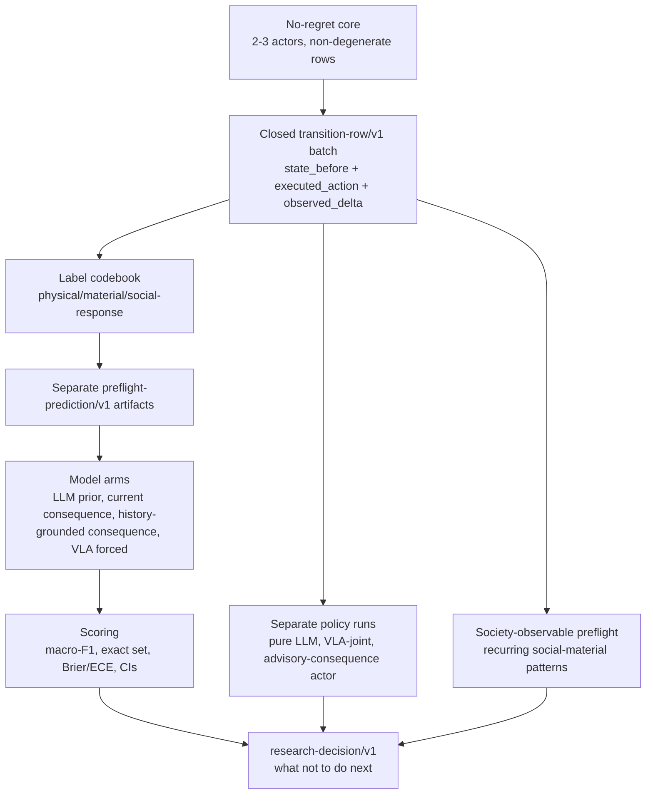

# Qwen And VLA Action-Consequence Composition Proposal

Status: proposal and review artifact, superseded in sequencing by
`central-plan-embodied-co-actor-legibility.md` (2026-07-05). Its arm-design
discipline (mandatory nulls, forced-action prediction lanes, policy/prediction
separation) was absorbed into the active plan; its Qwen/VLA model arms remain
deferred until the legibility experiment produces a decision. This file does
not authorize provider-backed runs.

Search token: `QWEN_VLA_ACTION_CONSEQUENCE_COMPOSITION_2026_07_02`.

Recorded: 2026-07-02 (`Asia/Seoul`), after `main` was checked and
`git pull --ff-only origin main` reported the repository was already up to date.

Use with:

- `central-plan-no-regret-core-and-goldilocks-gate.md`
- `no-regret-core-research-protocol.md`
- `no-regret-core-implementation-campaign.md`
- `transition-row-v1-contract.md`
- `transition-row-label-codebook.md`
- `goldilocks-preflight-protocol.md`
- `society-observable-preflight.md`
- `project-docs/runtime/actor-turn/actor-turn-tool-calling-and-full-context-codegen.md`
- `project-docs/runtime/action-skills/action-selection-gated-action-skill-authoring-plan.md`

## Purpose

This document records whether the current project can support an experimental
composition that compares:

- pure LLM actors;
- WAM-style consequence-prediction arms, named with concrete current-spine terms;
- a VLA-as-joint action-and-future arm;
- optional Qwen and Minecraft-specific base models.

The answer is:

```text
Feasible as a staged project composition after the no-regret core produces
closed transition-row/v1 batches.

Not feasible as an immediate full experiment or headline claim.
```

The composition should be treated as a future branch-preflight design, not as a
replacement for the current `core-first` sequence.

## Current Verdict

`core-first`.

The proposal is promising because Minecraft has object dynamics that are often
predictable, Mineflayer provides an unusually strong adaptor/body layer, and
LLMs already carry substantial Minecraft prior knowledge. That same strength is
also the main threat to the research claim: a plain LLM prior, current
observation, or Mineflayer competence may explain the apparent success without
any learned social-material world model.

The valid near-term question is therefore not:

```text
Can Qwen, VLA, or a WAM-style label make Minecraft NPCs look social?
```

The sharper question is:

```text
Can explicit action-consequence modeling improve prediction or behavior over
plain LLM prior, current observation, and Mineflayer action competence, especially
when pre-action social-material history is available?
```

## Research Object

The object stays the active central-plan object until the gate changes it:

```text
state_before + executed_action + observed_delta
```

The row remains `transition-row/v1`.

Prediction artifacts are separate and join by `row_id` after the row is closed.
The actor's `expected_outcome` is not a target label, not `predicted_delta`, and
not evidence that a prediction arm was correct.

## Why VLA-As-Joint Is Plausible But Dangerous

The local literature notes define a vanilla VLA as:

```text
p(a | o, l)
```

A model becomes WAM-like or VLA-as-joint only if it makes a pre-action,
scoreable future-state commitment:

```text
p(o', a | o, l)
```

In Minecraft this can be unusually plausible:

- many object consequences are regular and already present in LLM pretraining;
- Mineflayer turns high-level choices into executable environment effects;
- Action Cards and generated action skills can express actions at a more useful
  altitude than keyboard/mouse tokens;
- typed state can represent inventory, blocks, access, response windows, and
  material affordances better than pixels alone.

This does not make vanilla VLA a WAM. If a model outputs only an action, it is a
policy arm. If it outputs action plus unscored natural-language expectation, it
is a rationale arm. It becomes a useful joint arm only when the future
commitment is captured before execution and scored against runtime-observed
labels.

## Candidate Arms

All arms must run against the same closed row batch when they are evaluated as
predictors. Policy arms may run in separate episodes, but their action success
must be reported separately from prediction quality.

The term `WAM-style` is historical shorthand in this document. New active work
should prefer concrete names: `action-consequence model`, `advisory consequence
predictor`, `social-material transition model`, or `preflight-prediction/v1`
arm.

| Arm | Distribution shape | Role | Can select actions? | Main risk |
| --- | --- | --- | --- | --- |
| `pure_llm_actor` | `p(a | o, l)` | Actor Turn baseline using current tools and Action Cards | yes | Minecraft prior and prompting may explain apparent social behavior |
| `llm_prior_predictor` | `p(o' | o, a)` from row state/action only | Baseline predictor, no history | no | may solve easy physical/material labels |
| `action_consequence_current` | `p(o' | o, l, a)` | Action-conditioned typed consequence predictor | no | may be indistinguishable from LLM prior unless prompts and inputs are controlled |
| `history_grounded_consequence` | `p(o' | o, l, a, h)` | History-grounded social-material predictor | no | history may leak labels or only reflect scenario forcing |
| `counterfactual_consequence` | `p(o'_i | o, l, a_i)` for candidate actions | Multi-candidate advisory predictor | no | unexecuted counterfactuals cannot be scored without matched executions |
| `vla_joint_prediction_only` | `p(o' | o, l, a)` with `a` forced | Tests whether a VLA-style model predicts consequences on the same rows | no | if not forced, action-selection confound dominates |
| `vla_joint_policy` | `p(o', a | o, l)` | Model proposes action and expected future, then runtime executes | yes | can choose easier actions, so prediction and acting are confounded |

Mandatory null or ablation arms:

- `majority_or_no_response`;
- `scripted_heuristic`;
- `current_observation`;
- `shuffled_history_null`;
- `dialogue_only`, if social labels are chat-heavy;
- `no_generated_action_rows`, if generated Mineflayer action skill rows exist.

## Base Model Candidates

This list is a candidate map, not a provider-run approval. Any live use still
requires the provider quota preflight and an explicit whole-run estimate.
Public model or paper availability is not the same as repo provider
availability, quota approval, local runnable infrastructure, or permission to
run a provider-backed experiment.

Source check date: 2026-07-02.

| Candidate | Best use | Current fit | Caveat |
| --- | --- | --- | --- |
| `Qwen/Qwen-AgentWorld-35B-A3B` | `action_consequence_current`, `history_grounded_consequence`, external language-world-model predictor baseline | strongest Qwen candidate for language next-observation prediction | public HF model exists; not Minecraft-specific; large and likely expensive to run |
| `Qwen/Qwen3.5-35B-A3B-Base` or existing provider models | pure LLM prior and promptable predictor baseline | useful for testing whether generic language prior already solves labels | public HF model exists; if it performs well, it weakens the action-consequence claim |
| `CraftJarvis/JarvisVLA-Qwen2-VL-7B` | VLA-as-joint or Minecraft visual-action contrast | Minecraft-specific VLA family | public HF model exists; action space differs from this repo's typed Mineflayer runtime |
| MineStudio VPT, STEVE-1, GROOT, ROCKET | low-level visual/body contrast | useful as external control or future body substrate | not the current social-material transition model |
| MineWorld | visual Minecraft world-model reference | conceptually close to `p(o' | o, a)` | visual future, not typed social-material deltas |
| Qwen-RobotWorld | world-model mechanism reference | language-conditioned video future prediction across embodied domains | arXiv/public paper exists; no current checked public HF weight path in this proposal |
| Qwen-RobotNav / Qwen-RobotManip | observation/action-interface design references | useful for adaptor/action-space ideas | not immediately usable as local base models for this repo |

Durable public refs checked for this proposal:

- `https://huggingface.co/Qwen/Qwen-AgentWorld-35B-A3B`
- `https://huggingface.co/Qwen/Qwen3.5-35B-A3B-Base`
- `https://huggingface.co/CraftJarvis/JarvisVLA-Qwen2-VL-7B`
- `https://arxiv.org/abs/2606.17030`

Recommended first model path:

```text
Use one promptable predictor stack first.

Run the same model with controlled input differences:
  llm_prior_predictor: state_before + executed_action
  action_consequence_current: state_before + actor frame + executed_action
  history_grounded_consequence: state_before + actor frame + executed_action + bounded history
  shuffled_history_null: same as history but history-row mapping broken

Only after this split is stable, add Qwen-AgentWorld or VLA-specific candidates.
```

## Project Architecture

The composition should be layered over the existing runtime rather than replacing
it.



Authority boundaries:

- Actor Turn selects actions.
- Runtime validates, executes, verifies, and records truth.
- Prediction arms never fill missing parameters, decide success, close
  obligations, mutate actor truth, or override runtime checks.
- VLA policy arms may select a tool only through the same Action Card or
  `author_mineflayer_action` path as other actors.
- Generated action skill rows must remain tagged because codegen quality can
  fabricate or erase consequence signals.

## What The Current Repo Already Supports

The main branch already has enough design and partial artifact wiring to make
the composition plausible:

- Actor Turn function-tool selection exists as the action hot path.
- Action Cards and `author_mineflayer_action` are separated from runtime truth.
- `transition-row/v1` is the active row contract.
- The row contract forbids `predicted_delta` and actor `expected_outcome`.
- Response-window and batch-audit contracts exist.
- Current status notes record managed controls that write transition rows,
  response windows, seed/reset records, and batch audits.
- Shared-session controls have reached simultaneous live connections, round
  robin slots, and deterministic Actor Turn smoke paths.
- A provider-backed shared-session control has run and produced partial rows,
  while preserving quota failures as environment/provider evidence.
- A Qwen Ambassador shared-session Actor Turn control has exercised the live
  provider path, produced four action classes, and closed transition-row,
  response-window, and batch-audit artifacts, while still ending
  `core-inconclusive`.

This is enough for documentation, smoke harnesses, and small offline predictor
checks on existing rows. It is not enough for a full model-comparison claim.
Before any real predictor comparison, re-verify the runtime row writer, row
collector, and scorer paths against current `probe/src` rather than relying on
dated status notes or curated control reports alone.

## Missing Pieces

The missing pieces are not mainly conceptual. They are empirical and operational.

Required before a real predictor comparison:

- a closed no-regret row batch that meets protocol thresholds;
- at least 2-3 active actors in the measured window;
- enough non-excluded rows, action classes, material-stake rows, interaction
  rows, and bounded response windows;
- live seed/reset provenance that counts toward thresholds;
- provider/cost discipline for any live model calls;
- a `preflight-prediction/v1` writer or equivalent analysis artifact;
- a scorer that reports per-layer metrics and calibration;
- input cutoff enforcement before `action_started_at`;
- explicit exclusion of post-action leakage;
- ablation support for shuffled history, current observation, dialogue-only, and
  generated-action rows.

Required before VLA policy comparison:

- a typed adapter from VLA output to existing Action Cards or structured
  `author_mineflayer_action` requests;
- identical action-surface exposure across compared policy arms, or explicit
  accounting when an arm has a larger action surface;
- evidence that action success, action diversity, generated action skill quality,
  and prediction accuracy are reported separately.

Deferred until after a positive gate:

- training or fine-tuning a local action-consequence model;
- Qwen-AgentWorld adaptation beyond zero-shot or few-shot prediction;
- VLA low-level body integration;
- counterfactual matched-reset execution;
- many-actor society scale-up;
- institutions, laws, taxes, religions, or settlement-scale labels.

## Staged Plan

### Stage 0 - Main-Based Planning

Status: complete for this document.

Output:

- main was checked and pulled with `git pull --ff-only origin main`;
- this proposal was written on a short branch from latest main;
- no Tier 0 authority file was changed.

### Stage 1 - Finish No-Regret Core

Goal:

```text
Produce a closed, non-degenerate 2-3 actor batch of transition-row/v1 records.
```

Success evidence:

- no-regret run declaration;
- seed/reset records;
- transition rows;
- response windows;
- batch audit;
- provider/cost evidence when live providers are used;
- audit verdict permits branch preflight or preserves a negative result.

Do not start action-consequence or VLA model comparison before this stage has a
closed batch.

### Stage 2 - Build Provider-Free Prediction Harness

Goal:

```text
Evaluate prediction artifact plumbing without live provider cost.
```

Allowed data:

- existing deterministic/control rows;
- manually curated tiny row slices;
- offline scripted heuristic predictions.

Outputs:

- `preflight-prediction/v1` artifact shape;
- row join by `row_id`;
- scorer input/output schema;
- leakage checks;
- metric table skeleton.

This stage proves only harness wiring.

### Stage 3 - Run Goldilocks Predictor Arms

Goal:

```text
Ask whether history improves consequence prediction beyond LLM prior.
```

Minimum input:

- the Goldilocks branch-triage thresholds, including 80 rows, 3 seed/reset
  sessions, 30 response-window rows, 20 interaction-opportunity rows, and 15
  material-stake rows.

Arms:

- `majority_or_no_response`;
- `scripted_heuristic`;
- `llm_prior_predictor`;
- `current_observation`;
- `action_consequence_current`;
- `history_grounded_consequence`;
- `shuffled_history_null`;
- optional `vla_joint_prediction_only`.

Decision:

- if prior is high, treat the layer as a control;
- if history adds no lift, preserve a negative result;
- if history lift survives controls, design a larger confirming experiment.

### Stage 4 - Policy Comparison

Goal:

```text
Compare actual NPC behavior only after prediction scoring is separated.
```

Policy arms may run in separate episodes only when their design declares:

- seed/reset and scenario-family matching;
- actor roster and ActorSoul/LifeGoal matching;
- action-surface equality or recorded action-surface differences;
- denominator rules for rows, slots, attempts, and scorable windows;
- a rule that acting outcome cannot be converted into prediction quality.

Without those matched controls, policy comparison is exploratory behavior
review, not evidence that one model family improves social-material consequence
prediction.

Policy arms:

- `pure_llm_actor`;
- `vla_joint_policy`;
- optional `advisory_consequence_actor`, where advisory predictions are visible
  only as advice and cannot override runtime.

Reports must split:

- action success;
- action diversity;
- generated action skill use;
- physical/material/social deltas;
- social-response windows;
- prediction accuracy;
- cost and latency.

### Stage 5 - Society-Observable Gate

Goal:

```text
Check whether recurring social-material patterns appear under controls.
```

This is not decided by prediction lift. Use the society-observable preflight and
declare one primary observable before inspecting outputs.

Candidate observables:

- repeated access negotiation around the same object, station, container, or
  place;
- refusal followed by repair, compensation, avoidance, retry, or changed future
  request;
- public affordance created by one actor and later used, ignored, contested, or
  maintained by another;
- future action changed by earlier material stake or social event.

## Experiment Sketch

```yaml
schema_version: experiment-sketch/v1
uncertainty_to_reduce: >
  Whether a model with pre-action social-material history predicts observed
  Minecraft consequences better than plain LLM prior, current observation, and
  scripted baselines.
hypothesis: >
  History-grounded action-consequence prediction improves social-response and
  material-access labels, while easy physical/material mechanics remain control
  layers solved by prior.
candidate_layer: social_response and material access/affordance labels
independent_variable: predictor input condition and model family
observed_target: locked transition-row/v1 labels assigned from runtime evidence
baseline: majority/no_response, scripted heuristic, llm_prior, current_observation
run_protocol: >
  Use a closed no-regret batch. Cut all predictor inputs before
  action_started_at. Write separate prediction artifacts. Score after row labels
  are locked.
minimum_data: Goldilocks branch-triage thresholds
artifacts_needed: >
  transition rows, label codebook audit, response windows, seed/reset records,
  prediction artifacts, scorer outputs, provider usage records, negative-result
  notes.
evaluator: deterministic scorer plus manual evidence audit for a small slice
stop_condition: >
  Stop or preserve negative result when LLM prior solves the layer, history lift
  is below threshold, response windows are mostly no_observable_response, or the
  lift is explained by one action family, fixture leakage, or generated-action
  quality.
negative_result_interpretation: >
  A negative result can show that Minecraft consequence prediction is too easy,
  too noisy, or not history-sensitive under cheap 2-3 actor conditions.
cost_bound: provider preflight required before any live model calls
```

## Soundness Review

```yaml
schema_version: proposal-soundness-review/v1
verdict: core-first
scores:
  object_clarity: 4
  gap_quality: 3
  significance: 4
  falsifiability: 4
  baseline_pressure: 5
  observability: 4
  confound_control: 3
  feasibility: 3
  negative_result_value: 5
strongest_objection: >
  The rigorous labels may be solved by LLM Minecraft prior, while the interesting
  social labels may be sparse, noisy, or scenario-forced.
revision_needed: >
  Do not frame the proposal as Qwen or VLA proving social simulation. Frame it as
  a staged comparison that can be killed by prior, current observation, no
  response, or control arms.
cheap_disambiguating_test: >
  Run an offline prediction-harness smoke on already closed control rows, then
  wait for a real no-regret batch before drawing research conclusions.
why_not_implementation_yet: >
  The model comparison depends on a closed, non-degenerate transition-row batch.
  Current controls prove wiring and partial provider paths, not Goldilocks-ready
  evidence.
```

## Decision Record

```yaml
schema_version: research-decision/v1
decision: >
  Keep Qwen/VLA/action-consequence composition as a staged branch-preflight design. Do not
  replace the active no-regret core or select a headline from this proposal.
verdict: core-first
evidence_used:
  - active central plan
  - no-regret core protocol and implementation campaign
  - transition-row/v1 contract and label codebook
  - Goldilocks and society-observable preflight protocols
  - current status note showing artifact controls but no completed no-regret pilot
  - public model metadata checked separately for Qwen-AgentWorld and Minecraft VLA candidates
alternatives_considered:
  - immediate Qwen-AgentWorld predictor comparison
  - immediate VLA policy comparison
  - making WAM the active headline again
  - many-actor open-ended society run
strongest_objection: >
  The proposal can easily collapse into a model demo unless action success,
  prediction accuracy, social-material consequence, and LLM prior are separated.
accepted_risk: >
  The future comparison may produce only a negative result. That result is still
  useful if it prevents premature action-consequence, VLA, or society scale-up.
next_action: >
  Finish the no-regret core and prepare provider-free prediction artifact wiring.
what_not_to_do_next: >
  Do not add predicted_delta to transition-row/v1, do not use expected_outcome as
  a label, do not run provider-heavy Qwen/VLA comparisons before preflight, and
  do not claim society from vivid transcripts.
```

## Review Checklist

Before treating this proposal as implementation guidance, review these points:

- Does it preserve the active `core-first` sequence?
- Does it keep `transition-row/v1` independent from predictions?
- Does it avoid making Qwen, VLA, WAM-style labels, or verification hygiene the headline?
- Does every claim have a baseline that can erase it?
- Does VLA-as-joint have both prediction-only and policy lanes?
- Are generated action skill rows tagged and ablated?
- Are provider calls blocked until provider quota preflight?
- Are physical/material controls separated from social-response claims?
- Are society-observable claims kept separate from Goldilocks prediction lift?

## What Not To Do

- Do not edit Tier 0 specs to adopt this proposal without a separate direction
  change artifact.
- Do not use `WAM` as the active banner name in new implementation work.
- Do not run Qwen-AgentWorld or JarvisVLA as live providers without a quota and
  infrastructure plan.
- Do not train or fine-tune before the label target survives the Goldilocks gate.
- Do not score unexecuted counterfactual actions without matched execution or a
  clearly marked simulator-only evaluation.
- Do not treat Mineflayer adapter success as evidence of prediction quality.
- Do not treat social-looking chat as embodied social-material consequence.
